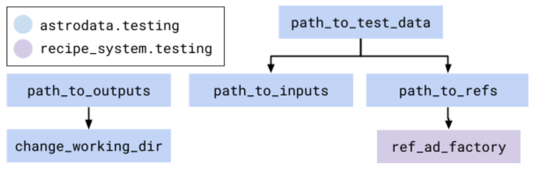

.. _AstroData: https://astrodata-programmer-manual.readthedocs.io/en/v2.1.0/appendices/api_refguide.html#astrodata

.. _`astrodata.testing`: https://github.com/GeminiDRSoftware/DRAGONS/blob/master/astrodata/testing.py

.. _`built-in fixtures`: https://docs.pytest.org/en/latest/fixture.html#pytest-fixtures-explicit-modular-scalable

.. _conftest.py: https://github.com/GeminiDRSoftware/DRAGONS/blob/master/conftest.py

.. _fixtures: https://docs.pytest.org/en/latest/fixture.html

.. _fixtures_scopes : https://docs.pytest.org/en/latest/fixture.html#scope-sharing-a-fixture-instance-across-tests-in-a-class-module-or-session

.. _`matplotlib.testing`: https://matplotlib.org/3.2.1/api/testing_api.html#matplotlib-testing

.. _`numpy.testing`: https://docs.scipy.org/doc/numpy/reference/routines.testing.html

.. _`parameterization of tests and fixtures`: https://docs.pytest.org/en/latest/parametrize.html#parametrizing-fixtures-and-test-functions

.. _pytest: https://docs.pytest.org/en/latest/

.. _recipe_system.testing: https://github.com/GeminiDRSoftware/DRAGONS/blob/master/recipe_system/testing.py

.. _tox: https://tox.readthedocs.io/en/latest/

.. _tox-conda: https://github.com/tox-dev/tox-conda

*************************************
Creating and Running Tests on DRAGONS
*************************************

This document contains some guidelines to run the existing DRAGONS tests and to
create new ones. DRAGONS testing infrastructure depends on pytest_. You can
find the Python modules containing the tests within each ``tests/`` directory
that live in the same level as the module that they are testing. Here are some
examples:

.. list-table::
   :widths: 50 50
   :header-rows: 1

   * - Tests for:
     - Are found in:
   * - astrodata/fits.py
     - astrodata/tests/
   * - gempy/library/astromodel.py
     - gempy/library/tests/
   * - geminidr/gmos/primitives_gmos.py
     - geminidr/gmos/tests/
   * - geminidr/gmos/recipes/ql/recipe*.py
     - geminidr/gmos/recipes/ql/tests/

Requirements
============

First of all, make sure you have all the packages required to install and run
DRAGONS.

.. todo:: Add link to requirements page.

You will also need to install pytest_, since it is the main testing suite used
in DRAGONS. Alternatively, you might want to install tox_ and the tox-conda_
extension.

Static Data
-----------

Some of DRAGONS' tests require static data that will be used as Input Data.
These tests require that you store the root path for these Input Data in the
``$DRAGONS_TEST`` environment variable. The relative path to the data depends
on the relative path of the test module within DRAGONS.

For example, if we want to find the input file for a test defined in:
``gemini_instruments/gmos/tests/test_gmos.py``, the input file would be found
inside the following directory:

.. code::

    $DRAGONS_TEST/gemini_instruments/gmos/test_gmos/inputs/

Other tests, usually called Regression Tests, require Reference Files for
comparison. These Reference Files are stored within a similar directory
structure. The only difference is the most internal directory, which should be
``**refs/**``, like this:

.. code::

    $DRAGONS_TEST/gemini_instruments/gmos/test_gmos/refs/

Here is another example:

Test module:

.. code::

   geminidr/gmos/tests/test_gmos_spect_ls_apply_qe_correction.py

New path to inputs:
.. code::

   $DRAGONS_TEST/geminidr/gmos/test_gmos_spect_ls_apply_qe_correction/inputs/

New path to refs:

.. code::

   $DRAGONS_TEST/geminidr/gmos/test_gmos_spect_ls_apply_qe_correction/refs/

This architecture allows direct relationship between the path to the data and
the test who uses it. It is important to highlight that this file management is
completely manual. There is no automatic option that would write any data into
the ``$DRAGONS_TEST`` folder.

Running Tests
=============

We can run them with the following command line in the root of the DRAGONS
repository:

.. code-block::

    $ pytest

pytest_ can be configured via a lot of command line parameters. Some
particularly useful ones are:

.. list-table::
   :widths: 50 50
   :header-rows: 1

   * - -v or --verbose
     - Be more verbose.
   * - --capture=no or -s
     - Do not capture stdout (print messages in during test execution)
   * - -rs
     - Report why tests were skipped (see more)
   * - --basetemp=./temp
     - Write temporary files into the ./temp folder.

If you call pytest_ in the repository's root folder, it will run all the tests
inside DRAGONS. You can select which test(s) you want to run by directory, as
we show in the examples below:

.. code-block::

    $ pytest gempy/library

Or,

.. code-block::

    $ pytest gempy/library/tests

If you want to run a particular test within a given file, you can call pytest
with the relative path to that file followed by a double colon (::) and the
name of the test, as the example below:

.. code-block::

    $ pytest astrodata/tests/test_fits.py::test_slice

Customized Command Line Options
-------------------------------

pytest_ allows custom command line options. In DRAGONS, these options are
defined inside the ``conftest.py`` file, in the repository's root folder. Here
is a short description of each of them:

.. list-table::
   :widths: 50 50
   :header-rows: 1

   * - --dragons-remote-data
     - Enable tests that require any input data.
   * - --force-cache
     - Allows downloading input data from the archive and caching them into a
       temporary folder.
   * - --force-preprocess-data
     - Allows tests to create pre-processed data and store them into a temporary
       folder.
   * - --do-plots
     - Allows tests to plot results and save them.

Tests that require any kind of input data are normally skipped. If you want to
run them, you will have to call them using the ``--dragons-remote-data`` command
line option. These tests will fail with a ``FileNotFoundError`` error if they
cannot find the input files.

Using Tox
---------

Tests can be run directly with pytest, but this requires some work to set up the
test environment (downloading files, installing optional dependencies), and it
may not be obvious what options to use to run the different series of tests
(unit tests, integration tests, etc.).

Tox_ is a standard tool in the Python community that takes care of creating a
virtual environment (possible with conda), installing the package and its
dependencies, and running some commands.

This allows easy setup on Continuous Integration (CI) providers, like Jenkins
or GitHub Actions, and assures that the setup is the same in both of them. It
also allows developers to run tests in environments that are almost identical
to the CI server, which can be very useful for debugging.

With the current configuration, it is possible to run one of those environments:

.. code-block::

    $ pip install tox tox-conda
    $ tox -l
        py36-unit   py36-gmosls     py36-integ      py36-reg
        py37-unit   py37-gmosls     py37-integ      py37-reg
        py38-unit   py38-gmosls     py38-integ      py38-reg
        py39-unit   py39-gmosls     py39-integ      py39-reg
        codecov     check           docs-astrodata

And here are some examples to run a given environment, here running unit tests
on Python 3.7:

.. code-block::

    # simple usage:
    $ tox -e py37-unit

    # with the verbose flag, showing more detail about tox operations:
    $ tox -e py37-unit -v

    # passing additional options to pytest (arguments after the --):
    $ tox -e py37-unit -- -sv --pdb

    # specifying the environment with an environment variable:
    $ TOXENV=py37-unit tox

Writing new tests
=================

New tests for DRAGONS should use pytest_ and testing modules like
`numpy.testing`_ or `matplotlib.testing`_. In DRAGONS, we write our tests as
`part of the application code <https://docs.pytest.org/en/latest/goodpractices.html#tests-as-part-of-application-code>`_.
That means that we have a direct relation between tests and application modules.
For example:

.. code-block::

    astrodata/
        __init__.py
        factory.py
        fits.py
        (...)
        tests/
            __init__.py
            test_factory.py
            test_fits.py
            (...)

The only requirement on the test function name is that it should have a
**test_** prefix or a **_test** suffix. That means that the example below is
valid test definition:

.. code-block:: python

    def test_can_perform_task(_):
        ...
        assert task_was_performed()

In general, it is considered to be a good practice to write long and descriptive
names for test functions. Mostly because it allows faster diagnosis when some
test fails. Acronyms and test numbers usually give lesser information on why
the tests were failing. The two examples below should be **avoided**:

.. code-block:: python

    def test_cpt():
        ...
        assert task_was_performed()

    def test_1(_):
        ...
        assert task_was_performed()

Test plug-ins (fixtures)
------------------------

Pytest_ allows the creation of special functions called fixtures_. They are
usually to add custom test setup and/or finalization. Boilerplate code or code
that brings up the system to a state right before the test should usually be
written within fixtures. This is a way of isolating what is being actually
tested.

A fixture is any function containing a ``@pytest.fixture`` decorator. For
example:

.. code-block:: python

    # astrodata/tests/test_core.py
    @pytest.fixture
    def ad1():
        hdr = fits.Header({'INSTRUME': 'darkimager', 'OBJECT': 'M42'})
        phu = fits.PrimaryHDU(header=hdr)
        hdu = fits.ImageHDU(data=np.ones(SHAPE), name='SCI')
        return astrodata.create(phu, [hdu])

This fixture creates a new AstroData_ object to be used in tests. Fixtures
cannot be called directly. There are several ways of plugging fixtures into
tests. DRAGONS uses the most popular one, which is adding them to the test
function argument, as the example below:

.. code-block:: python

    def test_is_astrodata(ad1):
        assert is_instance(ad1, AstroData)  # True

The ``@pytest.fixture()`` decorator can receive a scope parameter, which can
have the values of function, class, module, or session. The default scope
is ``function``. This parameter determines if the fixture should run once per
each test (``scope="function"``), once per each test file (``scope="module"``)
or once per each test session (``scope="session"``). More information on
Fixtures Scopes can be found in `this link <fixtures_scopes>`_.

Pytest_ contains several `built-in fixtures`_ that are used in DRAGONS' tests. The
most commonly used fixtures_ are:

.. list-table::
   :align: center
   :widths: 30 50

   * - capsys
     - Captures stdout and stderr messages.
   * - caplog
     - Capture and handle log messages.
   * - monkeypatch
     - Modify objects and environment.
   * - tmp_path_factory
     - Returns a function used to access a temporary folder unique for each
       test session.
   * - request
     - Passes information from the test function to within the fixture being
       called.

Pytest_ fixtures_ are modular since they can be used by fixtures_. This allowed
the creation of custom fixtures_ for the DRAGONS Testing Suite.

For example, the `astrodata.testing`_ module contains several fixtures_ that
handle reading/writing/caching data. These fixtures are used directly in tests
or inside other fixtures just like fixtures are used inside tests (as function
arguments).

The diagram below shows the hierarchical structure of the main fixtures used for
data handling in DRAGONS:

   DRAGONS Test Suite Hierarchy

And here is a very brief description of the fixtures defined in
`astrodata.testing`_ (marked with :sup:`x`) and in `recipe_system.testing`_
(marked with :sup:`+`):

.. list-table::
   :align: center
   :widths: 40 60

   * - :sup:`x` path_to_test_data
     - Root directory to local data.
   * - :sup:`x` path_to_inputs
     - Absolute directory path to local static input data.
   * - :sup:`x` path_to_refs
     - Absolute directory path to local static reference data.
   * - :sup:`x` path_to_outputs
     - Absolute directory path to temporary or static output data.
   * - :sup:`x` change_working_dir
     - Context manager that allows easily changing working directories.
   * - :sup:`+` ref_ad_factory
     - Returns a function that is used to load the reference data.

The lower level tests in DRAGONS are, in general, much simpler since they do not
require much pre-processing. Higher level tests, like the ones for the
**geminidr** module, are much more complex and they need a lot of boilerplate
before actually running the tests. The fixtures_ for **geminidr** usually load
static input data but they must also contain a recipe to reproduce the data in
case of losing them.

PyTest Configuration File
-------------------------

Most of pytest_'s setup and customization happens inside a special file named
**conftest.py**. This file might contain fixtures_ that can be used in tests
without being imported and custom command line options. The `conftest.py`_ file
that lives in the top level of the DRAGONS repository adds the options described
in `Customized command line options`_. The configurations stored in this top
level **conftest.py** are inherited by the submodules.

Parametrization
---------------

Pytest_ allows `parameterization of tests and fixtures`_. The following sections
show how to parametrize tests in three different ways. It is important to notice
that mixing these three kinds of parametrization is allowed and might lead to a
matrix of parameters. This might or not be the desired effect.

Parametrizing tests
^^^^^^^^^^^^^^^^^^^

Tests can be directly parametrized using the ``@pytest.mark.parametrize``
decorator.

.. code-block:: python

    list_of_parameters = [
        ('apple', 3),
        ('orange', 2),
    ]

    @pytest.mark.parametrize("fruit,number", list_of_parameters)
    def test_number_of_fruits(fruit, number):
        assert fruit in ['apple', 'banana', 'orange']
        assert isinstance(number, int)

The example above shows that parametrize's first argument should be a string
containing the name of parameters of the test. The second argument should be a
list (dictionaries and sets do not work) containing tuples of lists with the
same number of elements as the number of parameters.

Parametrizing fixtures
^^^^^^^^^^^^^^^^^^^^^^

If your input parameters have to pass through a fixture (e.g., the parameter is
a file name and the fixture reads and returns this file), you can parametrize
the fixture itself directly.

The example below shows how to parametrize a fixture using the the **request**
fixture, which is a built-in fixture in pytest_ that holds information about the
fixture and the test themselves. Line 08 shows how to pass the parameter to the
fixture using the **request.param** variable.

If you parametrize more than one fixture, you will end up with a matrix of test
cases.

.. code-block:: python
   :linenos:

    input_files = [
        'N20001231_S001.fits',
        'N20001231_S002.fits',
    ]

    @pytest.fixture(params=input_files)
    def ad(request):
        filename = request.param
        return astrodata.open(filename)

    def test_is_astrodata(ad):
        assert isinstance(ad, AstroData)

Indirect Fixture Parametrization
^^^^^^^^^^^^^^^^^^^^^^^^^^^^^^^^

Finally, it is possible to parametrize tests and pass these parameters to a
fixture using ``indirect=True`` argument in
``@pytest.mark.parametrize``. This is only required when you want to have
a single list of parameters and some of these parameters need to pass through a
fixture. Here is an example:

.. code-block:: python
   :linenos:

    pars = [
        # Input File, Expected Value
        ('N20001231_S001.fits', 5),
        ('N20001231_S002.fits', 10),
    ]

    def ad(request):
        """Open a file"""
        filename = request.param
        return astrodata.open(filename)

    def numeric_par(request):
        """Forward parameter"""
        return request.param

    @pytest.mark.parametrize("ad,numeric_par", pars, indirect=True)
    def test_function_returns_int(ad, numeric_par):
        assert function_returns_int(ad) == numeric_par

This method allows passing one of the input parameters to a fixture while
preventing the undesired creation of a matrix of test cases. It is also useful
because the tests reports will show tests with the parameter value instead of
some cryptic parameter. Note that, when using ``indirect=True``, every parameter
has to be represented as a fixture, even if it simply forwards the parameter value.

Creating inputs for tests
=========================

Most of the tests for primitives and recipes require partially-processed data.
This data must be static and, ideally, should be recreated only in rare cases.
This data should be created using a recipe that lives in the same file as the
test. For now, all the recipes that create inputs should start with
``create_``. Inputs for these recipes can be defined within the function itself
or can come from variables defined in the outer scope.

These functions can be called using the ``--create-inputs`` command option,
which is implemented simply:

.. code-block:: python

   if __name__ == '__main__':
       import sys
       if "--create-inputs" in sys.argv[1:]:
           create_inputs_for_my_test()
       else:
           pytest.main()

Ideally, these recipes should write the created inputs inside
./dragons_tests_inputs/ folder following the same directory structure inside
$DRAGONS_TEST.

Test markers
============

Pytest also allows custom markers that can be used to select tests or to add
custom behaviour. These custom markers are applied using
``@pytest.mark.(mark_name)``, where ``(mark_name)`` is replaced by any values in
the table below:

.. list-table::
   :align: center
   :widths: 40 60
   :header-rows: 1

   * - Marker Name
     - Description
   * - dragons_remote_data
     - Tests that require data that can be downloaded from the Archive. Require ``--dragons-remote-data`` and
       ``$DRAGONS_TEST`` to run.
   * - integtest
     - Long tests using ``Reduce(...)``. Only used for test selection.
   * - gmosls
     - GMOS Long-slit Tests. Only used for test selection.
   * - preprocess_data
     - Tests that require preprocessed data. If input files are not found, they
       raise a ``FileNotFoundError`` error. If you need to create inputs, see
       `Creating inputs for tests`_ above.

