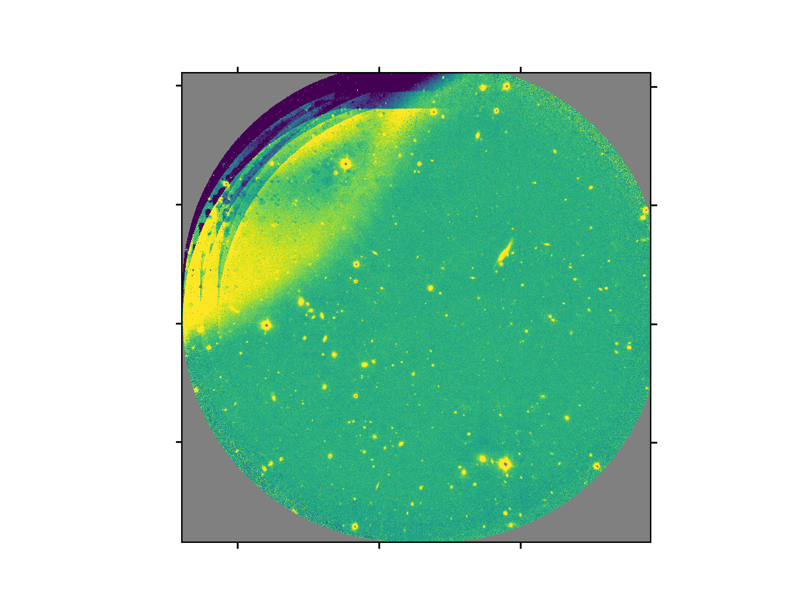

.. ex1_f2im_ontarget_api.rst

.. _ontarget_api:

**************************************************************************
Example 1 - Small sources with dither on target - Using the "Reduce" class
**************************************************************************

There may be cases where you would be interested in accessing the DRAGONS
Application Program Interface (API) directly instead of using the command
line wrappers to reduce your data. Here we show you how to do the same
reduction we did in the previous chapter but using the API.

The dataset
===========
If you have not already, download and unpack the tutorial's data package.
Refer to :ref:`datasetup` for the links and simple instructions.

The dataset specific to this example is described in:

    :ref:`ontarget_dataset`.

Here is a copy of the table for quick reference.

+---------------+---------------------+--------------------------------+
| Science       || S20131121S0075-083 | Y-band, 120 s                  |
+---------------+---------------------+--------------------------------+
| Darks         || S20131121S0369-375 | 2 s, short darks for BPM       |
|               +---------------------+--------------------------------+
|               || S20131120S0115-120 | 120 s, for science data        |
|               || S20131121S0010     |                                |
|               || S20131122S0012     |                                |
|               || S20131122S0438-439 |                                |
+---------------+---------------------+--------------------------------+
| Flats         || S20131129S0320-323 | 20 s, Lamp On, Y-band          |
|               +---------------------+--------------------------------+
|               || S20131126S1111-116 | 20 s, Lamp Off, Y-band         |
+---------------+---------------------+--------------------------------+

Setting Up
==========
First, navigate to your work directory in the unpacked data package.

::

    cd <path>/f2im_tutorial/playground

The first steps are to import libraries, set up the calibration manager,
and set the logger.

Importing Libraries
-------------------

We first import the necessary modules and classes:

.. code-block:: python
    :linenos:

    import glob

    import astrodata
    import gemini_instruments
    from recipe_system.reduction.coreReduce import Reduce
    from gempy.adlibrary import dataselect

The ``dataselect`` module will be used to create file lists for the
biases, the flats, the arcs, the standard, and the science observations.
The ``Reduce`` class is used to set up and run the data
reduction.

Setting up the logger
---------------------
We recommend using the DRAGONS logger. (See also :ref:`double_messaging`.)

.. code-block:: python
    :linenos:
    :lineno-start: 8

    from gempy.utils import logutils
    logutils.config(file_name='f2im_data_reduction.log')

.. _set_caldb_api:

Setting up the Calibration Service
----------------------------------

.. important::  Remember to set up the calibration service.

    Instructions to configure and use the calibration service are found in
    :ref:`cal_service`, specifically the these sections:
    :ref:`cal_service_config` and :ref:`cal_service_api`.

.. _create_file_lists:

Create list of files
====================

The next step is to create input file lists. The module ``dataselect`` helps
with that.  It uses Astrodata tags and |descriptors| to select the files and
store the filenames to a Python list that can then be fed to the ``Reduce``
class. (See the |astrodatauser| for information about Astrodata and for a list
of |descriptors|.)

The first list we create is a list of all the files in the ``playdata/example1/``
directory.

.. code-block:: python
    :linenos:
    :lineno-start: 15

    all_files = glob.glob('../playdata/example1/*.fits')
    all_files.sort()

The :meth:`~list.sort` method simply re-organize the list with the file names
and is an optional, but a recommended step. Before you carry on, you might want to do
``print(all_files)`` to check if they were properly read.

We will search that list for files with specific characteristics.  We use
the ``all_files`` :class:`list` as an input to the function
``dataselect.select_data()`` .  The function's signature is::

    select_data(inputs, tags=[], xtags=[], expression='True')

We show several usage examples below.

Two lists for the darks
-----------------------
We select the files that will be used to create a master dark for
the science observations, those with an exposure time of 120 seconds.

.. code-block:: python
    :linenos:
    :lineno-start: 17

    dark_files_120s = dataselect.select_data(
        all_files,
        ['F2', 'DARK', 'RAW'],
        [],
        dataselect.expr_parser('exposure_time==120')
    )

Above we are requesting data with tags ``F2``, ``DARK``, and ``RAW``, though
since we only have F2 raw data in the directory, ``DARK`` would be sufficient
in this case. We are not excluding any tags, as represented by the empty
list ``[]``.

.. note::  All expressions need to be processed with ``dataselect.expr_parser``.

We repeat the same syntax for the 2-second darks:

.. code-block:: python
    :linenos:
    :lineno-start: 23

    dark_files_2s = dataselect.select_data(
        all_files,
        ['F2', 'DARK', 'RAW'],
        [],
        dataselect.expr_parser('exposure_time==2')
    )

A list for the flats
--------------------
Now you must create a list of FLAT images for each filter. The expression
specifying the filter name is needed only if you have data from multiple
filters. It is not really needed in this case.

.. code-block:: python
    :linenos:
    :lineno-start: 29

    list_of_flats_Y = dataselect.select_data(
         all_files,
         ['FLAT'],
         [],
         dataselect.expr_parser('filter_name=="Y"')
    )

A list for the science data
---------------------------
Finally, the science data can be selected using:

.. code-block:: python
    :linenos:
    :lineno-start: 35

    list_of_science_images = dataselect.select_data(
        all_files,
        ['F2'],
        [],
        dataselect.expr_parser('(observation_class=="science" and filter_name=="Y")')
    )

The filter name is not really needed in this case since there are only Y-band
frames, but it shows how you could have two selection criteria in
the expression.

.. _api_process_dark_files:

Create a Master Dark
====================

We first create the master dark for the science targe.The master biases
will be automatically added to the local calibration manager when the "store"
parameter is present in the ``.dragonsrc`` configuration file.

The name of the output master dark is
``N20160102S0423_dark.fits``. The output is written to disk and its name is
stored in the Reduce instance. The calibration service expects the name of a
file on disk.

.. code-block:: python
    :linenos:
    :lineno-start: 41

    reduce_darks = Reduce()
    reduce_darks.files.extend(dark_files_120s)
    reduce_darks.runr()

The ``Reduce`` class is our reduction
"controller". This is where we collect all the information necessary for
the reduction. In this case, the only information necessary is the list of
input files which we add to the ``files`` attribute. The ``runr`` method is
where the recipe search is triggered and where it is executed.

.. note:: The file name of the output processed dark is the file name of the
    first file in the list with _dark appended as a suffix. This is the general
    naming scheme used by the ``Recipe System``.

.. note:: If you wish to inspect the processed calibrations before adding them
    to the calibration database, remove the "store" option attached to the
    database in the ``dragonsrc`` configuration file.  You will then have to
    add the calibrations manually following your inspection, eg.

   .. code-block::

        caldb.add_cal(reduce_darks.output_filenames[0])

.. _api_create_bpm_files:

Create a Bad Pixel Mask
=======================

By default, for F2 imaging data, an illumination mask will be added to the
data quality plane to identify the pixels beyond the circular aperture as
"non-illuminated". The instrument does not have a downloadable bad pixel mask
but the user can easily create a fresh bad pixel mask from the flats and
recent short darks.

The Bad Pixel Mask is created as follows:

.. code-block:: python
    :linenos:
    :lineno-start: 46

    reduce_bpm = Reduce()
    reduce_bpm.files.extend(list_of_flats_Y)
    reduce_bpm.files.extend(dark_files_2s)
    reduce_bpm.recipename = 'makeProcessedBPM'
    reduce_bpm.runr()

    bpm_filename = reduce_bpm.output_filenames[0]

The flats must be passed first to the input list to ensure that the recipe
library associated with F2 flats is selected. We are setting the recipe
name to ``makeProcessedBPM`` to select that recipe from the recipe library
instead of the using the default (which would create a master flat).

The BPM produced is named ``S20131129S0320_bpm.fits``.

Since this is a user-made BPM, you will have to pass it to DRAGONS on the
as an option to the ``Reduce`` instance to use it, as we will show below.

.. _api_process_flat_files:

Create a Master Flat Field
==========================
A F2 master flat is created from a series of lamp-on and lamp-off exposures.
Each flavor is stacked, then the lamp-off stack is subtracted from the
lamp-on stack and the result normalized.

We create the master flat field and add it to the calibration manager as follows:

.. code-block:: python
    :linenos:
    :lineno-start: 53

    reduce_flats = Reduce()
    reduce_flats.files.extend(list_of_flats_Y)
    reduce_flats.uparms = dict([('addDQ:user_bpm', bpm_filename)])
    reduce_flats.runr()

Note how we pass in the BPM we created in the previous step. The ``addDQ``
primitive, one of the primitives in the recipe, has an input parameter named
``user_bpm``. We assign our BPM to that input parameter. The value of
``uparms`` needs to be a :class:`dict`.

.. _api_process_science_files:

Reduce the Science Images
=========================
The science observation uses a dither-on-target pattern. The sky frames will
be derived automatically for each science frame from the dithered frames.

The master dark and the master flat will be retrieved automatically from the
local calibration database. Again, the user BPM needs to be specified as the
``user_bpm`` argument to ``addDQ``.

We use similar commands as before to initiate a new reduction to reduce the
science data:

.. code-block:: python
    :linenos:
    :lineno-start: 59

    reduce_target = Reduce()
    reduce_target.files.extend(list_of_science_images)
    reduce_target.uparms = dict([('addDQ:user_bpm', bpm_filename), ('prepare:bad_wcs', 'fix')])
    reduce_target.runr()

The final product file will have a ``_image.fits`` suffix and it is shown below.

The output stack units are in electrons (header keyword BUNIT=electrons).
The output stack is stored in a multi-extension FITS (MEF) file.  The science
signal is in the "SCI" extension, the variance is in the "VAR" extension, and
the data quality plane (mask) is in the "DQ" extension.

.. warning::

    The upper-left quadrant of this science sequence is rather messy. This
    is caused by the PWFS2 guide probe (see :ref:`issue_p2`). Photometry
    in this portion of the image is likely to be seriously compromised.

.. the figure below can be created using the script inside the ``savefig``
   folder.

