.. ex1_f2ls_JHHK_api.rst

.. include:: symbols.txt

.. _f2ls_JHHK_api:

**************************************************************************
Example 1 - JH and HK Longslit Point Source - Using the "Reduce" class API
**************************************************************************

We will reduce a Flamingos 2 JH and a HK longslit observation of the 2022
eruption of the recurrent nova U Sco using the Python
programmatic interface.

The 2-pixel slit is used.  The dither sequence is ABBA-ABBA.

The dataset
===========
If you have not already, download and unpack the tutorial's data package.
Refer to :ref:`datasetup` for the links and simple instructions.

The dataset specific to this example is described in:

    :ref:`f2ls_JHHK_dataset`

Setting up
==========
First navigate to your work directory in the unpacked data package.

::

    cd <path>/f2ls_tutorial/playground

The first steps are to import libraries, set up the calibration manager,
and set the logger.

Configuring the interactive interface
-------------------------------------
In ``~/.dragons/``, add the following to the configuration file ``dragonsrc``::

    [interactive]
    browser = your_preferred_browser

The ``[interactive]`` section defines your preferred browser.  DRAGONS will open
the interactive tools using that browser.  The allowed strings are "**safari**",
"**chrome**", and "**firefox**".

Importing libraries
-------------------

.. code-block:: python
    :linenos:

    import glob

    import astrodata
    import gemini_instruments
    from recipe_system.reduction.coreReduce import Reduce
    from gempy.adlibrary import dataselect

The ``dataselect`` module will be used to create file lists for the
biases, the flats, the arcs, the telluric star, and the science observations.
The ``Reduce`` class is used to set up and run the data
reduction.

Setting up the logger
---------------------
We recommend using the DRAGONS logger.  (See also :ref:`double_messaging`.)

.. code-block:: python
    :linenos:
    :lineno-start: 7

    from gempy.utils import logutils
    logutils.config(file_name='f2ls_tutorial.log')

Set up the Calibration Service
------------------------------

.. important::  Remember to set up the calibration service.

    Instructions to configure and use the calibration service are found in
    :ref:`cal_service`, specifically the these sections:
    :ref:`cal_service_config` and :ref:`cal_service_api`.

We recommend that you clean up your working directory (``playground``) and
delete the old calibration database before you start.  Create a fresh one.

Start a fresh calibration database (``caldb.init(wipe=True)``) when you
start a new example.

Inspect and fix headers
=======================
It is unfortunately too common that the last frame of a science or
telluric sequence gets some, not all, of its header values from the next
(yes, future) frame which is normally, in the case of F2, a flat.  The
key headers to pay attention too are EXPTIME and LNRS.  They are both
associate with descriptors.

Let's inspect the ``exposure_time`` and the ``read_mode`` for the science
and the telluric data.  For a given sequence, all the values should match.

First, we create is a list of all the files in the ``playdata``
directory.

.. code-block:: python
    :linenos:
    :lineno-start: 9

    all_files = glob.glob('../playdata/example1/*.fits')
    all_files.sort()

We will select the telluric and science frames and display the values for
the ``exposure_time`` and ``read_mode`` descriptors.

.. code-block:: python
    :linenos:
    :lineno-start: 11

    telJH = dataselect.select_data(
        all_files,
        [],
        ['CAL'],
        dataselect.expr_parser('observation_class=="partnerCal" and disperser=="JH"')
    )
    telHK = dataselect.select_data(
        all_files,
        [],
        ['CAL'],
        dataselect.expr_parser('observation_class=="partnerCal" and disperser=="HK"')
    )
    sciJH = dataselect.select_data(
        all_files,
        [],
        ['CAL'],
        dataselect.expr_parser('observation_class=="science" and disperser=="JH"')
    )
    sciJH = dataselect.select_data(
        all_files,
        [],
        ['CAL'],
        dataselect.expr_parser('observation_class=="science" and disperser=="HK"')
    )

    for f in telJH:
        ad = astrodata.open(f)
        print(f"{f}:\t{ad.exposure_time()}\t{ad.read_mode()}")

    for f in telHK:
        ad = astrodata.open(f)
        print(f"{f}:\t{ad.exposure_time()}\t{ad.read_mode()}")

    for f in sciJH:
        ad = astrodata.open(f)
        print(f"{f}:\t{ad.exposure_time()}\t{ad.read_mode()}")

    for f in sciJH:
        ad = astrodata.open(f)
        print(f"{f}:\t{ad.exposure_time()}\t{ad.read_mode()}")

You will notice that the exposure times and read mode for each sequence match,
**except for the HK science sequence** where the last frame claims to have an
exposure time of 90 seconds instead of 25, and a read mode of 1 (LNRS keyword)
instead of 4.   Those are the values that apply to the next frame, the flat.
The data was taken with the correct exposure time and read mode, but the
headers are wrong.

::

    ../playdata/example1/S20220617S0038.fits            25.0           4
    ../playdata/example1/S20220617S0039.fits            25.0           4
    ../playdata/example1/S20220617S0040.fits            25.0           4
    ../playdata/example1/S20220617S0041.fits            90.0           1

Let's fix that.  So that you can rerun these same commands before, we first
make a copy of the problematic file and give it a new name, leaving the
original untouched. Obviously, with your own data, you would just fix the
downloaded file once and for all, skipping the copy.

.. code-block:: python
    :linenos:
    :lineno-start: 51

    import shutil
    shutil.copy('../playdata/example1/S20220617S0041.fits', '../playdata/example1/S20220617S0041_fixed.fits')

    ad = astrodata.open('../playdata/example1/S20220617S0041_fixed.fits')
    ad.phu['EXPTIME'] = 25
    ad.phu['LNRS'] = 4
    ad.write(overwrite=True)

Create file lists
=================
This data set contains science and calibration frames. For some programs, it
could contain different observed targets and different exposure times depending
on how you like to organize your raw data.

The DRAGONS data reduction pipeline does not organize the data for you.  You
have to do it.  However, DRAGONS provides tools to help you.

The first step is to create input file lists.  The module "|dataselect|" helps.
It uses Astrodata tags and "|descriptors|" to select the files and
send the filenames to a text file that can then be fed to the ``Reduce``
class.  (See the |astrodatauser| for information about Astrodata  and for a
list of |descriptors|.)

Let's get a fresh list of all the files in the ``playdata`` directory.

.. code-block:: python
    :linenos:
    :lineno-start: 58

    all_files = glob.glob('../playdata/example1/*.fits')
    all_files.sort()

We will search that list for files with specific characteristics.  We use
the ``all_files`` :class:`list` as an input to the function
``dataselect.select_data()`` .  The function's signature is::

    select_data(inputs, tags=[], xtags=[], expression='True')

Several lists for the darks
---------------------------
The flats, the arcs, the telluric, and the science observations need
a master dark matching their exposure time.  We need a list of darks
for each set, and for both JH and HK gratings.

A dark correction is unfortunately necessary for Flamingos 2 data due to
strong and bright patterns that can interfere with the reduction if left
present in the data.

.. code-block:: python
    :linenos:
    :lineno-start: 60

    exposure_times = [6, 8, 15, 18, 25, 60, 90]
    darks = {}
    for exptime in exposure_times:
        darks[exptime] = dataselect.select_data(
                all_files,
                ['DARK'],
                [],
                dataselect.expr_parser(f'exposure_time=={exptime}')
        )

Four lists for the flats
------------------------
We have four observation sequences: science and telluric for both JH and HK
settings.  Each has its own flat.  The recipe to make the master
flats will combine the flats more than one is passed.  We need each flat to be
processed independently as they were taken at a slightly different telescope
orientation.  Therefore we need to separate them into four lists.

There are various ways to do that with |dataselect|.  Here use the name
of the disperser and a UT time selection.

We first check the times at which the flats were taken.  Then use that
information to set our selection criteria to separate them.

.. code-block:: python
    :linenos:
    :lineno-start: 69

    for f in dataselect.select_data(all_files, ['FLAT']):
        ad = astrodata.open(f)
        print(f"{f}\t{ad.ut_time()}\t{ad.disperser()}")

::

    ../playdata/example1/S20220617S0031.fits	00:30:30.100000	HK_G5802
    ../playdata/example1/S20220617S0042.fits	00:57:17.100000	HK_G5802
    ../playdata/example1/S20220617S0048.fits	01:06:37.100000	JH_G5801
    ../playdata/example1/S20220617S0077.fits	01:58:44.100000	JH_G5801

For HK, the telluric was taken before the science, for JH, it was taken after.
Therefore, we can construct our lists this way:

.. code-block:: python
    :linenos:
    :lineno-start: 72

    flatsciJH = dataselect.select_data(
        all_files,
        ['FLAT'],
        [],
        dataselect.expr_parser('filter_name=="JH" and ut_time<="01:56:00"')
    )
    flattelJH = dataselect.select_data(
        all_files,
        ['FLAT'],
        [],
        dataselect.expr_parser('filter_name=="JH" and ut_time>="01:56:00"')
    )
    flatsciHK = dataselect.select_data(
        all_files,
        ['FLAT'],
        [],
        dataselect.expr_parser('filter_name=="HK" and ut_time>="00:52:00"')
    )
    flattelHK = dataselect.select_data(
        all_files,
        ['FLAT'],
        [],
        dataselect.expr_parser('filter_name=="HK" and ut_time<="00:52:00"')
    )

The exact UT time does not matter as long as it is between the two flats that
we want to separate.

A list for the arcs
-------------------
There are four arcs.  One for the telluric sequence, one for the science
sequence, and for both the JH and HK gratings.  The recipe to measure the
wavelength solution will not stack the arcs.  Therefore, we can conveniently
create just one list with all the raw arc observations in it and they will be
processed independently.

.. code-block:: python
    :linenos:
    :lineno-start: 96

    arcs = dataselect.select_data(all_files, ['ARC'])

A list for the telluric
-----------------------
DRAGONS does not recognize the telluric star as such.  This is because, at
Gemini, the observations are taken like science data and the Flamingos 2
headers do not explicitly state that the observation is a telluric standard.
In most cases, the ``observation_class`` descriptor can be used to
differentiate the telluric from the science observations, along with the
rejection of the ``CAL`` tag to reject flats and arcs.

.. code-block:: python
    :linenos:
    :lineno-start: 97

    telluricsJH = dataselect.select_data(
        all_files,
        [],
        ['CAL'],
        dataselect.expr_parser('observation_class=="partnerCal" and disperser=="JH"')
    )
    telluricsHK = dataselect.select_data(
        all_files,
        [],
        ['CAL'],
        dataselect.expr_parser('observation_class=="partnerCal" and disperser=="HK"')
    )

A list for the science observations
-----------------------------------
The science observations can be selected from the observation class,
``science``, that is how they are differentiated from the telluric standards
which are ``partnerCal``.

If we had multiple targets, we would need to split them into separate lists. To
inspect what we have we can use |dataselect|.

.. code-block:: python
    :linenos:
    :lineno-start: 110

    all_science = dataselect.select_data(
        all_files,
        [],
        ['CAL'],
        dataselect.expr_parser('observation_class=="science"')
    )
    for sci in all_science:
        ad = astrodata.open(sci)
        print(sci, '  ', ad.object())

::

    ../playdata/example1/S20220617S0038.fits    V* U Sco
    ../playdata/example1/S20220617S0039.fits    V* U Sco
    ../playdata/example1/S20220617S0040.fits    V* U Sco
    ../playdata/example1/S20220617S0041.fits    V* U Sco
    ../playdata/example1/S20220617S0041_fixed.fits    V* U Sco
    ../playdata/example1/S20220617S0044.fits    V* U Sco
    ../playdata/example1/S20220617S0045.fits    V* U Sco
    ../playdata/example1/S20220617S0046.fits    V* U Sco
    ../playdata/example1/S20220617S0047.fits    V* U Sco

Also, since we had to fix the exposure time for one of the files and we created
a copy instead of changing the original, we need to make sure only the science
frame with the correct exposure time of 25 seconds get picked up.  If you had
fixed the original, mostly likely what you will do with your own data, you
wouldn't need to select on the exposure time.

.. code-block:: python
    :linenos:
    :lineno-start: 119

    sciJH = dataselect.select_data(
        all_files,
        [],
        ['CAL'],
        dataselect.expr_parser('observation_class=="science" and disperser=="JH" and object=="V* U Sco"')
    )
    sciHK = dataselect.select_data(
        all_files,
        [],
        ['CAL'],
        dataselect.expr_parser('observation_class=="science" and disperser=="HK" and exposure_time==25 and object=="V* U Sco"')
    )

Master Darks
============
Now that the lists are created, we just need to run ``Reduce`` on each list.

.. code-block:: python
    :linenos:
    :lineno-start: 131

    for exptime in darks.keys():
        reduce_darks = Reduce()
        reduce_darks.files.extend(darks[exptime])
        reduce_darks.runr()

Master Flat Fields
==================
Flamingos 2 longslit flat fields are normally obtained at night along with the
observation sequence to match the telescope and instrument flexure.

Flamingos 2 longslit master flat fields are created from the lamp-on flat(s)
and a master dark matching the flats exposure times.  Lamp-off flats are not
used.

In Flamingos 2 spectroscopic observations a blocking filter is used.  The
sharp drops in signal at both end makes fitting a function difficult. Our
recommendation is to set the region to be between the sharp drops and then
fit a low-order cubic spline.  This is a departure from what is being
recommended for the other Gemini spectrograph where a high-order is
recommended to fit all the wiggles.

For F2, only the overall shape should be fit.  The detailed fitting will be
taken care of when the sensitivity function is calculated using the telluric
standard star.

We have defined appropriate defaults for the order and the region to use to
normalize the flat for each grism and filter combinations.  You should not
have to modify them.

.. code-block:: python
    :linenos:
    :lineno-start: 135

    flatlists = [flatsciJH, flattelJH, flatsciHK, flattelHK]
    for flats in flatlists:
        reduce_flats = Reduce()
        reduce_flats.files.extend(flats)
        reduce_flats.runr()

If you wish to see the fit, you can add
``reduce_flats.uparms = dict([('interactive', True)])`` before the ``runr()``
call. For reference, this is how the HK flat fit looks like.

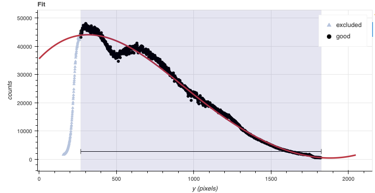

Processed Arc - Wavelength Solution
===================================
Obtaining the wavelength solution for Flamingos 2 is fairly straightforward
from the user's perspective. There are usually a sufficient number of lines
in the lamp.  Note, however, that the lines becomes asymmetric as they move
away from the center.  There are provisions in the algorithm to account of
that effect but the precision of the solution is limited.

The recipe for the arc requires a flat as it contains a map of the
unilluminated areas.   The master dark is required because of the strong
pattern that is often horizontal and that could be interpreted as an emission
line if not removed.

The solution is normally found automatically, but it does not hurt to
visually inspect it in interactive mode.

.. code-block:: python
    :linenos:
    :lineno-start: 140

    reduce_arcs = Reduce()
    reduce_arcs.files.extend(arcs)
    reduce_arcs.uparms = dict([('interactive', True),])
    reduce_arcs.runr()

The interactive tools are introduced in section :ref:`interactive`.

Telluric Standards
==================
Two telluric standards are required for the reduction of this data set.  The
HK observations were done at the beginning of the program's sequence.  A
HK telluric was observed before the start of the science sequence.   The JH
observations were done at the end of the sequence and the matching JH telluric
was obtained afterwards.

The JH telluric is HIP 83920, a A0V star with an estimated temperature of
9700K and a H magnitude of 8.044.  The HK telluric is HIP 79156, a A0.5V star
with an estimated temperature of 9500K and a H magnitude of 7.576.

(Temperatures from Eric Mamajek's list "A Modern Mean Dwarf Stellar Color and
Effective Temperature Sequence"
https://www.pas.rochester.edu/~emamajek/EEM_dwarf_UBVIJHK_colors_Teff.txt
)

Those physical characteristic are required to properly calculate and fit a
telluric model to the star and scale the sensitivity function.  They are
fed to the primitive ``fitTelluric``.

Note that the data are recognized by Astrodata as normal F2 longslit science
spectra.  To calculate the telluric correction, we need to specify the telluric
recipe (``-r reduceTelluric``), otherwise the default science reduction will be
run.

.. code-block:: python
    :linenos:
    :lineno-start: 144

    reduce_telluricJH = Reduce()
    reduce_telluricJH.files.extend(telluricsJH)
    reduce_telluricJH.recipename = 'reduceTelluric'
    reduce_telluricJH.uparms = dict([
                ('fitTelluric:bbtemp', 9700),
                ('fitTelluric:magnitude', 'H=8.044'),
                ('fitTelluric:interactive', True),
                ])
    reduce_telluricJH.runr()

    reduce_telluricHK = Reduce()
    reduce_telluricHK.files.extend(telluricsHK)
    reduce_telluricHK.recipename = 'reduceTelluric'
    reduce_telluricHK.uparms = dict([
                ('fitTelluric:bbtemp', 9500),
                ('fitTelluric:magnitude', 'H=8.576'),
                ('fitTelluric:interactive', True),
                ('prepare:bad_wcs', 'new')
                ])
    reduce_telluricHK.runr()

The WCS for the HK data are incorrect, hence the ``prepare:bad_wcs=new`` option.
See :ref:`badwcs` for more information.

The JH fit looks like this:

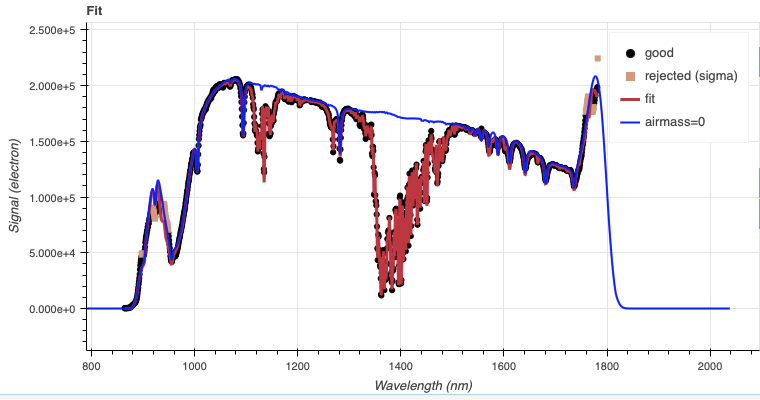

The flare up on the red end is the second order peeking through.  The sharp
dip in the blue is due to a large and bright artifact (likely a reflection)
that is seen in all the JH frames and can be clearly seen in the normalized
flat field that we produced earlier.  The position of the artifact is stable
but its strength does not seem to be as it is never completely removed during
flat fielding.

Similar observations can be made about the HK data.  In the HK data, the
reflection artifact is softer but present nonetheless.  Screenshots are
available here: :ref:`flat_artifacts`

Science Observations
====================
The target is a recurrent nova, U Sco, that was going through an eruption at
the time of the observations.   The dither pattern is a standard ABBA, repeated
once.

DRAGONS will subtract the dark current, flatfield the data, apply the
wavelength calibration, subtract the sky, stack the aligned spectra.  Then the
source will be extracted to a 1D spectrum, the telluric features removed, and
the spectrum flux calibrated.

Following the wavelength calibration, the default recipe has an optional
step to adjust the wavelength zero point using the sky lines.  By default,
this step will NOT make any adjustment.  We found that in general, the
adjustment is so small as being in the noise.  If you wish to make an
adjustment, or try it out, see :ref:`wavzero` to learn how.

.. note::  When the algorithm detects multiple sources, all of them will be
     extracted.  Each extracted spectrum is stored in an individual extension
     in the output multi-extension FITS file.

This is what the raw images looks like, for JH and for HK.

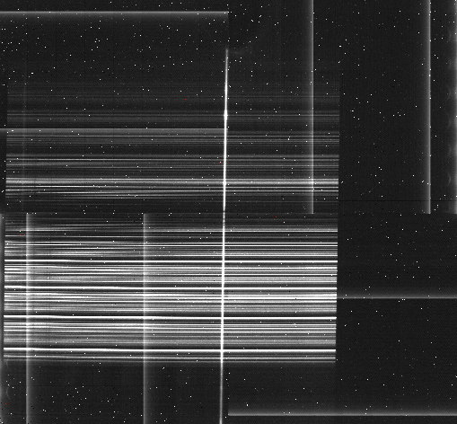

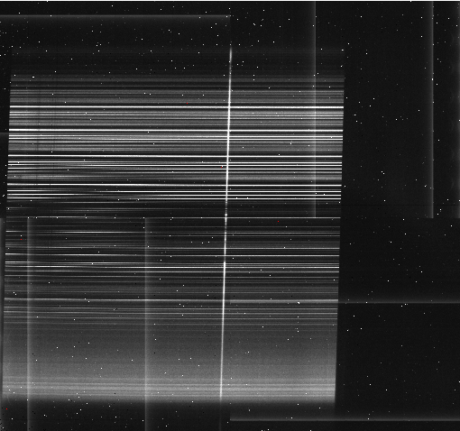

To run the reduction, call the ``Reduce`` class on the science list.  The
calibrations will be automatically associated.  It is recommended to run the
reduction in interactive mode to allow inspection of and control over the
critical steps.

.. code-block:: python
    :linenos:
    :lineno-start: 164

    reduce_scienceJH = Reduce()
    reduce_scienceJH.files.extend(sciJH)
    reduce_scienceJH.uparms = dict([
            ('interactive', True),
            ('prepare:bad_wcs', 'new'),
            ])
    reduce_scienceJH.runr()

    reduce_scienceHK = Reduce()
    reduce_scienceHK.files.extend(sciHK)
    reduce_scienceHK.uparms = dict([
            ('interactive', True),
            ('prepare:bad_wcs', 'new'),
            ])
    reduce_scienceHK.runr()

The 2D spectrum before extraction looks like this, with blue wavelengths at
the bottom and the red-end at the top.

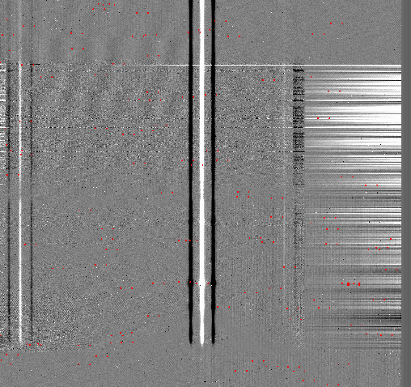

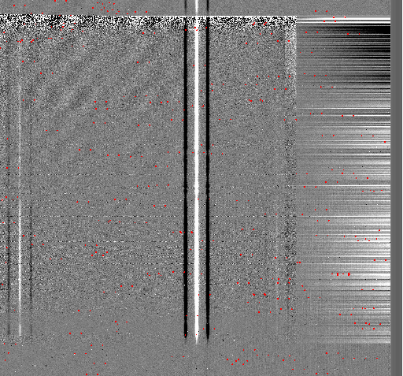

The 1D extracted spectra before telluric correction or flux calibration,
obtained by adding ``('extractSpectra:write_outputs', True)`` to the
``uparms`` dictionary, look like this.

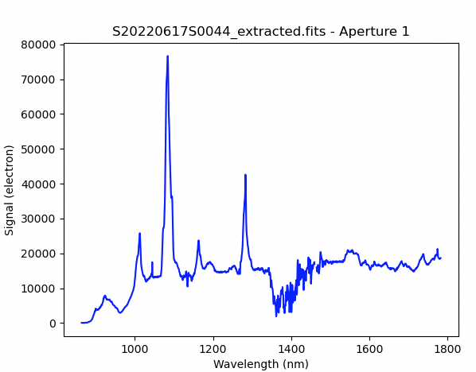

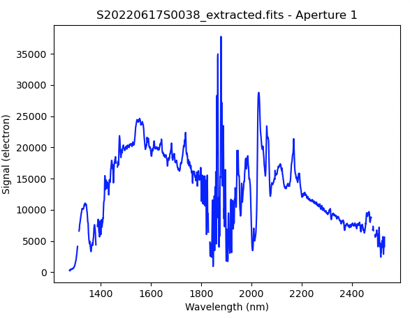

The 1D extracted spectra after telluric correction but before flux
calibration, obtained by adding ``('telluricCorrect:write_outputs', True)`` to
the ``uparms`` dictionary, look like this.

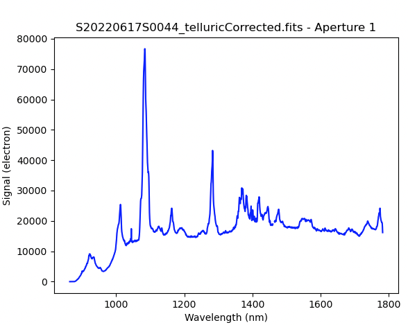

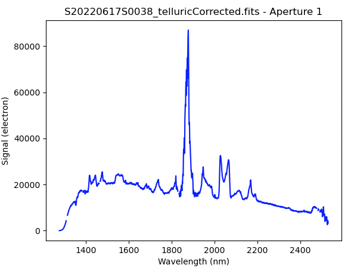

And the final spectra, corrected for telluric features and flux calibrated.

::

   from gempy.adlibrary import plotting
   ad = astrodata.open(reduce_scienceJH.output_filenames[0])
   plotting.dgsplot_matplotlib(ad, 1, kwargs={})

   ad = astrodata.open(reduce_scienceHK.output_filenames[0])
   plotting.dgsplot_matplotlib(ad, 1, kwargs={})

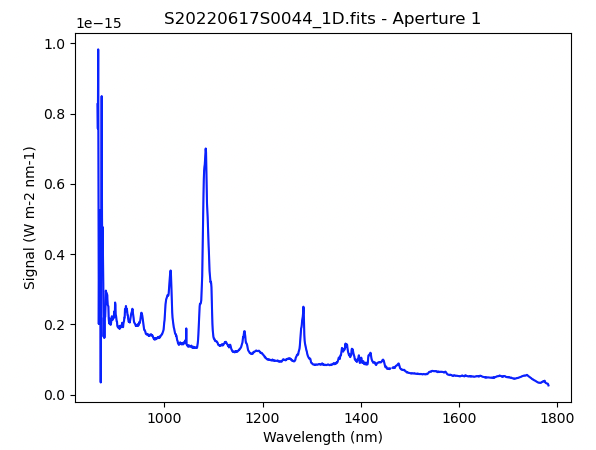

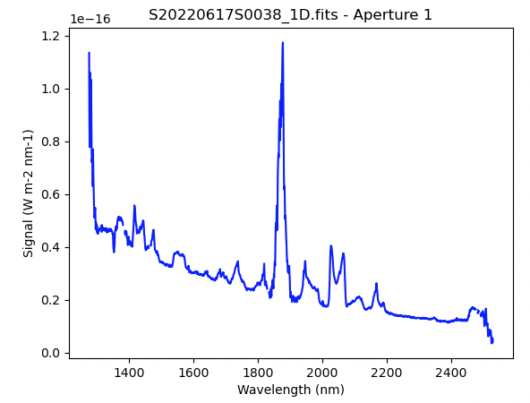

To join the JH and HK spectra into a full range spectrum, we will use the
``joinSpectra`` recipe.

However, because of the low signal at the red and blue edges, it
is not unusual for the flux calibration to diverge at the extremities; the
function is simply not well constrained there.  Therefore, before we join the
spectra, it is recommended to mask the noisy extremities, and in this case the
JH second order that was discussed above during the telluric reduction.   We
can use the
``dgsplot`` as above to identify the wavelength range we want to **keep**.
Then we call ``maskBeyondRegions``:

.. code-block:: python
    :linenos:
    :lineno-start: 179

    reduce_maskedges = Reduce()
    reduce_maskedges.files.append('S20220617S0044_1D.fits')
    reduce_maskedges.recipename = "maskBeyondRegions"
    reduce_maskedges.uparms = dict([('regions', "880:1720")])
    reduce_maskedges.runr()

    reduce_maskedges = Reduce()
    reduce_maskedges.files.append('S20220617S0038_1D.fits')
    reduce_maskedges.recipename = "maskBeyondRegions"
    reduce_maskedges.uparms = dict([('regions', "1400:2475")])
    reduce_maskedges.runr()

We can now join the two cleaned up spectra.

.. code-block:: python
    :linenos:
    :lineno-start: 190

    reduce_join = Reduce()
    reduce_join.files.extend(['S20220617S0044_regionsMasked.fits', 'S20220617S0038_regionsMasked.fits'])
    reduce_join.recipename = "joinSpectra"
    reduce_join.runr()

::

   from gempy.adlibrary import plotting
   ad = astrodata.open(reduce_join.output_filenames[0])
   plotting.dgsplot_matplotlib(ad, 1, kwargs={})

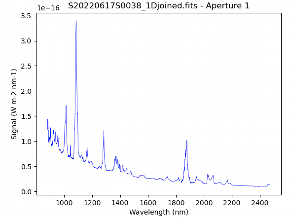

.. JH:  Matches the publish spectrum except below 1.040 um where the
..      continuum starts looking weird and likely exaggerated features show
..      up.  This is the section where the sensfunc fit struggles.
..
.. HK:  Very good match to publish spectrum.  Again it's the blue end which
..      is not quite right, but not as badly as for JH.
