.. ex2_f2ls_R3KJband_api.rst

.. include:: symbols.txt

.. _f2ls_R3KJband_api:

***************************************************************************
Example 2 - J-band R3K Longslit Point Source - Using the "Reduce" class API
***************************************************************************

We will reduce a F2 R3K 1.25 |um| longslit observation the recurrent nova
V1047 Cen using the Python programmatic interface.

This observation uses the 2-pixel slit. The dither pattern is a standard
ABBA.

The dataset
===========
If you have not already, download and unpack the tutorial's data package.
Refer to :ref:`datasetup` for the links and simple instructions.

The dataset specific to this example is described in:

    :ref:`f2ls_R3KJband_dataset`

Here is a copy of the table for quick reference.

+----------------------------+---------------------------------------------+
| Science                    || S20190702S0107-110                         |
+----------------------------+---------------------------------------------+
| Science darks (300s)       || S20190706S0431-437                         |
+----------------------------+---------------------------------------------+
| Science flat               || S20190702S0111                             |
+----------------------------+---------------------------------------------+
| Science flat darks (5s)    || S20190629S0029-035                         |
+----------------------------+---------------------------------------------+
| Science arc                || S20190702S0112                             |
+----------------------------+---------------------------------------------+
| Science arc darks (60s)    || S20190629S0085-091                         |
+----------------------------+---------------------------------------------+
| Science arc flat           || Same as science flat                       |
+----------------------------+---------------------------------------------+
| Telluric                   || S20190702S0099-102                         |
+----------------------------+---------------------------------------------+
| Telluric darks (25s)       || S20190706S0340-346                         |
+----------------------------+---------------------------------------------+
| Telluric flat              || Same as science flat                       |
+----------------------------+---------------------------------------------+
| Telluric flat darks (16s)  || Same as science flat darks                 |
+----------------------------+---------------------------------------------+
| Telluric arc               || S20190702S0103                             |
+----------------------------+---------------------------------------------+
| Telluric arc darks         || Same as science arc darks                  |
+----------------------------+---------------------------------------------+
| Telluric arc flat          || Same as telluric flat                      |
+----------------------------+---------------------------------------------+

Setting up
==========
First navigate to your work directory in the unpacked data package.

::

    cd <path>/f2ls_tutorial/playground

The first steps are to import libraries, set up the calibration manager,
and set the logger.

Configuring the interactive interface
-------------------------------------
In ``~/.dragons/``, add the following to the configuration file ``dragonsrc``::

    [interactive]
    browser = your_preferred_browser

The ``[interactive]`` section defines your preferred browser.  DRAGONS will open
the interactive tools using that browser.  The allowed strings are "**safari**",
"**chrome**", and "**firefox**".

Importing libraries
-------------------

.. code-block:: python
    :linenos:

    import glob

    import astrodata
    import gemini_instruments
    from recipe_system.reduction.coreReduce import Reduce
    from gempy.adlibrary import dataselect

The ``dataselect`` module will be used to create file lists for the
biases, the flats, the arcs, the telluric star, and the science observations.
The ``Reduce`` class is used to set up and run the data
reduction.

Setting up the logger
---------------------
We recommend using the DRAGONS logger.  (See also :ref:`double_messaging`.)

.. code-block:: python
    :linenos:
    :lineno-start: 7

    from gempy.utils import logutils
    logutils.config(file_name='f2ls_tutorial.log')

Set up the Calibration Service
------------------------------

.. important::  Remember to set up the calibration service.

    Instructions to configure and use the calibration service are found in
    :ref:`cal_service`, specifically the these sections:
    :ref:`cal_service_config` and :ref:`cal_service_api`.

We recommend that you clean up your working directory (``playground``) and
delete the old calibration database before you start.  Create a fresh one.

Start a fresh calibration database (``caldb.init(wipe=True)``) when you
start a new example.

Inspect and fix headers
=======================
It is unfortunately too common that the last frame of a science or
telluric sequence gets some, not all, of its header values from the next
(yes, future) frame which is normally, in the case of F2, a flat.  The
key headers to pay attention too are EXPTIME and LNRS.  They are both
associate with descriptors.

Let's inspect the ``exposure_time`` and the ``read_mode`` for the science
and the telluric data.  For a given sequence, all the values should match.

First, we create is a list of all the files in the ``playdata``
directory.

.. code-block:: python
    :linenos:
    :lineno-start: 9

    all_files = glob.glob('../playdata/example2/*.fits')
    all_files.sort()

We will select the telluric and science frames and display the values for
the ``exposure_time`` and ``read_mode`` descriptors.

.. code-block:: python
    :linenos:
    :lineno-start: 11

    sciframes = dataselect.select_data(
        all_files,
        [],
        ['CAL'],
        dataselect.expr_parser('observation_class=="science"')
    )
    tellurics = dataselect.select_data(
        all_files,
        [],
        ['CAL'],
        dataselect.expr_parser('observation_class!="science"')
    )

    for f in sciframes:
        ad = astrodata.open(f)
        print(f"{f}:\t{ad.exposure_time()}\t{ad.read_mode()}")

    for f in tellurics:
        ad = astrodata.open(f)
        print(f"{f}:\t{ad.exposure_time()}\t{ad.read_mode()}")

The science sequence::

    ../playdata/example2/S20190702S0107.fits           300.0           8
    ../playdata/example2/S20190702S0108.fits           300.0           8
    ../playdata/example2/S20190702S0109.fits           300.0           8
    ../playdata/example2/S20190702S0110.fits           300.0           8

The telluric sequence::

    ../playdata/example2/S20190702S0099.fits            25.0           1
    ../playdata/example2/S20190702S0100.fits            25.0           1
    ../playdata/example2/S20190702S0101.fits            25.0           1
    ../playdata/example2/S20190702S0102.fits            25.0           1

Everything looks good with all the exposure times and read modes matching.
Had there been discrepancies, you would have fixed them
as shown in Example 1 and Example 3.

Create file lists
=================
This data set contains science and calibration frames. For some programs, it
could contain different observed targets and different exposure times depending
on how you like to organize your playdata/example2 data.

The DRAGONS data reduction pipeline does not organize the data for you.  You
have to do it.  However, DRAGONS provides tools to help you.

The first step is to create input file lists.  The tool "|dataselect|" helps
with that.  It uses Astrodata tags and "|descriptors|" to select the files and
send the filenames to a text file that can then be fed to the ``Reduce``
class.  (See the |astrodatauser| for information about Astrodata  and for a
list of |descriptors|.)

Let's get a fresh list of all the files in the ``playdata`` directory.

.. code-block:: python
    :linenos:
    :lineno-start: 31

    all_files = glob.glob('../playdata/example2/*.fits')
    all_files.sort()

We will search that list for files with specific characteristics.  We use
the ``all_files`` :class:`list` as an input to the function
``dataselect.select_data()`` .  The function's signature is::

    select_data(inputs, tags=[], xtags=[], expression='True')

Several lists for the darks
---------------------------
The flats, the arcs, the telluric, and the science observations need
a master dark matching their exposure time.  We need a list of darks
for each set.   The exposure times are 5s for the flats, 60s for the arcs,
25s for the telluric frames, and 300s for the science frames.

A dark correction is unfortunately necessary for Flamingos 2 data due to
strong and bright patterns that can interfere with the reduction if left
present in the data.

.. code-block:: python
    :linenos:
    :lineno-start: 33

    exposure_times = [5, 25, 60, 300]
    darks = {}
    for exptime in exposure_times:
        darks[exptime] = dataselect.select_data(
                all_files,
                ['DARK'],
                [],
                dataselect.expr_parser(f'exposure_time=={exptime}')
        )

One list for the flat
---------------------
Only one flat was obtained for this observation, one flat just after the
science sequence.  It can happen that a flat is also obtained after the
telluric sequence.  The recipe to make the master flats combines the input
flats if more than one is passed.  Therefore each flat group (one flat or
flats taken in succession) needs to be reduced independently.  Here, we just
need to send the filename of the unique flat to a list.

.. note:: No selection criteria are needed here since there is just one flat.
    Obviously, if your raw data directory contains all the data for the
    entire program you will have to apply selection criteria to ensure that
    the flats are sorted adequately.

.. code-block:: python
    :linenos:
    :lineno-start: 42

    for f in dataselect.select_data(all_files, ['FLAT']):
        ad = astrodata.open(f)
        print(f"{f}\t{ad.ut_time()}\t{ad.disperser()}")

::

    ../playdata/example2/S20190702S0111.fits   01:54:39.300000

.. code-block:: python
    :linenos:
    :lineno-start: 45

    flat = dataselect.select_data(all_files, ['FLAT'])

A list for the arcs
-------------------
There are two arcs.  One for the telluric sequence, one for the science
sequence.  The recipe to measure the wavelength solution will not stack the
arcs.  Therefore, we can conveniently create just one list with all the raw
arc observations in it and they will be processed independently.

.. code-block:: python
    :linenos:
    :lineno-start: 46

    arcs = dataselect.select_data(all_files, ['ARC'])

A list for the telluric
-----------------------
DRAGONS does not recognize the telluric star as such.  This is because, at
Gemini, the observations are taken like science data and the Flamingos 2
headers do not
explicitly state that the observation is a telluric standard.  In most cases,
the ``observation_class`` descriptor can be used to differentiate the telluric
from the science observations, along with the rejection of the ``CAL`` tag to
reject flats and arcs.

.. code-block:: python
    :linenos:
    :lineno-start: 47

    tellurics = dataselect.select_data(
        all_files,
        [],
        ['CAL'],
        dataselect.expr_parser('observation_class!="science"')
    )

A list for the science observations
-----------------------------------
The science observations can be selected from the observation
class, ``science``, that is how they are differentiated from the telluric
standards which are ``partnerCal``.

If we had multiple targets, we would need to split them into separate lists. To
inspect what we have we can use |dataselect|.

.. code-block:: python
    :linenos:
    :lineno-start: 53

    all_science = dataselect.select_data(
        all_files,
        [],
        ['CAL'],
        dataselect.expr_parser('observation_class=="science"')
    )
    for sci in all_science:
        ad = astrodata.open(sci)
        print(sci, '  ', ad.object())

::

    ../playdata/example2/S20190702S0107.fits   V1047 Cen
    ../playdata/example2/S20190702S0108.fits   V1047 Cen
    ../playdata/example2/S20190702S0109.fits   V1047 Cen
    ../playdata/example2/S20190702S0110.fits   V1047 Cen

Here we only have one object from the same sequence.  If we had multiple
objects we could add the object name in the expression.

.. code-block:: python
    :linenos:
    :lineno-start: 62

    sciframes = dataselect.select_data(
        all_files,
        [],
        ['CAL'],
        dataselect.expr_parser('observation_class=="science" and object=="V1047 Cen"')
    )

Master Darks
============
Now that the lists are created, we just need to run ``Reduce`` on each list.

.. code-block:: python
    :linenos:
    :lineno-start: 68

    for exptime in darks.keys():
        reduce_darks = Reduce()
        reduce_darks.files.extend(darks[exptime])
        reduce_darks.runr()

Master Flat Fields
==================
Flamingos 2 longslit flat fields are normally obtained at night along with the
observation sequence to match the telescope and instrument flexure.

Flamingos 2 longslit master flat fields are created from the lamp-on flat(s)
and a master dark matching the flats exposure times.  Lamp-off flats are not
used.

In Flamingos 2 spectroscopic observations a blocking filter is used.  The
sharp drops in signal at both end makes fitting a function difficult. Our
recommendation is to set the region to be between the sharp drops and then
fit a low-order cubic spline.  This is a departure from what is being
recommended for the other Gemini spectrographs where a high-order is
recommended to fit all the wiggles.

For F2, only the overall shape should be fit.  The detailed fitting will be
taken care of when the sensitivity function is calculated using the telluric
standard star.

We have defined appropriate defaults for the order and the region to use to
normalize the flat for each grism and filter combinations.  You should not
have to modify them.

.. code-block:: python
    :linenos:
    :lineno-start: 72

    reduce_flats = Reduce()
    reduce_flats.files.extend(flat)
    reduce_flats.runr()

If you wish to see the fit, you can add
``reduce_flats.uparms = dict([('interactive', True)])`` before the ``runr()``
call. For reference, this is how the flat fit looks like.

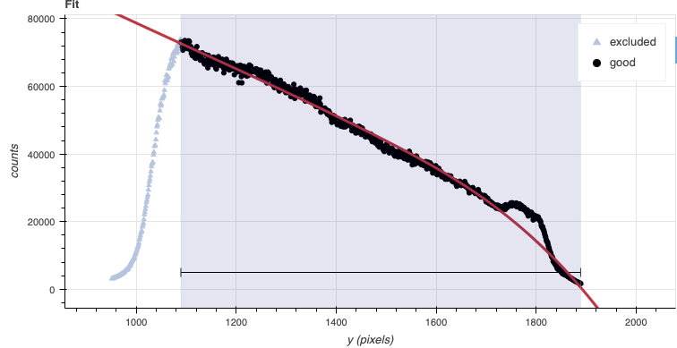

Processed Arc - Wavelength Solution
===================================
Obtaining the wavelength solution for Flamingos 2 is fairly straightforward
from the user's perspective. There are usually a sufficient number of lines
in the lamp.  Note, however, that the lines becomes asymmetric as they move
away from the center.  There are provisions in the algorithm to account of
that effect but the precision of the solution is limited.

The recipe for the arc requires a flat as it contains a map of the
unilluminated areas.   The master dark is required because of the strong
pattern that is often horizontal and that could be interpreted as an emission
line if not removed.

The solution is normally found automatically, but it does not hurt to
visually inspect it in interactive mode.

.. code-block:: python
    :linenos:
    :lineno-start: 75

    reduce_arcs = Reduce()
    reduce_arcs.files.extend(arcs)
    reduce_arcs.uparms = dict([('interactive', True),])
    reduce_arcs.runr()

The interactive tools are introduced in section :ref:`interactive`.

Telluric Standard
=================
The telluric standard observed after the science observation is "hip 63036".
The spectral type of the star is A0/1V.

To properly calculate and fit a telluric model to the star, we need to know
its effective temperature.  To properly scale the sensitivity function (to
use the star as a spectrophotometric standard), we need to know the star's
magnitude.  Those are inputs to the ``fitTelluric`` primitive.

In Eric Mamajek's list "A Modern Mean Dwarf Stellar Color and Effective
Temperature Sequence"
(https://www.pas.rochester.edu/~emamajek/EEM_dwarf_UBVIJHK_colors_Teff.txt)
the effective temperature of an A0/1V star as about 9500 K. The precise
value has only a small effect on the derived sensitivity and even less
effect on the telluric correction, so the temperature from any reliable
source can be used. Using Simbad, we find that the star has a magnitude
of J=7.498, which is the closest waveband to our observation.

Note that the data are recognized by Astrodata as normal F2 longslit science
spectra.  To calculate the telluric correction, we need to specify the telluric
recipe (``reduceTelluric``), otherwise the default science reduction will be
run.

.. code-block:: python
    :linenos:
    :lineno-start: 79

    reduce_telluric = Reduce()
    reduce_telluric.files.extend(tellurics)
    reduce_telluric.recipename = 'reduceTelluric'
    reduce_telluric.uparms = dict([
                ('fitTelluric:bbtemp', 9500),
                ('fitTelluric:magnitude', 'J=7.498'),
                ('fitTelluric:interactive', True),
                ('prepare:bad_wcs', 'new')
                ])
    reduce_telluric.runr()

The ``prepare:bad_wcs=new`` is needed because the WCS in the raw data
is not quite right and that leads to an incorrect sky subtraction and
alignment.  See :ref:`badwcs` for more information.

Using the defaults, the fit and model spectrum look like this:

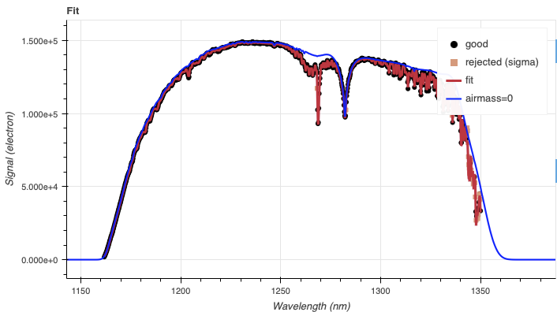

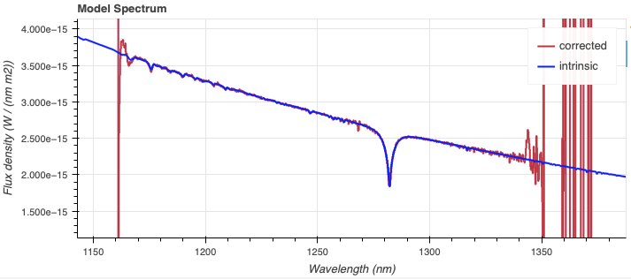

Science Observations
====================
The science target is recurrent nova.  The observation is one ABBA set.
DRAGONS will subtract the dark current, flatfield the data, apply the
wavelength calibration, subtract the sky, stack the aligned spectra.  Then the
source will be extracted to a 1D spectrum, the telluric features removed, and
the spectrum flux calibrated.

Following the wavelength calibration, the default recipe has an optional
step to adjust the wavelength zero point using the sky lines.  By default,
this step will NOT make any adjustment.  We found that in general, the
adjustment is so small as being in the noise.  If you wish to make an
adjustment, or try it out, see :ref:`wavzero` to learn how.

.. note::  When the algorithm detects multiple sources, all of them will be
     extracted.  Each extracted spectrum is stored in an individual extension
     in the output multi-extension FITS file.

This is what one raw image looks like.

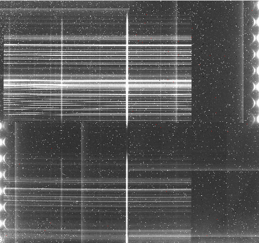

To run the reduction, call the ``Reduce`` class on the science list.  The
calibrations will be automatically associated.  It is recommended to run the
reduction in interactive mode to allow inspection of and control over the
critical steps.

There are many sources along the slit.  We know that we are interested
only in the brightest one.  Therefore, we set the maximum number of sources
to find to 1 in ``findApertures``.

.. code-block:: python
    :linenos:
    :lineno-start: 89

    reduce_science = Reduce()
    reduce_science.files.extend(sciframes)
    reduce_science.uparms = dict([
            ('interactive', True),
            ('prepare:bad_wcs', 'new'),
            ('findApertures:max_apertures', 1)
            ])
    reduce_science.runr()

The exposure time of each of the four frames is 300 seconds.  The default time
interval for the sky subtraction association is 600 seconds.  The default
number of skies to use, ``min_skies`` is 2.  The routine will issues warnings
that it cannot find 2 sky frames compatible with the time interval.  The
default behavior in this case is to issue the warnings and ignore the time
interval constraint.  Here it works fine.  Depending on the sky conditions and
variability, another solution would be to set ``min_skies`` to 1 and always
catch the A or B frame closest in time.  Which works best for a given dataset
is something the users will have to judge for themselves.

At the ``telluricCorrect`` step you should focus on the section illustrated
below.  The redder region is marked as non-illuminated in the flat and masked.

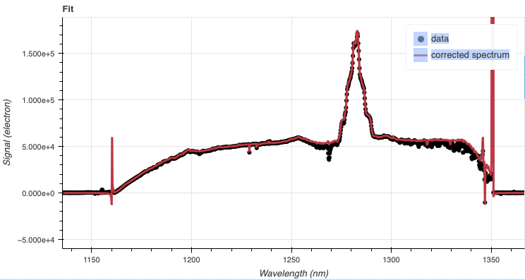

If you zoom-in on a region where there was a telluric feature, you will notice
that the fit is not quite aligned.  It happens, that is what the interactive
tool for ``telluricCorrect`` is for.   You can adjust the shift to get a
better removal of the telluric feature.

A shift of -0.25 helps.

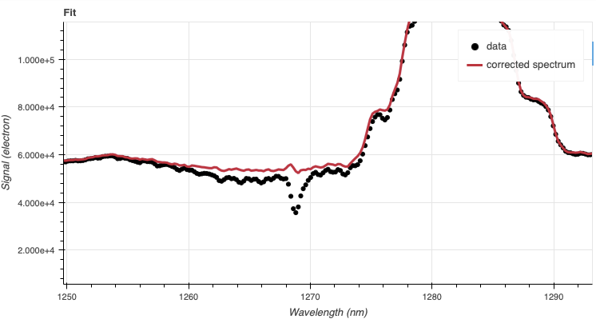

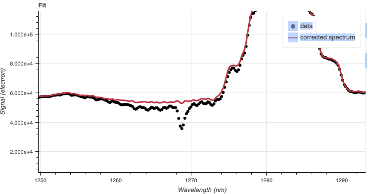

The 2D spectrum before extraction looks like this, with blue wavelengths at
the bottom and the red-end at the top.   Only the bottom half of the frame
is valid and within the J filter transmission band.

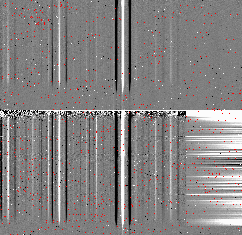

The 1D extracted spectrum before telluric correction or flux calibration,
obtained by adding ``('extractSpectra:write_outputs', True)`` to the
``uparms`` dictionary, looks like this.

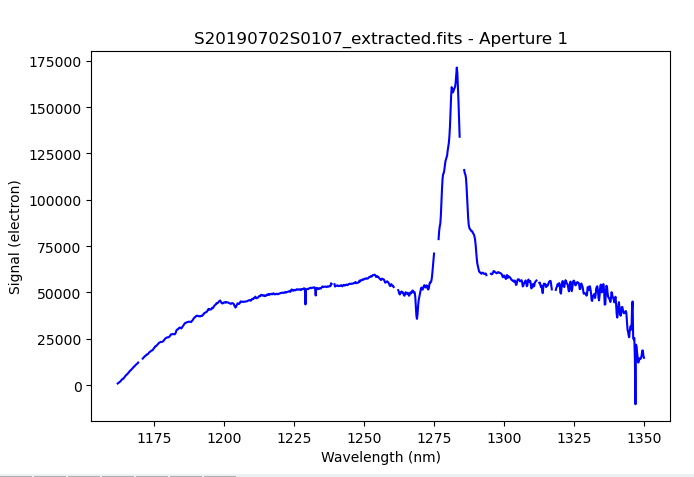

The 1D extracted spectrum after telluric correction but before flux
calibration, obtained by adding ``('telluricCorrect:write_outputs', True)`` to
the ``uparms`` dictionary, looks like this.

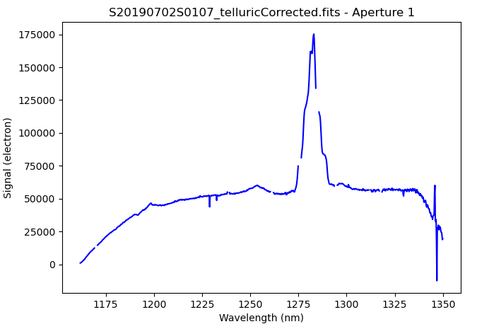

And the final spectrum, corrected for telluric features and flux calibrated.

::

   from gempy.adlibrary import plotting
   ad = astrodata.open(reduce_science.output_filenames[0])
   plotting.dgsplot_matplotlib(ad, 1, kwargs={})

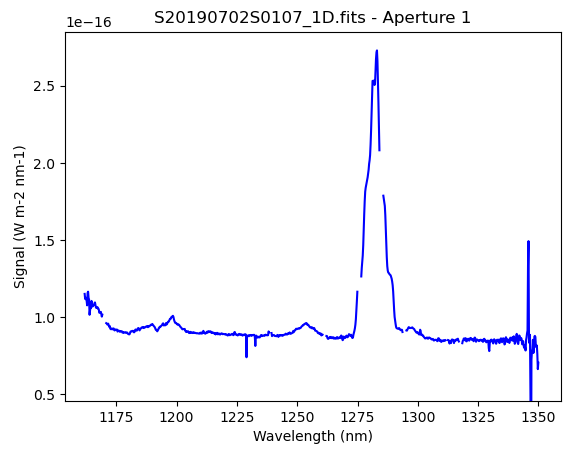

The "notch" in the emission line is where pixels have been masked, in this case
due to saturation (probably when a bright sky line added to the star's signal
to push the counts over the limit).  The tool ``dgsplot`` understands the data
quality plane and plots the spectrum accordingly.

.. It appears that the "beyond filter cut off" signal is not being masked.  It shows up in science spectrum.
.. telluricCorrect:  shows the masked pixel area.  It shouldn't.  Over the ** valid ** area, the model
..    looks ever so slightly better.
.. dgsplot shows only the valid area for the extracted spectrum.
.. For the _1D, it shows all the crap beyond.

