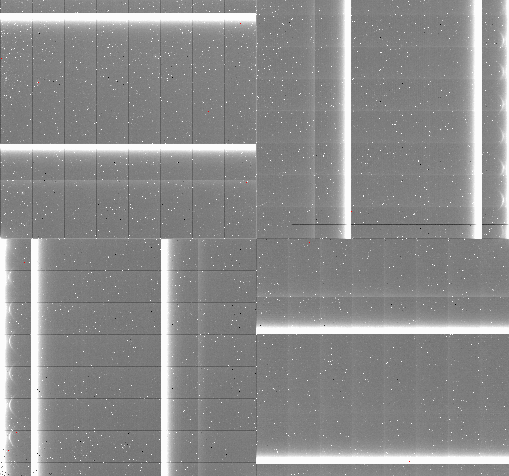
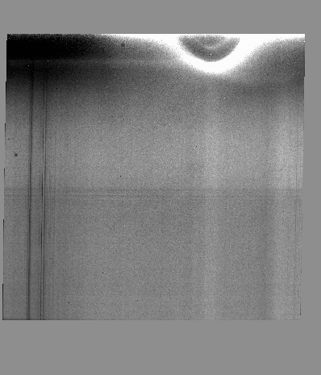
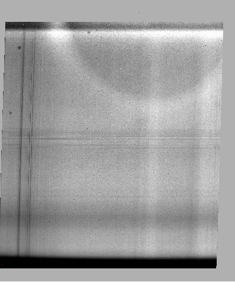
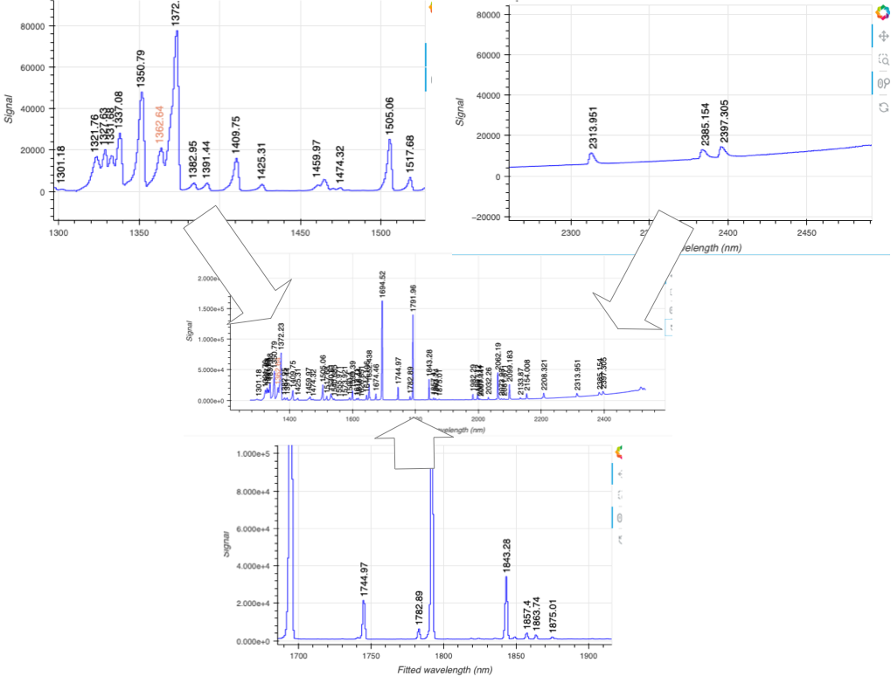
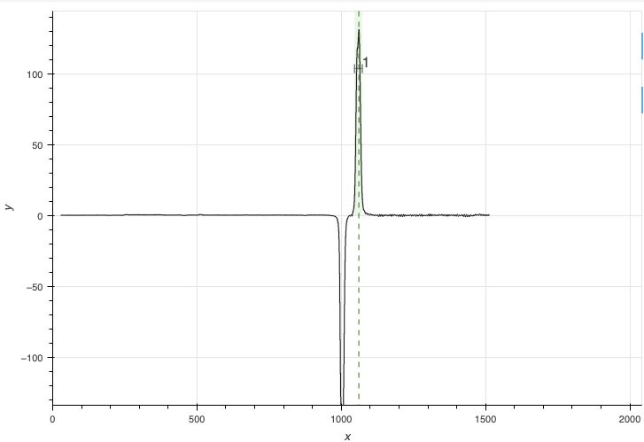
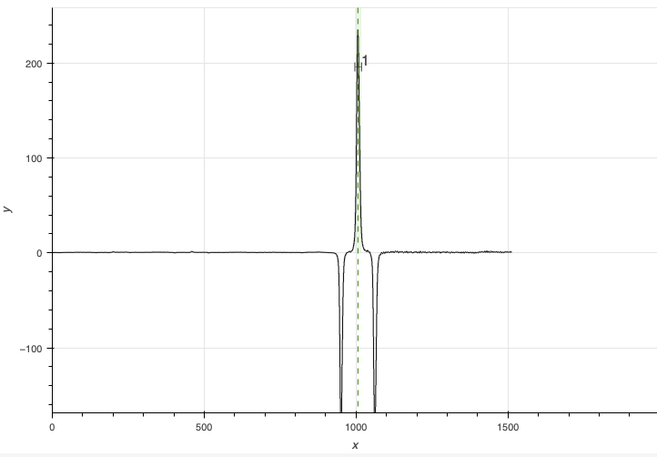

.. issues_and_limitations.rst

.. _issues_and_limitations:

**********************
Issues and Limitations
**********************

.. _why_darks:

Why darks are used
==================
A Flamingos 2 dark looks like this.

Not only is the pattern very strong, it is also not stable.  Using a separate
dark subtraction step helps attenuate the pattern a bit.  Also, for the flats,
lamp-off flats are not observed and the dark pattern has to be removed with
same-exposure-time darks to produce a master flat. Also, if that pattern is
not remove in the lamp arcs, they can interfere with the arc line detection.

.. _flat_artifacts:

Reflections in flats
====================
In JH and HK longslit observations, the observations suffer from what looks
like internal reflections.  The top (blue part) of the array is affected and
lead to difficulties with the sensitivity function calculation in that part
of the spectrum.

For references, here is what the JH and HK longslit master flat fields look
like.

.. _asymmetric_lines:

Asymmetric lines
================
The optics in Flamingos 2 lead to line profiles that are asymmetric, get worse
with distance from the center.  Here is an illustration.

The DRAGONS wavelength solution and telluric modeling algorithms do their best
to compensate, but it is not perfect.  The line spread function used in the
telluric modeling accounts for this asymmetry.

.. _badwcs:

Recognizing and fixing bad WCS
==============================
The WCS in Flamingos 2 data is commonly not quite right.  There is a step
in the ``prepare`` primitive that tries to identify issues and raise an
error.  Unfortunately, for Flamingos 2, the discrepancies are not
always detected by the current algorithm.

There are ways for the user to detect the problem however.

One is is by inspecting the spatial profile with the ``findApertures``
interactive tool. There are indications in the logs before that step, but the
visual cue is often easier to spot.

When the WCS of the raw data are wrong in an on-target ABBA, to the point that
it recognize a target-offset_to_sky pattern during sky subtraction rather than
a ABBA dither patter, the profile in ``findApertures`` can
look like this, one positive, one negative:

When the WCS is correct or has been fixed, the standard AB dither pattern
should lead to a negative-positive-negative profile, like this:

Another way to notice the WCS problem is to look at the logs for ``separateSky``.
In a standard ABBA sequence, all the datasets should be recognized as target,
and all of them should also be recognized as sky: B is sky for A and A is sky
for B.  If you notice that the list gets separated into only target and only
sky, when it is an on-target ABBA dither pattern, then the WCS in the raw
data are wrong.  Here is an example of wrongly identified ABBA::

   PRIMITIVE: separateSky
   ----------------------
   Identified 3 group(s) of exposures
   Classifying groups based on target proximity and observation efficiency
   Science frames:
     S20190702S0100_wavelengthZeroPointAdjusted.fits
     S20190702S0101_wavelengthZeroPointAdjusted.fits
   Sky frames:
     S20190702S0099_wavelengthZeroPointAdjusted.fits
     S20190702S0102_wavelengthZeroPointAdjusted.fits
   .

One other tell-tale of a bad WCS in the raw data is in the logs of
``adjustWCSToReference``.  The offsets it finds must match the dither pattern.
All the A position should be offset by a value close to zero, and all the B
offsets should be similar and match the offset that was applied at the
telescope.  If you see a message about the cross-correlation failing, that is
almost certainly an issue with the WCS.  Eg.::

   PRIMITIVE: adjustWCSToReference
   -------------------------------
   Reference image: S20220617S0044_distortionCorrected.fits
   WARNING - No cross-correlation peak found for S20220617S0045_distortionCorrected.fits:1 within tolerance
   S20220617S0045_distortionCorrected.fits: applying offset of -38.22 pixels
   S20220617S0046_distortionCorrected.fits: applying offset of -55.82 pixels
   S20220617S0047_distortionCorrected.fits: applying offset of -0.02 pixels
   .

Therefore, when you run the telluric or the science reduction on new data, run
``findApertures`` in interactive mode (``-p findApertures:interactive=True`` or
``-p interactive=True`` to turn everything interactive), **and pay attention** to
the logs.  If you see the "bad WCS" signs, abort and re-run the reduction with
``-p prepare:bad_wcs=new``.  For example::

    reduce @sci.lis -p prepare:bad_wcs=new interactive=True

That should lead to the "good WCS" profile.  If not, the problem is elsewhere.

.. note::  If you still see cross-correlation issues in `adjustWCSToReference`
    even with `prepare:bad_wcs=new`, try to add `adjustWCSToReference:method:wcs`,
    that will bypass the cross-correlation and use the offsets in the headers.

.. todo:: Add screenshot of all the optical and detector issues.