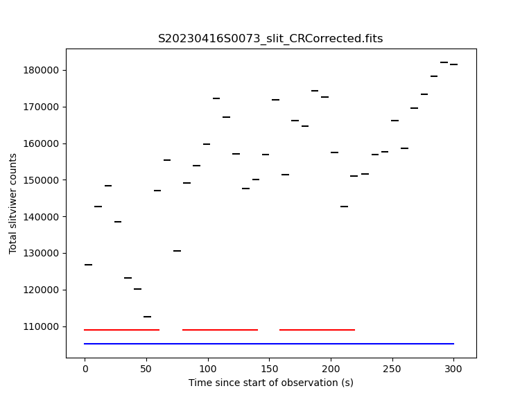

.. ex1_ghost_stdonetarget_api.rst

.. role:: raw-html(raw)
   :format: html

.. |verticalpadding| replace:: :raw-html:` `

.. stdonetarget_api:

*******************************************************************
Example 1 - Standard Resolution One Target - Using the "Reduce" API
*******************************************************************

In this example we will reduce a GHOST observation of the star XX Oph using the
``Reduce`` class that serves as the main API to the DRAGONS pipeline.

This observation uses IFU-1 for the target.  IFU-2 is stowed.

The dataset
===========
If you have not already, download and unpack the tutorial's data package.
Refer to :ref:`datasetup` for the links and simple instructions.

The dataset specific to this example is described in:

    :ref:`datastdonetarget`.

Here is a copy of the table for quick reference.

+-----------------+-------------------------------------------------+
| Science         || S20230416S0079 (blue:2x2,slow; red:2x2,medium) |
+-----------------+-------------------------------------------------+
| Science biases  || S20230417S0011-015                             |
+-----------------+-------------------------------------------------+
| Science Flats   || S20230416S0047 (1x1; blue:slow; red:medium)    |
+-----------------+-------------------------------------------------+
| Science Arcs    || S20230416S0049-51 (1x1)                        |
+-----------------+-------------------------------------------------+
| Flats Biases    || S20230417S0036-40 (1x1; blue:slow; red:medium) |
+-----------------+                                                 |
| Arc Biases      ||                                                |
+-----------------+-------------------------------------------------+
| Standard        || S20230416S0073 (blue:2x2,slow; red:2x2,medium) |
| (CD -32 9927)   ||                                                |
+-----------------+-------------------------------------------------+
| Standard biases || In this case, the calibrations for the         |
+-----------------+  science can be used for the standard star.     |
| Standard flats  ||                                                |
+-----------------+                                                 |
| Standard arc    ||                                                |
+-----------------+                                                 |
| Std flat biases ||                                                |
+-----------------+                                                 |
| Std arc biases  ||                                                |
+-----------------+-------------------------------------------------+
+ BPMs            || bpm_20220601_ghost_blue_11_full_4amp.fits      |
|                 || bpm_20220601_ghost_red_11_full_4amp.fits       |
|                 ||                                                |
|                 ||  From archive, not data package.               |
+-----------------+-------------------------------------------------+

Setting up
==========
Before you launch Python, navigate to your work directory in the unpacked
data package.

::

    cd <path>/gmosls_tutorial/playground

The first steps are to import libraries, set up the calibration manager,
and set the logger.

Importing libraries
-------------------

.. code-block:: python
    :linenos:

    import glob
    import os

    import astrodata
    import gemini_instruments
    from recipe_system.reduction.coreReduce import Reduce
    from gempy.adlibrary import dataselect

The ``dataselect`` module will be used to create file lists for the
biases, the flats, the arcs, the standard, and the science observations.
The ``Reduce`` class is used to set up and run the data
reduction.

Setting up the logger
---------------------
We recommend using the DRAGONS logger.  (See also :ref:`double_messaging`.)

.. code-block:: python
    :linenos:
    :lineno-start: 8

    from gempy.utils import logutils
    logutils.config(file_name='ghost_tutorial.log')

Set up the Calibration Service
------------------------------

.. important::  Remember to set up the calibration service.

    Instructions to configure and use the calibration service are found in
    :ref:`cal_service`, specifically the these sections:
    :ref:`cal_service_config` and :ref:`cal_service_api`.

The Files
=========
Unlike for other Gemini instruments, the GHOST raw data are "bundles".  They
contain multiple exposures from the red channel, multiple exposures for the
blue channel, and multiple slit-viewer images.

To keep our work directory clean, at least while learning how to reduce
GHOST data, we will de-bundle the files we need as we need them and create
list of data to reduce as we need them.

It might be tempting to de-bundle all the data at once, but beware of memory
issues.  GHOST raw bundles are very large.  You will also be drowned in files.

Let's inspect the data.  (It take a little long to run, the bundle files are
large.)   From a terminal:

::

  cd <path>/ghost_tutorial/playground
  showd ../playdata/example1/*.fits -d object,detector_x_bin,detector_y_bin,read_mode

::

    ---------------------------------------------------------------------------------------------------------------------------------------------------------------------------------------
    filename                                        object                      detector_x_bin                      detector_y_bin                                                read_mode
    ---------------------------------------------------------------------------------------------------------------------------------------------------------------------------------------
    ../playdata/example1/S20230416S0047.fits                            GCALflat   {'blue': 1, 'red': 1, 'slitv': 2}   {'blue': 1, 'red': 1, 'slitv': 2}   {'blue': 'slow', 'red': 'medium', 'slitv': 'standard'}
    ../playdata/example1/S20230416S0049.fits                                ThAr   {'blue': 1, 'red': 1, 'slitv': 2}   {'blue': 1, 'red': 1, 'slitv': 2}   {'blue': 'slow', 'red': 'medium', 'slitv': 'standard'}
    ../playdata/example1/S20230416S0050.fits                                ThAr   {'blue': 1, 'red': 1, 'slitv': 2}   {'blue': 1, 'red': 1, 'slitv': 2}   {'blue': 'slow', 'red': 'medium', 'slitv': 'standard'}
    ../playdata/example1/S20230416S0051.fits                                ThAr   {'blue': 1, 'red': 1, 'slitv': 2}   {'blue': 1, 'red': 1, 'slitv': 2}   {'blue': 'slow', 'red': 'medium', 'slitv': 'standard'}
    ../playdata/example1/S20230416S0073.fits                         CD -32 9927   {'blue': 2, 'red': 2, 'slitv': 2}   {'blue': 2, 'red': 2, 'slitv': 2}   {'blue': 'slow', 'red': 'medium', 'slitv': 'standard'}
    ../playdata/example1/S20230416S0079.fits                              XX Oph   {'blue': 2, 'red': 2, 'slitv': 2}   {'blue': 2, 'red': 2, 'slitv': 2}   {'blue': 'slow', 'red': 'medium', 'slitv': 'standard'}
    ../playdata/example1/S20230417S0011.fits                                Bias   {'blue': 2, 'red': 2, 'slitv': 2}   {'blue': 2, 'red': 2, 'slitv': 2}   {'blue': 'slow', 'red': 'medium', 'slitv': 'standard'}
    ../playdata/example1/S20230417S0012.fits                                Bias   {'blue': 2, 'red': 2, 'slitv': 2}   {'blue': 2, 'red': 2, 'slitv': 2}   {'blue': 'slow', 'red': 'medium', 'slitv': 'standard'}
    ../playdata/example1/S20230417S0013.fits                                Bias   {'blue': 2, 'red': 2, 'slitv': 2}   {'blue': 2, 'red': 2, 'slitv': 2}   {'blue': 'slow', 'red': 'medium', 'slitv': 'standard'}
    ../playdata/example1/S20230417S0014.fits                                Bias   {'blue': 2, 'red': 2, 'slitv': 2}   {'blue': 2, 'red': 2, 'slitv': 2}   {'blue': 'slow', 'red': 'medium', 'slitv': 'standard'}
    ../playdata/example1/S20230417S0015.fits                                Bias   {'blue': 2, 'red': 2, 'slitv': 2}   {'blue': 2, 'red': 2, 'slitv': 2}   {'blue': 'slow', 'red': 'medium', 'slitv': 'standard'}
    ../playdata/example1/S20230417S0036.fits                                Bias   {'blue': 1, 'red': 1, 'slitv': 2}   {'blue': 1, 'red': 1, 'slitv': 2}   {'blue': 'slow', 'red': 'medium', 'slitv': 'standard'}
    ../playdata/example1/S20230417S0037.fits                                Bias   {'blue': 1, 'red': 1, 'slitv': 2}   {'blue': 1, 'red': 1, 'slitv': 2}   {'blue': 'slow', 'red': 'medium', 'slitv': 'standard'}
    ../playdata/example1/S20230417S0038.fits                                Bias   {'blue': 1, 'red': 1, 'slitv': 2}   {'blue': 1, 'red': 1, 'slitv': 2}   {'blue': 'slow', 'red': 'medium', 'slitv': 'standard'}
    ../playdata/example1/S20230417S0039.fits                                Bias   {'blue': 1, 'red': 1, 'slitv': 2}   {'blue': 1, 'red': 1, 'slitv': 2}   {'blue': 'slow', 'red': 'medium', 'slitv': 'standard'}
    ../playdata/example1/S20230417S0040.fits                                Bias   {'blue': 1, 'red': 1, 'slitv': 2}   {'blue': 1, 'red': 1, 'slitv': 2}   {'blue': 'slow', 'red': 'medium', 'slitv': 'standard'}

..    ../playdata/example1/bpm_20220601_ghost_blue_11_full_4amp.fits           BPM                                   1                                   1                                                     slow
..    ../playdata/example1/bpm_20220601_ghost_red_11_full_4amp.fits            BPM                                   1                                   1                                                     slow

Bad Pixel Mask
==============
Starting with DRAGONS v3.1, the bad pixel masks (BPMs) are handled as
calibrations.  They are downloadable from the archive instead of being
packaged with the software. They are automatically associated like any other
calibrations.  This means that the user can now download the BPMs along with
the other calibrations and add the BPMs to the local calibration manager.

.. For this tutorial, the BPMs are not included in the data package.  However,
  it is possible to let the calibration manager ask the Gemini Observatory
  Archive for them.

.. Make sure that you have added the archive in the list of databases in the
  ``dragonsrc`` file.  See :ref:`cal_service_config`.

.. .. note:: You can search the archive for GHOST BPMs and download them ahead of
      time.  You will then add the static BPM included in the data package to
      the local calibration database as follows::

.. caldb add <path_to>/bpm*.fits

For this tutorial, the BPMs are not included in the data package.
See :ref:`datasetup` for a link to download them.

Once you have them locally, add them to the calibration database.

.. code-block:: python
    :linenos:
    :lineno-start: 10

    bpms = glob.glob('../playdata/example1/bpm*')
    for bpm in bpms:
        caldb.add_cal(bpm)

Create the list of bundles
==========================
The next step is to create input file lists.  The module ``dataselect`` helps
with that.  It uses Astrodata tags and |descriptors| to select the files and
store the filenames to a Python list that can then be fed to the ``Reduce``
class. (See the |astrodatauser| for information about Astrodata and for a list
of |descriptors|.)

The first list we create is a list of all the bundles in the ``playdata``
directory.

.. code-block:: python
    :linenos:
    :lineno-start: 13

    all_bundles = glob.glob('../playdata/example1/*.fits')
    all_bundles.sort()

We will search that list for files with specific characteristics.  We use
the ``all_bundles`` :class:`list` as an input to the function
``dataselect.select_data()`` .  The function's signature is::

    select_data(inputs, tags=[], xtags=[], expression='True')

We show several usage examples below.

Master Biases
=============
In this section, we will create all the master biases that we need.  Here is
the list of biases we need to produce:

* A bias for slit-viewer camera
* A bias for science and standard, red channel
* A bias for science and standard, blue channel
* A bias for flat and arc, red channel
* A bias for flat and arc, blue channel

The biases must match the binning and read-mode of the data they will be used
on.  The binning of the flats and arcs is always 1x1.  While the read-mode
for the flats must match the science, there is no such requirement for the
arcs.  If the arcs have a different read-mode from the science and flats, you
will need an extra set of biases for the arc.   Fortunately, this is
not needed here since all the data was obtained with the same read-mode for
all red and all blue exposures.

Debundle the biases
-------------------
Debundle the biases and get a list of all the debundled files in the
current directory.

.. code-block:: python
    :linenos:
    :lineno-start: 15

    bias_bundles = dataselect.select_data(all_bundles, ['BIAS'])

    debundle_biases = Reduce()
    debundle_biases.files.extend(bias_bundles)
    debundle_biases.runr()

    all_inputfiles = glob.glob('*.fits')
    all_inputfiles.sort()

Reduce the slit biases
----------------------
All the slit biases, regardless of binning or read mode in the blue and red
channels, are identical.  Then can all be stacked together to reduce noise.

.. code-block:: python
    :linenos:
    :lineno-start: 23

    slit_biases = dataselect.select_data(all_inputfiles, ['BIAS','SLIT'])

    reduce_slit_biases = Reduce()
    reduce_slit_biases.files.extend(slit_biases)
    reduce_slit_biases.runr()

Reduce the science biases
-------------------------

.. code-block:: python
    :linenos:
    :lineno-start: 28

    redsci_biases = dataselect.select_data(
        all_inputfiles,
        ['BIAS','RED'],
        [],
        dataselect.expr_parser("binning=='2x2'")
    )
    bluesci_biases = dataselect.select_data(
        all_inputfiles,
        ['BIAS','BLUE'],
        [],
        dataselect.expr_parser("binning=='2x2'")
    )

    reduce_redsci_biases = Reduce()
    reduce_redsci_biases.files.extend(redsci_biases)
    reduce_redsci_biases.runr()

    reduce_bluesci_biases = Reduce()
    reduce_bluesci_biases.files.extend(bluesci_biases)
    reduce_bluesci_biases.runr()

All the data was obtained with the same read modes.  If this is not the case
for your data and you need to select on read mode, use an expression like
this one::

    dataselect.expr_parser("binning=='2x2' and read_mode=='slow'")

.. note::  You may see the following error message::

       ERROR - ValueError: zero-size array to reduction operation minimum which has no identity

    If so, your bias frame is corrupted (all pixels have the same value)
    and you should find an alternative bias with the same binning and
    read speeds in the archive and use that instead.

Reduce the flat/arc biases
--------------------------
The flats and the arcs were taken in the same read mode.  Therefore, we can
use the same set of biases for the flats and the arcs.  If they had been
observed in different read modes, you would need a set for the flats and a
set for the arcs.  Fortunately, not the case here, one set for both.

.. code-block:: python
    :linenos:
    :lineno-start: 48

    redflatarc_biases = dataselect.select_data(
        all_inputfiles,
        ['BIAS','RED'],
        [],
        dataselect.expr_parser("binning=='1x1'")
    )
    blueflatarc_biases = dataselect.select_data(
        all_inputfiles,
        ['BIAS','BLUE'],
        [],
        dataselect.expr_parser("binning=='1x1'")
    )

    reduce_redflatarc_biases = Reduce()
    reduce_redflatarc_biases.files.extend(redflatarc_biases)
    reduce_redflatarc_biases.runr()

    reduce_blueflatarc_biases = Reduce()
    reduce_blueflatarc_biases.files.extend(blueflatarc_biases)
    reduce_blueflatarc_biases.runr()

Master biases to Calibration Database
-------------------------------------
The output master biases, like all ``Reduce`` products, are written to disk in
the work directory, ie. where ``Reduce`` was called.  For calibrations, the final
calibration files are also written in the ``calibrations`` directory, in a
subdirectory representing the type of calibrations.  For the biases,
``calibrations/processed_bias/``.

This is a safe copy of the calibrations that will be needed later allowing
us the freedom to clean the work directory between steps, which is
particularly helpful in the case of GHOST.  Because the database
was given the "store" option in the ``dragonsrc`` file, the processed biases
will be automatically added to the database at the end of the recipe and no
additional commands are required.

.. note:: If you wish to inspect the processed calibrations before adding them
    to the calibration database, remove the "store" option attached to the
    database in the ``dragonsrc`` configuration file.  You will then have to
    add the calibrations manually following your inspection, eg.

    ``caldb add calibrations/processed_bias/*.fits``

Clean up
--------
GHOST reduction creates a lot of, often big, files in the work directory.  It
is recommended to clean up between each reduction phase.  If you want to save
the intermediate files, move them (``mv``) somewhere else at least.  In this
tutorial, we will simply delete them.

.. code-block:: python
    :linenos:
    :lineno-start: 68

    for f in glob.glob('*.fits'):
        os.remove(f)

Master Flats and Slit-flats
===========================

Debundle Flats
--------------
Debundle the flats and get a list of all the debundled files in the
current directory.

.. code-block:: python
    :linenos:
    :lineno-start: 70

    flat_bundles = dataselect.select_data(all_bundles, ['FLAT'])

    debundle_flats = Reduce()
    debundle_flats.files.extend(flat_bundles)
    debundle_flats.runr()

    all_inputfiles = glob.glob('*.fits')
    all_inputfiles.sort()

Reduce the Slit-flat
--------------------
The slit-flat is required to reduce the red and blue channel flats, so it is
important to reduce it first. Again, you will need to manually add it to the
calibration database if your ``dragonsrc`` file is not set up to auto-store
the calibrations as they are created.

.. code-block:: python
    :linenos:
    :lineno-start: 78

    slit_flats = dataselect.select_data(all_inputfiles, ['SLITFLAT'])

    reduce_slit_flats = Reduce()
    reduce_slit_flats.files.extend(slit_flats)
    reduce_slit_flats.runr()

.. note::  You will see this message in the logs::

       ERROR - Inputs have different numbers of SCI extensions.

    You can safely ignore it.  It is expected and the wording is misleading.
    This is not a real error.

Reduce the Flats
----------------
The flats have a 1x1 binning and must match the read mode of the science
data.  If the science data are binned, the software will bin the 1x1 flats
to match. Reducing the flats takes a little time because of the step to
trace each of the echelle orders.

.. code-block:: python
    :linenos:
    :lineno-start: 83

    red_flats = dataselect.select_data(all_inputfiles, ['FLAT','RED'])
    blue_flats = dataselect.select_data(all_inputfiles, ['FLAT','BLUE'])

    reduce_red_flats = Reduce()
    reduce_red_flats.files.extend(red_flats)
    reduce_red_flats.runr()

    reduce_blue_flats = Reduce()
    reduce_blue_flats.files.extend(blue_flats)
    reduce_blue_flats.runr()

.. note::  If you are reducing out-of-focus data from the December 2023 FT run,
    you should add this parameter settin before you launch ``.run()`` on the
    red and blue flats::

       reduce_xxx_flags.uparms = dict([('smoothing', 6)])

    The value of 6 (the FWHM in
    pixels of the Gaussian smoothing kernel) applied to the slit-viewer
    camera images (which are in focus) seems to work well but may not be
    optimal. The value is stored in the header of the processed flat so it
    is applied automatically to the reduction of the arc and on-sky frames
    that use the flat. You are welcome to try other values.

Clean up
--------
With the calibrations safely in the ``calibrations`` directory, we can clean
the work directory.

.. code-block:: python
    :linenos:
    :lineno-start: 93

    for f in glob.glob('*.fits'):
        os.remove(f)

Arcs
====
The arcs have a 1x1 binning, the read mode does not matter.  It does save
processing if they are of the same read mode as the flats as otherwise they
will need their own flats with a matching read mode as well as their own
biases.  If the science data are binned, the software will bin the 1x1 arcs
to match.

A minimum of three arc exposures are required in each arm to eliminate cosmic
rays (which can look very similar to arc lines). At the time these data were
taken,each arc bundle only contained a single exposure in each of the red and
blue arms, so three separate files are needed. Now each GHOST arc observation
(and hence each raw bundle) contains three exposures in each arm so only one
file should be needed.

Debundle the Arcs
-----------------
Debundle the arcs and get a list of all the debundled files in the
current directory.

.. code-block:: python
    :linenos:
    :lineno-start: 95

    arc_bundles = dataselect.select_data(all_bundles, ['ARC'])

    debundle_arcs = Reduce()
    debundle_arcs.files.extend(arc_bundles)
    debundle_arcs.runr()

    all_inputfiles = glob.glob('*.fits')
    all_inputfiles.sort()

Reduce the slit-viewer data
---------------------------
We have 3 slit images for the arc because there are 3 arc bundles but we really
just need one because the illumination of the slit by the arc lamp is stable.
We grab the first one.

.. code-block:: python
    :linenos:
    :lineno-start: 103

    slit_arcs = dataselect.select_data(all_inputfiles, ['ARC','SLIT'])

    reduce_slit_arcs = Reduce()
    reduce_slit_arcs.files.extend(slit_arcs[0:1])
    reduce_slit_arcs.runr()

Reduce the arcs
---------------

.. code-block:: python
    :linenos:
    :lineno-start: 108

    red_arcs = dataselect.select_data(all_inputfiles, ['ARC','RED'])
    blue_arcs = dataselect.select_data(all_inputfiles, ['ARC','BLUE'])

    reduce_red_arcs = Reduce()
    reduce_red_arcs.files.extend(red_arcs[0:1])
    reduce_red_arcs.runr()

    reduce_blue_arcs = Reduce()
    reduce_blue_arcs.files.extend(blue_arcs[0:1])
    reduce_blue_arcs.runr()

.. note::  If you want to save a plot of the wavelength fits,
    add ::

       reduce_xxx_arcs.uparms = dict([('determineWavelengthSolution:plot1d', True)])

    to the ``Reduce`` instance. A PDF will be created.

Clean up
--------
With the calibrations safely in the ``calibrations`` directory, we can clean
the work directory.

.. code-block:: python
    :linenos:
    :lineno-start: 118

    for f in glob.glob('*.fits'):
        os.remove(f)

Spectrophotometric Standard
===========================
Unlike for GMOS, the standards are not automatically recognized as such.
This is something that has not been implemented at this time.
Therefore to select them, we will need to use the object's name.

Debundle the Standard
---------------------
Debundle the standard star and get a list of all the debundled files in the
current directory.

.. code-block:: python
    :linenos:
    :lineno-start: 120

    std_bundles = dataselect.select_data(all_bundles,
            [],
            [],
            dataselect.expr_parser("object=='CD -32 9927'")
    )

    debundle_std = Reduce()
    debundle_std.files.extend(std_bundles)
    debundle_std.runr()

    all_inputfiles = glob.glob('*.fits')
    all_inputfiles.sort()

Reduce the slit-viewer data
---------------------------
Since we have cleaned up all the intermediate files as we went along, we
are able to just select on the tag SLIT.  If we had not cleaned up, we would
need to use the object name like we did above.

.. code-block:: python
    :linenos:
    :lineno-start: 132

    slit_std = dataselect.select_data(all_inputfiles, ['SLIT'])

    reduce_slit_std = Reduce()
    reduce_slit_std.files.extend(slit_std)
    reduce_slit_std.runr()

Note that four separate files are produced by this reduction and stored in
the database. This is because the bundle contains four separate exposures in
the red and blue spectrographs that cover different periods of time, and each
needs its own slit-viewer image produced from the slit-viewer camera data taken
at the same time. In general, as many calibration files will be produced as
there are spectrograph exposures, unless the red and blue exposure times are
the same, in which case the first exposures in each cover exactly the same
period of time and so a single reduced slit-viewer image can be used for both.

During the reduction of on-sky slit-viewer images, a plot is produced of the
total flux (summed from both the red and blue slit images) as a function of
time, with the durations of each of the spectrograph exposures also plotted.
By default, this is written to the working directory as a PDF file with a
like ``S20230416S0073_slit_slitflux.pdf``. You can change the format with
the ``reduce_slit_std.uparms = dict([('plotSlitFlux:format', 'png')])`` or
``reduce_slit_std.uparms = dict([('plotSlitFlux:format', 'screen')])``
where the latter option will display a plot on the screen without saving it
to disk. A scatter of ~10% appears to be fairly typical, and the lower count
rate in the early exposures can be traced to poorer seeing conditions, which
are reported during the reduction of the spectrograph images.

Reduce the standard star
------------------------
Since we have cleaned up all the intermediate files as we went along, we
are able to just select on the tag RED and BLUE.  If we had not cleaned up,
we would need to use the object name like we did above for the bundle.

This step takes a while, with the extraction of each spectrum needing
about 3 minutes. As each image is processed, the estimated seeing is
reported, together with the fraction of light collected by the IFU. Here
the seeing improves significantly from the first to the second red exposure,
which explains the increase in the counts from the slit-viewer camera seen
in the previous plot.

The spectrophotometric standard used in this tutorial is in the Gemini list and
so the file containging the table of spectrophotometric data will be found
automatically. If you were to use a spectrophotometric standard not on the
Gemini list, you would need to provide that flux standard file with the
``reduce_xxx_flags.uparms = dict([('calculateSensitivity:filename', 'path/name_of_file')])``.
The accepted format are the "IRAF format" and any FITS table which properly
describes its columns (files in the HST
calspec and ESO X-Shooter libraries fulfill this criterion).

.. code-block:: python
    :linenos:
    :lineno-start: 137

    red_std = dataselect.select_data(all_inputfiles, ['RED'])
    blue_std = dataselect.select_data(all_inputfiles, ['BLUE'])

    reduce_red_std = Reduce()
    reduce_red_std.files.extend(red_std)
    reduce_red_std.recipename = 'reduceStandard'
    reduce_red_std.uparms = dict([('scaleCountsToReference:tolerance', 1)])
    reduce_red_std.runr()

    reduce_blue_std = Reduce()
    reduce_blue_std.files.extend(blue_std)
    reduce_blue_std.recipename = 'reduceStandard'
    reduce_blue_std.uparms = dict([('scaleCountsToReference:tolerance', 1)])
    reduce_blue_std.runr()

The reduced spectrophotometric standard observations are the ``_standard``
files.

The ``_arraysTiled`` files are the last 2D images of the spectra
before they gets extracted to 1D.  They are saved just in case you want to
inspect them.  They are not used for further reduction.

For the wavelength calibration, the pipeline will try to find an arc taken
before the observation and one taken after.  If it finds two, it will use them
both and interpolate between them to obtain a wavelength solution, but one is
enough provided it is taken close enough in time (the stability of the
instrument has not yet been sufficiently well quantified to say what "close
enough" means, but here the arcs are taken on the same night so that is
definitely OK).  This is what happens here: the software finds
a "before" arc, but no "after" arc.  So, do not be alarmed by the messages
saying that it failed to find an arc, it's okay, it got one, it's enough.

This standard observation has three red arm exposures whose counts can be
scaled to match the level of the first frame and then stacked.  By default,
the ``scaleCountsToReference`` primitive only scales by the exposure time
(which is the same for all these exposures), so no scaling will occur.
This choice of default is to prevent erroneous scaling factors being calculated
when the signal-to-noise ratio in the data are low, but that is not the case
here so we can trust the ratios calculated by the software.  Setting a tolerance
of 1 indicates that the calculated ratios should be used whatever they are,
whereas a value of, for example, 0.1 means that the ratio should only be used
if it is within 10% of that expected from the relative exposure times.  If the
calculated ratio is outside this range, then the relative exposure times will
be used to scale the data.  In this case the second and third exposures are
brighter by about 15%, which is consistent with the improvement in the image
quality reported during the reduction.  Since the first exposure is the
reference to which the others are scaled, the flux scale produced from this
red-arm calibration will be based on the poorer image quality of that
exposure.

There is only a single blue exposure so there aren't multiple frames to stack
and the ``tolerance`` parameter is irrelevant. It is included in this tutorial
to make clear that it can be specified for both arms.

.. note:: GHOST has some scattered light which appears as diffuse light in the
   echellogram images. By default, this is not removed from the data. If your
   spectra are binned 4x or 8x in the spatial direction and you are performing
   the extraction with ``sky_subtract=True`` (the default) then the sky model
   is smooth enough to remove the scattered light. Other reductions will have
   some scattered light (which is at the 1% level or less) and there is a
   primitive to remove this light. It is strongly recommended that you review
   the scattered light model and compare it to the ``_arraysTiled`` file as a
   validity check.

   ::

        reduce_red_std.uparms = dict([
            ('removeScatteredLight:skip', False),
            ('removeScatteredLight:save_model', True)
        ])

Clean up
--------
With the calibrations safely in the ``calibrations`` directory, we can clean
the work directory.

.. code-block:: python
    :linenos:
    :lineno-start: 151

    for f in glob.glob('*.fits'):
        os.remove(f)

Science Frames
==============

Debundle the Science Frames
---------------------------
Debundle the science observations and get a list of all the debundled files
in the current directory.

.. code-block:: python
    :linenos:
    :lineno-start: 153

    sci_bundles = dataselect.select_data(all_bundles,
            [],
            [],
            dataselect.expr_parser("object=='XX Oph'")
    )

    debundle_sci = Reduce()
    debundle_sci.files.extend(sci_bundles)
    debundle_sci.runr()

    all_inputfiles = glob.glob('*.fits')
    all_inputfiles.sort()

Reduce the slit-viewer data
---------------------------

.. code-block:: python
    :linenos:
    :lineno-start: 165

    slit_sci = dataselect.select_data(all_inputfiles, ['SLIT'])

    reduce_slit_sci = Reduce()
    reduce_slit_sci.files.extend(slit_sci)
    reduce_slit_sci.runr()

Again, there will be four "processed slit" calibration files produced, one for
each spectrograph exposure in the bundle.

Reduce the Science Frames
-------------------------
.. note::  Possible customizations.

   * The sky subtraction can be turned off with ::

       reduce_red_std.uparms = dict([('extractSpectra:sky_subtract', False)])

     if it is found to add noise (of course, the sky emission lines will still be
     present in your data).
   * If you wish to remove the scattered light, then add the parameters as
     described at the end of the section on the standard star reduction.
   * If you expected IFU-2 to be on-sky but there's an accidental source, tell
     the software that there is a source and it isn't sky with::

       reduce_red_std.uparms = dict([('extractSpectra:ifu2', 'object')])

   * If you do not want the barycentric correction, turn is off with::

       reduce_red_std.uparms = dict([('barycentricCorrect:velocity', 0)])

   * If you don't have a spectrophotometric standard and are happy to have your output
     spectra in units of electrons, make sure to add::

       reduce_red_std.uparms = dict([('fluxCalibrate:do_cal', 'skip')])

.. code-block:: python
    :linenos:
    :lineno-start: 170

    red_sci = dataselect.select_data(all_inputfiles, ['RED'])
    blue_sci = dataselect.select_data(all_inputfiles, ['BLUE'])

    reduce_red_sci = Reduce()
    reduce_red_sci.files.extend(red_sci)
    reduce_red_sci.runr()

    reduce_blue_sci = Reduce()
    reduce_blue_sci.files.extend(blue_sci)
    reduce_blue_sci.runr()

Note that during the ``extractSpectra`` step (which takes a few minutes for
each expoure), a warning appears that "There are saturated pixels that have
not been flagged as cosmic rays" with pixel coordinates. The pixel coordinates
are different for each exposure and in all cases only the first instance is
reported so the data could be severely affected. You can investigate further
by displaying the DQ plane of the ``_arraysTiled`` frame, e.g.,

.. code-block:: python
    :linenos:
    :lineno-start: 180

    display = Reduce()
    display.files = ['S20230416S0079_red001_arraysTiled.fits']
    display.recipename = 'display'
    display.uparms = dict([('extname', 'DQ')])
    display.runr()

(make sure you have ``ds9`` running first) and saturated pixels will appear
as white (they have the value 4, which is the maximum value in the DQ plane
at this point in the reduction).

The final product from each arm are the ``_dragons`` files.  In those files,
all the orders have been stitched together with the wavelength on a log-linear scale,
calibrated to in-air wavelengths and corrected for barycentric motion (unless
that correction is turned off.) Individual exposures will also be stacked after
being scaled.

To see the spectrum:

.. code-block:: python
    :linenos:
    :lineno-start: 185

    from gempy.adlibrary import plotting
    import matplotlib.pyplot as plt

    ad = astrodata.open('S20230416S0079_red001_dragons.fits')
    plt.ioff()
    plt.clf()
    plotting.dgsplot_matplotlib(ad, 1, kwargs={'linewidth':0.5})
    plt.ion()

The first "aperture" (the "1" in the call to ``dgsplot`` above) is the spectrum.
The second aperture is the spectrum of the sky.  This is for an observation
with one object and sky subtraction turned on (default).  Here's the list of
possible configurations:

* One object, sky subtraction: 2 spectra per order: sky-subtracted object
  spectrum, then sky spectrum
* Two objects, sky subtraction: 3 spectra per order: sky-subtracted object1
  spectrum, sky subtracted object2 spectrum, sky spectrum
* One object, no sky subtraction: 1 spectrum per order: object spectrum
* Two objects, no sky subtraction: 2 spectra per order: object1 spectrum,
  object2 spectrum

.. note::  If you are reducing standard-resolution out-of-focus data from
    the December 2023 FTrun in two-object mode or with one of the IFUs stowed
    you may see "ripple" artifacts in your data due to contamination of the
    sky fibres by light from the target(s). Using these settings may help::

        reduce_???_sci.uparms = dict([
            ('extractSpectra:sky_subtract', False),
            ('extractSpectra:weighting', 'uniform')
        ])

It is possible to write the spectra to a text file with ``write1DSpectra``,
for example:

.. code-block:: python
    :linenos:
    :lineno-start: 193

    writeascii = Reduce()
    writeascii.files = ['S20230416S0079_red001_dragons.fits']
    writeascii.recipename = 'write1DSpectra'
    writeascii.runr()

The primitive outputs in various formats offered by ``astropy.Table``.  To see
the list, use |showpars| in a terminal.

::

  showpars S20230416S0079_red001_dragons.fits write1DSpectra

The ``_dragons`` files are probably what most people will want to use for
making their measurements.

The files ``_calibrated`` are the reduced spectra *before* stitching
the orders and stacking the files and the format of the file is more complex
and somewhat less accessible.  But if you need it, you have it. These files
can also be plotted with the ``dgsplot`` tool, and each order will appear
in a different color.  The flux pixels are in a
2D array for each aperture with the first axis being the wavelength direction
and the second axis going through each of the 30-something orders.  The
wavelengths of each pixel are stored as an image in the ``AWAV`` extension
(following the FITS naming convention for in-air wavelengths).

The software automatically stacks the three red exposures during the
``combineOrders`` step after scaling them (there is no ``tolerance``
parameter here) so there is only one ``_dragons`` file for each arm,
but there are 3 ``_calibrated`` files for the red arm and 1 for the blue arm,
one for each exposure.

Alternative data products
-------------------------

If you don't wish to stack the individual order-combined spectra, you can
adjust the parameters to ``combineOrders`` to get the result you desire.
You can turn off stacking with::

    reduce_red_sci.uparms = dict([('combineOrders:stacking_mode', 'none')])

and you will obtain one ``_dragons`` file for each exposure. These can be
combined later if you wish by running the following command:

::

    red_not_stacked = glob.glob('S20230416S0079_red00?_dragons.fits')
    red_not_stacked.sort()

    reduce_red_not_stacked = Reduce()
    reduce_red_not_stacked.files = red_not_stacked
    reduce_red_not_stacked.recipename = 'combineOrders'
    reduce_red_not_stacked.runr()

It is also possible to stack the individual spectra without scaling them with
``reduce_red_cal.uparms = dict([('combineOrders:stacking_mode', 'unscaled')])``.

The ``combineOrders`` primitive will also combine spectra from *both* arms
so you can obtain a single spectrum covering the full wavelength range of
GHOST. Simply send the ``_calibrated`` files from both arms to the primitive.
By default, the output will have the ``_dragons`` suffix and so may overwrite
an existing file (depending on the first file in the input list) and so you
may wish to specify an alternative output suffix.

.. code-block:: python
    :linenos:
    :lineno-start: 197

    all_calibrated = glob.glob('S20230416S0079_*_calibrated.fits')
    all_calibrated.sort()

    reduce_all_cal = Reduce()
    reduce_all_cal.files = all_calibrated
    reduce_all_cal.recipename = 'combineOrders'
    reduce_all_cal.uparms = dict([('suffix', '_full')])
    reduce_all_cal.runr()

If you wish to turn your reduced spectrum into a ``specutils.Spectrum``
object, you can do this within a python session as follows:

::

  import astrodata, gemini_instruments
  from gempy.library.spectral import Spek1D
  ad = astrodata.open("S20230416S0079_blue001_full.fits")
  spectrum1d = Spek1D(ad[0]).asSpectrum()

Note that you need to specify ``ad[0]`` to obtain the first aperture
(the target).

If you wish to analyse the spectrum with IRAF's `onedspec` tools, the data
need to be written in the non-standard format that IRAF uses for log-linear
wavelength axes. There is a primitive to do this, ``makeIRAFCompatible``,
so you should run

::

    reduce_iraf = Reduce()
    reduce_iraf.files = ['S20230416S0079_red001_dragons.fits']
    reduce_iraf.recipename = 'makeIRAFCompatible'
    reduce_iraf.runr()

which will create a file ``S20230416S0079_red001_dragons_irafCompatible.fits`` that
IRAF can read. Note, however, that this file is now **incompatible with DRAGONS**.