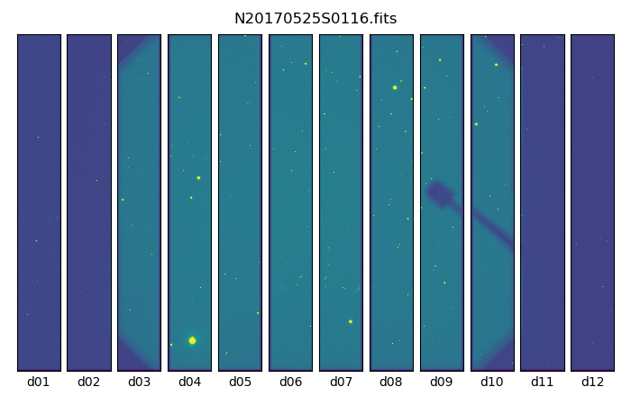
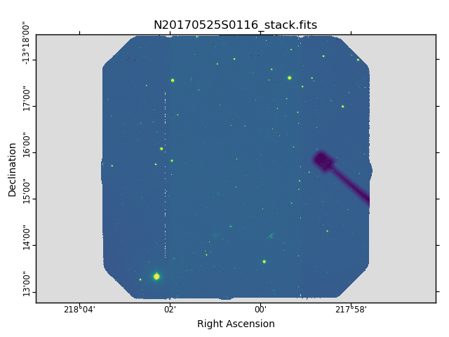

.. 02_data_reduction.rst

.. _caldb: https://dragons-recipe-system-users-manual.readthedocs.io/en/latest/supptools.html#caldb

.. _dataselect: https://dragons-recipe-system-users-manual.readthedocs.io/en/latest/supptools.html#dataselect

.. _`data quality plane`: https://astrodata-user-manual.readthedocs.io/en/latest/data.html#data-quality-plane

.. _descriptor: https://astrodata-user-manual.readthedocs.io/en/latest/headers.html#astrodata-descriptors

.. _reduce: https://dragons-recipe-system-users-manual.readthedocs.io/en/latest/supptools.html#typewalk

.. _showd: https://dragons-recipe-system-users-manual.readthedocs.io/en/latest/supptools.html#showd

.. _showrecipes: https://dragons-recipe-system-users-manual.readthedocs.io/en/latest/supptools.html#showrecipes

.. _showpars: https://dragons-recipe-system-users-manual.readthedocs.io/en/latest/supptools.html#showpars

.. _typewalk: https://dragons-recipe-system-users-manual.readthedocs.io/en/latest/supptools.html#typewalk

.. |github| image:: /_static/img/GitHub-Mark-32px.png
    :scale: 75%

.. _command_line_data_reduction:

Data Reduction
**************

DRAGONS installation comes with a set of handful scripts that are used to
reduce astronomical data. One of the most important scripts is called
reduce_, which is extensively explained in the `Recipe System Users Manual
<https://dragons-recipe-system-users-manual.readthedocs.io/en/latest/index.html>`_.
For this tutorial, we will be also using other `Supplemental tools
<https://dragons-recipe-system-users-manual.readthedocs.io/en/latest/supptools.html>`_,
like dataselect_, showd_, typewalk_, and caldb_.

.. warning:: Some primitives use a lot of RAM memory and they can make reduce_
    crash. Our team is aware of this problem and we are working on that. For
    now, if that happens to you, you might need to run the pipeline on a
    smaller data set.

Please, remember that we will be working in the
``/path_to_my_data/playground`` folder and that all the commands used in this
tutorial are related to this path.

.. _setup_caldb:

Set up caldb_
-------------

DRAGONS comes with a local calibration manager and a local light weight database
that uses the same calibration association rules as the Gemini Observatory
Archive. This allows ``reduce`` to make requests for matching **processed**
calibrations when needed to reduce a dataset.

Let's set up the local calibration manager for this session.

In ``~/.geminidr/``, create or edit the configuration file ``rsys.cfg`` as
follow:

.. code-block:: none

    [calibs]
    standalone = True
    database_dir = /path_to_my_data/gsaoiimg_tutorial/playground

This simply tells the system where to put the calibration database, the
database that will keep track of the processed calibrations we are going to
send to it.

.. note:: The tilde (``~``) in the path above refers to your home directory.
   Also, mind the dot in ``.geminidr``.

.. todo: calmanager
.. warning:: The Gemini Local Calibration Manager is not available yet in the
   Gemini Conda Channel for installation and you might not have it installed.
   On a terminal, type `caldb config`. If you get an error message, you can
   skip this section and you will still be able to bypass the Calibration
   Manager as we will show later here.

Then initialize the calibration database:

..  todo:: @dragons_team The command below should give a feedback to the user.
    How do I know that the command actually worked? How do I know that I
    am using the correct database?

.. code-block:: bash

    caldb init

That's it! It is ready to use!

You can add processed calibrations with ``caldb add <filename>`` (we will
later), list the database content with ``caldb list``, and
``caldb remove <filename>`` to remove a file **only** from the database
(it will **not** remove the file on disk). For more the details, check the
caldb_ documentation in the
`Recipe System: User's Manual <https://dragons-recipe-system-users-manual.readthedocs.io/>`_.

.. _organize_files:

Organize files
--------------

First of all, let us consider that we have put all the files in the same folder
called ``../playdata/`` and that we do not have any information anymore. From a
bash terminal and from within the Conda Virtual Environment where DRAGONS was
installed, we can call the command tool typewalk_:

..  code-block:: bash

    $ typewalk -d ../playdata/

    directory:  /data/bquint/tutorials/gmosimg_tutorial/playdata
         N20170525S0116.fits ............... (GEMINI) (GMOS) (IMAGE) (NORTH) (RAW) (SIDEREAL) (UNPREPARED)
         ...
         N20170527S0528.fits ............... (AT_ZENITH) (AZEL_TARGET) (BIAS) (CAL) (GEMINI) (GMOS) (LS) (NON_SIDEREAL) (NORTH) (RAW) (UNPREPARED)
         ...
         N20170530S0360.fits ............... (CAL) (FLAT) (GEMINI) (GMOS) (IMAGE) (NORTH) (RAW) (SIDEREAL) (TWILIGHT) (UNPREPARED)
         ...
    Done DataSpider.typewalk(..)

This command will open every FITS file within the folder passed after the ``-d``
flag (recursively) and will print an unsorted table with the file names and the
associated tags. For example, calibration files will always have the ``CAL``
tag. Flat images will always have the ``FLAT`` tag. This means that we can start
getting to know a bit more about our data set just by looking the tags. The
output above was trimmed for simplicity.

.. _create_file_lists:

Create File lists
-----------------

This data set now contains science and calibration frames. It could have
different observed targets and different exposure times. The current data
reduction pipeline does not organize the data.

That means that we first need to identify these files and create lists that will
be used in the data-reduction process. For that, we will use the dataselect_
command line. Please, refer to the dataselect_ page for details regarding its
usage. Let us start with the BIAS files:

..  code-block:: bash

    $ dataselect --tags BIAS ../playdata/*.fits > list_of_bias.txt

Here, the ``>`` symbol gets the dataselect_ output and stores it within the
``list_of_bias.txt`` file. If you want to see the output, simply omit it and
everything after it.

Now we can do the same with the FLAT files:

..  code-block:: bash

    $ dataselect --tags FLAT ../playdata/*.fits > list_of_flats.txt

If your dataset has FLATs obtained with more than one filter, you can add the
``--expr 'filter_name=="g"'`` expression to get on the FLATs obtained with in
the g-band. For example:

.. code-block:: bash

    $ dataselect --tags FLAT --expr 'filter_name=="g"' ../playdata/*.fits > list_of_g-band_flats.txt

The rest is the data with your science target. The simplest way of creating a
list of science frames is excluding everything that is a calibration:

.. code-block:: bash

    $ dataselect --xtags CAL ../playdata/*.fits > list_of_science.txt

This will work for our dataset because we know that a single target was observed
with a single filter and with the same exposure time. But what if we don't knwo
that?

We can check it by passing the dataselect_ output to the showd_ command line
using a "pipe" (``|``):

..  code-block:: bash

    $ dataselect --expr 'observation_class=="science"' ../playdata/*.fits | showd -d object,exposure_time
    --------------------------------------------------------
    filename                          object   exposure_time
    --------------------------------------------------------
    ../playdata/N20170525S0116.fits    o3e43           300.0
    ../playdata/N20170525S0117.fits    o3e43           300.0
    ../playdata/N20170525S0118.fits    o3e43           300.0
    ../playdata/N20170525S0119.fits    o3e43           300.0
    ../playdata/N20170525S0120.fits    o3e43           300.0

The ``-d`` flag tells showd_ which descriptor_ will be printed for each input
file. As you can see, we have only observed target and only exposure time.

If you see more than one object, you can create a list for each standard star
using the ``object`` descriptor as an argument for dataselect_ (spaces are
allowed if you use double quotes):

.. code-block:: bash

    $ dataselect --expr 'object=="o3e43"' ../playdata/*.fits > list_of_sci_o3e43.txt

Now let us consider that we want to filter all the files whose ``object`` is
**o3e43** and that the ``exposure_time`` is **300 seconds**. We also want to
pass the output to a new list:

.. code-block:: bash

   $ dataselect --expr '(object=="o3e43" and exposure_time==300.)' ../playdata/*.fits > list_of_science_files.txt

.. _process_bias_files:

Process BIAS files
------------------

The Master BIAS file can be created using the command below:

..  code-block:: bash

   $ reduce @list_of_bias.txt

Master Bias files can be added to the local database using the caldb_
command. Before you run it, make sure you have `configured and initialized your
caldb <setup_caldb>`_. Once you are set, add the Master Bias to the local
database using the following command:

..  code-block:: bash

    $ caldb add ./calibrations/processed_bias/N20170527S0528_bias.fits

``reduce`` uses the first filename in the input list as basename and adds
``_bias`` as a suffix to it. So if your first filename is, for example,
``N20001231S001.fits``, the output will be
``N20001231S001_bias.fits``. Because of that, the base name of the Master Bias
file can be different for you.

Before carrying on, check that the Master Bias was added to the database
using the ``caldb list`` command:

.. code-block:: bash

    $ caldb list
    N20170527S0528_bias.fits       /path_to_my_data/playground/calibrations/processed_bias

.. _process_flat_files:

Process FLAT files
------------------

FLAT images can be easily reduced using the ``reduce`` command line:

..  code-block:: bash

   $ reduce @list_of_flats.txt

Now reduce_ will query the local calibration manager for the Master Bias frame
and use it in the data reduction.

.. todo: calmanager

If you don't have the calibration manager or want to bypass it for some reason,
use the following command to override the input calibrations:

.. code-block:: bash

   $ reduce @list_of_flats.txt --user_cal processed_bias:N20170527S0528_bias.fits

Once it finished, you shall have the Master Flat inside the
``./calibrations/processed_flat`` directory with a ``_flat`` suffix. Add it to
the local calibration database with the following command:

..  code-block:: bash

    $ caldb add ./calibrations/processed_flat/N20170530S0360_flat.fits

If you do so, ``reduce`` will "see" this calibration file when performing
the data reduction of our science files. Again, check that the Master Flat was
added to your local database:

.. code-block:: bash

  $ caldb list
  N20170527S0528_bias.fits       /data/bquint/tutorials/gmosimg_tutorial/playground/calibrations/processed_bias
  N20170530S0360_flat.fits       /data/bquint/tutorials/gmosimg_tutorial/playground/calibrations/processed_flat

.. _process_fringe_frame:

Process Fringe Frame
--------------------

.. note:: The dataset used in this tutorial does not require Fringe Correction
    so you can skip this section if you are following it. Find more information
    below.

The reduction of some datasets requires a Processed Fringe Frame. The datasets
that need a Fringe Frame are shown in the appendix
`Fringe Correction Tables <fringe_correction_tables>`_.

If you find out that your dataset needs Fringe Correction, you can use the
command below to create the Processed Fringe Frame:

.. code-block:: bash

    $ reduce @list_of_science.txt -r makeProcessedFringe

This command line will produce an image with the ``_fringe`` suffix in the
current working directory.

Once you have the, you still need to add it to the local calibration manager
database:

.. code-block:: bash

    $ caldb add N20170525S0116_fringe.fits

Again, note that this step is only needed for images obtained with some
detector and filter combinations. Make sure you checked the
`Fringe Correction Tables <fringe_correction_tables>`_.

.. _processing_science_files:

Process Science files
---------------------

Once we have our calibration files processed and added to the database, we can
run ``reduce`` on our science data:

.. code-block:: bash

   $ reduce @list_of_science.txt

This command will generate flat corrected and sky subtracted files and will
stack them. This stacked image will have the ``_stack`` suffix. You might see
some warning messages but it should be safe to ignore them for now.

.. todo: calmanager

If you don't have the calibration manager or want to bypass it for some reason,
use the following command to override the input calibrations:

..  code-block:: bash

    $ reduce @list_of_science.txt --user_cal processed_bias:N20170527S0528_bias.fits processed_flat:N20170530S0360_flat.fits

Here is one of the raw images:

   One of the multi-extensions files.

Note that the raw images do not have a mask yet. Because of that, the whole
detector area is considered with data. Now, once reduce_ runs, it adds a
`data quality plane`_ with information about why the data is being rejected.

The figure below shows the reduced staked data and the bad pixel mask (in light
gray):

   Sky Subtracted and Stacked Final Image. The light-gray area represents the
   masked pixels.

The mask is updated on every data reduction step and most of the calculations
are done on the good data. Because of this, you might expect to see some
leftover features if you hide the mask. Here is an example:

.. figure:: _static/img/N20170525S0116_stack_nomask.png
   :align: center

   Sky Subtracted and Stacked Final Image.

Note that the exposed image is clear but that the non illuminated region has
some cosmic rays lefovers that persisted even after the stack process.

.. todo @bquint The image above have some problems in the gaps. How do I fix
    them?

Advanced Operations
-------------------

It is also important to remember that ``reduce`` is basically a recipe with
a sequence of operations, called Primitives, and that each Primitive require
a set of parameters. When we run ``reduce`` without any extra flag, it will
run all the Primitives in our recipe using the default values. Depending on
your data/science case, you may have to try to change the parameters of one or
more Primitives.

First, you need to know what are the recipes available for a given files, then
you need to get what are Primitives living within that recipe. Finally, you need
a list of parameters that can be modified.

The showrecipes_ command line takes care of both steps. In order to list
all the recipes available for a given file, we can pass the file as an input and
the ``--all`` option. Here is an example:

..  code-block:: bash

    $ showrecipes ../playdata/N20170525S0116.fits --all

    Input file: /path_to_my_data/playdata/N20170530S0360.fits
    Input tags: {'UNPREPARED', 'GEMINI', 'GMOS', 'IMAGE', 'NORTH', 'RAW', 'SIDEREAL'}
    Recipes available for the input file:
       geminidr.gmos.recipes.sq.recipes_IMAGE::makeProcessedFringe
       geminidr.gmos.recipes.sq.recipes_IMAGE::reduce
       geminidr.gmos.recipes.qa.recipes_IMAGE::makeProcessedFringe
       geminidr.gmos.recipes.qa.recipes_IMAGE::reduce
       geminidr.gmos.recipes.qa.recipes_IMAGE::reduce_nostack
       geminidr.gmos.recipes.qa.recipes_IMAGE::stack

The output tells me that I have two recipes for the SQ (Science Quality) mode
and four recipe for the QA (Quality Assessment) mode. By default, ``reduce``
uses the SQ mode for processing the data.

The showrecipes_ command line can also display what are the Primitives that
were used within a particular Recipe. Check the example below:

.. code-block::  bash

    $ showrecipes ../playdata/N20170525S0116.fits --mode sq --recipe reduce

    Input file: /path_to_my_data/playdata/N20170530S0360.fits
    Input tags: ['RAW', 'GEMINI', 'NORTH', 'SIDEREAL', 'GMOS', 'IMAGE', 'UNPREPARED']
    Input mode: sq
    Input recipe: reduce
    Matched recipe: geminidr.gmos.recipes.sq.recipes_IMAGE::reduce
    Recipe location: /data/bquint/Repos/DRAGONS/geminidr/gmos/recipes/sq/recipes_IMAGE.py
    Recipe tags: {'IMAGE', 'GMOS'}
    Primitives used:
       p.prepare()
       p.addDQ()
       p.addVAR(read_noise=True)
       p.overscanCorrect()
       p.biasCorrect()
       p.ADUToElectrons()
       p.addVAR(poisson_noise=True)
       p.flatCorrect()
       p.makeFringe()
       p.fringeCorrect()
       p.mosaicDetectors()
       p.adjustWCSToReference()
       p.resampleToCommonFrame()
       p.stackFrames()
       p.writeOutputs()

Now you can get the list of parameters for a given Primitive using the
showpars_ command line. Here is an example:

.. code-block:: none

    $ showpars ../playdata/N20170525S0116.fits stackFrames

    Dataset tagged as {'UNPREPARED', 'SIDEREAL', 'NORTH', 'IMAGE', 'GEMINI', 'RAW', 'GMOS'}
    Settable parameters on 'stackFrames':
    ========================================
     Name                   Current setting

    suffix               '_stack'             Filename suffix
    apply_dq             True                 Use DQ to mask bad pixels?
    statsec              None                 Section for statistics
    operation            'mean'               Averaging operation
    Allowed values:
            mean    arithmetic mean
            wtmean  variance-weighted mean
            median  median
            lmedian low-median

    reject_method        'sigclip'            Pixel rejection method
    Allowed values:
            none    no rejection
            minmax  reject highest and lowest pixels
            sigclip reject pixels based on scatter
            varclip reject pixels based on variance array

    hsigma               3.0                  High rejection threshold (sigma)
            Valid Range = [0,inf)
    lsigma               3.0                  Low rejection threshold (sigma)
            Valid Range = [0,inf)
    mclip                True                 Use median for sigma-clipping?
    max_iters            None                 Maximum number of clipping iterations
            Valid Range = [1,inf)
    nlow                 0                    Number of low pixels to reject
            Valid Range = [0,inf)
    nhigh                0                    Number of high pixels to reject
            Valid Range = [0,inf)
    memory               None                 Memory available for stacking (GB)
            Valid Range = [0.1,inf)
    separate_ext         True                 Handle extensions separately?
    scale                False                Scale images to the same intensity?
    zero                 False                Apply additive offsets to images to match intensity?

Now that we know what are is the recipe being used, what are the Primitives
it calls and what are the parameters that are set, we can finally change the
default values using the ``-p`` flag. As an example, we can change the
``reject_method`` for the stackFrames to one of its allowed values, e.g.,
``varclip``:

.. code-block:: bash

    $ reduce @list_of_science -p stackFrames:reject_method="varclip" --suffix "_stack_varclip"

The command line above changes the rejection algorithing during the stack
process. It helps with the cosmetics of the image but it might affect the
photometry if the point-spread function (seeing) changes a lot on every images
in the stack or if the images are poorly aligned. The ``--suffix`` option is
added so the final stack frame has a different name. Otherwise, reduce_
overwrites the output. Here is the product of the command line above:

.. figure:: _static/img/N20170525S0116_stack_varclip.png
   :align: center

   Sky Subtracted and Stacked Final Image. The light-gray area represents the
   masked pixels.
