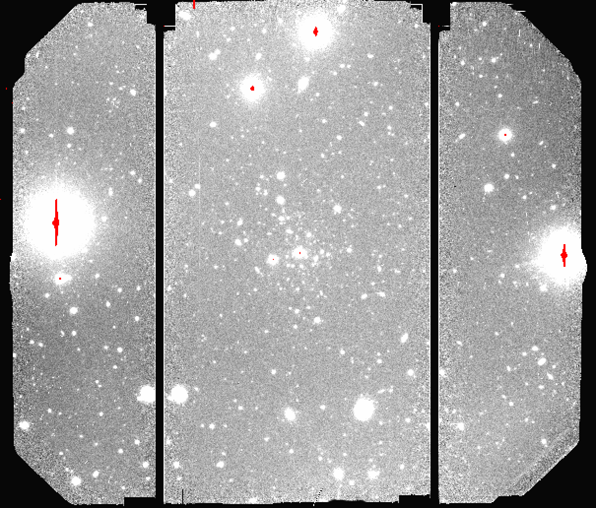

.. ex2_gmosim_separateCCDs_api.rst

.. _separateCCDs_api:

****************************************************
Example 2 - Separate CCDs - Using the "Reduce" class
****************************************************

A reduction can be initiated from the command line as shown in
:ref:`separateCCDs_cmdline` and it can also be done programmatically as we will
show here.  The classes and modules of the RecipeSystem can be
accessed directly for those who want to write Python programs to drive their
reduction.  In this example we replicate the
command line version of Example 2 but using the Python
programmatic interface. What is shown here could be packaged in modules for
greater automation.

Instead of running the default recipe, we will run the recipe to reduce
the CCDs separately instead of mosaicing them before the stack.  Doing the
reduction this way and not mosaicing the CCDs is used when the science
objective require very accurate photometry that needs to take into account
color-terms and the different color responses of the CCDs.

The dataset
===========
If you have not already, download and unpack the tutorial's data package.
Refer to :ref:`datasetup` for the links and simple instructions.

The dataset specific to this example is described in:

    :ref:`separateCCDs_dataset`.

Here is a copy of the table for quick reference.

+---------------+---------------------+--------------------------------+
| Science       || N20220627S0115-119 || 350 s, i-band                 |
+---------------+---------------------+--------------------------------+
| Bias          || N20220613S0180-184 || For science                   |
|               || N20220627S0222-226 || For twilights                 |
+---------------+---------------------+--------------------------------+
| Twilight Flats|| N20220613S0138-142 || r-band                        |
+---------------+---------------------+--------------------------------+
| BPM           || bpm_20220303_gmos-n_Ham_22_full_12amp.fits          |
+---------------+------------------------------------------------------+

Setting Up
==========

Importing Libraries
-------------------

We first import the necessary modules and classes:

.. code-block:: python
    :linenos:

    import glob

    import astrodata
    import gemini_instruments
    from recipe_system.reduction.coreReduce import Reduce
    from gempy.adlibrary import dataselect

The ``dataselect`` module will be used to create file lists for the
biases, the flats, the arcs, the standard, and the science observations.
The ``Reduce`` class is used to set up and run the data
reduction.

Setting up the logger
---------------------
We recommend using the DRAGONS logger. (See also :ref:`double_messaging`.)

.. code-block:: python
    :linenos:
    :lineno-start: 7

    from gempy.utils import logutils
    logutils.config(file_name='gmos_data_reduction.log')

Setting up the Calibration Service
----------------------------------

.. important::  Remember to set up the calibration service.

    Instructions to configure and use the calibration service are found in
    :ref:`cal_service`, specifically the these sections:
    :ref:`cal_service_config` and :ref:`cal_service_api`.

Create list of files
====================

The next step is to create input file lists. The module ``dataselect`` helps
with that.  It uses Astrodata tags and |descriptors| to select the files and
store the filenames to a Python list that can then be fed to the ``Reduce``
class. (See the |astrodatauser| for information about Astrodata and for a list
of |descriptors|.)

The first list we create is a list of all the files in the ``playdata/example2/``
directory.

.. code-block:: python
    :linenos:
    :lineno-start: 9

    all_files = glob.glob('../playdata/example2/*.fits')
    all_files.sort()

The :meth:`~list.sort` method simply re-organize the list with the file names
and is an optional step, but a recommended step. Before you carry on, you
might want to do ``print(all_files)`` to check if they were properly read.

We will search that list for files with specific characteristics.  We use
the ``all_files`` :class:`list` as an input to the function
``dataselect.select_data()`` .  The function's signature is::

    select_data(inputs, tags=[], xtags=[], expression='True')

We show several usage examples below.

List of Biases
--------------
We are going to use two sets of biases, one for the science and one for the
twilights.  The reason for that is that the twilights and the science were
obtained weeks apart and it is always safer to use biases that were obtained
close in time with the data we want to use them on.  It is also a good
example to show you how to specify a date range in the |dataselect| expression.

The command line |showd| can be used to inspect the data ahead of time.

::

  $ showd -d object,ut_date ../playdata/example2/N*.fits

    --------------------------------------------------------------------------------
    filename                                                     object      ut_date
    --------------------------------------------------------------------------------
    ../playdata/example2/N20220613S0138.fits                   Twilight   2022-06-13
    ../playdata/example2/N20220613S0139.fits                   Twilight   2022-06-13
    ../playdata/example2/N20220613S0140.fits                   Twilight   2022-06-13
    ../playdata/example2/N20220613S0141.fits                   Twilight   2022-06-13
    ../playdata/example2/N20220613S0142.fits                   Twilight   2022-06-13
    ../playdata/example2/N20220613S0180.fits                       Bias   2022-06-13
    ../playdata/example2/N20220613S0181.fits                       Bias   2022-06-13
    ../playdata/example2/N20220613S0182.fits                       Bias   2022-06-13
    ../playdata/example2/N20220613S0183.fits                       Bias   2022-06-13
    ../playdata/example2/N20220613S0184.fits                       Bias   2022-06-13
    ../playdata/example2/N20220627S0115.fits   Disrupting UFD Candidate   2022-06-27
    ../playdata/example2/N20220627S0116.fits   Disrupting UFD Candidate   2022-06-27
    ../playdata/example2/N20220627S0117.fits   Disrupting UFD Candidate   2022-06-27
    ../playdata/example2/N20220627S0118.fits   Disrupting UFD Candidate   2022-06-27
    ../playdata/example2/N20220627S0119.fits   Disrupting UFD Candidate   2022-06-27
    ../playdata/example2/N20220627S0222.fits                       Bias   2022-06-27
    ../playdata/example2/N20220627S0223.fits                       Bias   2022-06-27
    ../playdata/example2/N20220627S0224.fits                       Bias   2022-06-27
    ../playdata/example2/N20220627S0225.fits                       Bias   2022-06-27
    ../playdata/example2/N20220627S0226.fits                       Bias   2022-06-27

The science frames were obtained on 2022-06-27 and the twilights on 2022-06-13.
We will create two lists, one of the biases obtained on each of those two days.

Let us select the files that will be used to create the two master biases:

.. code-block:: python
    :linenos:
    :lineno-start: 11

    list_of_biastwi = dataselect.select_data(
        all_files,
        ['BIAS'],
        [],
        dataselect.expr_parser("ut_date=='2022-06-13'")
    )

    list_of_biassci = dataselect.select_data(
        all_files,
        ['BIAS'],
        [],
        dataselect.expr_parser("ut_date=='2022-06-27'")
    )

List of Flats
-------------

Next we create a list of twilight flats for each filter. The expression
specifying the filter name is needed only if you have data from multiple
filters. It is not really needed in this case.

.. code-block:: python
    :linenos:
    :lineno-start: 24

    list_of_flats = dataselect.select_data(
        all_files,
        ['FLAT'],
        [],
        dataselect.expr_parser('filter_name=="r"')
    )

.. note::  All expressions need to be processed with ``dataselect.expr_parser``.

List of Science Data
--------------------

Finally, the science data can be selected using:

.. code-block:: python
    :linenos:
    :lineno-start: 30

    list_of_science = dataselect.select_data(
        all_files,
        [],
        ['CAL'],
        dataselect.expr_parser('(observation_class=="science" and filter_name=="r")')
    )

Here we left the ``tags`` argument as an empty list and passed the tag
``'CAL'`` as an exclusion tag through the ``xtags`` argument.

We also added a fourth argument which is not necessary for our current dataset
but that can be useful for others. It contains an expression that has to be
parsed by ``dataselect.expr_parser``, and which ensures
that we are getting *science* frames obtained with the *r-band* filter.

Bad Pixel Mask
==============
Starting with DRAGONS v3.1, the static bad pixel masks (BPMs) are now handled
as calibrations.  They
are downloadable from the archive instead of being packaged with the software.
They are automatically associated like any other calibrations.  This means that
the user now must download the BPMs along with the other calibrations and add
the BPMs to the local calibration manager.

See :ref:`getBPM` in :ref:`tips_and_tricks` to learn about the various ways
to get the BPMs from the archive.

To add the BPM included in the data package to the local calibration database:

.. code-block:: python
    :linenos:
    :lineno-start: 36

    for bpm in dataselect.select_data(all_files, ['BPM']):
        caldb.add_cal(bpm)

Make Master Bias
================
The reduction of the biases does not mosaic
the biases and it keeps the CCDs separated, always.  Because of that, the
reduction of the biases for the "Separate CCDs" recipe is exactly the same
as for the default recipe.

We create the master bias and add it to the calibration manager as follows:

.. code-block:: python
   :linenos:
   :lineno-start: 38

   reduce_biastwi = Reduce()
   reduce_biastwi.files.extend(list_of_biastwi)
   reduce_biastwi.runr()

   reduce_biassci = Reduce()
   reduce_biassci.files.extend(list_of_biassci)
   reduce_biassci.runr()

The ``Reduce`` class is our reduction
"controller". This is where we collect all the information necessary for
the reduction. In this case, the only information necessary is the list of
input files which we add to the ``files`` attribute. The
``Reduce.runr`` method is where the
recipe search is triggered and where it is executed.

.. note:: The file name of the output processed bias is the file name of the
    first file in the list with ``_bias`` appended as a suffix.  This is the
    general naming scheme used by the ``Recipe System``.

.. note:: If you wish to inspect the processed calibrations before adding them
    to the calibration database, remove the "store" option attached to the
    database in the ``dragonsrc`` configuration file.  You will then have to
    add the calibrations manually following your inspection, eg.

    .. code-block::

       caldb.add_cal(reduce_biassci.output_filenames[0])

Make Master Flat
================
The reduction of the
flats does not mosaic the flats and it keeps the CCDs separated, always.
Because of that, the reduction of the flats for the "Separate CCDs" recipe
is exactly the same as for the default recipe.

We create the master flat field and add it to the calibration database as follows:

.. code-block:: python
    :linenos:
    :lineno-start: 45

    reduce_flats = Reduce()
    reduce_flats.files.extend(list_of_flats)
    reduce_flats.runr()

Make Master Fringe Frame
========================

.. warning:: The dataset used in this tutorial does not require fringe
    correction so we skip this step.  To find out how to produce a master
    fringe frame, see :ref:`process_fringe_frame` in the
    :ref:`tips_and_tricks` chapter.

Reduce Science Images
=====================

We use similar statements as before to initiate a new reduction to reduce the
science data.  Instead of using the default recipe, we
will explicitly call the recipe ``reduceSeparateCCDs``:

.. code-block:: python
    :linenos:
    :lineno-start: 48

    reduce_science = Reduce()
    reduce_science.files.extend(list_of_science)
    reduce_science.recipename = 'reduceSeparateCCDs'
    reduce_science.runr()

This recipe performs the standardization and corrections needed to
convert the raw input science images into a stacked image. To deal
with different color terms on the different CCDs, the images are
split by CCD midway through the recipe and subsequently reduced
separately. The relative WCS is determined from mosaicked versions
of the images and then applied to each of the CCDs separately.

The stacked images of each CCD are in separate extension of the file
with the ``_image`` suffix.

When you display the image, you will notice that some sources
appear on two CCDs.  This is because the each CCD has been stacked individually
and because of the dithers some sources ended up moving from to the adjacent
CCD.

   Final stacked image, with CCD separated.

The output stack units are in electrons (header keyword BUNIT=electrons).
The output stack is stored in a multi-extension FITS (MEF) file.  The science
signal is in the "SCI" extension, the variance is in the "VAR" extension, and
the data quality plane (mask) is in the "DQ" extension.

.. note::

    There is another similar recipe that can be used to reduce the CCDs
    separately:  ``reduceSeparateCCDsCentral``.  The difference is that
    the relative WCS is determined from the central CCD
    (CCD2) and then applied to CCDs 1 and 3, while in ``reduceSeparateCCDs``
    the whole image is used to adjust the WCS.  The "Central" recipe can be
    faster than the other but potentially less accurate if you do not have
    a lot of sources in CCD2.
