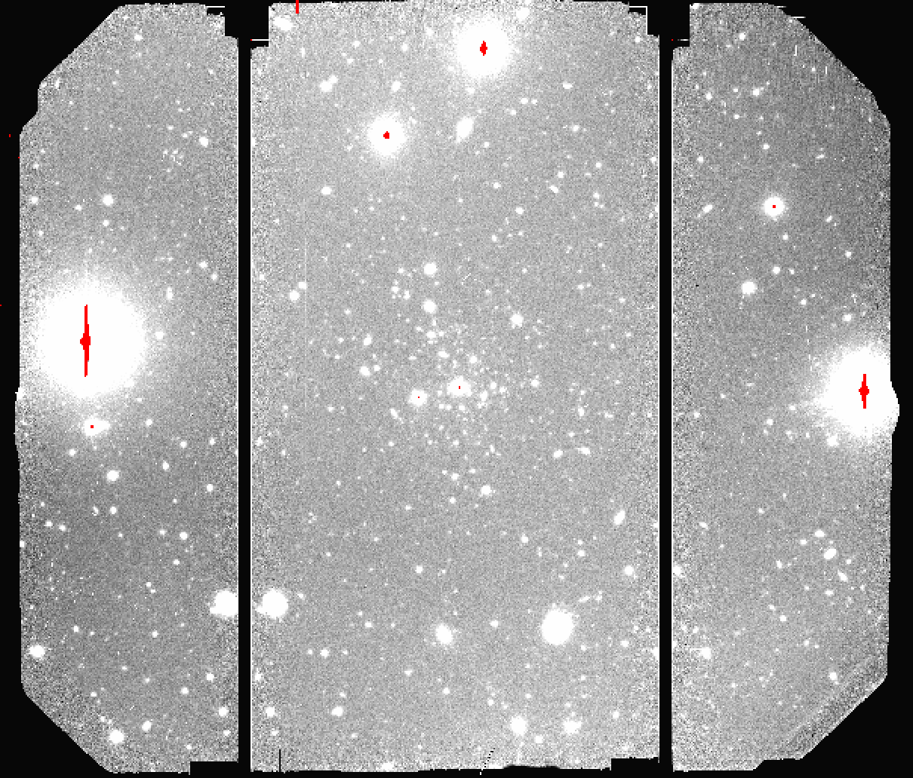

.. ex2_gmosim_separateCCDs_cmdline.rst

.. _separateCCDs_cmdline:

***********************************************************
Example 2 - Separate CCDs - Using the "reduce" command line
***********************************************************

This is a GMOS-N imaging observation of the galaxy Bootes V obtained
in the r-band using the "|reduce|" command that is operated directly from
the unix shell.

Instead of running the default recipe, we will run the recipe to reduce
the CCDs separately instead of mosaicing them before the stack.  Doing the
reduction this way and not mosaicing the CCDs is used when the science
objective require very accurate photometry that needs to take into account
color-terms and the different color responses of the CCDs.

Just open a terminal and load the DRAGONS conda environment to get started.

The dataset
===========
If you have not already, download and unpack the tutorial's data package.
Refer to :ref:`datasetup` for the links and simple instructions.

The dataset specific to this example is described in:

    :ref:`separateCCDs_dataset`.

Here is a copy of the table for quick reference.

+---------------+---------------------+--------------------------------+
| Science       || N20220627S0115-119 || 350 s, i-band                 |
+---------------+---------------------+--------------------------------+
| Bias          || N20220613S0180-184 || For science                   |
|               || N20220627S0222-226 || For twilights                 |
+---------------+---------------------+--------------------------------+
| Twilight Flats|| N20220613S0138-142 || r-band                        |
+---------------+---------------------+--------------------------------+
| BPM           || bpm_20220303_gmos-n_Ham_22_full_12amp.fits          |
+---------------+------------------------------------------------------+

Set up the Calibration Service
==============================

.. important::  Remember to set up the calibration service.

    Instructions to configure and use the calibration service are found in
    :ref:`cal_service`, specifically the these sections:
    :ref:`cal_service_config` and :ref:`cal_service_cmdline`.

Check files
===========

For this example, all the raw files we need are in the same directory called
``../playdata/example2``. Let us learn a bit about the data we have.

Ensure that you are in the ``playground`` directory and that the ``conda``
environment that includes DRAGONS has been activated.

Let us call the command tool "|typewalk|":

..  code-block:: bash

    $ typewalk -d ../playdata/example2

    directory:  /Users/klabrie/data/tutorials/gmosimg_tutorial/playdata/example2
         N20220613S0138.fits ............... (CAL) (FLAT) (GEMINI) (GMOS) (IMAGE) (NORTH) (RAW) (SIDEREAL) (TWILIGHT) (UNPREPARED)
         ...
         N20220613S0180.fits ............... (BIAS) (CAL) (GEMINI) (GMOS) (NORTH) (RAW) (UNPREPARED)
         ...
         N20220627S0115.fits ............... (GEMINI) (GMOS) (IMAGE) (NORTH) (RAW) (SIDEREAL) (UNPREPARED)
         ...
         N20220627S0222.fits ............... (BIAS) (CAL) (GEMINI) (GMOS) (NORTH) (RAW) (UNPREPARED)
         ...
         bpm_20220303_gmos-n_Ham_22_full_12amp.fits
         ................................... (BPM) (CAL) (GEMINI) (GMOS) (NORTH) (OVERSCAN_TRIMMED) (PREPARED) (PROCESSED)
    Done DataSpider.typewalk(..)

This command will open every FITS file within the folder passed after the ``-d``
flag (recursively) and will print an unsorted table with the file names and the
associated tags. For example, calibration files will always have the ``CAL``
tag. Flat images will always have the ``FLAT`` tag. This means that we can start
getting to know a bit more about our data set just by looking the tags. The
output above was trimmed for presentation.

Create File lists
=================

This data set contains science and calibration frames. For some programs, it
could have different observed targets and different exposure times depending
on how you like to organize your raw data.

The DRAGONS data reduction pipeline does not organize the data for you. You
have to do it. DRAGONS provides tools to help you with that.

The first step is to create lists that will be used in the data reduction
process. For that, we use "|dataselect|". Please, refer to the "|dataselect|"
documentation for details regarding its usage.

First, navigate to the ``playground`` directory in the unpacked data package::

    cd <path>/gmosim_tutorial/playground

Lists of Biases
---------------
We are going to use two sets of biases, one for the science and one for the
twilights.  The reason for that is that the twilights and the science were
obtained weeks apart and it is always safer to use biases that were obtained
close in time with the data we want to use them on.  It is also a good
example to show you how to specify a date range in the |dataselect| expression.

Let's first check the dates for the various observations.

::

  $ showd -d object,ut_date ../playdata/example2/N*.fits

    --------------------------------------------------------------------------------
    filename                                                     object      ut_date
    --------------------------------------------------------------------------------
    ../playdata/example2/N20220613S0138.fits                   Twilight   2022-06-13
    ../playdata/example2/N20220613S0139.fits                   Twilight   2022-06-13
    ../playdata/example2/N20220613S0140.fits                   Twilight   2022-06-13
    ../playdata/example2/N20220613S0141.fits                   Twilight   2022-06-13
    ../playdata/example2/N20220613S0142.fits                   Twilight   2022-06-13
    ../playdata/example2/N20220613S0180.fits                       Bias   2022-06-13
    ../playdata/example2/N20220613S0181.fits                       Bias   2022-06-13
    ../playdata/example2/N20220613S0182.fits                       Bias   2022-06-13
    ../playdata/example2/N20220613S0183.fits                       Bias   2022-06-13
    ../playdata/example2/N20220613S0184.fits                       Bias   2022-06-13
    ../playdata/example2/N20220627S0115.fits   Disrupting UFD Candidate   2022-06-27
    ../playdata/example2/N20220627S0116.fits   Disrupting UFD Candidate   2022-06-27
    ../playdata/example2/N20220627S0117.fits   Disrupting UFD Candidate   2022-06-27
    ../playdata/example2/N20220627S0118.fits   Disrupting UFD Candidate   2022-06-27
    ../playdata/example2/N20220627S0119.fits   Disrupting UFD Candidate   2022-06-27
    ../playdata/example2/N20220627S0222.fits                       Bias   2022-06-27
    ../playdata/example2/N20220627S0223.fits                       Bias   2022-06-27
    ../playdata/example2/N20220627S0224.fits                       Bias   2022-06-27
    ../playdata/example2/N20220627S0225.fits                       Bias   2022-06-27
    ../playdata/example2/N20220627S0226.fits                       Bias   2022-06-27

The science frames were obtained on 2022-06-27 and the twilights on 2022-06-13.
We will create two lists, one of the biases obtained on each of those two days.

The bias files are selected with |dataselect|:

..  code-block:: bash

    $ dataselect --tags BIAS ../playdata/example2/*.fits --expr="ut_date=='2022-06-13'" -o biastwi.lis
    $ dataselect --tags BIAS ../playdata/example2/*.fits --expr="ut_date=='2022-06-27'" -o biassci.lis

List of Flats
-------------

Now we build a list for the FLAT files:

..  code-block:: bash

    $ dataselect --tags FLAT ../playdata/example2/*.fits -o flats.lis

If your dataset has flats obtained with more than one filter, you can add the
``--expr 'filter_name=="r"'`` expression to get only the flats obtained within
the r-band. For example:

.. code-block:: bash

    $ dataselect --tags FLAT --expr 'filter_name=="r"' ../playdata/example2/*.fits -o flats.lis

List for science data
---------------------

The rest is the data with your science target. The simplest way, in this case,
of creating a list of science frames is excluding everything that is a
calibration:

.. code-block:: bash

    $ dataselect --xtags CAL ../playdata/example2/*.fits -o sci.lis

This will work for our dataset because we know that a single target was observed
with a single filter and with the same exposure time. But what if we don't know
that?

We can check it by passing the "|dataselect|" output to the "|showd|" command
line using a "pipe" (``|``):

..  code-block:: bash

    $ dataselect --expr 'observation_class=="science"' ../playdata/example2/*.fits | showd -d object,exposure_time
    -----------------------------------------------------------------------------------
    filename                                                     object   exposure_time
    -----------------------------------------------------------------------------------
    ../playdata/example2/N20220627S0115.fits   Disrupting UFD Candidate           350.0
    ../playdata/example2/N20220627S0116.fits   Disrupting UFD Candidate           350.0
    ../playdata/example2/N20220627S0117.fits   Disrupting UFD Candidate           350.0
    ../playdata/example2/N20220627S0118.fits   Disrupting UFD Candidate           350.0
    ../playdata/example2/N20220627S0119.fits   Disrupting UFD Candidate           350.0

The ``-d`` flag tells "|showd|" which "|descriptors|" will be printed for
each input file. As you can see, we have only one target and only one
exposure time.

To select on target name and exposure time, specify the criteria in the
``expr`` field of "|dataselect|":

.. code-block:: bash

   $ dataselect --expr '(object=="Disrupting UFD Candidate" and exposure_time==350.)' ../playdata/example2/*.fits -o sci.lis

We have our input lists and we have initialized the calibration database, we
are ready to reduce the data.

Please make sure that you are still in the ``playground`` directory.

Bad Pixel Mask
==============
Starting with DRAGONS v3.1, the bad pixel masks (BPMs) are now handled as
calibrations.  They are downloadable from the archive instead of being
packaged with the software. They are automatically associated like any other
calibrations.  This means that the user now must download the BPMs along with
the other calibrations and add the BPMs to the local calibration manager.

See :ref:`getBPM` in :ref:`tips_and_tricks` to learn about the various ways
to get the BPMs from the archive.

To add the static BPM included in the data package to the local calibration
database:

::

    caldb add ../playdata/example2/bpm*.fits

Create a Master Bias
====================

We start the data reduction by creating the master biases for the science
and the twilight data.  Note that the reduction of the biases does not mosaic
the biases and it keeps the CCDs separated, always.  Because of that, the
reduction of the biases for the "Separate CCDs" recipe is exactly the same
as for the default recipe.

The biases are created and added to the calibration database using the
commands below:

..  code-block:: bash

   $ reduce @biastwi.lis
   $ reduce @biassci.lis

The ``@`` character before the name of the input file is the "at-file" syntax.
More details can be found in the |atfile| documentation.

Because the database was given the "store" option in the ``dragonsrc`` file,
the processed bias will be automatically added to the database at the end of
the recipe.

To check that the master bias was added to the database, use ``caldb list``.

.. note:: The file name of the output processed bias is the file name of the
    first file in the list with ``_bias`` appended as a suffix.  This the
    general naming scheme used by "|reduce|".

.. note:: If you wish to inspect the processed calibrations before adding them
    to the calibration database, remove the "store" option attached to the
    database in the ``dragonsrc`` configuration file.  You will then have to
    add the calibrations manually following your inspection, eg.

    ``caldb add N20220613S0180_bias.fits``

.. note::
    The master bias will be saved in the same folder where |reduce| was
    called *and* inside the ``./calibrations/processed_bias`` folder. The latter
    location is to cache a copy of the file. This applies to all the processed
    calibration.

Create a Master Flat Field
==========================

Twilight flats images are used to produce an imaging master flat and the
result is added to the calibration database.  Note that the reduction of the
flats does not mosaic the flats and it keeps the CCDs separated, always.
Because of that, the reduction of the flats for the "Separate CCDs" recipe
is exactly the same as for the default recipe.

..  code-block:: bash

   $ reduce @flats.lis

Note "|reduce|" will query the local calibration manager for the master bias
and use it in the data reduction.

Create Master Fringe Frame
==========================

.. warning:: The dataset used in this tutorial does not require fringe
    correction so we skip this step.  To find out how to produce a master
    fringe frame, see :ref:`process_fringe_frame` in the
    :ref:`tips_and_tricks` chapter.

Reduce Science Images
=====================

Once we have our calibration files processed and added to the database, we can
run ``reduce`` on our science data.  Instead of using the default recipe, we
will explicitly call the recipe ``reduceSeparateCCDs``:

.. code-block:: bash

   $ reduce @sci.lis -r reduceSeparateCCDs

This recipe performs the standardization and corrections needed to
convert the raw input science images into a stacked image. To deal
with different color terms on the different CCDs, the images are
split by CCD midway through the recipe and subsequently reduced
separately. The relative WCS is determined from mosaicked versions
of the images and then applied to each of the CCDs separately.

The stacked images of each CCD are in separate extension of the file
with the ``_image`` suffix.

If you ``reduce -r display`` the image, you will notice that some sources
appear on two CCDs.  This is because the each CCD has been stacked individually
and because of the dithers some sources ended up moving from to the adjacent
CCD.

   Final stacked image, with CCD separated.

.. note::

    ``ds9`` must be launched by the user ahead of running the display primitive.
    (``ds9&`` on the terminal prompt.)

The output stack units are in electrons (header keyword BUNIT=electrons).
The output stack is stored in a multi-extension FITS (MEF) file.  The science
signal is in the "SCI" extension, the variance is in the "VAR" extension, and
the data quality plane (mask) is in the "DQ" extension.

.. note::

    There is another similar recipe that can be used to reduce the CCDs
    separately:  ``reduceSeparateCCDsCentral``.  The difference is that
    the relative WCS is determined from the central CCD
    (CCD2) and then applied to CCDs 1 and 3, while in ``reduceSeparateCCDs``
    the whole image is used to adjust the WCS.  The "Central" recipe can be
    faster than the other but potentially less accurate if you do not have
    a lot of sources in CCD2.
