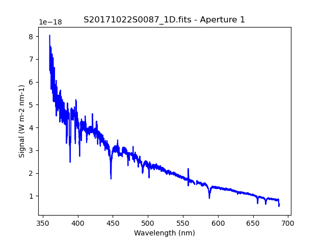

.. 04_dithered_api.rst

.. include:: DRAGONSlinks.txt

.. _dithered_api:

**********************************************************************
Example 1-B: Dithered Point Source Longslit - Using the "Reduce" class
**********************************************************************

A reduction can be initiated from the command line as shown in
:ref:`dithered_cmdline` and it can also be done programmatically as we will
show here.  The classes and modules of the RecipeSystem can be
accessed directly for those who want to write Python programs to drive their
reduction.  In this example we replicate the command line reduction from
Example 1-A, this time using the Python interface instead of the command line.
Of course what is shown here could be packaged in modules for greater
automation.

The dataset
===========
If you have not already, download and unpack the tutorial's data package.
Refer to :ref:`datasetup` for the links and simple instructions.

The dataset specific to this example is described in:

    :ref:`datadithered`.

Here is a copy of the table for quick reference.

+---------------------+---------------------------------+
| Science             || S20171022S0087,89 (515 nm)     |
|                     || S20171022S0095,97 (530 nm)     |
+---------------------+---------------------------------+
| Science biases      || S20171021S0265-269             |
|                     || S20171023S0032-036             |
+---------------------+---------------------------------+
| Science flats       || S20171022S0088 (515 nm)        |
|                     || S20171022S0096 (530 nm)        |
+---------------------+---------------------------------+
| Science arcs        || S20171022S0092 (515 nm)        |
|                     || S20171022S0099 (530 nm)        |
+---------------------+---------------------------------+
| Standard (LTT2415)  || S20170826S0160 (515 nm)        |
+---------------------+---------------------------------+
| Standard biases     || S20170825S0347-351             |
|                     || S20170826S0224-228             |
+---------------------+---------------------------------+
| Standard flats      || S20170826S0161 (515 nm)        |
+---------------------+---------------------------------+
| Standard arc        || S20170826S0162 (515 nm)        |
+---------------------+---------------------------------+

Setting up
==========
First, navigate to your work directory in the unpacked data package.

::

    cd <path>/gmosls_tutorial/playground/example1

The first steps are to import libraries, set up the calibration manager,
and set the logger.

Importing libraries
-------------------

.. code-block:: python
    :linenos:

    import glob

    import astrodata
    import gemini_instruments
    from recipe_system.reduction.coreReduce import Reduce
    from recipe_system import cal_service
    from gempy.adlibrary import dataselect

The ``dataselect`` module will be used to create file lists for the
darks, the flats and the science observations. The ``cal_service`` package
is our interface to the local calibration database. Finally, the
``Reduce`` class is used to set up and run the data reduction.

Setting up the logger
---------------------
We recommend using the DRAGONS logger.  (See also :ref:`double_messaging`.)

.. code-block:: python
    :linenos:
    :lineno-start: 8

    from gempy.utils import logutils
    logutils.config(file_name='gmosls_tutorial.log')

Set up the Local Calibration Manager
------------------------------------
DRAGONS comes with a local calibration manager and a local, light weight database
that uses the same calibration association rules as the Gemini Observatory
Archive.  This allows the ``Reduce`` instance to make requests for matching
**processed** calibrations when needed to reduce a dataset.

Let's set up the local calibration manager for this session.

In ``~/.geminidr/``, edit the configuration file ``rsys.cfg`` as follow::

    [calibs]
    standalone = True
    database_dir = <where_the_data_package_is>/gmosls_tutorial/playground

This tells the system where to put the calibration database, the
database that will keep track of the processed calibration we are going to
send to it.

.. note:: The tilde (``~``) in the path above refers to your home directory.
    Also, mind the dot in ``.geminidr``.

The calibration database is initialized and the calibration service is
configured like this:

.. code-block:: python
    :linenos:
    :lineno-start: 10

    caldb = cal_service.CalibrationService()
    caldb.config()
    caldb.init()

    cal_service.set_calservice()

The calibration service is now ready to use.  If you need more details,
check the "|caldb|" documentation in the Recipe System User Manual.

Create file lists
=================
The next step is to create input file lists.  The module ``dataselect`` helps
with that.  It uses Astrodata tags and |descriptors| to select the files and
store the filenames to a Python list that can then be fed to the ``Reduce``
class. (See the |astrodatauser| for information about Astrodata and for a list
of |descriptors|.)

The first list we create is a list of all the files in the ``playdata``
directory.

.. code-block:: python
    :linenos:
    :lineno-start: 15

    all_files = glob.glob('../../playdata/*.fits')
    all_files.sort()

We will search that list for files with specific characteristics.  We use
the ``all_files`` :class:`list` as an input to the function
``dataselect.select_data()`` .  The function's signature is::

    select_data(inputs, tags=[], xtags=[], expression='True')

We show several usage examples below.

Two lists for the biases
------------------------
We have two sets for biases: one for the science observation, one for the
spectrophotometric standard observation.  The science observations and the
spectrophotometric standard observations were obtained using different
regions-of-interest (ROI).  So we will need two master biases, one "Full Frame"
for the science and one "Central Spectrum" for the standard.

To inspect data for specific |descriptors|, and to figure out how to build
our |dataselect| expression, we can loop through the biases and print the value
for the descriptor of interest, here ``detector_roi_setting``.

.. code-block:: python
    :linenos:
    :lineno-start: 17

    all_biases = dataselect.select_data(all_files, ['BIAS'])
    for bias in all_biases:
        ad = astrodata.open(bias)
        print(bias, '  ', ad.detector_roi_setting())

::

    ../../playdata/S20170825S0347.fits    Central Spectrum
    ../../playdata/S20170825S0348.fits    Central Spectrum
    ../../playdata/S20170825S0349.fits    Central Spectrum
    ../../playdata/S20170825S0350.fits    Central Spectrum
    ../../playdata/S20170825S0351.fits    Central Spectrum
    ../../playdata/S20170826S0224.fits    Central Spectrum
    ../../playdata/S20170826S0225.fits    Central Spectrum
    ../../playdata/S20170826S0226.fits    Central Spectrum
    ../../playdata/S20170826S0227.fits    Central Spectrum
    ../../playdata/S20170826S0228.fits    Central Spectrum
    ../../playdata/S20171021S0265.fits    Full Frame
    ../../playdata/S20171021S0266.fits    Full Frame
    ../../playdata/S20171021S0267.fits    Full Frame
    ../../playdata/S20171021S0268.fits    Full Frame
    ../../playdata/S20171021S0269.fits    Full Frame
    ../../playdata/S20171023S0032.fits    Full Frame
    ../../playdata/S20171023S0033.fits    Full Frame
    ../../playdata/S20171023S0034.fits    Full Frame
    ../../playdata/S20171023S0035.fits    Full Frame
    ../../playdata/S20171023S0036.fits    Full Frame

We can clearly see the two groups of biases above.  Let's split them into
two lists.

.. code-block:: python
    :linenos:
    :lineno-start: 21

    biasstd = dataselect.select_data(
        all_files,
        ['BIAS'],
        [],
        dataselect.expr_parser('detector_roi_setting=="Central Spectrum"')
    )

    biassci = dataselect.select_data(
        all_files,
        ['BIAS'],
        [],
        dataselect.expr_parser('detector_roi_setting=="Full Frame"')
    )

.. note::  All expression need to be processed with ``dataselect.expr_parser``.

A list for the flats
--------------------
The GMOS longslit flats are not normally stacked.   The default recipe does
not stack the flats.  This allows us to use only one list of the flats.  Each
will be reduced individually, never interacting with the others.

.. code-block:: python
    :linenos:
    :lineno-start: 34

    flats = dataselect.select_data(all_files, ['FLAT'])

A list for the arcs
-------------------
The GMOS longslit arcs are not normally stacked.  The default recipe does
not stack the arcs.  This allows us to use only one list of arcs.  Each will be
reduce individually, never interacting with the others.

.. code-block:: python
    :linenos:
    :lineno-start: 35

    arcs = dataselect.select_data(all_files, ['ARC'])

A list for the spectrophotometric standard star
-----------------------------------------------
If a spectrophotometric standard is recognized as such by DRAGONS, it will
receive the Astrodata tag ``STANDARD``.  To be recognized, the name of the
star must be in a lookup table.  All spectrophotometric standards normally used
at Gemini are in that table.

.. code-block:: python
    :linenos:
    :lineno-start: 36

    stdstar = dataselect.select_data(all_files, ['STANDARD'])

A list for the science observation
----------------------------------
The science observations are what is left, anything that is not a calibration
or assigned the tag ``CAL``.

First, let's have a look at the list of objects.

.. code-block:: python
    :linenos:
    :lineno-start: 37

    all_science = dataselect.select_data(all_files, [], ['CAL'])
    for sci in all_science:
        ad = astrodata.open(sci)
        print(sci, '  ', ad.object())

On line 37, remember that the second argument contains the tags to **include**
(``tags``) and the third argument is the list of tags to **exclude**
(``xtags``).

::

    ../../playdata/S20171022S0087.fits    J2145+0031
    ../../playdata/S20171022S0089.fits    J2145+0031
    ../../playdata/S20171022S0095.fits    J2145+0031
    ../../playdata/S20171022S0097.fits    J2145+0031

In this case we only have one target.  If we had more than one, we would need
several lists and we could use the ``object`` descriptor in an expression.  We
will do that here to show how it would be done.  To be clear, the
``dataselect.expr_parser`` argument is not necessary in this specific case.

.. code-block:: python
    :linenos:
    :lineno-start: 41

    scitarget = dataselect.select_data(
        all_files,
        [],
        ['CAL'],
        dataselect.expr_parser('object=="J2145+0031"')
    )

Master Bias
===========
We create the master biases with the ``Reduce`` class.  We will run it
twice, once of each of the two raw bias lists, then add the master biases
produced to the local calibration manager with the ``caldb`` instance.
The output is written to disk and its name is
stored in the ``Reduce`` instance.  The calibration service expects the
name of a file on disk.

.. code-block:: python
    :linenos:
    :lineno-start: 47

    reduce_biasstd = Reduce()
    reduce_biassci = Reduce()
    reduce_biasstd.files.extend(biasstd)
    reduce_biassci.files.extend(biassci)
    reduce_biasstd.runr()
    reduce_biassci.runr()

    caldb.add_cal(reduce_biasstd.output_filenames[0])
    caldb.add_cal(reduce_biassci.output_filenames[0])

The two master biases are: ``S20170825S0347_bias.fits`` and
``S20171021S0265_bias.fits``.

.. note:: The file name of the output processed bias is the file name of the
    first file in the list with ``_bias`` appended as a suffix.  This the
    general naming scheme used by the ``Recipe System``.

Master Flat Field
=================
GMOS longslit flat field are normally obtained at night along with the
observation sequence to match the telescope and instrument flexure.  The
matching flat nearest in time to the target observation is used to flat field
the target.  The central wavelength, filter, grating, binning, gain, and
read speed must match.

Because of the flexure, GMOS longslit flat field are not stacked.  Each is
reduced and used individually.  The default recipe takes that into account.

We can send all the flats, regardless of characteristics, to ``Reduce`` and each
will be reduce individually.  When a calibration is needed, in this case, a
master bias, the best match will be obtained automatically from the local
calibration manager.

.. code-block:: python
    :linenos:
    :lineno-start: 56

    reduce_flats = Reduce()
    reduce_flats.files.extend(flats)
    reduce_flats.mode = 'ql'
    reduce_flats.runr()

    for f in reduce_flats.output_filenames:
        caldb.add_cal(f)

.. note:: GMOS longslit reduction is currently available only for quicklook
   reduction.  The science quality recipes do not exist, hence the use of the
   ``ql`` mode to activate the "quicklook" recipes.

Processed Arc - Wavelength Solution
===================================
GMOS longslit arc can be obtained at night with the observation sequence,
if requested by the program, but are often obtained at the end of the night
instead.  In this example, the arcs have been obtained at night, as part of
the sequence.

Like the spectroscopic flats, they are not stacked which means that
they can be sent to reduce all to together and will be reduced individually.

The wavelength solution is automatically calculated and the algorithm has
been found to be quite reliable.  There might be cases where it fails; inspect
the ``*_mosaic.pdf`` plot and the RMS of ``determineWavelengthSolution`` in the
logs to confirm a good solution.

.. code-block:: python
    :linenos:
    :lineno-start: 63

    reduce_arcs = Reduce()
    reduce_arcs.files.extend(arcs)
    reduce_arcs.mode = 'ql'
    reduce_arcs.runr()

    for f in reduce_arcs.output_filenames:
        caldb.add_cal(f)

.. note:: Failures of the wavelength solution calculation are not easy to fix
   in quicklook mode.  It might be better to simply not use the arc at all and
   rely on the approximate solution instead.  When the science quality package
   is released, there will be interactive tools to fix a bad solution.
   Remember, this is version only offers quicklook reduction for GMOS longslit.

Processed Standard - Sensitivity Function
=========================================
The GMOS longslit spectrophotometric standards are normally taken when there
is a hole in the queue schedule, often when the weather is not good enough
for science observations.  One standard per configuration, per program is
the norm.  If you dither along the dispersion axis, most likely only one
of the positions will have been used for the spectrophotometric standard.
This is normal for baseline calibrations at Gemini.  The standard is used
to calculate the sensitivity function.  It has been shown that a difference of
10 or so nanometers does not significantly impact the spectrophotometric
calibration.

The reduction of the standard will be using a master bias, a master flat,
and a processed arc.  If those have been added to the local calibration
manager, they will be picked up automatically.

.. code-block:: python
    :linenos:
    :lineno-start: 70

    reduce_std = Reduce()
    reduce_std.files.extend(stdstar)
    reduce_std.mode = 'ql'
    reduce_std.runr()

    caldb.add_cal(reduce_std.output_filenames[0])

To inspect the spectrum:

.. code-block:: python
    :linenos:
    :lineno-start: 76

    from gempy.adlibrary import plotting
    import matplotlib.pyplot as plt

    ad = astrodata.open(reduce_std.output_filenames[0])
    plt.ioff()
    plotting.splot_matplotlib(ad, 1)
    plt.ion()

To learn how to plot a 1-D spectrum with matplotlib using the WCS from a Python
script, see Tips and Tricks :ref:`plot_1d`.

The sensitivity function is stored within the processed standard spectrum.  To
learn how to plot it, see Tips and Tricks :ref:`plot_sensfunc`.

Science Observations
====================
The science target is a DB white dwarf candidate.  The sequence has four images
that were dithered spatially and along the dispersion axis.  DRAGONS will
register the four images in both directions, align and stack them before
extracting the 1-D spectrum.

.. note::  In this observation, there is only one source to extract.  If there
   were multiple sources in slits, regardless of whether they are of interest to
   the program, DRAGONS will locate them, trace them, and extract them automatically.
   Each extracted spectrum is stored in an individual extension in the output
   multi-extension FITS file.

This is what one raw image looks like.

.. image:: _graphics/rawscience.png
   :width: 600
   :alt: raw science image

With the master bias, the master flat, the processed arcs (one for each of the
grating position, aka central wavelength), and the processed standard in the
local calibration manager, to reduce the science observations and extract the 1-D
spectrum, one only needs to do as follow.

.. code-block:: python
    :linenos:
    :lineno-start: 83

    reduce_science = Reduce()
    reduce_science.files.extend(scitarget)
    reduce_science.mode = 'ql'
    reduce_science.runr()

This produces a 2-D spectrum (``S20171022S0087_2D.fits``) which has been
bias corrected, flat fielded, QE-corrected, wavelength-calibrated, corrected for
distortion, sky-subtracted, and stacked.  It also produces the 1-D spectrum
(``S20171022S0087_1D.fits``) extracted from that 2-D spectrum.  The 1-D
spectrum is flux calibrated with the sensitivity function from the
spectrophotometric standard. The 1-D spectra are stored as 1-D FITS images in
extensions of the output Multi-Extension FITS file.

This is what the 2-D spectrum looks like.

.. code-block:: python
    :linenos:
    :lineno-start: 87

    display = Reduce()
    display.files = ['S20171022S0087_2D.fits']
    display.recipename = 'display'
    display.runr()

.. image:: _graphics/2Dspectrum.png
   :width: 600
   :alt: 2D stacked spectrum

The apertures found are list in the log for the ``findApertures`` just before
the call to ``traceApertures``.  Information about the apertures are also
available in the header of each extracted spectrum: ``XTRACTED``, ``XTRACTLO``,
``XTRACTHI``, for aperture center, lower limit, and upper limit, respectively.

This is what the 1-D flux-calibrated spectrum of our sole target looks like.

.. code-block:: python
    :linenos:
    :lineno-start: 91

    from gempy.adlibrary import plotting
    import matplotlib.pyplot as plt

    ad = astrodata.open(reduce_science.output_filenames[0])
    plt.ioff()
    plotting.splot_matplotlib(ad, 1)
    plt.ion()

To learn how to plot a 1-D spectrum with matplotlib using the WCS from a Python
script, see Tips and Tricks :ref:`plot_1d`.
