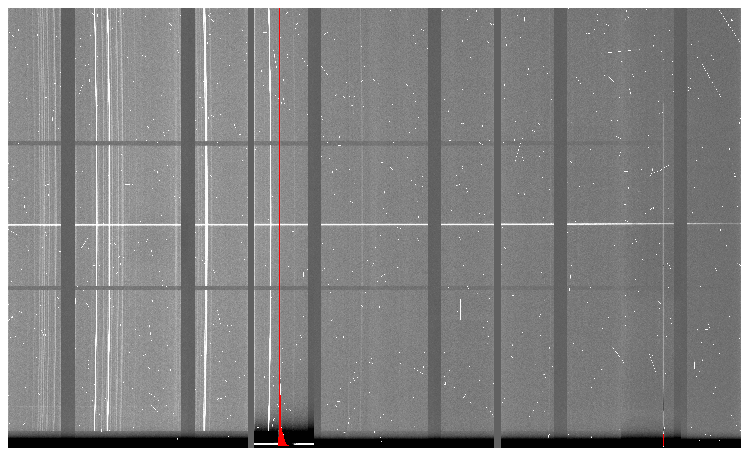
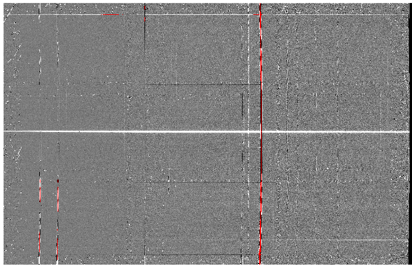

.. ex1_gmosls_dithered_cmdline.rst

.. _dithered_cmdline:

****************************************************************************
Example 1 - Longslit Dithered Point Source - Using the "reduce" command line
****************************************************************************

In this example we will reduce a GMOS longslit observation of a DB white
dwarf candidate using the "|reduce|" command that is operated directly from
the unix shell. Just open a terminal and load the DRAGONS conda environment
to get started.

This observation dithers along the slit and along the dispersion axis.

The dataset
===========
If you have not already, download and unpack the tutorial's data package.
Refer to :ref:`datasetup` for the links and simple instructions.

The dataset specific to this example is described in:

    :ref:`datadithered`.

Here is a copy of the table for quick reference.

+---------------------+---------------------------------------------+
| Science             || S20171022S0087,89 (515 nm)                 |
|                     || S20171022S0095,97 (530 nm)                 |
+---------------------+---------------------------------------------+
| Science biases      || S20171021S0265-269                         |
|                     || S20171023S0032-036                         |
+---------------------+---------------------------------------------+
| Science flats       || S20171022S0088 (515 nm)                    |
|                     || S20171022S0096 (530 nm)                    |
+---------------------+---------------------------------------------+
| Science arcs        || S20171022S0092 (515 nm)                    |
|                     || S20171022S0099 (530 nm)                    |
+---------------------+---------------------------------------------+
| Standard (LTT2415)  || S20170826S0160 (515 nm)                    |
+---------------------+---------------------------------------------+
| Standard biases     || S20170825S0347-351                         |
|                     || S20170826S0224-228                         |
+---------------------+---------------------------------------------+
| Standard flats      || S20170826S0161 (515 nm)                    |
+---------------------+---------------------------------------------+
| Standard arc        || S20170826S0162 (515 nm)                    |
+---------------------+---------------------------------------------+
| BPM                 || bpm_20140601_gmos-s_Ham_22_full_12amp.fits |
+---------------------+---------------------------------------------+

Configuring the interactive interface
=====================================
In ``~/.dragons/``, add the following to the configuration file ``dragonsrc``::

    [interactive]
    browser = your_preferred_browser

The ``[interactive]`` section defines your preferred browser.  DRAGONS will open
the interactive tools using that browser.  The allowed strings are "safari",
"chrome", and "firefox".

Set up the Local Calibration Manager
====================================

.. important::  Remember to set up the calibration service.

    Instructions to configure and use the calibration service are found in
    :ref:`cal_service`, specifically the these sections:
    :ref:`cal_service_config` and :ref:`cal_service_cmdline`.

Create file lists
=================

This data set contains science and calibration frames. For some programs, it
could contain different observed targets and different exposure times depending
on how you like to organize your raw data.

The DRAGONS data reduction pipeline does not organize the data for you.  You
have to do it.  However, DRAGONS provides tools to help you with that.

The first step is to create input file lists.  The tool "|dataselect|" helps
with that.  It uses Astrodata tags and "|descriptors|" to select the files and
send the filenames to a text file that can then be fed to "|reduce|".  (See the
|astrodatauser| for information about Astrodata.)

First, navigate to the ``playground`` directory in the unpacked data package::

    cd <path>/gmosls_tutorial/playground

Two lists for the biases
------------------------
The science observations and the spectrophotometric standard observations were
obtained using different regions-of-interest (ROI).  So we will need two master
biases, one "Full Frame" for the science and one "Central Spectrum" for the
standard.

We can use |dataselect| to select biases for each ROIs.

Given the data that we have in the ``playdata`` directory, we can create
our GMOS-S bias list using the tags and an expression that uses the ROI
settings. Remember, this will always depend on what you have in your raw data
directory.  For easier selection criteria, you might want to keep raw data
from different programs in different directories.

First, let's see which biases we have for in our raw data directory.

::

    dataselect ../playdata/example1/*.fits --tags BIAS | showd -d detector_roi_setting

    -------------------------------------------------------------------
    filename                                       detector_roi_setting
    -------------------------------------------------------------------
    ../playdata/example1/S20170825S0347.fits       Central Spectrum
    ../playdata/example1/S20170825S0348.fits       Central Spectrum
    ../playdata/example1/S20170825S0349.fits       Central Spectrum
    ../playdata/example1/S20170825S0350.fits       Central Spectrum
    ../playdata/example1/S20170825S0351.fits       Central Spectrum
    ../playdata/example1/S20170826S0224.fits       Central Spectrum
    ../playdata/example1/S20170826S0225.fits       Central Spectrum
    ../playdata/example1/S20170826S0226.fits       Central Spectrum
    ../playdata/example1/S20170826S0227.fits       Central Spectrum
    ../playdata/example1/S20170826S0228.fits       Central Spectrum
    ../playdata/example1/S20171021S0265.fits             Full Frame
    ../playdata/example1/S20171021S0266.fits             Full Frame
    ../playdata/example1/S20171021S0267.fits             Full Frame
    ../playdata/example1/S20171021S0268.fits             Full Frame
    ../playdata/example1/S20171021S0269.fits             Full Frame
    ../playdata/example1/S20171023S0032.fits             Full Frame
    ../playdata/example1/S20171023S0033.fits             Full Frame
    ../playdata/example1/S20171023S0034.fits             Full Frame
    ../playdata/example1/S20171023S0035.fits             Full Frame
    ../playdata/example1/S20171023S0036.fits             Full Frame

We can see the two groups that differ on their ROI.  We can use that as a
search criterion for creating the list with |dataselect|

::

    dataselect ../playdata/example1/*.fits --tags BIAS --expr='detector_roi_setting=="Central Spectrum"' -o biasesstd.lis
    dataselect ../playdata/example1/*.fits --tags BIAS --expr='detector_roi_setting=="Full Frame"' -o biasessci.lis

A list for the flats
--------------------
The GMOS longslit flats are not normally stacked.   The default recipe does
not stack the flats.  This allows us to use only one list of the flats.  Each
will be reduced individually, never interacting with the others.

If you have multiple programs and you want to reduce only the flats for that
program, you might want to use the ``program_id`` descriptor in the ``--expr``
expression.

Here, we have only one set of flats, so we will just gather
them all together.

::

    dataselect ../playdata/example1/*.fits --tags FLAT -o flats.lis

A list for the arcs
-------------------
The GMOS longslit arcs are not normally stacked.  The default recipe does
not stack the arcs.  This allows us to use only one list of arcs.  Each will be
reduced individually, never interacting with the others.

The arcs normally share the ``program_id`` with the science observations, if
you find that you need more accurate sorting.  We do not need it here.

::

    dataselect ../playdata/example1/*.fits --tags ARC -o arcs.lis

A list for the spectrophotometric standard star
-----------------------------------------------
If a spectrophotometric standard is recognized as such by DRAGONS, it will
receive the Astrodata tag ``STANDARD``.  All spectrophotometric standards
normally used at Gemini are in the DRAGONS list of recognized standards.

::

    dataselect ../playdata/example1/*.fits --tags STANDARD -o std.lis

A list for the science observations
-----------------------------------

The science observations are what is left, that is anything that is not a
calibration. Calibrations are assigned the astrodata tag ``CAL``, therefore
we can select against that tag to get the science observations.

If we had multiple targets, we would need to split them into separate list. To
inspect what we have we can use |dataselect| and |showd| together.

::

    dataselect ../playdata/example1/*.fits --xtags CAL | showd -d object

    -----------------------------------------------------
    filename                                       object
    -----------------------------------------------------
    ../playdata/example1/S20171022S0087.fits   J2145+0031
    ../playdata/example1/S20171022S0089.fits   J2145+0031
    ../playdata/example1/S20171022S0095.fits   J2145+0031
    ../playdata/example1/S20171022S0097.fits   J2145+0031

Here we only have one object from the same sequence.  We would not need any
expression, just excluding calibrations would be sufficient.  But we demonstrate
here how one would specify the object name for a more surgical selection.

::

    dataselect ../playdata/example1/*.fits --xtags CAL --expr='object=="J2145+0031"' -o sci.lis

Bad Pixel Mask
==============
Starting with DRAGONS v3.1, the bad pixel masks (BPMs) are now handled as
calibrations.  They are downloadable from the archive instead of being
packaged with the software. They are automatically associated like any other
calibrations.  This means that the user now must download the BPMs along with
the other calibrations and add the BPMs to the local calibration manager.

See :ref:`getBPM` in :ref:`tips_and_tricks` to learn about the various ways
to get the BPMs from the archive.

To add the static BPM included in the data package to the local calibration
database:

::

    caldb add ../playdata/example1/bpm*.fits

Master Bias
===========
We create the master biases with the "|reduce|" command.  Because the database
was given the "store" option in the ``dragonsrc`` file, the processed biases
will be automatically added
to the database at the end of the recipe.

::

    reduce @biasesstd.lis
    reduce @biasessci.lis

The master biases are ``S20170825S0347_bias.fits`` and ``S20171021S0265_bias.fits``;
this information is in both the terminal log and the log file.  The ``@`` character
before the name of the input file is the "at-file" syntax. More details can be found in
the |atfile| documentation.

.. note:: The file name of the output processed bias is the file name of the
    first file in the list with ``_bias`` appended as a suffix.  This the
    general naming scheme used by "|reduce|".

.. note:: If you wish to inspect the processed calibrations before adding them
    to the calibration database, remove the "store" option attached to the
    database in the ``dragonsrc`` configuration file.  You will then have to
    add the calibrations manually following your inspection, eg.

    ``caldb add *_bias.fits``

Master Flat Field
=================
GMOS longslit flat field are normally obtained at night along with the
observation sequence to match the telescope and instrument flexure.  The
matching flat nearest in time to the target observation is used to flat field
the target.  The central wavelength, filter, grating, binning, gain, and
read speed must match.

Because of the flexure, GMOS longslit flat field are not stacked.  Each is
reduced and used individually.  The default recipe takes that into account.

We can send all the flats, regardless of characteristics, to |reduce| and each
will be reduce individually.  When a calibration is needed, in this case, a
master bias, the best match will be obtained automatically from the local
calibration manager.

::

    reduce @flats.lis

The primitive ``normalizeFlat``, used in the recipe, has an interactive mode.
To activate the interactive mode:

::

    reduce @flats.lis -p interactive=True

The interactive tools are introduced in section :ref:`interactive`.

Processed Arc - Wavelength Solution
===================================
GMOS longslit arc can be obtained at night with the observation sequence,
if requested by the program, but are often obtained at the end of the night
or the following afternoon instead. In this example, the arcs have been obtained at night, as part of
the sequence. Like the spectroscopic flats, they are not
stacked which means that they can be sent to reduce all together and will
be reduced individually.

The wavelength solution is automatically calculated and has been found to be
quite reliable.  There might be cases where it fails; inspect the
``*_wavelengthSolutionDetermined.pdf`` plot and the RMS of ``determineWavelengthSolution`` in the
logs to confirm a good solution.

::

    reduce @arcs.lis

The primitive ``determineWavelengthSolution``, used in the recipe, has an
interactive mode. To activate the interactive mode:

::

    reduce @arcs.lis -p interactive=True

The interactive tools are introduced in section :ref:`interactive`.

Processed Standard - Sensitivity Function
=========================================
The GMOS longslit spectrophotometric standards are normally taken when there
is a hole in the queue schedule, often when the weather is not good enough
for science observations.  One standard per configuration, per program is
the norm.  If you dither along the dispersion axis, most likely only one
of the positions will have been used for the spectrophotometric standard.
This is normal for baseline calibrations at Gemini.  The standard is used
to calculate the sensitivity function.  It has been shown that a difference of
10 or so nanometers in central wavelength setting does not significantly impact
the spectrophotometric calibration.

The reduction of the standard will be using a BPM, a master bias, a master flat,
and a processed arc.  If those have been added to the local calibration
manager, they will be picked up automatically.  The output of the reduction
includes the sensitivity function and will be added to the calibration
database automatically if the "store" option is set in the ``dragonsrc``
configuration file.

::

    reduce @std.lis

Four primitives in the default recipe for spectrophotometric standard have
an interactive interface: ``skyCorrectFromSlit``, ``findApertures``,
``traceApertures``, and ``calculateSensitivity``.  To activate the interactive
mode for all four:

::

    reduce @std.lis -p interactive=True

Since the standard star spectrum is bright and strong, and the exposure short,
it is somewhat unlikely that interactivity will be needed for the sky
subtraction, or finding and tracing the spectrum.  The fitting of the
sensitivity function however can sometimes benefit from little adjustment.

To activate the interactive mode **only** for the measurement of the
sensitivity function:

::

    reduce @std.lis -p calculateSensitivity:interactive=True

Here is an example of what could be adjusted in this particular case.  The
plots below show the default fit on the left, and the adjusted fit on the
right.  All that was changed is that the order of the fit was set to "4"
instead of the default "6".  You can see how the flaring at the red-end is
reduced.

.. image:: _graphics/dithered_calSensbefore.png
   :width: 325
   :alt: calculateSensitivity fit with default

.. image:: _graphics//dithered_calSensafter.png
   :width: 325
   :alt: calculateSensitivity fit lower order

The interactive tools are introduced in section :ref:`interactive`.

.. note:: If you wish to inspect the spectrum::

    dgsplot S20170826S0160_standard.fits 1

   where ``1`` is the aperture #1, the brightest target.
   To learn how to plot a 1-D spectrum with matplotlib using the WCS from a
   Python script, see Tips and Tricks :ref:`plot_1d`.

   The sensitivity function is stored within the processed standard spectrum.  To
   learn how to plot it, see Tips and Tricks :ref:`plot_sensfunc`.

_`Science Observations`
=======================
The science target is a DB white dwarf candidate.  The sequence has four images
that were dithered spatially and along the dispersion axis.  DRAGONS will
register the four images in both directions, align and stack them before
extracting the 1-D spectrum.

.. note::  In this observation, there is only one source to extract.  If there
   were multiple sources in the slit, regardless of whether they are of
   interest to the program, DRAGONS will locate them, trace them, and extract
   them automatically. Each extracted spectrum is stored in an individual
   extension in the output multi-extension FITS file.

This is what one raw image looks like.

With the master bias, the master flat, the processed arcs (one for each of the
grating position, aka central wavelength), and the processed standard in the
local calibration manager, one only needs to do as follows to reduce the
science observations and extract the 1-D spectrum.

::

    reduce @sci.lis

This produces a 2-D spectrum (``S20171022S0087_2D.fits``) which has been
bias corrected, flat fielded, QE-corrected, wavelength-calibrated, corrected for
distortion, sky-subtracted, and stacked.  It also produces the 1-D spectrum
(``S20171022S0087_1D.fits``) extracted from that 2-D spectrum.  The 1-D
spectrum is flux calibrated with the sensitivity function from the
spectrophotometric standard. The 1-D spectra are stored as 1-D FITS images in
extensions of the output Multi-Extension FITS file.

This is what the 2-D spectrum looks like.

::

    reduce -r display S20171022S0087_2D.fits

.. note::

    ``ds9`` must be launched by the user ahead of running the display primitive.
    (``ds9&`` on the terminal prompt.)

The apertures found are listed in the log for the ``findApertures`` primitive,
just before the call to ``traceApertures``.  Information about the apertures
are also available in the header of each extracted spectrum: ``XTRACTED``,
``XTRACTLO``, ``XTRACTHI``, for aperture center, lower limit, and upper limit,
respectively.

This is what the 1-D flux-calibrated spectrum of our sole target looks like.

::

    dgsplot S20171022S0087_1D.fits 1

.. image:: _graphics/1Dspectrum.png
   :width: 600
   :alt: 1D spectrum

To learn how to plot a 1-D spectrum with matplotlib using the WCS from a Python
script, see Tips and Tricks :ref:`plot_1d`.

If you need an ascii representation of the spectum, you can use the primitive
``write1DSpectra`` to extract the values from the FITS file.

::

    reduce -r write1DSpectra S20171022S0087_1D.fits

The primitive outputs in the various formats offered by ``astropy.Table``.  To
see the list, use |showpars|.

::

    showpars S20171022S0087_1D.fits write1DSpectra

To use a different format, set the ``format`` parameters.

::

    reduce -r write1DSpectra -p format=ascii.ecsv extension='ecsv' S20171022S0087_1D.fits
