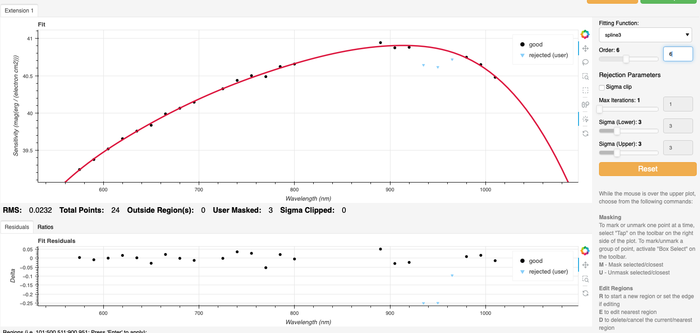
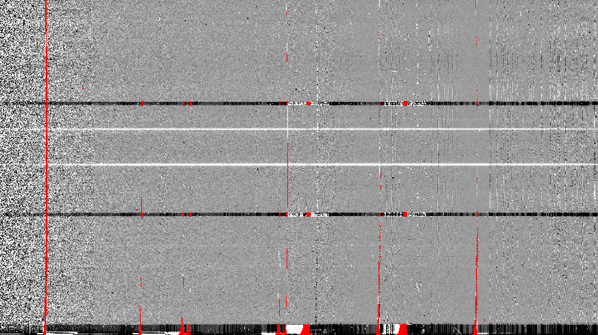

.. ex2_gmosls_large_dither_api.rst

.. _api_large_dither:

*************************************************************************
Example 2 - Longslit large-dither point source - using the "Reduce" class
*************************************************************************

A reduction can be initiated from the command line as shown in
:ref:`cmdline_large_dither` and it can also be done programmatically as we will
show here.  The classes and modules of the RecipeSystem can be
accessed directly for those who want to write Python programs to drive their
reduction.  In this example, we replicate the
command line version of Example 2 but using the Python
programmatic interface. What is shown here could be packaged in modules for
greater automation.

The dataset
===========
If you have not already, download and unpack the tutorial's data package.
Refer to :ref:`datasetup` for the links and simple instructions.

The dataset specific to this example is described in:

    :ref:`data_large_dither`.

Here is a copy of the table for quick reference.

+---------------------+---------------------------------------------+
| Science             || S20220611S0717 (705 nm)                    |
|                     || S20220611S0716 (795 nm)                    |
+---------------------+---------------------------------------------+
| Science biases      || S20220610S0182-186                         |
|                     || S20220611S0827,829,830,832,834             |
+---------------------+---------------------------------------------+
| Science flats       || S20220611S0718 (705 nm)                    |
|                     || S20220611S0715 (795 nm)                    |
+---------------------+---------------------------------------------+
| Science arcs        || S20220611S0782 (705 nm)                    |
|                     || S20220611S0779 (795 nm)                    |
+---------------------+---------------------------------------------+
| Standard (LTT7379)  || S20220608S0098 (705 nm)                    |
|                     || S20220608S0101 (795 nm)                    |
+---------------------+---------------------------------------------+
| Standard biases     || S20220608S0186-190                         |
|                     || S20220609S0206-210                         |
+---------------------+---------------------------------------------+
| Standard flats      || S20220608S0099 (705 nm)                    |
|                     || S20220608S0100 (795 nm)                    |
+---------------------+---------------------------------------------+
| Standard arc        || S20220608S0124 (705 nm)                    |
|                     || S20220608S0125 (795 nm)                    |
+---------------------+---------------------------------------------+
| BPM                 || bpm_20220128_gmos-s_Ham_22_full_12amp.fits |
+---------------------+---------------------------------------------+

Setting up
==========
First, navigate to your work directory in the unpacked data package.

::

    cd <path>/gmosls_tutorial/playground

The first steps are to import libraries, set up the calibration manager,
and the logger.

Configuring the interactive interface
-------------------------------------
In ``~/.dragons/``, add the following to the configuration file ``dragonsrc``::

    [interactive]
    browser = your_prefered_browser

The ``[interactive]`` section defines your prefered browser.  DRAGONS will open
the interactive tools using that browser.  The allowed strings are "safari",
"chrome", and "firefox".

Importing libraries
-------------------

.. code-block:: python
    :linenos:

    import glob
    import astrodata
    import gemini_instruments
    from recipe_system.reduction.coreReduce import Reduce
    from gempy.adlibrary import dataselect

The ``dataselect`` module will be used to create file lists for the
biases, the flats, the arcs, the standard, and the science observations.
The ``Reduce`` class is used to set up and run the data
reduction.

Setting up the logger
---------------------
We recommend using the DRAGONS logger.  (See also :ref:`double_messaging`.)

.. code-block:: python
    :linenos:
    :lineno-start: 6

    from gempy.utils import logutils
    logutils.config(file_name='gmosls_tutorial.log')

Set up the Calibration Service
------------------------------

.. important::  Remember to set up the calibration service.

    Instructions to configure and use the calibration service are found in
    :ref:`cal_service`, specifically these sections:
    :ref:`cal_service_config` and :ref:`cal_service_api`.

Create file lists
=================
The next step is to create input file lists.  The module ``dataselect`` helps
with that.  It uses Astrodata tags and |descriptors| to select the files and
store the filenames to a Python list that can then be fed to the ``Reduce``
class. (See the |astrodatauser| for information about Astrodata and for a list
of |descriptors|.)

The first list we create is a list of all the files in the ``playdata/example2``
directory.

.. code-block:: python
    :linenos:
    :lineno-start: 11

    all_files = glob.glob('../playdata/example2/*.fits')
    all_files.sort()

We will search that list for files with specific characteristics.  We use
the ``all_files`` :class:`list` as an input to the function
``dataselect.select_data()`` .  The function's signature is::

    select_data(inputs, tags=[], xtags=[], expression='True')

We show several usage examples below.

Two lists for the biases
------------------------
We have two sets for biases: one for the science observation, one for the
spectrophotometric standard observation.  The science observations and the
spectrophotometric standard observations were obtained using different
regions-of-interest (ROI).  So we will need two master biases, one "Full Frame"
for the science and one "Central Spectrum" for the standard.

To inspect data for specific |descriptors|, and to figure out how to build
our |dataselect| expression, we can loop through the biases and print the value
for the descriptor of interest, here ``detector_roi_setting``.

.. code-block:: python
    :linenos:
    :lineno-start: 13

    all_biases = dataselect.select_data(all_files, ['BIAS'])
    for bias in all_biases:
        ad = astrodata.open(bias)
        print(bias, '  ', ad.detector_roi_setting())

::

    ../playdata/example2/S20220608S0186.fits    Central Spectrum
    ../playdata/example2/S20220608S0187.fits    Central Spectrum
    ../playdata/example2/S20220608S0188.fits    Central Spectrum
    ../playdata/example2/S20220608S0189.fits    Central Spectrum
    ../playdata/example2/S20220608S0190.fits    Central Spectrum
    ../playdata/example2/S20220609S0206.fits    Central Spectrum
    ../playdata/example2/S20220609S0207.fits    Central Spectrum
    ../playdata/example2/S20220609S0208.fits    Central Spectrum
    ../playdata/example2/S20220609S0209.fits    Central Spectrum
    ../playdata/example2/S20220609S0210.fits    Central Spectrum
    ../playdata/example2/S20220610S0182.fits    Full Frame
    ../playdata/example2/S20220610S0183.fits    Full Frame
    ../playdata/example2/S20220610S0184.fits    Full Frame
    ../playdata/example2/S20220610S0185.fits    Full Frame
    ../playdata/example2/S20220610S0186.fits    Full Frame
    ../playdata/example2/S20220611S0827.fits    Full Frame
    ../playdata/example2/S20220611S0829.fits    Full Frame
    ../playdata/example2/S20220611S0830.fits    Full Frame
    ../playdata/example2/S20220611S0832.fits    Full Frame
    ../playdata/example2/S20220611S0834.fits    Full Frame

We can clearly see the two groups of biases above.  Let's split them into
two lists.

.. code-block:: python
    :linenos:
    :lineno-start: 17

    biasstd = dataselect.select_data(
        all_files,
        ['BIAS'],
        [],
        dataselect.expr_parser('detector_roi_setting=="Central Spectrum"')
    )

    biassci = dataselect.select_data(
        all_files,
        ['BIAS'],
        [],
        dataselect.expr_parser('detector_roi_setting=="Full Frame"')
    )

.. note::  All expressions need to be processed with ``dataselect.expr_parser``.

A list for the flats
--------------------
The GMOS longslit flats are not normally stacked.   The default recipe does
not stack the flats.  This allows us to use only one list of the flats.  Each
will be reduced individually, never interacting with the others.

.. code-block:: python
    :linenos:
    :lineno-start: 30

    flats = dataselect.select_data(all_files, ['FLAT'])

A list for the arcs
-------------------
The GMOS longslit arcs are not normally stacked.  The default recipe does
not stack the arcs.  This allows us to use only one list of arcs.  Each will be
reduced individually, never interacting with the others.

.. code-block:: python
    :linenos:
    :lineno-start: 31

    arcs = dataselect.select_data(all_files, ['ARC'])

Two lists for the spectrophotometric standard star
--------------------------------------------------
If a spectrophotometric standard is recognized as such by DRAGONS, it will
receive the Astrodata tag ``STANDARD``.  To be recognized, the name of the
star must be in a lookup table.  All spectrophotometric standards normally used
at Gemini are in that table.

For this example with a large wavelength dither, we will be reducing the standard star observations at each 
central wavelength separately without stacking them. The standard star reduction 
recipe stacks all the observations in a given file list. So we need to create 
separate file lists for the different central wavelengths. 

First, let's inspect the central wavelength of the standard star frames in our raw data directory. 
For this, we can loop through all the files with the tag ``STANDARD`` and print 
the value for the descriptor of interest, here ``central_wavelength``.

.. code-block:: python
    :linenos:
    :lineno-start: 32

    all_stdstar = dataselect.select_data(all_files, ['STANDARD'])
    for std in all_stdstar:
        ad = astrodata.open(std)
        print(std, '  ', ad.central_wavelength())
        
::

    ../playdata/example2/S20220608S0098.fits    7.05e-07
    ../playdata/example2/S20220608S0101.fits    7.95e-07

We will then create two standard star lists for the two central wavelengths.

.. code-block:: python
    :linenos:
    :lineno-start: 36

    stdstar_705nm = dataselect.select_data(
        all_files,
        ['STANDARD'],
        [],
        dataselect.expr_parser('central_wavelength==7.05e-07')
    )

    stdstar_795nm = dataselect.select_data(
        all_files,
        ['STANDARD'],
        [],
        dataselect.expr_parser('central_wavelength==7.95e-07')
    )

A list for the science observations
-----------------------------------
The science observations are what is left, that is anything that is not a
calibration. Calibrations are assigned the astrodata tag ``CAL``, therefore
we can select against that tag to get the science observations.

First, let's have a look at the list of objects.

.. code-block:: python
    :linenos:
    :lineno-start: 49

    all_science = dataselect.select_data(all_files, [], ['CAL'])
    for sci in all_science:
        ad = astrodata.open(sci)
        print(sci, '  ', ad.object())

On line 49, remember that the second argument contains the tags to **include**
(``tags``) and the third argument is the list of tags to **exclude**
(``xtags``).

::

    ../playdata/example2/S20220611S0716.fits    ORC5
    ../playdata/example2/S20220611S0717.fits    ORC5

In this case we only have one target.  If we had more than one, we would need
several lists and we could use the ``object`` descriptor in an expression.  We
will do that here to show how it would be done.  To be clear, the
``dataselect.expr_parser`` argument is not necessary in this specific case.

.. code-block:: python
    :linenos:
    :lineno-start: 53

    scitarget = dataselect.select_data(
        all_files,
        [],
        ['CAL'],
        dataselect.expr_parser('object=="ORC5"')
    )

Bad Pixel Mask
==============
Starting with DRAGONS v3.1, the static bad pixel masks (BPMs) are now handled
as calibrations.  They
are downloadable from the archive instead of being packaged with the software.
They are automatically associated like any other calibrations.  This means that
the user now must download the BPMs along with the other calibrations and add
the BPMs to the local calibration manager.

See :ref:`getBPM` in :ref:`tips_and_tricks` to learn about the various ways
to get the BPMs from the archive.

To add the BPM included in the data package to the local calibration database:

.. code-block:: python
    :linenos:
    :lineno-start: 59

    for bpm in dataselect.select_data(all_files, ['BPM']):
        caldb.add_cal(bpm)

Master Bias
===========
We create the master biases with the ``Reduce`` class.  We will run it
twice, once for each of the two raw bias lists.  The master biases
will be automatically added to the local calibration manager when the "store"
parameter is present in the ``.dragonsrc`` configuration file.
The output is written to disk and its name is stored in the ``Reduce``
instance.  The calibration service expects the name of a file on disk.

Because the database was given the "store" option in the ``dragonsrc`` file,
the processed biases will be automatically added to the database at the end
of the recipe.

.. code-block:: python
    :linenos:
    :lineno-start: 61

    reduce_biasstd = Reduce()
    reduce_biassci = Reduce()
    reduce_biasstd.files.extend(biasstd)
    reduce_biassci.files.extend(biassci)
    reduce_biasstd.runr()
    reduce_biassci.runr()

The two master biases are: ``S20220608S0186_bias.fits`` and
``S20220610S0182_bias.fits``.

.. note:: The file name of the output processed bias is the file name of the
    first file in the list with ``_bias`` appended as a suffix.  This is the
    general naming scheme used by the ``Recipe System``.

.. note:: If you wish to inspect the processed calibrations before adding them
    to the calibration database, remove the "store" option attached to the
    database in the ``dragonsrc`` configuration file.  You will then have to
    add the calibrations manually following your inspection, eg.

    .. code-block::

        caldb.add_cal(reduce_biasstd.output_filenames[0])
        caldb.add_cal(reduce_biassci.output_filenames[0])

Master Flat Field
=================
GMOS longslit flat fields are normally obtained at night along with the
observation sequence to match the telescope and instrument flexure.  The
matching flat nearest in time to the target observation is used to flat field
the target.  The central wavelength, filter, grating, binning, gain, and
read speed must match.

Because of the flexure, GMOS longslit flat field are not stacked.  Each is
reduced and used individually.  The default recipe takes that into account.

We can send all the flats, regardless of characteristics, to ``Reduce`` and each
will be reduced individually.  When a calibration is needed, in this case, a
master bias, the best match will be obtained automatically from the local
calibration manager.

.. code-block:: python
    :linenos:
    :lineno-start: 67

    reduce_flats = Reduce()
    reduce_flats.files.extend(flats)
    reduce_flats.runr()

The primitive ``normalizeFlat`` used in the recipe has an interactive mode.
To activate the interactive mode:

.. code-block:: python
    :linenos:
    :lineno-start: 70

    reduce_flats = Reduce()
    reduce_flats.files.extend(flats)
    reduce_flats.uparms = [('interactive', True)]
    reduce_flats.runr()

The interactive tools are introduced in section :ref:`interactive`.

.. note:: If the database is not set to "store" automatically,  the
          processed flats can be added manually as follows:

          .. code-block:: python

              for f in reduce_flats.output_filenames:
                  caldb.add_cal(f)

Processed Arc - Wavelength Solution
===================================
GMOS longslit arc can be obtained at night with the observation sequence,
if requested by the program, but are often obtained at the end of the night
or the following afternoon instead.  In this example, the arcs have been obtained at night, as part of
the sequence. Like the spectroscopic flats, they are not
stacked which means that they can be sent to reduce all together and will
be reduced individually.

The wavelength solution is automatically calculated and the algorithm has
been found to be quite reliable.  There might be cases where it fails; inspect
the RMS of ``determineWavelengthSolution`` in the
logs to confirm a good solution.

.. code-block:: python
    :linenos:
    :lineno-start: 74

    reduce_arcs = Reduce()
    reduce_arcs.files.extend(arcs)
    reduce_arcs.runr()

The primitive ``determineWavelengthSolution`` used in the recipe has an
interactive mode. To activate the interactive mode:

.. code-block:: python
    :linenos:
    :lineno-start: 77

    reduce_arcs = Reduce()
    reduce_arcs.files.extend(arcs)
    reduce_arcs.uparms = [('interactive', True)]
    reduce_arcs.runr()

The interactive tools are introduced in section :ref:`interactive`.

Processed Standard - Sensitivity Function
=========================================
The GMOS longslit spectrophotometric standards are normally taken when there
is a hole in the queue schedule, often when the weather is not good enough
for science observations. For a large wavelength dither, i.e., a difference 
in central wavelength much greater than about 10 nm, a spectrophotometric standard should be 
taken at each of those positions to calculate the respective sensitvity functions. 
The latter will then be used for spectrophotometric calibration of the science observations 
at the corresponding central wavelengths. 

The reduction of the standard will be using a BPM, a master bias, a master flat,
and a processed arc.  If those have been added to the local calibration
manager, they will be picked up automatically.  The output of the reduction
includes the sensitivity function and will be added to the calibration
database automatically if the "store" option is set in the ``dragonsrc``
configuration file.

**The 705nm Standard**

In most situation, the default recipe and input parameters will yield a good
calculation of the sensitivity function.

.. code-block:: python
    :linenos:
    :lineno-start: 81

    reduce_std_705nm = Reduce()
    reduce_std_705nm.files.extend(stdstar_705nm)
    reduce_std_705nm.runr()

However, if you suspect a suboptimal reduction or just want to confirm that
things are going well, there are four primitives in the default recipe for
spectrophotometric standard have an interactive interface:
``skyCorrectFromSlit``, ``findApertures``,
``traceApertures``, and ``calculateSensitivity``.  To activate the interactive
mode for all four:

.. code-block:: python
    :linenos:
    :lineno-start: 84

    reduce_std_705nm = Reduce()
    reduce_std_705nm.files.extend(stdstar_705nm)
    reduce_std_705nm.uparms = [('interactive', True)]
    reduce_std_705nm.runr()

Since the standard star spectrum is bright and strong, and the exposure short,
it is somewhat unlikely that interactivity will be needed for the sky
subtraction, or finding and tracing the spectrum.  The fitting of the
sensitivity function however can sometimes benefit from little adjustment.

To activate the interactive mode **only** for the measurement of the
sensitivity function:

.. code-block:: python
    :linenos:
    :lineno-start: 88

    reduce_std_705nm = Reduce()
    reduce_std_705nm.files.extend(stdstar_705nm)
    reduce_std_705nm.uparms = [('calculateSensitivity:interactive', True)]
    reduce_std_705nm.runr()

The interactive tools are introduced in section :ref:`interactive`.

**The 795nm Standard**

For the standard star observation at central wavelength 795 nm in this
dataset, ``calculateSensitivity`` with its default parameter values yields a suboptimal number 
of data points to constrain its sensitivity curve (see the left plot below; click the panel to enlarge). 
There is a conspicuous gap between 820 and 980 nm -- a result of the amplifier #5 issue and compounded 
by the presence of telluric absorption redward of around 880 nm. 

To deal with this, we can consider interpolating the (reference) data of the spectrophotometric standard, 
given that it has a smooth spectrum,  
to generate new sensitivity data points to fit. 
This is enabled by the ``resampling`` parameter, whose value 
we update as follows

.. code-block:: python
    :linenos:
    :lineno-start: 92

    reduce_std_795nm = Reduce()
    reduce_std_795nm.files.extend(stdstar_795nm)
    reduce_std_795nm.uparms = [('calculateSensitivity:interactive', True),
        ('calculateSensitivity:resampling', 15.0)
    ]
    reduce_std_795nm.runr()

.. image:: _graphics/LS_ldred_sens_before.png
   :width: 325
   :alt: Sensitivity function before optimization
   
   

The resulting curve is shown on the right plot (click the panel to enlarge). Notice that we have also tuned other parameters in the 
interactive tool and have manually masked four data points.  

.. note:: If you wish to inspect the spectrum in aperture 1:

    .. code-block:: python

        from gempy.adlibrary import plotting
        import matplotlib.pyplot as plt

        ad = astrodata.open(reduce_std_795nm.output_filenames[0])
        plt.ioff()
        plotting.dgsplot_bokeh(ad, 1)
        plt.ion()

    To learn how to plot a 1-D spectrum with matplotlib using the WCS from a
    Python script, see Tips and Tricks :ref:`plot_1d`.

    The sensitivity function is stored within the processed standard spectrum.
    To learn how to plot it, see Tips and Tricks :ref:`plot_sensfunc`.

Science Observations
====================
As mentioned previously, the science target is the central galaxy of an Odd Radio Circle. The sequence 
has two images that were dithered in wavelength (with a large step of 90 nm).  
DRAGONS will register the two images, align and stack them before
extracting the 1-D spectrum. 

This is what one raw image looks like.

.. image:: _graphics/LS_ldred_rawsci_716.png
   :width: 600
   :alt: raw science image

The broad, white and black vertical bands (slightly to the left of the middle) are related 
to the GMOS-S amplifier #5 issues. 
As can be seen, there are two obvious sources in this observation. Regardless of whether 
both of them are of interest to the program, DRAGONS will locate, trace, and extract 
them automatically. Each extracted spectrum is stored in an individual extension 
in the output multi-extension FITS file.

With the master bias, the master flat, the processed arcs (one for each of the
grating position, aka central wavelength), and the processed standards in the
local calibration manager, one only needs to do as follows to reduce the
science observations and extract the 1-D spectrum.

.. code-block:: python
    :linenos:
    :lineno-start: 98

    reduce_science = Reduce()
    reduce_science.files.extend(scitarget)
    reduce_science.recipename = 'reduceWithMultipleStandards'
    reduce_science.uparms = [('interactive', True)]
    reduce_science.runr()
    
Here we use a different science reduction recipe ``reduceWithMultipleStandards`` (line 97) 
than the default. The 
latter performs flux calibration *after* stacking the extracted spectra 
as described :ref:`here <Science Observations>`, which is not suitable 
for these observations with a large wavelength dither. The recipe 
``reduceWithMultipleStandards`` will run flux calibration for each 
central wavelength using the corresponding sensitivity function from the
spectrophotometric standard before stacking 
the observations -- the desired workflow for this example.

You can make use of the interactive tools to optimize the reduction. For 
the science reduction above, we have deleted any additional apertures found
by DRAGONS barring the two most prominent ones (see the left plot; click 
to enlarge). You simply hover over the unwanted peak and press D. Furthermore, 
we have selected sigma-clipping while tracing the apertures (right plot; 
click to enlarge). Notice that there is an additional tab for Aperture 2
in the upper part of the right plot. 

.. image:: _graphics/LS_ldred_findAp_sci.png
   :width: 325
   :alt: Apertures found by DRAGONS
   
.. image:: _graphics/LS_ldred_traceAp_sci.png
   :width: 325
   :alt: Tracing of aperture

The outputs include a 2-D spectrum image (``S20220611S0716_2D.fits``), which has been
bias corrected, flat fielded, QE-corrected, wavelength-calibrated, corrected for
distortion, sky-subtracted, flux-calibrated, and stacked, and also the 1-D spectra
(``S20171022S0087_1D.fits``) extracted from this 2-D spectrum image. The 1-D spectra are stored 
as 1-D FITS images in extensions of the output Multi-Extension FITS file, along with their 
respective variance and data quality (or mask) arrays.  

.. note:: If you wish to inspect the content of the 1-D output, run:    
    
    .. code-block:: python

            astrodata.open('S20220611S0716_1D.fits').info()

    ::

        Filename: S20220611S0716_1D.fits
        Tags: EXTRACTED GEMINI GMOS LS OVERSCAN_SUBTRACTED OVERSCAN_TRIMMED PREPARED
            PROCESSED PROCESSED_SCIENCE SIDEREAL SOUTH SPECT

        Pixels Extensions
        Index  Content                  Type              Dimensions     Format
        [ 0]   science                  NDAstroData       (3723,)        float32
                  .variance             ADVarianceUncerta (3723,)        float32
                  .mask                 ndarray           (3723,)        uint16
        [ 1]   science                  NDAstroData       (3723,)        float32
                  .variance             ADVarianceUncerta (3723,)        float32
                  .mask                 ndarray           (3723,)        uint16

        Other Extensions
                       Type        Dimensions
        .PROVENANCE    Table       (10, 4)
        .HISTORY       Table       (24, 4)

This is what the 2-D spectrum image looks like.

.. code-block:: python
    :linenos:
    :lineno-start: 103

    display = Reduce()
    display.files = ['S20220611S0716_2D.fits']
    display.recipename = 'display'
    display.runr()

The apertures found are listed in the log for the ``findApertures`` primitive,
just before the call to ``traceApertures``.  Information about the apertures
are also available in the header of each extracted spectrum: ``XTRACTED``,
``XTRACTLO``, ``XTRACTHI``, for aperture center, lower limit, and upper limit,
respectively.

The 1-D flux-calibrated spectra of the two apertures are shown below.

.. code-block:: python
    :linenos:
    :lineno-start: 107

    from gempy.adlibrary import plotting
    import matplotlib.pyplot as plt

    ad = astrodata.open(reduce_science.output_filenames[0])
    plt.ioff()
    plotting.dgsplot_bokeh(ad, 1)
    plotting.dgsplot_bokeh(ad, 2)
    plt.ion()

.. image:: _graphics/LS_ldred_ap1_spec1D.png
   :width: 325
   :alt: 1D spectrum for aperture 1
   
.. image:: _graphics/LS_ldred_ap2_spec1D.png
   :width: 325
   :alt: 1D spectrum for aperture 2   

To learn how to plot a 1-D spectrum with matplotlib using the WCS from a Python
script, see Tips and Tricks :ref:`plot_1d`. 

If you need an ascii representation of the spectum, you can use the primitive
``write1DSpectra`` to extract the values from the FITS file.

.. code-block:: python
    :linenos:
    :lineno-start: 115

    writeascii = Reduce()
    writeascii.files = ['S20220611S0716_1D.fits']
    writeascii.recipename = 'write1DSpectra'
    writeascii.runr()

The primitive outputs in the various formats offered by ``astropy.Table``.  To
see the list, use |showpars| **from the command line**.

::

    showpars S20220611S0716_1D.fits write1DSpectra

To use a different format, set the ``format`` parameters.

.. code-block:: python
    :linenos:
    :lineno-start: 119

    writeascii = Reduce()
    writeascii.files = ['S20220611S0716_1D.fits']
    writeascii.recipename = 'write1DSpectra'
    writeascii.uparms = [('format', 'ascii.ecsv'), ('extension', 'ecsv')]
    writeascii.runr()
