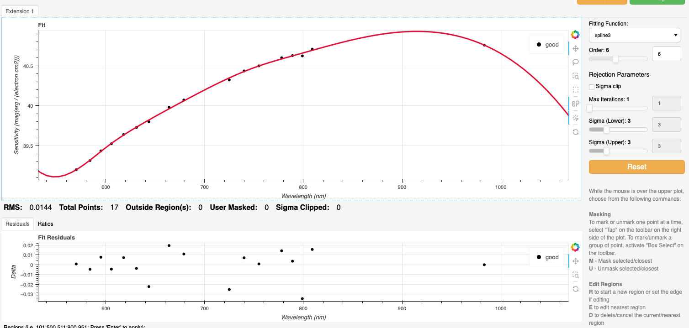
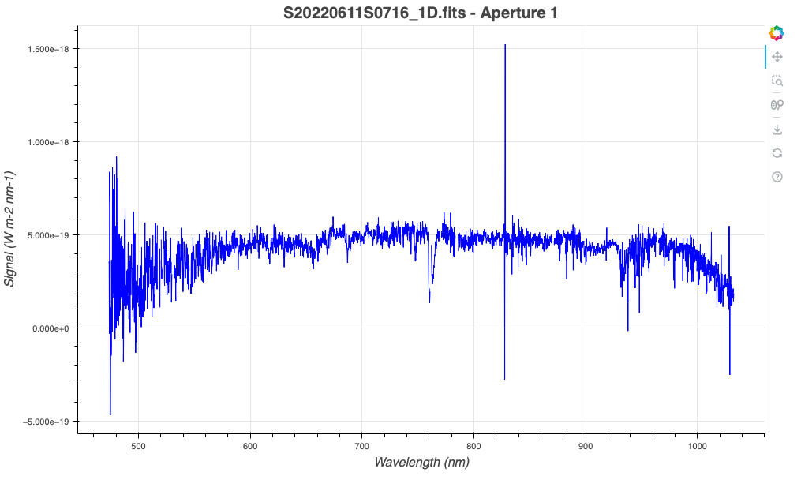
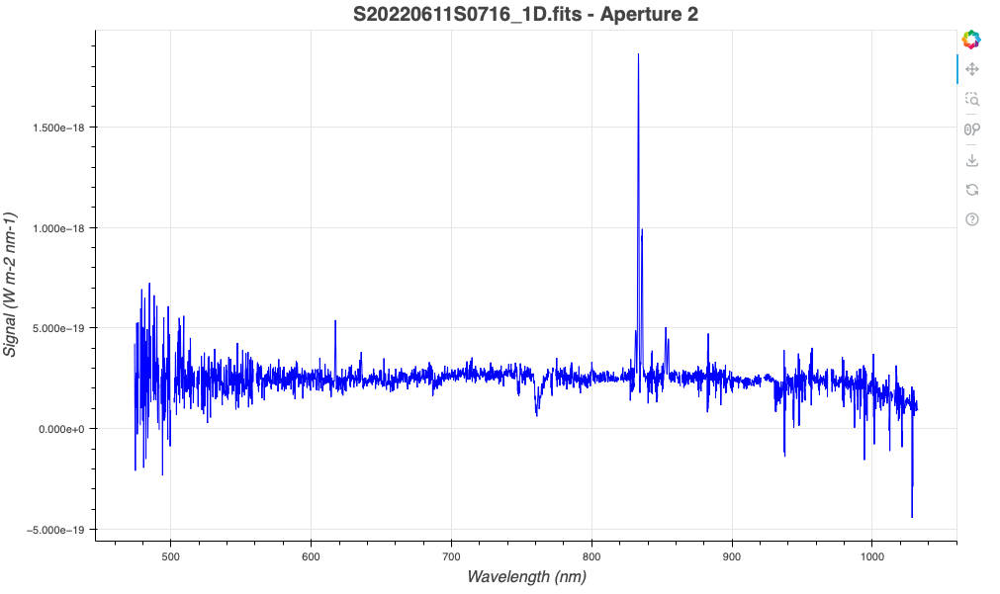

.. ex2_gmosls_large_dither_cmdline.rst

.. _cmdline_large_dither:

********************************************************************************
Example 2 - Longslit large-dither point source - using the "reduce" command line
********************************************************************************

In this example, we will reduce a GMOS longslit observation of `ORC J0102-2450 <https://ui.adsabs.harvard.edu/abs/2021MNRAS.505L..11K/abstract>`_, 
an Odd Radio Circle, using the "|reduce|" command that is operated directly from the unix shell. Just open a terminal and load the DRAGONS conda environment
to get started.

This observation dithers along the dispersion axis by several tens of nanometer.

The dataset
===========
If you have not already, download and unpack the tutorial's data package.
Refer to :ref:`datasetup` for the links and simple instructions.

The dataset specific to this example is described in:

    :ref:`data_large_dither`.

Here is a copy of the table for quick reference.

+---------------------+---------------------------------------------+
| Science             || S20220611S0717 (705 nm)                    |
|                     || S20220611S0716 (795 nm)                    |
+---------------------+---------------------------------------------+
| Science biases      || S20220610S0182-186                         |
|                     || S20220611S0827,829,830,832,834             |
+---------------------+---------------------------------------------+
| Science flats       || S20220611S0718 (705 nm)                    |
|                     || S20220611S0715 (795 nm)                    |
+---------------------+---------------------------------------------+
| Science arcs        || S20220611S0782 (705 nm)                    |
|                     || S20220611S0779 (795 nm)                    |
+---------------------+---------------------------------------------+
| Standard (LTT7379)  || S20220608S0098 (705 nm)                    |
|                     || S20220608S0101 (795 nm)                    |
+---------------------+---------------------------------------------+
| Standard biases     || S20220608S0186-190                         |
|                     || S20220609S0206-210                         |
+---------------------+---------------------------------------------+
| Standard flats      || S20220608S0099 (705 nm)                    |
|                     || S20220608S0100 (795 nm)                    |
+---------------------+---------------------------------------------+
| Standard arc        || S20220608S0124 (705 nm)                    |
|                     || S20220608S0125 (795 nm)                    |
+---------------------+---------------------------------------------+
| BPM                 || bpm_20220128_gmos-s_Ham_22_full_12amp.fits |
+---------------------+---------------------------------------------+

Configuring the interactive interface
=====================================
In ``~/.dragons/``, add the following to the configuration file ``dragonsrc``::

    [interactive]
    browser = your_prefered_browser

The ``[interactive]`` section defines your prefered browser.  DRAGONS will open
the interactive tools using that browser.  The allowed strings are "safari",
"chrome", and "firefox".

Set up the Local Calibration Manager
====================================

.. important::  Remember to set up the calibration service.

    Instructions to configure and use the calibration service are found in
    :ref:`cal_service`, specifically these sections:
    :ref:`cal_service_config` and :ref:`cal_service_cmdline`.

Create file lists
=================

This dataset contains science and calibration frames. For some programs, it
could contain different observed targets and different exposure times depending
on how you like to organize your raw data.

The DRAGONS data reduction pipeline does not organize the data for you.  You
have to do it.  However, DRAGONS provides tools to help you with that.

The first step is to create input file lists.  The tool "|dataselect|" helps
with that.  It uses Astrodata tags and "|descriptors|" to select the files and
send the filenames to a text file that can then be fed to "|reduce|".  (See the
|astrodatauser| for information about Astrodata.)

First, navigate to the ``playground`` directory in the unpacked data package::

    cd <path>/gmosls_tutorial/playground

Two lists for the biases
------------------------
The science observations and the spectrophotometric standard observations were
obtained using different regions-of-interest (ROI).  So we will need two master
biases, one "Full Frame" for the science and one "Central Spectrum" for the
standard.

We can use |dataselect| to select biases for each ROI.

Given the data that we have in the ``playdata/example2`` directory, we can create
our GMOS-S bias list using the tags and an expression that uses the ROI
settings. Remember, this will always depend on what you have in your raw data
directory.  For easier selection criteria, you might want to keep raw data
from different programs in different directories.

First, let's see which biases we have for the different ROIs in our raw data directory.

::

    dataselect ../playdata/example2/*.fits --tags BIAS | showd -d detector_roi_setting

    ---------------------------------------------------------------
    filename                                   detector_roi_setting
    ---------------------------------------------------------------
    ../playdata/example2/S20220608S0186.fits       Central Spectrum
    ../playdata/example2/S20220608S0187.fits       Central Spectrum
    ../playdata/example2/S20220608S0188.fits       Central Spectrum
    ../playdata/example2/S20220608S0189.fits       Central Spectrum
    ../playdata/example2/S20220608S0190.fits       Central Spectrum
    ../playdata/example2/S20220609S0206.fits       Central Spectrum
    ../playdata/example2/S20220609S0207.fits       Central Spectrum
    ../playdata/example2/S20220609S0208.fits       Central Spectrum
    ../playdata/example2/S20220609S0209.fits       Central Spectrum
    ../playdata/example2/S20220609S0210.fits       Central Spectrum
    ../playdata/example2/S20220610S0182.fits             Full Frame
    ../playdata/example2/S20220610S0183.fits             Full Frame
    ../playdata/example2/S20220610S0184.fits             Full Frame
    ../playdata/example2/S20220610S0185.fits             Full Frame
    ../playdata/example2/S20220610S0186.fits             Full Frame
    ../playdata/example2/S20220611S0827.fits             Full Frame
    ../playdata/example2/S20220611S0829.fits             Full Frame
    ../playdata/example2/S20220611S0830.fits             Full Frame
    ../playdata/example2/S20220611S0832.fits             Full Frame
    ../playdata/example2/S20220611S0834.fits             Full Frame

We can see the two groups that differ on their ROI.  We can use that as a
search criterion for creating the list with |dataselect|

::

    dataselect ../playdata/example2/*.fits --tags BIAS --expr='detector_roi_setting=="Central Spectrum"' -o biasesstd.lis
    dataselect ../playdata/example2/*.fits --tags BIAS --expr='detector_roi_setting=="Full Frame"' -o biasessci.lis

A list for the flats
--------------------
The GMOS longslit flats are not normally stacked.   The default recipe does
not stack the flats.  This allows us to use only one list of the flats.  Each
will be reduced individually, never interacting with the others.

If you have multiple programs and you want to reduce only the flats for that
program, you might want to use the ``program_id`` descriptor in the ``--expr``
expression.

Here, we have only one set of flats, so we will just gather
them all together.

::

    dataselect ../playdata/example2/*.fits --tags FLAT -o flats.lis

A list for the arcs
-------------------
The GMOS longslit arcs are not normally stacked.  The default recipe does
not stack the arcs.  This allows us to use only one list of arcs.  Each will be
reduced individually, never interacting with the others.

The arcs normally share the ``program_id`` with the science observations, if
you find that you need more accurate sorting.  We do not need it here.

::

    dataselect ../playdata/example2/*.fits --tags ARC -o arcs.lis

Two lists for the spectrophotometric standard star
--------------------------------------------------
If a spectrophotometric standard is recognized as such by DRAGONS, it will
receive the Astrodata tag ``STANDARD``.  All spectrophotometric standards
normally used at Gemini are in the DRAGONS list of recognized standards. 
For this example, we will be reducing the standard star observations at each 
central wavelength separately without stacking them. The standard star reduction 
recipe stacks all the observations in a given file list. So we need to create 
separate file lists for the different central wavelengths. 

First, let's check the central wavelength of the standard star frames in our raw data directory.

::

    dataselect ../playdata/example2/*.fits --tags STANDARD | showd -d central_wavelength

    -------------------------------------------------------------
    filename                                   central_wavelength
    -------------------------------------------------------------
    ../playdata/example2/S20220608S0098.fits             7.05e-07
    ../playdata/example2/S20220608S0101.fits             7.95e-07    

We will then create two standard star lists for the two central wavelengths.  

::

    dataselect ../playdata/example2/*.fits --tags STANDARD --expr='central_wavelength==7.05e-07' -o std_705nm.lis
    dataselect ../playdata/example2/*.fits --tags STANDARD --expr='central_wavelength==7.95e-07' -o std_795nm.lis
    

A list for the science observations
-----------------------------------

The science observations are what is left, that is anything that is not a
calibration. Calibrations are assigned the astrodata tag ``CAL``, therefore
we can select against that tag to get the science observations.

If we had multiple targets, we would need to split them into separate list. To
inspect what we have we can use |dataselect| and |showd| together.

::

    dataselect ../playdata/example2/*.fits --xtags CAL | showd -d object

    -------------------------------------------------
    filename                                   object
    -------------------------------------------------
    ../playdata/example2/S20220611S0716.fits     ORC5
    ../playdata/example2/S20220611S0717.fits     ORC5

Here we only have one object from the same sequence.  We would not need any
expression, just excluding calibrations would be sufficient.  But we demonstrate
here how one would specify the object name for a more surgical selection.

::

    dataselect ../playdata/example2/*.fits --xtags CAL --expr='object=="ORC5"' -o sci.lis

Bad Pixel Mask
==============
Starting with DRAGONS v3.1, the bad pixel masks (BPMs) are now handled as
calibrations.  They are downloadable from the archive instead of being
packaged with the software. They are automatically associated like any other
calibrations.  This means that the user now must download the BPMs along with
the other calibrations and add the BPMs to the local calibration manager.

See :ref:`getBPM` in :ref:`tips_and_tricks` to learn about the various ways
to get the BPMs from the archive.

To add the static BPM included in the data package to the local calibration
database:

::

    caldb add ../playdata/example2/bpm*.fits

Master Bias
===========
We create the master biases with the "|reduce|" command.  Because the database
was given the "store" option in the ``dragonsrc`` file, the processed biases
will be automatically added
to the database at the end of the recipe.

::

    reduce @biasesstd.lis
    reduce @biasessci.lis

The master biases are ``S20220608S0186_bias.fits`` and ``S20220610S0182_bias.fits``;
this information is in both the terminal log and the log file.  The ``@`` character
before the name of the input file is the "at-file" syntax. More details can be found in
the |atfile| documentation.

.. note:: The file name of the output processed bias is the file name of the
    first file in the list with ``_bias`` appended as a suffix.  This is the
    general naming scheme used by "|reduce|".

.. note:: If you wish to inspect the processed calibrations before adding them
    to the calibration database, remove the "store" option attached to the
    database in the ``dragonsrc`` configuration file.  You will then have to
    add the calibrations manually following your inspection, eg.

    ``caldb add *_bias.fits``

Master Flat Field
=================
GMOS longslit flat fields are normally obtained at night along with the
observation sequence to match the telescope and instrument flexure.  The
matching flat nearest in time to the target observation is used to flat field
the target.  The central wavelength, filter, grating, binning, gain, and
read speed must match.

Because of the flexure, GMOS longslit flat fields are not stacked.  Each is
reduced and used individually.  The default recipe takes that into account.

We can send all the flats, regardless of characteristics, to |reduce| and each
will be reduced individually.  When a calibration is needed, in this case, a
master bias, the best match will be obtained automatically from the local
calibration manager.

::

    reduce @flats.lis

The primitive ``normalizeFlat``, used in the recipe, has an interactive mode.
To activate the interactive mode:

::

    reduce @flats.lis -p interactive=True

The interactive tools are introduced in section :ref:`interactive`.

Processed Arc - Wavelength Solution
===================================
GMOS longslit arc can be obtained at night with the observation sequence,
if requested by the program, but are often obtained at the end of the night
or the following afternoon instead. In this example, the arcs have been obtained at night, 
as part of the sequence. Like the spectroscopic flats, they are not
stacked, which means that they can be sent to reduce all together and will
be reduced individually.

The wavelength solution is automatically calculated and has been found to be
quite reliable.  There might be cases where it fails; inspect the RMS of 
``determineWavelengthSolution`` in the logs to confirm a good solution.

::

    reduce @arcs.lis

The primitive ``determineWavelengthSolution``, used in the recipe, has an
interactive mode. To activate the interactive mode:

::

    reduce @arcs.lis -p interactive=True

The interactive tools are introduced in section :ref:`interactive`.

Processed Standard - Sensitivity Function
=========================================
The GMOS longslit spectrophotometric standards are normally taken when there
is a hole in the queue schedule, often when the weather is not good enough
for science observations. For a large wavelength dither, i.e., a difference 
in central wavelength much greater than about 10 nm, a spectrophotometric standard should be 
taken at each of those positions to calculate the respective sensitvity functions. 
The latter will then be used for spectrophotometric calibration of the science observations 
at the corresponding central wavelengths. 

The reduction of the standard will be using a BPM, a master bias, a master flat,
and a processed arc.  If those have been added to the local calibration
manager, they will be picked up automatically.  The output of the reduction
includes the sensitivity function and will be added to the calibration
database automatically if the "store" option is set in the ``dragonsrc``
configuration file.

**The 705nm Standard**

In most situation, the default recipe and input parameters will yield a good
calculation of the sensitivity function.

::

    reduce @std_705nm.lis

However, if you suspect a suboptimal reduction or just want to confirm that
things are going well, there are four primitives in the default recipe for
spectrophotometric standard have an interactive interface:
``skyCorrectFromSlit``, ``findApertures``,
``traceApertures``, and ``calculateSensitivity``.  To activate the
interactive mode for all four:

::

    reduce @std_705nm.lis -p interactive=True

Since the standard star spectrum is bright and strong, and the exposure short,
it is somewhat unlikely that interactivity will be needed for the sky
subtraction, or finding and tracing the spectrum.  The fitting of the
sensitivity function however can sometimes benefit from little adjustment. 

To activate the interactive mode **only** for the measurement of the
sensitivity function:

::

    reduce @std_705nm.lis -p calculateSensitivity:interactive=True

The interactive tools are introduced in section :ref:`interactive`. 

**The 795nm Standard**

For the standard star observation at central wavelength 795 nm in this
dataset, ``calculateSensitivity`` with its default parameter values yields a suboptimal number 
of data points to constrain its sensitivity curve (see the left plot below; click the panel to enlarge). 
There is a conspicuous gap between 820 and 980 nm -- a result of the amplifier #5 issue and compounded 
by the presence of telluric absorption redward of around 880 nm. 

To deal with this, we can consider interpolating the (reference) data of the spectrophotometric standard, 
given that it has a smooth spectrum,  
to generate new sensitivity data points to fit. 
This is enabled by the ``resampling`` parameter, whose value 
we update as follows

::

    reduce @std_795nm.lis -p calculateSensitivity:interactive=True calculateSensitivity:resampling=15.0

The resulting curve is shown on the right plot (click the panel to enlarge).
**Notice that we have manually masked three data points**.

   
   
.. image:: _graphics/LS_ldred_sens_after.png
   :width: 325
   :alt: Sensitivity function after optimization

.. note:: If you wish to inspect the spectra::

    dgsplot --bokeh S20220608S0098_standard.fits 1
    dgsplot --bokeh S20220608S0101_standard.fits 1

   where ``1`` is the aperture #1, the brightest target.
   To learn how to plot a 1-D spectrum with matplotlib using the WCS from a
   Python script, see Tips and Tricks :ref:`plot_1d`.

   The sensitivity function is stored within the processed standard spectrum.  To
   learn how to plot it, see Tips and Tricks :ref:`plot_sensfunc`.

Science Observations
====================
As mentioned previously, the science target is the central galaxy of an Odd Radio Circle. The sequence 
has two images that were dithered in wavelength (with a large step of 90 nm).  
DRAGONS will register the two images, align and stack them before
extracting the 1-D spectrum. 

This is what one raw image looks like.

.. image:: _graphics/LS_ldred_rawsci_716.png
   :width: 600
   :alt: raw science image

The broad, white and black vertical bands (slightly to the left of the middle) are related 
to the GMOS-S amplifier #5 issues. 
As can be seen, there are two obvious sources in this observation. Regardless of whether 
both of them are of interest to the program, DRAGONS will locate, trace, and extract 
them automatically. Each extracted spectrum is stored in an individual extension 
in the output multi-extension FITS file.

With the master bias, the master flat, the processed arcs (one for each of the
grating position, aka central wavelength), and the processed standards in the
local calibration manager, one only needs to do as follows to reduce the
science observations and extract the 1-D spectrum.

::

    reduce -r reduceWithMultipleStandards @sci.lis -p interactive=True

Here we use a different science reduction recipe ``reduceWithMultipleStandards`` 
than the default. The 
default recipe performs flux calibration **after** stacking the extracted spectra
as described :ref:`here <Science Observations>`, which is not suitable 
for these observations with a large wavelength dither. The recipe 
``reduceWithMultipleStandards`` will run flux calibration for each 
central wavelength using the corresponding sensitivity function from the
spectrophotometric standard before stacking 
the observations -- the desired workflow for this example.

You can make use of the interactive tools to optimize the reduction. For 
the science reduction above, we have deleted any additional apertures found
by DRAGONS barring the two most prominent ones (see the left plot; click 
to enlarge). You simply hover over the unwanted peak and press D. Furthermore, 
we have selected sigma-clipping while tracing the apertures (right plot; 
click to enlarge). Notice that there is an additional tab for Aperture 2
in the upper part of the right plot.

The plots below are from the second ``findApertures`` call, the one done on
the stacked image and after the ``skySubtractFromSlit`` primitive.

.. image:: _graphics/LS_ldred_findAp_sci.png
   :width: 325
   :alt: Apertures found by DRAGONS
   
.. image:: _graphics/LS_ldred_traceAp_sci.png
   :width: 325
   :alt: Tracing of aperture

The outputs include a 2-D spectrum image (``S20220611S0716_2D.fits``), which has been
bias corrected, flat fielded, QE-corrected, wavelength-calibrated, corrected for
distortion, sky-subtracted, flux-calibrated, and stacked, and also the 1-D spectra
(``S20220611S0716_1D.fits``) extracted from this 2-D spectrum image. The 1-D spectra are stored
as 1-D FITS images in extensions of the output Multi-Extension FITS file, along with their 
respective variance and data quality (or mask) arrays. 

This is what the 2-D spectrum looks like.

::

    reduce -r display S20220611S0716_2D.fits

.. note::

    ``ds9`` must be launched by the user ahead of running the display primitive.
    (``ds9&`` on the terminal prompt.)

.. image:: _graphics/LS_ldred_sci_2D.png
   :width: 600
   :alt: 2D stacked spectrum

The apertures found are listed in the log for the ``findApertures`` primitive,
just before the call to ``traceApertures``.  Information about the apertures
are also available in the header of each extracted spectrum: ``XTRACTED``,
``XTRACTLO``, ``XTRACTHI``, for aperture center, lower limit, and upper limit,
respectively.

The 1-D flux-calibrated spectra of the two apertures are shown below.

.. note:: The drop beyond 960nm is related to the lack of coverage in the
    sensitivity function.

::

    dgsplot --bokeh S20220611S0716_1D.fits 1
    dgsplot --bokeh S20220611S0716_1D.fits 2

   

Since there are only two images, several bad columns, and artifacts remain
in the data.  Many are flagged in the mask, the DQ plane of the output FITS
files. Flagged pixels are not used in the calculations.  ``dgsplot``
automatically ignore those bad pixels.

If you are using your own tools and they cannot use the DQ plane or mask, you
might want to interpolate over the bad values. This is a cosmetic step left to
the user as the only purpose is to improve the look of the spectra, not the
scientific result.

If you decide to apply a cosmetic correction, you could use the primitive
``applyDQPlane`` (``reduce -r applyDQPlane S20220611S0716_1D``).  We do not
recommend that you do science measurements on a file altered for cosmetic
purposes.

To learn how to plot a 1-D spectrum with matplotlib using the WCS from a Python
script, see Tips and Tricks :ref:`plot_1d`.

If you need an ascii representation of the spectra, you can use the primitive
``write1DSpectra`` to extract the values from the FITS file.

::

    reduce -r write1DSpectra S20220611S0716_1D.fits

The primitive outputs in the various formats offered by ``astropy.Table``.  To
see the list, use |showpars|.

::

    showpars S20220611S0716_1D.fits write1DSpectra

To use a different format, set the ``format`` parameters.

::

    reduce -r write1DSpectra -p format=ascii.ecsv extension='ecsv' S20220611S0716_1D.fits
