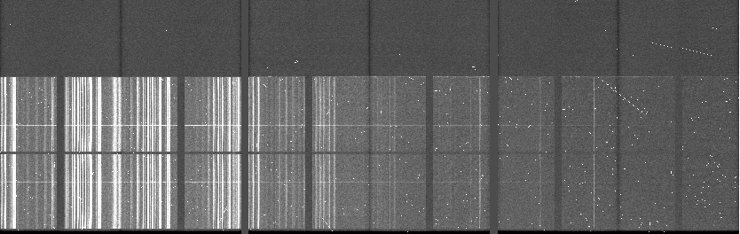
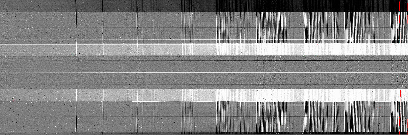
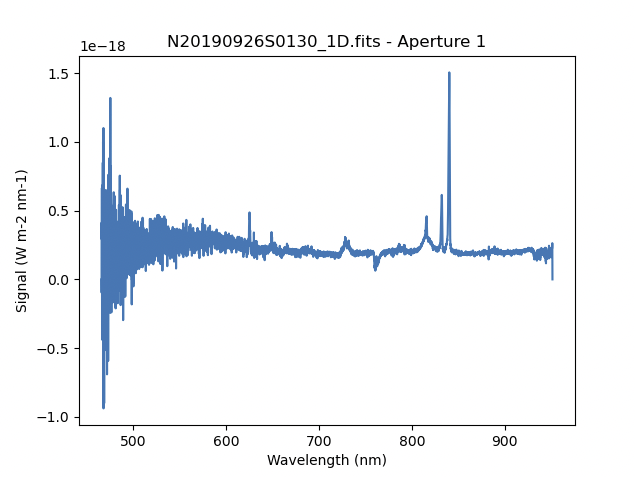

.. ex3_gmosls_ns_api.rst

.. _ns_api:

*********************************************************************
Example 3 - Nod-and-Shuffle Point Source - Using the "Reduce" class
*********************************************************************

A reduction can be initiated from the command line as shown in
:ref:`ns_cmdline` and it can also be done programmatically as we will
show here.  The classes and modules of the RecipeSystem can be
accessed directly for those who want to write Python programs to drive their
reduction.  In this example we replicate the
command line version of Example 3 but using the Python
programmatic interface. What is shown here could be packaged in modules for
greater automation.

The dataset
===========
If you have not already, download and unpack the tutorial's data package.
Refer to :ref:`datasetup` for the links and simple instructions.

The dataset specific to this example is described in:

    :ref:`ns_dataset`.

Here is a copy of the table for quick reference.

+---------------------+---------------------------------------------+
| Science             || N20190926S0130-32 (700 nm)                 |
|                     || N20190926S0137-39 (710 nm)                 |
+---------------------+---------------------------------------------+
| Science biases      || N20190926S0230-234                         |
+---------------------+---------------------------------------------+
| Science flats       || N20190926S0129,133 (700 nm)                |
|                     || N20190926S0136,140 (710 nm)                |
+---------------------+---------------------------------------------+
| Science arcs        || N20190926S0134 (700 nm)                    |
|                     || N20190926S0135 (710 nm)                    |
+---------------------+---------------------------------------------+
| Standard (G191B2B)  || N20190902S0046 (700 nm)                    |
+---------------------+---------------------------------------------+
| Standard biases     || N20190902S0089-093                         |
+---------------------+---------------------------------------------+
| Standard flats      || N20190902S0047 (700 nm)                    |
+---------------------+---------------------------------------------+
| Standard arc        || N20190902S0062 (700 nm)                    |
+---------------------+---------------------------------------------+
| BPM                 || bpm_20170306_gmos-n_Ham_12_full_12amp.fits |
+---------------------+---------------------------------------------+

Setting up
==========
First, navigate to your work directory in the unpacked data package.

::

    cd <path>/gmosls_tutorial/playground

The first steps are to import libraries, set up the calibration manager,
and set the logger.

Configuring the interactive interface
-------------------------------------
In ``~/.dragons/``, add the following to the configuration file ``dragonsrc``::

    [interactive]
    browser = your_prefered_browser

The ``[interactive]`` section defines your prefered browser.  DRAGONS will open
the interactive tools using that browser.  The allowed strings are "safari",
"chrome", and "firefox".

Importing libraries
-------------------

.. code-block:: python
    :linenos:

    import glob

    import astrodata
    import gemini_instruments
    from recipe_system.reduction.coreReduce import Reduce
    from gempy.adlibrary import dataselect

The ``dataselect`` module will be used to create file lists for the
biases, the flats, the arcs, the standard, and the science observations.
The ``Reduce`` class is used to set up and run the data
reduction.

Setting up the logger
---------------------
We recommend using the DRAGONS logger.  (See also :ref:`double_messaging`.)

.. code-block:: python
    :linenos:
    :lineno-start: 7

    from gempy.utils import logutils
    logutils.config(file_name='gmosls_tutorial.log')

Set up the Calibration Service
------------------------------

.. important::  Remember to set up the calibration service.

    Instructions to configure and use the calibration service are found in
    :ref:`cal_service`, specifically the these sections:
    :ref:`cal_service_config` and :ref:`cal_service_api`.

Create file lists
=================
The next step is to create input file lists.  The module ``dataselect`` helps
with that.  It uses Astrodata tags and |descriptors| to select the files and
store the filenames to a Python list that can then be fed to the ``Reduce``
class. (See the |astrodatauser| for information about Astrodata and for a list
of |descriptors|.)

The first list we create is a list of all the files in the ``playdata``
directory.

.. code-block:: python
    :linenos:
    :lineno-start: 9

    all_files = glob.glob('../playdata/example3/*.fits')
    all_files.sort()

We will search that list for files with specific characteristics.  We use
the ``all_files`` :class:`list` as an input to the function
``dataselect.select_data()`` .  The function's signature is::

    select_data(inputs, tags=[], xtags=[], expression='True')

We show several usage examples below.

Two lists for the biases
------------------------
We have two sets for biases: one for the science observation, one for the
spectrophotometric standard observation.  The science observations and the
spectrophotometric standard observations were obtained using different
regions-of-interest (ROI).  So we will need two master biases, one "Full Frame"
for the science and one "Central Spectrum" for the standard.

To inspect data for specific |descriptors|, and to figure out how to build
our |dataselect| expression, we can loop through the biases and print the value
for the descriptor of interest, here ``detector_roi_setting``.

.. code-block:: python
    :linenos:
    :lineno-start: 11

    all_biases = dataselect.select_data(all_files, ['BIAS'])
    for bias in all_biases:
        ad = astrodata.open(bias)
        print(bias, '  ', ad.detector_roi_setting())

::

    ../playdata/example3/N20190902S0089.fits    Central Spectrum
    ../playdata/example3/N20190902S0090.fits    Central Spectrum
    ../playdata/example3/N20190902S0091.fits    Central Spectrum
    ../playdata/example3/N20190902S0092.fits    Central Spectrum
    ../playdata/example3/N20190902S0093.fits    Central Spectrum
    ../playdata/example3/N20190926S0230.fits    Full Frame
    ../playdata/example3/N20190926S0231.fits    Full Frame
    ../playdata/example3/N20190926S0232.fits    Full Frame
    ../playdata/example3/N20190926S0233.fits    Full Frame
    ../playdata/example3/N20190926S0234.fits    Full Frame

We can clearly see the two groups of biases above.  Let's split them into
two lists.

.. code-block:: python
    :linenos:
    :lineno-start: 15

    biasstd = dataselect.select_data(
        all_files,
        ['BIAS'],
        [],
        dataselect.expr_parser('detector_roi_setting=="Central Spectrum"')
    )

    biassci = dataselect.select_data(
        all_files,
        ['BIAS'],
        [],
        dataselect.expr_parser('detector_roi_setting=="Full Frame"')
    )

.. note::  All expressions need to be processed with ``dataselect.expr_parser``.

A list for the flats
--------------------
The GMOS longslit flats are not normally stacked.   The default recipe does
not stack the flats.  This allows us to use only one list of the flats.  Each
will be reduced individually, never interacting with the others.

The flats used for nod-and-shuffle are normal flats.  The DRAGONS recipe will
"double" the flat and apply it to each beam.

.. code-block:: python
    :linenos:
    :lineno-start: 28

    flats = dataselect.select_data(all_files, ['FLAT'])

A list for the arcs
-------------------
The GMOS longslit arcs are not normally stacked.  The default recipe does
not stack the arcs.  This allows us to use only one list of arcs.  Each will be
reduce individually, never interacting with the others.

.. code-block:: python
    :linenos:
    :lineno-start: 29

    arcs = dataselect.select_data(all_files, ['ARC'])

A list for the spectrophotometric standard star
-----------------------------------------------
If a spectrophotometric standard is recognized as such by DRAGONS, it will
receive the Astrodata tag ``STANDARD``.  To be recognized, the name of the
star must be in a lookup table.  All spectrophotometric standards normally used
at Gemini are in that table.

.. code-block:: python
    :linenos:
    :lineno-start: 30

    stdstar = dataselect.select_data(all_files, ['STANDARD'])

A list for the science observation
----------------------------------
The science observations are what is left, that is anything that is not a
calibration. Calibrations are assigned the astrodata tag ``CAL``, therefore
we can select against that tag to get the science observations.

First, let's have a look at the list of objects.

.. code-block:: python
    :linenos:
    :lineno-start: 31

    all_science = dataselect.select_data(all_files, [], ['CAL'])
    for sci in all_science:
        ad = astrodata.open(sci)
        print(sci, '  ', ad.object())

On line 37, remember that the second argument contains the tags to **include**
(``tags``) and the third argument is the list of tags to **exclude**
(``xtags``).

::

    ../playdata/example3/N20190926S0130.fits    J013943
    ../playdata/example3/N20190926S0131.fits    J013943
    ../playdata/example3/N20190926S0132.fits    J013943
    ../playdata/example3/N20190926S0137.fits    J013943
    ../playdata/example3/N20190926S0138.fits    J013943
    ../playdata/example3/N20190926S0139.fits    J013943

In this case we only have one target.  If we had more than one, we would need
several lists and we could use the ``object`` descriptor in an expression.  We
will do that here to show how it would be done.  To be clear, the
``dataselect.expr_parser`` argument is not necessary in this specific case.

.. code-block:: python
    :linenos:
    :lineno-start: 35

    scitarget = dataselect.select_data(
        all_files,
        [],
        ['CAL']
    )

Bad Pixel Mask
==============
Starting with DRAGONS v3.1, the static bad pixel masks (BPMs) are now handled
as calibrations.  They
are downloadable from the archive instead of being packaged with the software.
They are automatically associated like any other calibrations.  This means that
the user now must download the BPMs along with the other calibrations and add
the BPMs to the local calibration manager.

See :ref:`getBPM` in :ref:`tips_and_tricks` to learn about the various ways
to get the BPMs from the archive.

To add the BPM included in the data package to the local calibration database:

.. code-block:: python
    :linenos:
    :lineno-start: 40

    for bpm in dataselect.select_data(all_files, ['BPM']):
        caldb.add_cal(bpm)

Master Bias
===========
We create the master biases with the ``Reduce`` class.  We will run it
twice, once for each of the two raw bias lists.  The master biases
will be automatically added to the local calibration manager when the "store"
parameter is present in the ``.dragonsrc`` configuration file.
The output is written to disk and its name is stored in the ``Reduce``
instance.  The calibration service expects the name of a file on disk.

Because the database was given the "store" option in the ``dragonsrc`` file,
the processed biases will be automatically added to the database at the end
of the recipe.

.. code-block:: python
    :linenos:
    :lineno-start: 42

    reduce_biasstd = Reduce()
    reduce_biassci = Reduce()
    reduce_biasstd.files.extend(biasstd)
    reduce_biassci.files.extend(biassci)
    reduce_biasstd.runr()
    reduce_biassci.runr()

The two master biases are: ``N20190902S0089_bias.fits`` and
``N20190926S0230_bias.fits``.

.. note:: The file name of the output processed bias is the file name of the
    first file in the list with ``_bias`` appended as a suffix.  This is the
    general naming scheme used by the ``Recipe System``.

.. note:: If you wish to inspect the processed calibrations before adding them
    to the calibration database, remove the "store" option attached to the
    database in the ``dragonsrc`` configuration file.  You will then have to
    add the calibrations manually following your inspection, eg.

    .. code-block::

        caldb.add_cal(reduce_biasstd.output_filenames[0])
        caldb.add_cal(reduce_biassci.output_filenames[0])

Master Flat Field
=================
GMOS longslit flat fields are normally obtained at night along with the
observation sequence to match the telescope and instrument flexure.  The
matching flat nearest in time to the target observation is used to flat field
the target.  The central wavelength, filter, grating, binning, gain, and
read speed must match.

Because of the flexure, GMOS longslit flat field are not stacked.  Each is
reduced and used individually.  The default recipe takes that into account.

We can send all the flats, regardless of characteristics, to ``Reduce`` and each
will be reduce individually.  When a calibration is needed, in this case, a
master bias, the best match will be obtained automatically from the local
calibration manager.

.. code-block:: python
    :linenos:
    :lineno-start: 48

    reduce_flats = Reduce()
    reduce_flats.files.extend(flats)
    reduce_flats.runr()

Processed Arc - Wavelength Solution
===================================
GMOS longslit arc can be obtained at night with the observation sequence,
if requested by the program, but are often obtained at the end of the night
or the following afternoon instead.  In this example, the arcs have been obtained at night, as part of
the sequence. Like the spectroscopic flats, they are not
stacked which means that they can be sent to reduce all together and will
be reduced individually.

The wavelength solution is automatically calculated and the algorithm has
been found to be quite reliable.  There might be cases where it fails; inspect
the ``*_mosaic.pdf`` plot and the RMS of ``determineWavelengthSolution`` in the
logs to confirm a good solution.

.. code-block:: python
    :linenos:
    :lineno-start: 51

    reduce_arcs = Reduce()
    reduce_arcs.files.extend(arcs)
    reduce_arcs.runr()

Processed Standard - Sensitivity Function
=========================================
The GMOS longslit spectrophotometric standards are normally taken when there
is a hole in the queue schedule, often when the weather is not good enough
for science observations.  One standard per configuration, per program is
the norm.  If you dither along the dispersion axis, most likely only one
of the positions will have been used for the spectrophotometric standard.
This is normal for baseline calibrations at Gemini.  The standard is used
to calculate the sensitivity function.  It has been shown that a difference of
10 or so nanometers does not significantly impact the spectrophotometric
calibration.

The reduction of the standard will be using a BPM, a master bias, a master flat,
and a processed arc.  If those have been added to the local calibration
manager, they will be picked up automatically.  The output of the reduction
includes the sensitivity function and will be added to the calibration
database automatically if the "store" option is set in the ``dragonsrc``
configuration file.

.. code-block:: python
    :linenos:
    :lineno-start: 54

    reduce_std = Reduce()
    reduce_std.files.extend(stdstar)
    reduce_std.runr()

.. note:: If you wish to inspect the spectrum in aperture 1:

    .. code-block:: python

        from gempy.adlibrary import plotting
        import matplotlib.pyplot as plt

        ad = astrodata.open(reduce_std.output_filenames[0])
        plt.ioff()
        plotting.dgsplot_matplotlib(ad, 1)
        plt.ion()

    To learn how to plot a 1-D spectrum with matplotlib using the WCS from a
    Python script, see Tips and Tricks :ref:`plot_1d`.

    The sensitivity function is stored within the processed standard spectrum.
    To learn how to plot it, see Tips and Tricks :ref:`plot_sensfunc`.

Science Observations
====================
The science target is a quasar.  The sequence has six images in two groups
that were dithered along the dispersion axis.  DRAGONS will
remove the sky from the six images using the nod-and-shuffle beams.  The six
images will be register and stack before extraction.

This is what one raw image looks like.

With the master bias, the master flat, the processed arcs (one for each of the
grating position, aka central wavelength), and the processed standard in the
local calibration manager, one only needs to do as follows to reduce the
science observations and extract the 1-D spectrum.

.. code-block:: python
    :linenos:
    :lineno-start: 57

    reduce_science = Reduce()
    reduce_science.files.extend(scitarget)
    reduce_science.runr()

This produces a 2-D spectrum (``N20190926S0130_2D.fits``) which has been
bias corrected, flat fielded, QE-corrected, wavelength-calibrated, corrected for
distortion, sky-subtracted, and stacked.  It also produces the 1-D spectrum
(``N20190926S0130_1D.fits``) extracted from that 2-D spectrum.  The 1-D
spectrum is flux calibrated with the sensitivity function from the
spectrophotometric standard. The 1-D spectra are stored as 1-D FITS images in
extensions of the output Multi-Extension FITS file.

This is what the 2-D spectrum looks like.

.. code-block:: python
    :linenos:
    :lineno-start: 60

    display = Reduce()
    display.files = ['N20190926S0130_2D.fits']
    display.recipename = 'display'
    display.runr()

.. note::

    ``ds9`` must be launched by the user ahead of running the display primitive.
    (``ds9&`` on the terminal prompt.)

The apertures found are listed in the log for the ``findApertures`` primitive,
just before the call to ``traceApertures``.  Information about the apertures
are also available in the header of each extracted spectrum: ``XTRACTED``,
``XTRACTLO``, ``XTRACTHI``, for aperture center, lower limit, and upper limit,
respectively.

This is what the 1-D flux-calibrated spectrum of our sole target looks like.

.. code-block:: python
    :linenos:
    :lineno-start: 64

    from gempy.adlibrary import plotting
    import matplotlib.pyplot as plt

    ad = astrodata.open(reduce_science.output_filenames[0])
    plt.ioff()
    plotting.dgsplot_matplotlib(ad, 1)
    plt.ion()

To learn how to plot a 1-D spectrum with matplotlib using the WCS from a Python
script, see Tips and Tricks :ref:`plot_1d`.

If you need an ascii representation of the spectum, you can use the primitive
``write1DSpectra`` to extract the values from the FITS file.

.. code-block:: python
    :linenos:
    :lineno-start: 71

    writeascii = Reduce()
    writeascii.files = ['N20190926S0130_1D.fits']
    writeascii.recipename = 'write1DSpectra'
    writeascii.runr()

The primitive outputs in the various formats offered by ``astropy.Table``.  To
see the list, use |showpars| **from the command line**.

::

    showpars S20171022S0087_1D.fits write1DSpectra

To use a different format, set the ``format`` parameters.

.. code-block:: python
    :linenos:
    :lineno-start: 75

    writeascii = Reduce()
    writeascii.files = ['N20190926S0130_1D.fits']
    writeascii.recipename = 'write1DSpectra'
    writeascii.uparms = dict([('format', 'ascii.ecsv'), ('extension', 'ecsv')])
    writeascii.runr()
