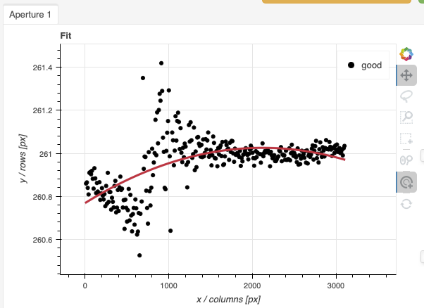
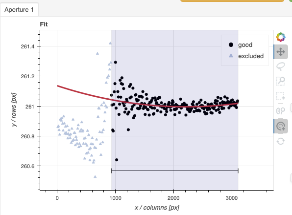
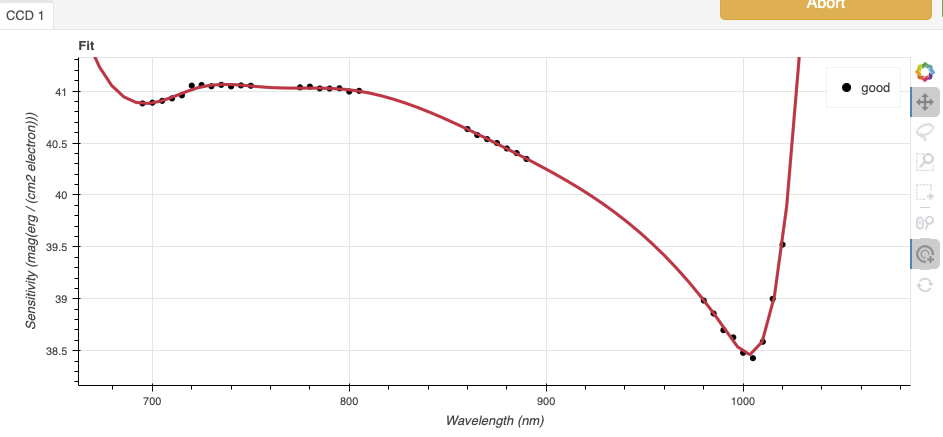
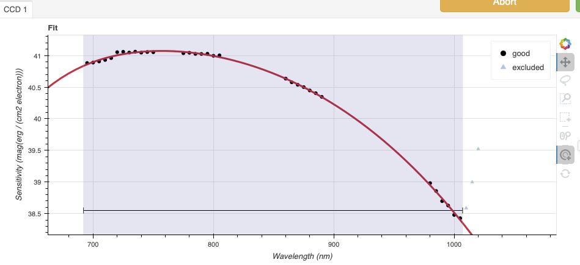
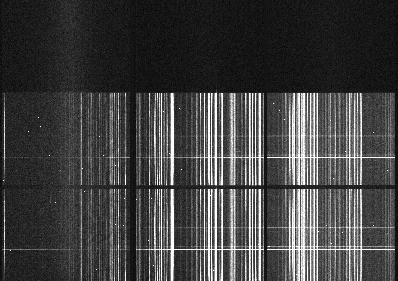
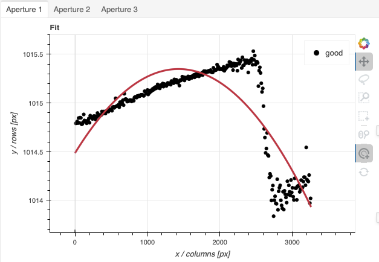
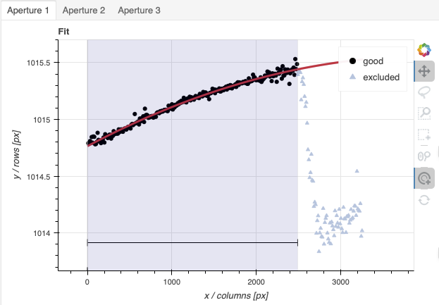
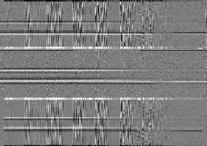
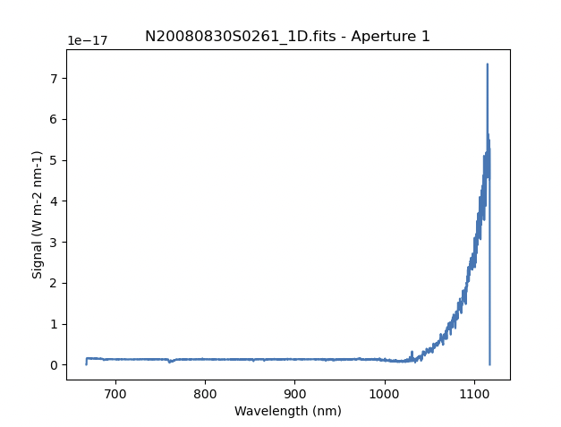

.. ex4_gmosls_nsred_cmdline.rst

.. _nsred_cmdline:

*************************************************************************************
Example 4 - Nod-and-Shuffle Correct for Extra Order - Using the "reduce" command line
*************************************************************************************

In this example we will reduce a GMOS longslit nod-and-shuffle observation of
a high redshift quasar.  The particularity here is that the setting is quite
red and the second order shows up in the spectrum. The configuration uses the
OG515 blocking filter and the second order light appears at 1030nm. We will
show how to recognize the effect and then how to not include the light from
that extra order using the interactive tools.

This observation dithers along the dispersion axis.

The dataset
===========
If you have not already, download and unpack the tutorial's data package.
Refer to :ref:`datasetup` for the links and simple instructions.

The dataset specific to this example is described in:

    :ref:`nsred_dataset`.

Here is a copy of the table for quick reference.

+---------------------+--------------------------------------------+
| Science             || N20080830S0261 (900 nm)                   |
|                     || N20080830S0262 (890 nm)                   |
|                     || N20080830S0265 (880 nm)                   |
+---------------------+--------------------------------------------+
| Science biases      || N20080830S0527-531                        |
+---------------------+--------------------------------------------+
| Science flats       || N20080830S0260 (900 nm)                   |
|                     || N20080830S0263 (890 nm)                   |
|                     || N20080830S0264 (880 nm)                   |
+---------------------+--------------------------------------------+
| Science arcs        || N20080830S0491 (900 nm)                   |
|                     || N20080830S0492 (890 nm)                   |
|                     || N20080830S0493 (880 nm)                   |
+---------------------+--------------------------------------------+
| Standard (G191B2B)  || N20190902S0046 (900 nm)                   |
+---------------------+--------------------------------------------+
| Standard biases     || N20081011S0313-317                        |
+---------------------+--------------------------------------------+
| Standard flats      || N20081010S0534 (900 nm)                   |
+---------------------+--------------------------------------------+
| Standard arc        || N20081010S0552 (900 nm)                   |
+---------------------+--------------------------------------------+
| BPM                 || bpm_20010801_gmos-n_EEV_22_full_3amp.fits |
+---------------------+--------------------------------------------+

Configuring the interactive interface
=====================================
In ``~/.dragons/``, add the following to the configuration file ``dragonsrc``::

    [interactive]
    browser = your_preferred_browser

The ``[interactive]`` section defines your preferred browser.  DRAGONS will open
the interactive tools using that browser.  The allowed strings are "safari",
"chrome", and "firefox".

Set up the Local Calibration Manager
====================================

.. important::  Remember to set up the calibration service.

    Instructions to configure and use the calibration service are found in
    :ref:`cal_service`, specifically the these sections:
    :ref:`cal_service_config` and :ref:`cal_service_cmdline`.

Create file lists
=================

This data set contains science and calibration frames. For some programs, it
could contain different observed targets and different exposure times depending
on how you like to organize your raw data.

The DRAGONS data reduction pipeline does not organize the data for you.  You
have to do it.  However, DRAGONS provides tools to help you with that.

The first step is to create input file lists.  The tool "|dataselect|" helps
with that.  It uses Astrodata tags and "|descriptors|" to select the files and
send the filenames to a text file that can then be fed to "|reduce|".  (See the
|astrodatauser| for information about Astrodata.)

First, navigate to the ``playground`` directory in the unpacked data package::

    cd <path>/gmosls_tutorial/playground

Two lists for the biases
------------------------
The science observations and the spectrophotometric standard observations were
obtained using different regions-of-interest (ROI).  So we will need two master
biases, one "Full Frame" for the science and one "Central Spectrum" for the
standard.

We can use |dataselect| to select biases for each ROIs.

Given the data that we have in the ``playdata`` directory, we can create
our GMOS-N bias list using the tags and an expression that uses the ROI
settings. Remember, this will always depend on what you have in your raw data
directory.  For easier selection criteria, you might want to keep raw data
from different programs in different directories.

Let's see which biases we have for in our raw data directory.

::

    dataselect ../playdata/example4/*.fits --tags BIAS | showd -d detector_roi_setting

    ---------------------------------------------------------------
    filename                                   detector_roi_setting
    ---------------------------------------------------------------
    ../playdata/example4/N20080830S0527.fits             Full Frame
    ../playdata/example4/N20080830S0528.fits             Full Frame
    ../playdata/example4/N20080830S0529.fits             Full Frame
    ../playdata/example4/N20080830S0530.fits             Full Frame
    ../playdata/example4/N20080830S0531.fits             Full Frame
    ../playdata/example4/N20081011S0313.fits       Central Spectrum
    ../playdata/example4/N20081011S0314.fits       Central Spectrum
    ../playdata/example4/N20081011S0315.fits       Central Spectrum
    ../playdata/example4/N20081011S0316.fits       Central Spectrum
    ../playdata/example4/N20081011S0317.fits       Central Spectrum

We can see the two groups that differ on their ROI.  We can use that as a
search criterion for creating the list with |dataselect|

::

    dataselect ../playdata/example4/*.fits --tags BIAS --expr='detector_roi_setting=="Central Spectrum"' -o biasesstd.lis
    dataselect ../playdata/example4/*.fits --tags BIAS --expr='detector_roi_setting=="Full Frame"' -o biasessci.lis

A list for the darks
--------------------
Nod-and-shuffle darks are required for the reduction of nod-and-shuffle
observations obtained with the EEV CCDs (this case) and the ee2vv CCDs.

::

    dataselect ../playdata/example4/*.fits --tags DARK -o darks.lis

A list for the flats
--------------------
The GMOS longslit flats are not normally stacked.   The default recipe does
not stack the flats.  This allows us to use only one list of the flats.  Each
will be reduced individually, never interacting with the others.

The flats used for nod-and-shuffle are normal flats.  The DRAGONS recipe will
"double" the flat and apply it to each beam.

::

    dataselect ../playdata/example4/*.fits --tags FLAT -o flats.lis

A list for the arcs
-------------------
The GMOS longslit arcs are not normally stacked.  The default recipe does
not stack the arcs.  This allows us to use only one list of arcs.  Each will be
reduced individually, never interacting with the others.

The arcs normally share the ``program_id`` with the science observations, if
you find that you need more accurate sorting.  We do not need it here.

::

    dataselect ../playdata/example4/*.fits --tags ARC -o arcs.lis

A list for the spectrophotometric standard star
-----------------------------------------------
If a spectrophotometric standard is recognized as such by DRAGONS, it will
receive the Astrodata tag ``STANDARD``.  All spectrophotometric standards
normally used at Gemini are in the DRAGONS list of recognized standards.

::

    dataselect ../playdata/example4/*.fits --tags STANDARD -o std.lis

A list for the science observations
-----------------------------------

The science observations are what is left, that is anything that is not a
calibration. Calibrations are assigned the astrodata tag ``CAL``, therefore
we can select against that tag to get the science observations.

If we had multiple targets, we would need to split them into separate list. To
inspect what we have we can use |dataselect| and |showd| together.

::

    dataselect ../playdata/example4/*.fits --xtags CAL | showd -d object

    -------------------------------------------------------
    filename                                         object
    -------------------------------------------------------
    ../playdata/example4/N20080830S0261.fits   433819088548
    ../playdata/example4/N20080830S0262.fits   433819088548
    ../playdata/example4/N20080830S0265.fits   433819088548

Here we only have one object from the same sequence.  We would not need any
expression, just excluding calibrations is sufficient.

::

    dataselect ../playdata/example4/*.fits --xtags CAL -o sci.lis

Bad Pixel Mask
==============
Starting with DRAGONS v3.1, the bad pixel masks (BPMs) are now handled as
calibrations.  They are downloadable from the archive instead of being
packaged with the software. They are automatically associated like any other
calibrations.  This means that the user now must download the BPMs along with
the other calibrations and add the BPMs to the local calibration manager.

See :ref:`getBPM` in :ref:`tips_and_tricks` to learn about the various ways
to get the BPMs from the archive.

To add the static BPM included in the data package to the local calibration
database:

::

    caldb add ../playdata/example4/bpm*.fits

Master Bias
===========
We create the master biases with the "|reduce|" command.  Because the database
was given the "store" option in the ``dragonsrc`` file, the processed biases
will be automatically added
to the database at the end of the recipe.

::

    reduce @biasesstd.lis
    reduce @biasessci.lis

The master biases are ``N20081011S0313_bias.fits`` and
``N20080830S0527_bias.fits``; this information is in both the terminal log
and the log file.  The ``@`` character before the name of the input file is
the "at-file" syntax. More details can be found in the |atfile| documentation.

.. note:: The file name of the output processed bias is the file name of the
    first file in the list with ``_bias`` appended as a suffix.  This the
    general naming scheme used by "|reduce|".

.. note:: If you wish to inspect the processed calibrations before adding them
    to the calibration database, remove the "store" option attached to the
    database in the ``dragonsrc`` configuration file.  You will then have to
    add the calibrations manually following your inspection, eg.

    ``caldb add *_bias.fits``

Master Nod-and-Shuffle Dark
===========================
The nod-and-shuffle darks normally reproduced the same number of charge
shuffling as was done for the science data observation.  They are done during
the day, when daytime work allows, or at night when the weather is bad. This
set was obtained 2 months after the science data.

The darks are stacked together.  Here we use the same bias as for the science
observation to minimize the amount of data required to download for this
tutorial.  For a science reduction, it might beneficial to use biases that
are contemporary to the darks (ie. from around 2008-10-26).

::

    reduce @darks.lis

Master Flat Field
=================
GMOS longslit flat field are normally obtained at night along with the
observation sequence to match the telescope and instrument flexure.  The
matching flat nearest in time to the target observation is used to flat field
the target.  The central wavelength, filter, grating, binning, gain, and
read speed must match.

Because of the flexure, GMOS longslit flat field are not stacked.  Each is
reduced and used individually.  The default recipe takes that into account.

We can send all the flats, regardless of characteristics, to |reduce| and each
will be reduce individually.  When a calibration is needed, in this case, a
master bias, the best match will be obtained automatically from the local
calibration manager.

::

    reduce @flats.lis

Processed Arc - Wavelength Solution
===================================
GMOS longslit arc can be obtained at night with the observation sequence,
if requested by the program, but are often obtained at the end of the night
or the following afternoon instead. In this example, the arcs have been
obtained in the morning. Like the spectroscopic flats,
they are not stacked which means that they can be sent to reduce all together
and will be reduced individually.

The wavelength solution is automatically calculated and the algorithm has
been found to be quite reliable.  There might be cases where it fails;
inspect the ``*_wavelengthSolutionDetermined.pdf`` plot and the RMS of
``determineWavelengthSolution`` in the logs to confirm a good solution.

::

    reduce @arcs.lis

.. _ex4_gmosls_nsred_cmdline_sensfunc:

Processed Standard - Sensitivity Function
=========================================
The GMOS longslit spectrophotometric standards are normally taken when there
is a hole in the queue schedule, often when the weather is not good enough
for science observations.  One standard per configuration, per program is
the norm.  If you dither along the dispersion axis, most likely only one
of the positions will have been used for the spectrophotometric standard.
This is normal for baseline calibrations at Gemini.  The standard is used
to calculate the sensitivity function.  It has been shown that a difference of
10 or so nanometers in central wavelength setting does not significantly impact
the spectrophotometric calibration.

The reduction of the standard will be using a BPM, a master bias, a master flat,
and a processed arc.  If those have been added to the local calibration
manager, they will be picked up automatically.  The output of the reduction
includes the sensitivity function and will be added to the calibration
database automatically if the "store" option is set in the ``dragonsrc``
configuration file.

::

    reduce @std.lis -p traceApertures:interactive=True calculateSensitivity:interactive=True

The interactive tools are introduced in a later chapter: :ref:`interactive`.
Here we will focus on two of them, the one for the trace and the one for the
calculation of the sensitivity function.

In both cases, we will adjust the *region* to use for the fits.  This is done
by point the cursor on one edge of the region, typing "r", moving the cursor
to the other edge, and typing "r" again.   To adjust the edge of an existing
region, use "e" and the cursor, and "e" again to confirm the adjustment.
See the summary of keyboard shortcuts at the bottom right of the tool, in
gray font.

It is also possible to set regions using the "Regions" textbox below the
plots.

**traceApertures**

Here are the before and after fits.  The x-axis is in pixels with the red-end
to the left, the blue-end to the right.  You can see the sharp discontinuity
around pixel 1000.  The points to left of the discontinuity are from the
second order.  The flux from the first order (right of discontinuity) fades
away, and the second order takes over.

We want the trace to follow the first order light only.  The region in gray
is what we need to define.  Using just those points, the trace matches the
first order light much better.

**calculateSensitivity**

Again, here are the before and after fits.  The x-axis this time is in
wavelength with the blue-end to the left and the red-end to the right.  The
fits is good within the region that covers the first order.  But there is
some flaring at both ends with some on the red side due to our previous cut
not being aggressive enough.

Like we did for the trace, we can define a region to use for the fit, this
is the gray area on the "after" plot.  Another thing that was adjusted is
the order of the fit.  The default is set to 6, and to avoid flaring on the
blue-end, we can reduce the order to 4 to have the smooth function shown here.

Science Observations
====================
The science target is a high redshift quasar.  The sequence has three images
that were dithered along the dispersion axis.  DRAGONS will
remove the sky from the three images using the nod-and-shuffle beams.  The
resulting 2D spectra will then be register and stacked before extraction.

This is what one raw image looks like.

With the master bias, the master flat, the processed arcs (one for each of the
grating position, aka central wavelength), and the processed standard in the
local calibration manager, one only needs to do as follows to reduce the
science observations and extract the 1-D spectrum.

::

    reduce @sci.lis -p traceApertures:interactive=True

**traceApertures**

Below are the before and after adjustments plots.  The x-axis is in pixel
like before for the spectrophotometric standard but this time, the data has
been resampled (for the stacking) before ``traceApertures`` is called.
Because of that, blue is left and red is right.

A sharp discontinuity is visible where the first order fades away and the second order
starts showing up, around pixel 2600.  We set the region to use
only the first order light, the points left of the discontinuity.

This time however note that there are three apertures.  You can see a tab
for each one in the upper part of the plot.  If you were not interested in
the other, fainter sources, you could ignore them.  But if the fainter
sources were of interest, you would want to apply the same region to Aperture
2 and 3.  The easiest way to do that is to set the region for Aperture 1, and
then go to the "Regions" box at the bottom, copy the region, and then paste
that region definition in the "Regions" box in the other two tabs.

When done, click the green Accept button and the reduction will complete.

The product includes a 2-D spectrum (``N20080830S0261_2D.fits``) which has been
bias corrected, flat fielded, QE-corrected, wavelength-calibrated, corrected for
distortion, sky-subtracted, the beams combined, and then all frames stacked.
It also produces the 1-D spectrum (``N20080830S0261_1D.fits``) extracted
from that 2-D spectrum.  The 1-D spectrum is flux calibrated with the
sensitivity function from the spectrophotometric standard. The 1-D spectra
are stored as 1-D FITS images in extensions of the output Multi-Extension
FITS file.

This is what the 2-D spectrum looks like.  Only the middle section is valid.

::

    reduce -r display N20080830S0261_2D.fits

.. note::

    ``ds9`` must be launched by the user ahead of running the display primitive.
    (``ds9&`` on the terminal prompt.)

The apertures found are listed in the log for the ``findApertures`` primitive,
just before the call to ``traceApertures``.  Information about the apertures
are also available in the header of each extracted spectrum: ``XTRACTED``,
``XTRACTLO``, ``XTRACTHI``, for aperture center, lower limit, and upper limit,
respectively.

This is what the 1-D flux-calibrated spectrum of our sole target looks like.

::

    dgsplot N20080830S0261_1D.fits 1

The entire spectrum is plotted including the part redder of the discontinuity
where there is no light at all from the first order.  What is there is
whatever got caught in the extraction that followed the extrapolated trace.

The scaling of the plot is obviously wrong, but we can use the matplotlib
interactive zooming feature to focus on the spectrum from the first order.
That is shown in the plot on the right.

.. image:: _graphics/1Dspectrum_nsred.png
   :width: 325
   :alt: 1D spectrum

Note the flaring bluer of 700nm.  This is because the spectrophotometric
standard was observed with a central wavelength of 900nm and it is unable
to constrain the sensitivity bluer of ~700nm.  This can be seen in the
plots of the interactive ``calculateSensitivity``, the bluer point is at 690nm.
(:ref:`ex4_gmosls_nsred_cmdline_sensfunc`) We have a science spectrum bluer of 690nm because of the other two central
wavelength settings of 890nm and 880nm.  Observing the standard with a
central wavelength of 880nm would have help reduce, possible avoid entirely.
