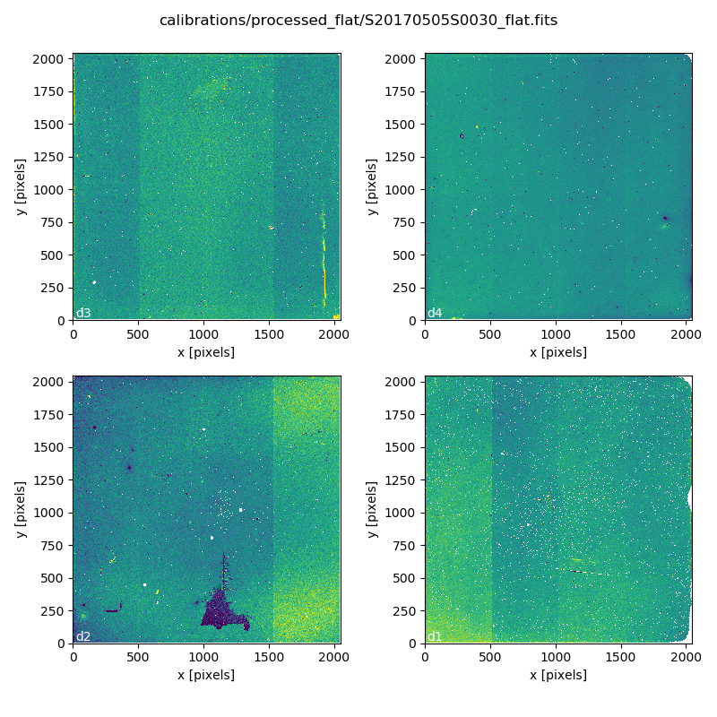
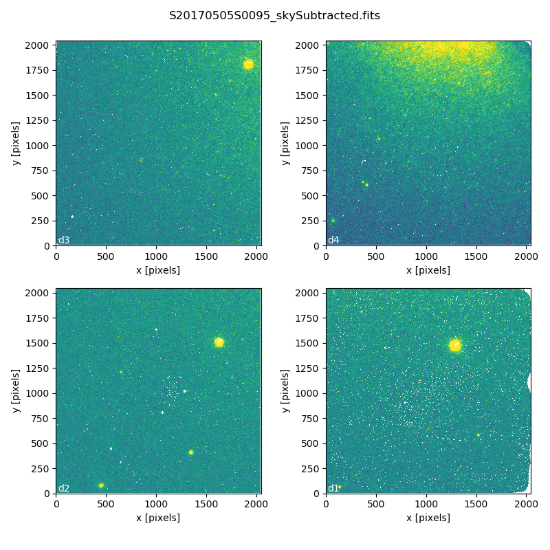
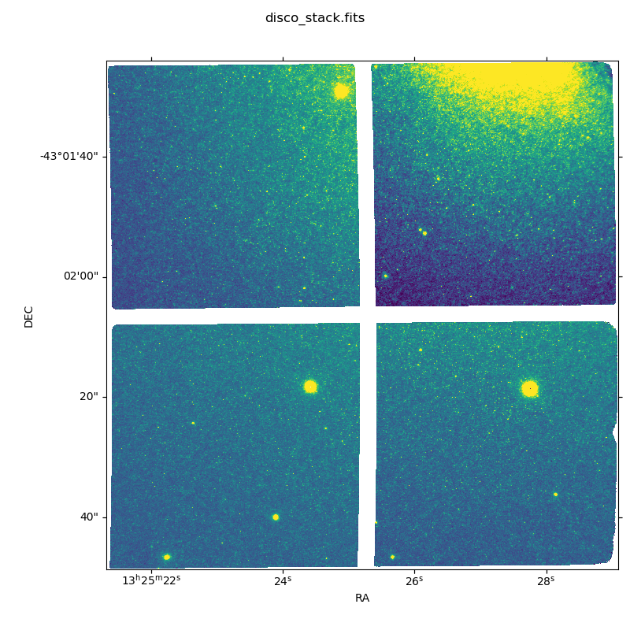
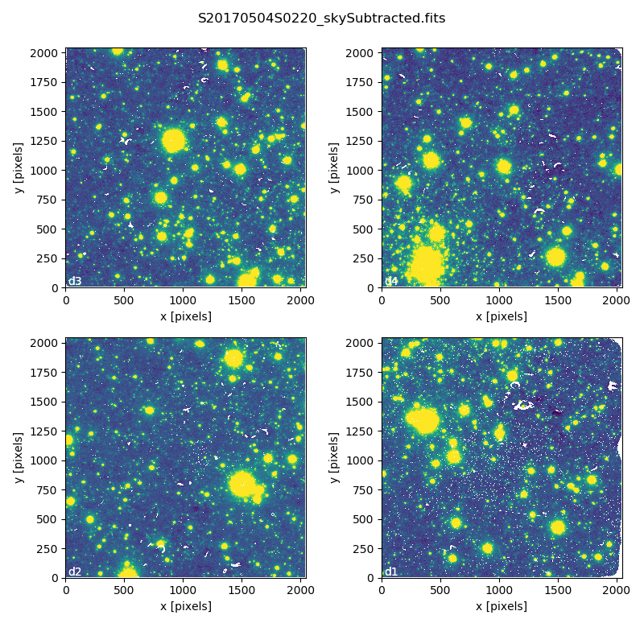
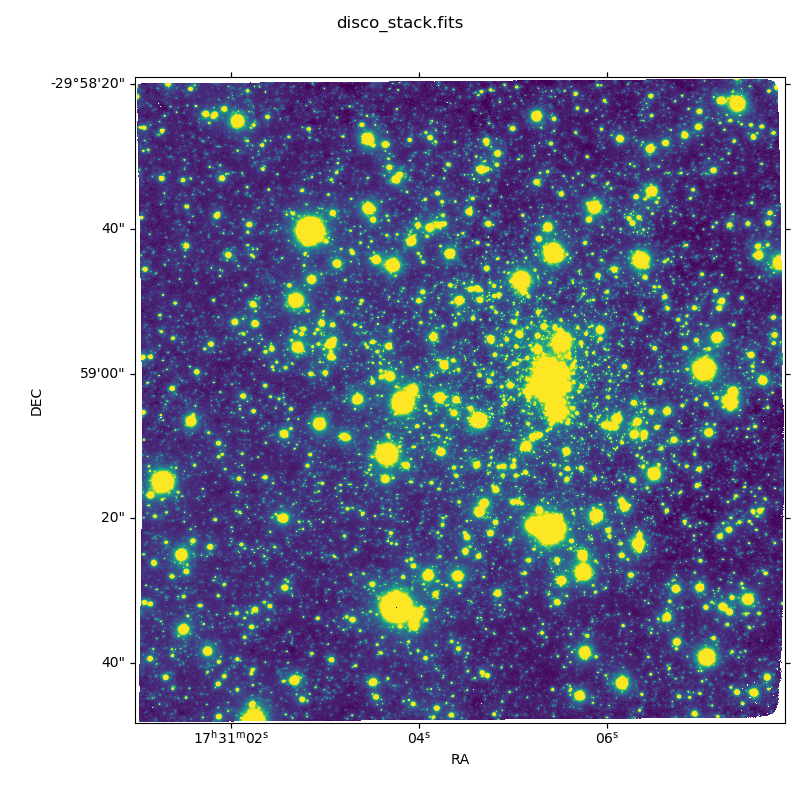

.. 02_data_reduction.rst

.. _caldb: https://dragons-recipe-system-users-manual.readthedocs.io/en/latest/supptools.html#caldb

.. _dataselect: https://dragons-recipe-system-users-manual.readthedocs.io/en/latest/supptools.html#dataselect

.. _reduce: https://dragons-recipe-system-users-manual.readthedocs.io/en/latest/supptools.html#typewalk

.. _showd: https://dragons-recipe-system-users-manual.readthedocs.io/en/latest/supptools.html#showd

.. _show_primitives: https://dragons-recipe-system-users-manual.readthedocs.io/en/latest/supptools.html#show-primitives

.. _show_recipes: https://dragons-recipe-system-users-manual.readthedocs.io/en/latest/supptools.html#show-recipes

.. _showpars: https://dragons-recipe-system-users-manual.readthedocs.io/en/latest/supptools.html#showpars

.. _typewalk: https://dragons-recipe-system-users-manual.readthedocs.io/en/latest/supptools.html#typewalk

.. |github| image:: /_static/img/GitHub-Mark-32px.png
    :scale: 75%

.. _command_line_data_reduction:

Data Reduction
**************

DRAGONS installation comes with a set of handful scripts that are used to
reduce astronomical data. One of the most important scripts is called
reduce_, which is extensively explained in the `Recipe System Users Manual
<https://dragons-recipe-system-users-manual.readthedocs.io/en/latest/index.html>`_.
For this tutorial, we will be also using other `Supplemental tools
<https://dragons-recipe-system-users-manual.readthedocs.io/en/latest/supptools.html>`_,
like dataselect_, showd_, typewalk_, and caldb_.

.. warning:: Some primitives use a lot of RAM memory and they can make `reduce`
    crash. Our team is aware of this problem and we are working on that. For
    now, if that happens to you, you might need to run the pipeline on a
    smaller data set.

.. _organize_files:

Organize files
--------------

First of all, let us consider that we have put all the files in the same folder
called ``raw`` and that we do not have any information anymore. From a bash
terminal and from within the Conda Virtual Environment where DRAGONS was
installed, we can call the command tool typewalk_: ::

    $ typewalk

    directory:  <path_to_my>/playground/raw
         S20060624S0065.fits ............... (AZEL_TARGET) (BIAS) (CAL) (GEMINI) (GMOS) (NON_SIDEREAL) (RAW) (SOUTH) (UNPREPARED)
         S20060624S0066.fits ............... (AZEL_TARGET) (BIAS) (CAL) (GEMINI) (GMOS) (NON_SIDEREAL) (RAW) (SOUTH) (UNPREPARED)
         S20060624S0067.fits ............... (AZEL_TARGET) (BIAS) (CAL) (GEMINI) (GMOS) (NON_SIDEREAL) (RAW) (SOUTH) (UNPREPARED)
         ...
         S20060818S0188.fits ............... (CAL) (FLAT) (GEMINI) (GMOS) (IMAGE) (RAW) (SIDEREAL) (SOUTH) (TWILIGHT) (UNPREPARED)
         S20060818S0189.fits ............... (CAL) (FLAT) (GEMINI) (GMOS) (IMAGE) (RAW) (SIDEREAL) (SOUTH) (TWILIGHT) (UNPREPARED)
         S20060818S0190.fits ............... (CAL) (FLAT) (GEMINI) (GMOS) (IMAGE) (RAW) (SIDEREAL) (SOUTH) (TWILIGHT) (UNPREPARED)
         ...
         S20060910S0007.fits ............... (GEMINI) (GMOS) (IMAGE) (RAW) (SIDEREAL) (SOUTH) (UNPREPARED)
         S20060910S0008.fits ............... (GEMINI) (GMOS) (IMAGE) (RAW) (SIDEREAL) (SOUTH) (UNPREPARED)
         S20060910S0009.fits ............... (GEMINI) (GMOS) (IMAGE) (RAW) (SIDEREAL) (SOUTH) (UNPREPARED)
         ...

This command will open every FITS file within the current folder (recursively)
and will print a table with the file names and the associated tags. For example,
calibration files will always have the ``CAL`` tag. Flat images will always have
the ``FLAT`` tag. Bias files will have the ``BIAS`` tag. This means that we
can start getting to know a bit more about our data set just by looking the
tags. The output above was trimmed to keep this document short.

.. _create_file_lists:

Create File lists
-----------------

This data set now contains science and calibration frames. It contains
data and calibrations obtained on different dates and have exposure times. The
current data reduction pipeline does not organize the data.

That means that we first need to identify these files and create lists that will
be used in the data-reduction process. For that, we will use the dataselect_
command line. Please, refer to the `dataselect page <dataselect>`_ for details
regarding its usage. Let us start with the BIAS files::

    $ dataselect --tags BIAS raw/*.fits
    raw/S20060624S0065.fits
    raw/S20060624S0066.fits
    raw/S20060624S0067.fits
    ...
    raw/S20060906S0056.fits
    raw/S20060906S0057.fits
    raw/S20060906S0058.fits
    ...
    raw/S20070308S0276.fits
    raw/S20070308S0277.fits
    raw/S20070308S0278.fits

Again, the output was trimmed. The files names tell us that these data were
obtained on different days. Let us use the `showd`_ command to check if we have
more than one configuration::

    $ dataselect --tags BIAS raw/*.fits | showd -d detector_name

    filename:   detector_name
    ------------------------------
    S20060624S0065.fits: EEV2037-06-03EEV8194-19-04EEV8261-07-04
    S20060624S0066.fits: EEV2037-06-03EEV8194-19-04EEV8261-07-04
    S20060624S0067.fits: EEV2037-06-03EEV8194-19-04EEV8261-07-04
    ...
    S20070308S0277.fits: 2
    S20070308S0278.fits: 2

The "pipe" (``|``) gets the output from `dataselect`_ and passes it to `showd`_.
That shows us that all the files were obtained with the same detector. What
about binning? ::

    $ dataselect --tags BIAS raw/*.fits | showd -d detector_x_bin,detector_y_bin

    filename:   detector_x_bin   detector_y_bin
    ------------------------------
    S20060624S0065.fits: 2 2
    S20060624S0066.fits: 2 2
    S20060624S0067.fits: 2 2
    ...
    S20070308S0277.fits: 2 2
    S20070308S0278.fits: 2 2

All the files have the same binning.

    $ dataselect --tags BIAS raw/*.fits > list_of_bias.txt

Here, the ``>`` symbol gets the dataselect_ output and stores it within the
``list_of_darks.txt`` file. If you want to see the output, simply omit it and
everything after it.

Now we can do the same with the FLAT files, separating them by filter: ::

    $ dataselect --tags FLAT --expr 'filter_name=="Kshort"' raw/*.fits > \
         list_of_Kshort_flats.txt

    $ dataselect --tags FLAT --expr 'filter_name=="H"' raw/*.fits > \
         list_of_H_flats.txt

Recall that the ``\`` (back-slash) is used simply to break the long line .

You can select the standard start with the following command: ::

    $ dataselect --expr 'observation_class=="partnerCal"' raw/*.fits
    raw/S20170504S0114.fits
    raw/S20170504S0115.fits
    raw/S20170504S0116.fits
    raw/S20170504S0117.fits

Here we have only four files. But the problem is that you may have more than one
standard star in your data set. We can verify that by passing the dataselect_
output to the showd_ command line using "pipe" (``|``): ::

    $ dataselect --expr 'observation_class=="partnerCal"' raw/*.fits | showd -d object

    filename:   object
    ------------------------------
    S20170504S0114.fits: 9132
    S20170504S0115.fits: 9132
    S20170504S0116.fits: 9132
    S20170504S0117.fits: 9132

The ``-d`` flag tells showd_ which descriptor will be printed for each input
file. As you can see, it was not our case. If you see more than one object, you
can create a list for each standard star using the ``object`` descriptor
as an argument for dataselect_ (spaces are allowed if you use double quotes): ::

   $ dataselect --expr 'object=="9132"' raw/*.fits > list_of_std_9132.txt

The rest is the data with your science target. Before we create a new list, let
us check if we have more than one target and more than one exposure time: ::

   $ dataselect --expr 'observation_class=="science"' raw/*.fits | showd -d object

   filename:   object
   ------------------------------
   S20170505S0095.fits: NGC5128
   S20170505S0096.fits: NGC5128
   ...
   S20170505S0109.fits: NGC5128
   S20170505S0110.fits: NGC5128

We have only one target. Now let us check the exposure time: ::

   $ dataselect --expr 'observation_class=="science"' raw/*.fits | showd -d exposure_time

   filename:   exposure_time
   ------------------------------
   S20170505S0095.fits: 60.0
   S20170505S0096.fits: 60.0
   ...
   S20170505S0109.fits: 60.0
   S20170505S0110.fits: 60.0

Again, only one exposure time. Just to show the example, let us consider that
we want to filter all the files whose ``object`` is NGC5128 and that the
``exposure_time`` is 60 seconds. We also want to pass the output to a new list: ::

   $ dataselect --expr '(observation_class=="science" and exposure_time==60.)' raw/*.fits > \
      list_of_science_files.txt

.. _process_dark_files:

Process DARK files
------------------

Accordingly to the `Calibration webpage for GSAOI
<https://www.gemini.edu/sciops/instruments/gsaoi/calibrations>`_,
**DARK subtraction is not necessary** since the dark noise level is too low. DARK
files are only used to generate Bad Pixel Masks (BPM).

If, for any reason, you believe that you really need to have a master DARK file,
you can create it using the command below: ::

   $ reduce @list_of_darks.txt

Note that ``reduce`` will no separate DARKS with different exposure times. You
will have to create a new list for each exposure time, if that is the case.

Master DARK files can be added to the local database using the caldb_
command. Before you run it, make sure you have `configured and initialized your
caldb <caldb>`_. Once you are set, add the Master Dark to the local database using
the following command: ::

   $ caldb add ./calibrations/processed_dark/S20150609S0022_dark.fits

Note that the name of the master dark file can be different for you.

.. _create_bpm_files:

Create BPM files
----------------

The Bad Pixel Mask (BPM) files can be created using a set of FLAT images and a
set of DARK files. The FLATs must be obtained in the H band with a number of
counts around 20000 adu and no saturated pixels, usually achieved with 7 seconds
exposure time. The :ref:`download_sample_files` section contains a sample of the
files to be used in this tutorial. If you need to download files for your own
data set, use the `Gemini Archive Search Form <https://archive.gemini.edu/searchform>`_
to look for matching data.

The BPM file can be created using the ``makeProcessedBPM`` recipe available
via ``reduce`` command line: ::

   $ reduce -r makeProcessedBPM @list_of_H_flats.txt @list_of_darks.txt

The ``-r`` argument tells ``reduce`` which recipe you want to use to replace
the default recipe. This recipe will create a new file that contains the
Bad Pixel Mask (see the `AstroData User's Manual
<https://astrodata-user-manual.readthedocs.io/en/latest/data.html#data-quality-plane>`_
for more details) into a FITS file with the ``_bpm`` suffix. In this example,
the created file is called ``./S20171208S0053_bpm.fits``.

.. _process_flat_files:

Process FLAT files
------------------

FLAT images can be easily reduced using the ``reduce`` command line: ::

   $ reduce @list_of_Kshort_flats.txt

If we want ``reduce`` to use the BPM file, we need to add ``-p
addDQ:user_bpm="S20131129S0320_bpm.fits"`` to the command line: ::

   $ reduce @list_of_Kshort_flats.txt -p addDQ:user_bpm="S20171208S0053_bpm.fits"

.. note::

   Here we used the "S20171208S0053_bpm.fits" as a BPM file. It is very unlikely
   that your BPM file has the same name. Make sure you use the correct file name.
   Processed BPM files will have the "_bpm.fits" sufix.

Once you finish, you will have the master flat file copied in two places: inside
the same folder where you ran ``reduce`` and inside the
``calibrations/processed_flats/`` folder. Here is an example of a master flat:

   Master Flat - K-Short Band

Note that this figure shows the masked pixels in white color but not all the
detector features are masked. For example, the "Christmas Tree" on the detector
2 can be easily noticed but was not masked.

Once you are done, add the Master Flat to the local database using caldb_: ::

   $ caldb add ./calibrations/processed_flat/S20170505S0030_flat.fits

If you do so, ``reduce`` will "see" this calibration file when performing
the data reduction of our science files.

.. _processing_science_files:

Process Science files
---------------------

Once we have our calibration files processed and added to the database, we can
run ``reduce`` on our science data: ::

   $ reduce @list_of_science_files.txt

This command will generate flat corrected and sky subtracted files but will
not stack them. You can find which file is which by its suffix
(``_flatCorrected`` or ``_skySubtracted``).

   S20170505S0095 - Flat corrected and sky subtracted

The figure above shows an example of a sparse field already reduced. The
masked pixels are represented in white color.

The sky subtraction works in the same as any other IR instrument. It uses the
positional offsets to work out whether the images all overlap or not. The image
with the smallest offsets is assumed to contain the science target. If some
images are clearly in a different position, these are assumed to be sky frames
and only these are stacked to construct sky frames to be subtracted from the
science images. If all the images overlap, then all frames can be used to make
skies provided they're more than a certain distance (a couple of arcseconds)
from the science frame (to avoid objects falling on top of each other and
cancelling out).

Stack Science reduced images
----------------------------

Finally, you will have to stack your images. For that, you must be aware that
GSAOI images are highly distorted and that this distortion must be corrected
before stacking. At this moment, the standard tool for distortion correction
and image stacking is called `disco-stu`. This package can be found in the
link bellow:

  |github|  `See disco-stu on GitHub <https://github.com/GeminiDRSoftware/disco-stu/releases/latest>`_

Check this page for requirements and instruction on installing the package.

Once you are all set, you can simply run ``disco`` on the Sky Subtracted
files: ::

   $ disco *_skySubtracted.fits

By default, ``disco`` will write the output file as ``disco_stack.fits``. If you
want to change the name of the output file during execution, run the following
command instead: ::

   $ disco *_skySubtracted.fits -o my_final_image.fits

The final image is shown below.

   Sky Subtracted and Stacked Final Image

This operation in known to have great impact on some science cases. For example,
check the two images below. The first one is a single frame of the globular
cluster "HP I", observed for the program GS-2017A-Q-44 and published in
`Kerber et. al. (2019) <https://ui.adsabs.harvard.edu/#abs/2019MNRAS.484.5530K/abstract>`_.
The second image, is the same object after aligning and stacking all the images
using ``disco_stu`` as described above.

   HP 1 - Single Frame

   HP 1 - Stacked Image

Note that although the sky subtraction adds several masked regions in the most
dense part of the field, the staked image corrects that and complete the full
frame which, now, can be use for science.

Advanced Operations
-------------------

It is also important to remember that ``reduce`` is basically a recipe with
a sequence of operations, called Primitives, and that each Primitive require
a set of parameters. When we run ``reduce`` without any extra flag, it will
run all the Primitives in our recipe using the default values. Depending on
your data/science case, you may have to try to change the parameters of one or
more Primitives.

First, you need to know what are the recipes available for a given files, then
you need to get what are Primitives living within that recipe. Finally, you need
a list of parameters that can be modified.

.. todo show_recipes

The show_recipes_ command line takes care of the first step. Here is an
example::

    $ show_recipes raw/S20170505S0073.fits

     DRAGONS v2.1.x - show_recipes
     Input file: ./raw/S20170505S0073.fits
     Input tags: (AT_ZENITH) (AZEL_TARGET) (CAL) (DARK) (GEMINI) (GSAOI)
                 (NON_SIDEREAL) (RAW) (SOUTH) (UNPREPARED)
     Recipes available for the input file:
       geminidr.gsaoi.recipes.qa.recipes_FLAT_IMAGE::makeProcessedFlat
       geminidr.gsaoi.recipes.sq.recipes_FLAT_IMAGE::makeProcessedFlat
       geminidr.gsaoi.recipes.sq.recipes_FLAT_IMAGE::makeProcessedBPM

The output tells me that I have two recipes for the SQ (Science Quality) mode
and one recipe for the QA (Quality Assesment) mode. By default, ``reduce`` uses
the SQ mode for processing the data.

.. todo show_primitives

The show_primitives_ command line displays what are the Primitives that
were used within a particular Recipe: ::

    $ show_primitives raw/S20170505S0073.fits --mode sq --recipe makeProcessedBPM

    DRAGONS v2.1.x - show_recipes
    Input file: ./raw/S20170505S0073.fits
    Input mode: sq
    Input recipe: makeProcessedBPM
    Matched recipe: geminidr.gsaoi.recipes.sq.recipes_FLAT_IMAGE::makeProcessedBPM
    Primitives used:
      p.prepare()
      p.addDQ()
      p.addVAR(read_noise=True, poisson_noise=True)
      p.ADUToElectrons()
      p.selectFromInputs(tags="DARK", outstream="darks")
      p.selectFromInputs(tags="FLAT")
      p.stackFrames(stream="darks")
      p.makeLampFlat()
      p.normalizeFlat()
      p.makeBPM()

.. todo showpars

Now you can get the list of parameters for a given Primitive using the
showpars_ command line. Here is an example: ::

    $ showpars raw/S20170505S0073.fits makeLampFlat
    Dataset tagged as {'FLAT', 'SOUTH', 'RAW', 'GEMINI', 'DOMEFLAT', 'CAL', 'AZEL_TARGET', 'GSAOI', 'NON_SIDEREAL', 'LAMPOFF', 'IMAGE', 'UNPREPARED'}
    Settable parameters on 'makeLampFlat':
    ========================================
     Name			Current setting

    suffix               '_stack'             Filename suffix
    apply_dq             True                 Use DQ to mask bad pixels?
    statsec              None                 Section for statistics
    operation            'mean'               Averaging operation
    Allowed values:
        mean	arithmetic mean
        wtmean	variance-weighted mean
        median	median
        lmedian	low-median

    reject_method        'sigclip'            Pixel rejection method
    Allowed values:
        none	no rejection
        minmax	reject highest and lowest pixels
        sigclip	reject pixels based on scatter
        varclip	reject pixels based on variance array

    hsigma               3.0                  High rejection threshold (sigma)
        Valid Range = [0,inf)
    lsigma               3.0                  Low rejection threshold (sigma)
        Valid Range = [0,inf)
    mclip                True                 Use median for sigma-clipping?
    max_iters            None                 Maximum number of clipping iterations
        Valid Range = [1,inf)
    nlow                 0                    Number of low pixels to reject
        Valid Range = [0,inf)
    nhigh                0                    Number of high pixels to reject
        Valid Range = [0,inf)
    memory               None                 Memory available for stacking (GB)
        Valid Range = [0.1,inf)

Now that we know what are is the recipe being used, what are the Primitives
it calls and what are the parameters that are set, we can finally change the
default values using the ``-p`` flag. We actually did this earlier in this
tutorial when we called::

   $ reduce @list_of_Kshort_flats.txt -p addDQ:user_bpm="S20171208S0053_bpm.fits"

for example. But now you know that ``-p`` is telling ``reduce`` that the
``addDQ`` primitive should use a different value for the ``user_bpm`` parameter.
Since we did not say anything about the mode or the recipe, it is using the
default values.
