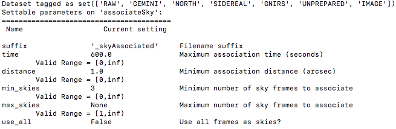
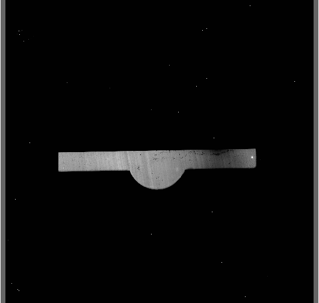

.. ex1_gnirsim_twostars_api.rst

.. _twostars_api:

********************************************************************************
Example 1 - Keyhole imaging of two stars with dithers - Using the "Reduce" class
********************************************************************************

A reduction can be initiated from the command line as shown in
:ref:`twostars_cmdline` and it can also be done programmatically as we will
show here.  The classes and modules of the RecipeSystem can be
accessed directly for those who want to write Python programs to drive their
reduction.  In this example we replicate the command line reduction from
Example 1-A, this time using the Python interface instead of the command line.
Of course what is shown here could be packaged in modules for greater
automation.

The dataset
===========
If you have not already, download and unpack the tutorial's data package.
Refer to :ref:`datasetup` for the links and simple instructions.

The dataset specific to this example is described in:

    :ref:`twostars_dataset`.

Here is a copy of the table for quick reference.

+---------------+----------------------------------------------+
| Science       || N20120117S0014-33 (J-band, on-target)       |
+---------------+----------------------------------------------+
| Science darks || N20120102S0538-547 (60 sec, like Science)   |
+---------------+----------------------------------------------+
| Flats         || N20120117S0034-41 (lamps-on)                |
|               || N20120117S0042-49 (lamps-off)               |
+---------------+----------------------------------------------+
| BPM           || bpm_20100716_gnirs_gnirsn_11_full_1amp.fits |
+---------------+----------------------------------------------+

Setting up
==========
First, navigate to the ``playground`` directory in the unpacked data package.

The first steps are to import libraries, set up the calibration manager,
and set the logger.

Importing Libraries
-------------------

.. code-block:: python
    :linenos:

    import glob

    import astrodata
    import gemini_instruments
    from recipe_system.reduction.coreReduce import Reduce
    from gempy.adlibrary import dataselect

The ``dataselect`` module will be used to create file lists for the
darks, the flats and the science observations.  The
``Reduce`` class is used to set up and run the data reduction.

Setting up the logger
---------------------
We recommend using the DRAGONS logger.  (See also :ref:`double_messaging`.)

.. code-block:: python
    :linenos:
    :lineno-start: 8

    from gempy.utils import logutils
    logutils.config(file_name='gnirsim_tutorial.log')

Set up the Calibration Service
------------------------------
.. important::  Remember to set up the calibration service.

    Instructions to configure and use the calibration service are found in
    :ref:`cal_service`, specifically the these sections:
    :ref:`cal_service_config` and :ref:`cal_service_api`.

Create file lists
=================

The next step is to create input file lists.  The tool ``dataselect`` helps
with that.  It uses Astrodata tags and descriptors to select the files and
store the filenames to a Python list that can then be fed to the ``Reduce``
class.  (See the |astrodatauser| for information about Astrodata and for a list
of |descriptors|.)

The first list we create is a list of all the files in the ``playdata/example1/``
directory.

.. code-block:: python
    :linenos:
    :lineno-start: 12

    all_files = glob.glob('../playdata/example1/*.fits')
    all_files.sort()

We will search that list for files with specific characteristics.  We use
the ``all_files`` :class:`list` as an input to the function
``dataselect.select_data()`` .  The function's signature is::

    select_data(inputs, tags=[], xtags=[], expression='True')

We show several usage examples below.

A list for the darks
--------------------
There is only one set of 60-second darks in the data package.  To create the
list, one simply need to select on the ``DARK`` tag:

.. code-block:: python
    :linenos:
    :lineno-start: 14

    darks60 = dataselect.select_data(all_files, ['DARK'])

If there was a need to select specifically on the 60-second darks, the
command would use the ``exposure_time`` descriptor:

.. code-block:: python
    :linenos:
    :lineno-start: 15

    darks60 = dataselect.select_data(
        all_files,
        ['DARK'],
        [],
        dataselect.expr_parser('exposure_time==60')
    )

.. note::  All expressions need to be processed with ``dataselect.expr_parser``.

A list for the flats
--------------------
The flats are a sequence of lamp-on and lamp-off exposures.  We just send all
of them to one list.

.. code-block:: python
    :linenos:
    :lineno-start: 21

    flats = dataselect.select_data(all_files, ['FLAT'])

A list for the science observations
-----------------------------------
The science frames are all the ``IMAGE`` non-``FLAT`` frames in the data
package.  They are also the ``J`` filter images that are non-``FLAT``. And
they are the ones with an object name ``GRB120116A``.  Those are all valid
ways to select the science observations.  Here we show all three ways as
examples; of course, just one is required.

.. code-block:: python
    :linenos:
    :lineno-start: 22

    target = dataselect.select_data(all_files, ['IMAGE'], ['FLAT'])

    # Or...
    target = dataselect.select_data(
        all_files,
        [],
        ['FLAT'],
        dataselect.expr_parser('filter_name=="J"')
    )

    # Or...
    target = dataselect.select_data(
        all_files,
        [],
        [],
        dataselect.expr_parser('object=="GRB120116A"')
    )

Pick the one you prefer, in this case, they all yield the same list.

.. note:: For GNIRS data, it is useful to check the World Coordinate
    System (WCS) of the science data.

    .. code-block::

        checkwcs = Reduce()
        checkwcs.files = list_of_science_images
        checkwcs.recipename = 'checkWCS'
        checkwcs.runr()

    Please see details in :ref:`checkWCS` in the :ref:`tips_and_tricks` chapter.

Master Dark
===========
We first create the master dark for the science target, then add it to the
calibration database.  The name of the output master dark is
``N20120102S0538_dark.fits``.  The output is written to disk and its name is
stored in the ``Reduce`` instance.  The calibration service expects the
name of a file on disk.

.. code-block:: python
    :linenos:
    :lineno-start: 39

    reduce_darks = Reduce()
    reduce_darks.files.extend(darks60)
    reduce_darks.runr()

The ``Reduce`` class is our reduction "controller".  This is where we collect
all the information necessary for the reduction.  In this case, the only
information necessary is the list of input files which we add to the
``files`` attribute.  The ``Reduce.runr{}`` method is where the
recipe search is triggered and where it is executed.

.. note:: The file name of the output processed dark is the file name of the
    first file in the list with _dark appended as a suffix. This is the general
    naming scheme used by the ``Recipe System``.

.. note:: If you wish to inspect the processed calibrations before adding them
    to the calibration database, remove the "store" option attached to the
    database in the ``dragonsrc`` configuration file.  You will then have to
    add the calibrations manually following your inspection, eg.

   .. code-block::

      caldb.add_cal(reduce_darks.output_filenames[0])

Bad Pixel Mask
==============
Starting with DRAGONS v3.1, the static bad pixel masks (BPMs) are now handled
as calibrations.  They
are downloadable from the archive instead of being packaged with the software.
They are automatically associated like any other calibrations.  This means that
the user now must download the BPMs along with the other calibrations and add
the BPMs to the local calibration manager.

See :ref:`getBPM` in :ref:`tips_and_tricks` to learn about the various ways
to get the BPMs from the archive.

To add the BPM included in the data package to the local calibration database:

.. code-block:: python
    :linenos:
    :lineno-start: 42

    for bpm in dataselect.select_data(all_files, ['BPM']):
        caldb.add_cal(bpm)

Master Flat Field
=================
A GNIRS master flat is created from a series of lamp-on and lamp-off exposures.
Each flavor is stacked, then the lamp-off stack is subtracted from the lamp-on
stack.

We create the master flat field and add it to the calibration database as
follows:

.. code-block:: python
    :linenos:
    :lineno-start: 44

    reduce_flats = Reduce()
    reduce_flats.files.extend(flats)
    reduce_flats.runr()

Science Observations
====================
The science targets are two point sources.  The sequence dithers on-target,
moving the sources across the thin keyhole aperture.  The sky frames for each
science image will be the adjacent dithered frames obtained within a certain
time limit.  The default for GNIRS keyhole images is "within 600 seconds".
This can be seen by using "|showpars|"::

    showpars ../playdata/example1/N20120117S0014.fits associateSky

The BPM, the master dark and the master flat are in our local calibration
database.  For any other Gemini facility instrument, they would both be
retrieved automatically by the calibration manager.  However, GNIRS not being
an imager, and the keyhole being normally used only for acquisition, it turns
out that there are no calibration association rules between GNIRS keyhole images
and darks.   We can specify the dark on the command line.  The flat will be
retrieved automatically.

.. code-block:: python
    :linenos:
    :lineno-start: 47

    reduce_target = Reduce()
    reduce_target.files.extend(target)
    reduce_target.uparms = dict([('darkCorrect:dark', 'N20120102S0538_dark.fits')])
    reduce_target.runr()

The output stack units are in electrons (header keyword BUNIT=electrons).
The output stack is stored in a multi-extension FITS (MEF) file.  The science
signal is in the "SCI" extension, the variance is in the "VAR" extension, and
the data quality plane (mask) is in the "DQ" extension.

Below are a raw image (top) and the final stacked image (bottom).  The stack
keeps all the pixels and is never cropped to only the common area. Of course
the areas covered by less than the full stack of images will have a lower
signal-to-noise.

.. image:: _graphics/gnirs_keyhole_after.png
   :scale: 60%
   :align: center
