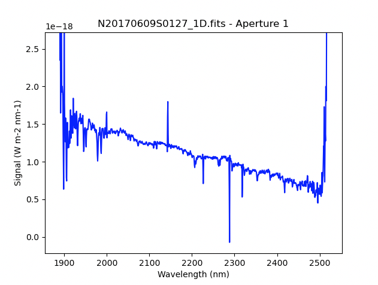

.. ex1_gnirsls_Kband32mm_cmdline.rst

.. include:: symbols.txt

.. _gnirs_Kband32mm_cmdline:

**************************************************************************
Example 1 - K-band Longslit Point Source - Using the "reduce" command line
**************************************************************************

In this example, we will reduce the GNIRS K-band longslit observation of
"SDSSJ162449.00+321702.0", a white dwarf, using the "|reduce|" command that
is operated directly from the unix shell.  Just open a terminal and load
the DRAGONS conda environment to get started.

This observation uses the 32 l/mm grating, the short-blue camera, a 0.3 arcsec
slit, and is set to a central wavelength of 2.2 |um|.   The dither pattern is
the standard ABBA.

The dataset
===========
If you have not already, download and unpack the tutorial's data package.
Refer to :ref:`datasetup` for the links and simple instructions.

The dataset specific to this example is described in:

    :ref:`gnirsls_Kband32mm_dataset`

Here is a copy of the table for quick reference.

+---------------------+----------------------------------------------+
| Science             || N20170609S0127-130                          |
+---------------------+----------------------------------------------+
| Science flats       || N20170609S0131-135                          |
+---------------------+----------------------------------------------+
| Science arcs        || N20170609S0136                              |
+---------------------+----------------------------------------------+
| BPM                 || bpm_20100716_gnirs_gnirsn_11_full_1amp.fits |
+---------------------+----------------------------------------------+

Configuring the interactive interface
=====================================
In ``~/.dragons/``, add the following to the configuration file ``dragonsrc``::

    [interactive]
    browser = your_preferred_browser

The ``[interactive]`` section defines your preferred browser.  DRAGONS will open
the interactive tools using that browser.  The allowed strings are "safari",
"chrome", and "firefox".

Set up the Local Calibration Manager
====================================

.. important::  Remember to set up the calibration service.

    Instructions to configure and use the calibration service are found in
    :ref:`cal_service`, specifically the these sections:
    :ref:`cal_service_config` and :ref:`cal_service_cmdline`.

Create file lists
=================

This data set contains science and calibration frames. For some programs, it
could contain different observed targets and different exposure times depending
on how you like to organize your raw data.

The DRAGONS data reduction pipeline does not organize the data for you.  You
have to do it.  However, DRAGONS provides tools to help you with that.

The first step is to create input file lists.  The tool "|dataselect|" helps
with that.  It uses Astrodata tags and "|descriptors|" to select the files and
send the filenames to a text file that can then be fed to "|reduce|".  (See the
|astrodatauser| for information about Astrodata.)

First, navigate to the ``playground`` directory in the unpacked data package::

    cd <path>/gnirsls_tutorial/playground

A list for the flats
--------------------
The GNRIS flats will be stack together.  Therefore it is important to ensure
that the flats in the list are compatible with each other.  You can use
`dataselect` to narrow down the selection as required.  Here, we have only
the flats that were taken with the science and we do not need extra selection
criteria.

::

    dataselect ../playdata/example1/*.fits --tags FLAT -o flats.lis

A list for the arcs
-------------------
The GNIRS longslit arc was obtained at the end of the science observation.
Often two are taken.  We will use both in this case and stack them later.

::

    dataselect ../playdata/example1/*.fits --tags ARC -o arcs.lis

.. telluric

A list for the science observations
-----------------------------------

In our case, the science observations can be selected from the observation
class, ``science``, that is how they are differentiated from the telluric
standards which are ``partnerCal``.

If we had multiple targets, we would need to split them into separate list. To
inspect what we have we can use |dataselect| and |showd| together.

::

    dataselect ../playdata/example1/*.fits --expr='observation_class=="science"' | showd -d object

    ------------------------------------------------------------------
    filename                                                    object
    ------------------------------------------------------------------
    ../playdata/example1/N20170609S0127.fits   SDSSJ162449.00+321702.0
    ../playdata/example1/N20170609S0128.fits   SDSSJ162449.00+321702.0
    ../playdata/example1/N20170609S0129.fits   SDSSJ162449.00+321702.0
    ../playdata/example1/N20170609S0130.fits   SDSSJ162449.00+321702.0

Here we only have one object from the same sequence.  If we had multiple
objects we could add the object name in the expression.

::

    dataselect ../playdata/example1/*.fits --expr='observation_class=="science" and object=="SDSSJ162449.00+321702.0"' -o sci.lis

Bad Pixel Mask
==============
Starting with DRAGONS v3.1, the bad pixel masks (BPMs) are handled as
calibrations.  They are downloadable from the archive instead of being
packaged with the software. They are automatically associated like any other
calibrations.  This means that the user now must download the BPMs along with
the other calibrations and add the BPMs to the local calibration manager.

See :ref:`getBPM` in :ref:`tips_and_tricks` to learn about the various ways
to get the BPMs from the archive.

To add the static BPM included in the data package to the local calibration
database:

::

    caldb add ../playdata/example1/bpm*.fits

Master Flat Field
=================
GNIRS longslit flat field are normally obtained at night along with the
observation sequence to match the telescope and instrument flexure.

The GNIRS longslit flatfield requires only lamp-on flats.  Subtracting darks
only increases the noise.

The flats will be stacked.

::

    reduce @flats.lis

GNIRS data is affected by a "odd-even" effect where alternate rows in the
GNIRS science array have gains that differ by approximately 10 percent.  When
you run ``normalizeFlat`` in interactive mode you can clearly see the two
levels.

In interactive mode, the objective is to get a fit that falls inbetween the
two sets of points, with a symmetrical residual fit.  In this case, order=30
worked well.

Note that you are not required to run in interactive mode, but you might want
to if flat fielding is critical to your program.

::

    reduce @flats.lis -p interactive=True

The interactive tools are introduced in section :ref:`interactive`.

Processed Arc - Wavelength Solution
===================================
Obtaining the wavelength solution for GNIRS longslit data can be a complicated
topic.  The quality of the results and what to use depend greatly on the
wavelength regime and the grating.

Our configuration in this example is K-band with a central wavelength less
then 2.3 |um|, using the 32 l/mm grating.  It is expected that the GCAL arc
lamp will have a sufficient number of lines available.   This is the simplest
case.

.. todo:: In tips and trick, add a summary table for each regime and what's
         most likely to work when it comes to wavecal.  (something like my
         spreadsheet.)

Because the slit length does not cover the whole array, we want to know where
the unilluminated areas are located and ignore them when the distortion
correction is calculated (along with the wavelength solution).  That information
is measured during the creation of the flat field and stored in the processed
flat.   Right now, the association rules do not automatically associate
flats to arcs, therefore we need to specify the processed flat on the
command line.  Using the flat is optional but it is recommended.

::

    reduce @arcs.lis -p flatCorrect:flat=N20170609S0131_flat.fits

The primitive ``determineWavelengthSolution``, used in the recipe, has an
interactive mode. To activate the interactive mode:

::

    reduce @arcs.lis -p interactive=True flatCorrect:flat=N20170609S0131_flat.fits

The interactive tools are introduced in section :ref:`interactive`.

We can see from the interactive tool plot that the wavelength solution has
reasonable line coverage between 1.98 and 2.4 |um|.

We will see later that the final science spectrum goes about 0.1 |um| beyond
the coverage.  The solution in the outer area is unconstrained.  If the lines
of scientific interest are beyond the line list range and wavelength accuracy
is very important, using sky lines, if strong enough in the science spectrum,
might be a better solution.

.. todo:: refer to an example using sky lines.

.. telluric

Science Observations
====================
The science target is a white dwarf.  The sequence is one ABBA dither pattern.
DRAGONS will flatfield, wavelength calibrate, subtract the sky, stack the
aligned spectra, and finally extract the source.

Note that at this time, DRAGONS does not offer tools to do the telluric
correction and flux calibration.  We are working on it.

Following the wavelength calibration, the default recipe has an optional
step to adjust the wavelength zero point using the sky lines.  By default,
this step will NOT make any adjustment.  We found that in general, the
adjustment is so small as being in the noise.  If you wish to make an
adjustment, or try it out, see :ref:`wavzero` to learn how.

For this dataset, the automatic wavelength zero point algorithm would find a
shift of 0.1461 pixels (-0.09408 nm), so not really significant.  This is
typical and why the default is set to do nothing.

.. note::  In this observation, there is only one real source to extract.  If there
   were multiple sources in the slit, regardless of whether they are of
   interest to the program, DRAGONS will locate them, trace them, and extract
   them automatically. Each extracted spectrum is stored in an individual
   extension in the output multi-extension FITS file.

   The automatic source detection in this case does find two extra spurious
   sources at the extreme left edge of the cross-section.  They are not real
   sources.  Just ignore them or remove them in interactive mode.

This is what one raw image looks like.

With all the calibrations in the local calibration manager, one only needs
to call |reduce| on the science frames to get an extracted spectrum.

::

    reduce @sci.lis

To run the reduction with all the interactive tools activated, set the
``interactive`` parameter to ``True``.

.. todo::  Atrocious handling of bad pixels in distortionCorrection and
      possibly stackFrames.  Bad pixels become giant diamonds.  The stacking
      enhance them!  distortionCorrection:dq_threshold might be too small.
      Currently 0.001 for all instruments. Selected for GMOS data. Not clear
      how that number was selected.  Used to be 0.01.  Looks better for GNIRS
      but still way too big.

      Then there's the stacking.  With only 2 A and 2 B positions, and those
      big diamonds always in the same position, the changing background sky
      appears to make them pop.  If the sky levels were the same, I suspect that
      they would not be visible.  But because it changes, you just need a big
      change and it will pop up either positive or negative in the individual
      sky subtracted images.  Then when you stack, they all remain because of
      the limited number (2 at most) of frames with good pixels but wildly
      different background flux compared to regions where all 4 can be used.
      Using stackFrames:zero=True makes the patches less prominent which seems
      to support this explanation.

At the ``traceApertures`` step, the fit one gets automatically for this source
is perfectly reasonable, well
within the envelope of the source aperture.  To improve the fit, one could
activate sigma clipping and increase to number of iteration to 3 to get a
straighter fit that ignores the deviant points at the edges of the spectrum.
This can be done manually with the interactive tool (try it), or on the command
line by adding ``-p traceApertures:niter=3`` to the ``reduce`` call.

::

    reduce @sci.lis -p interactive=True traceApertures:niter=3

.. blue wavelength bottom, red top

