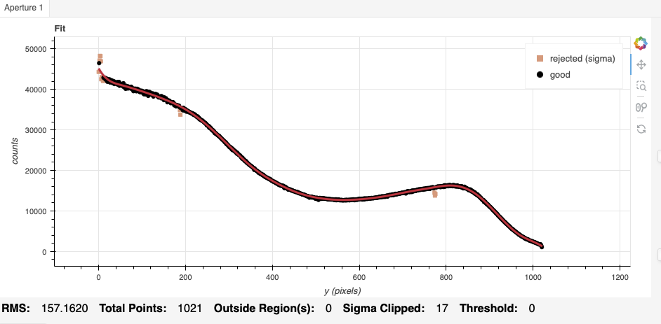
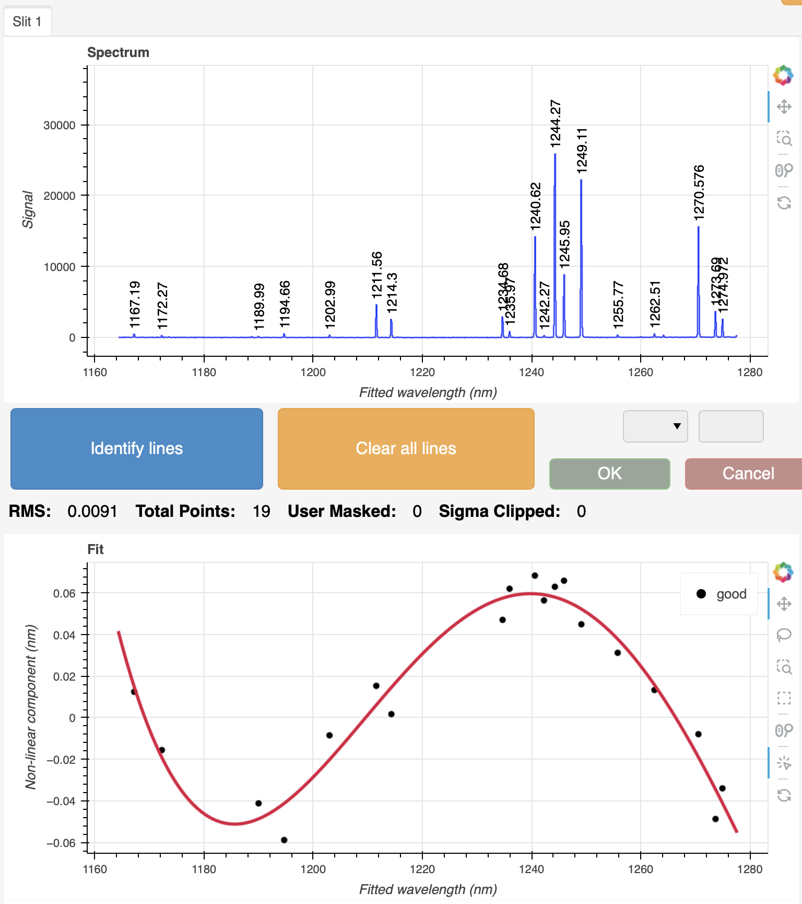
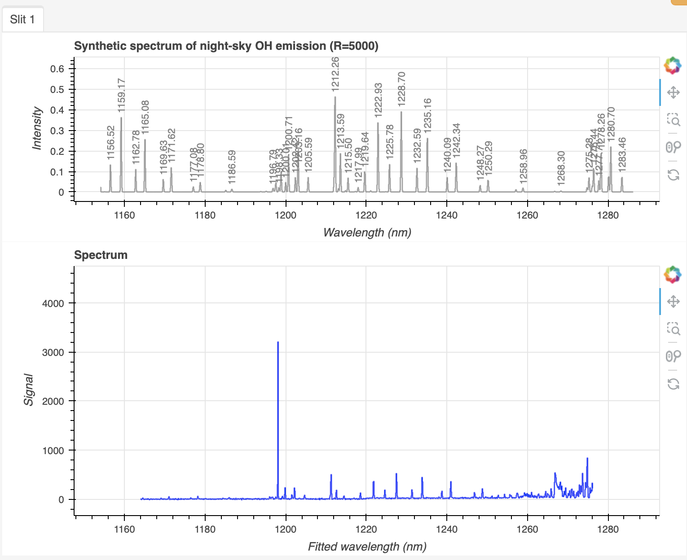
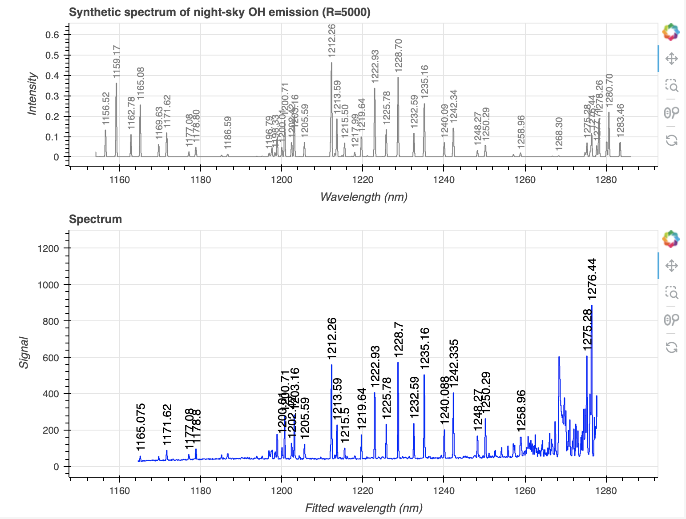
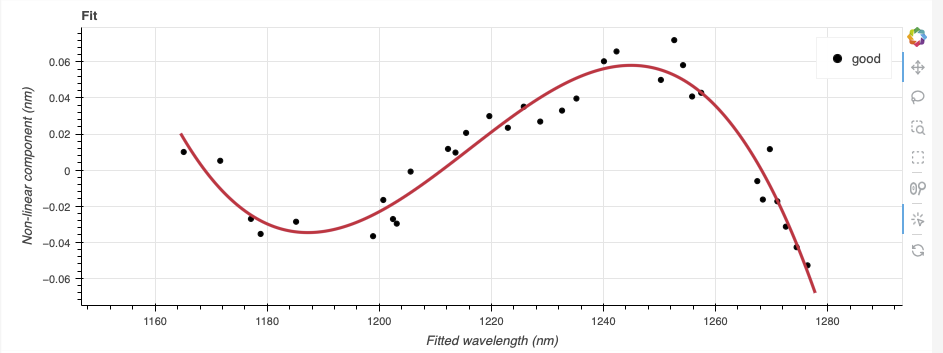
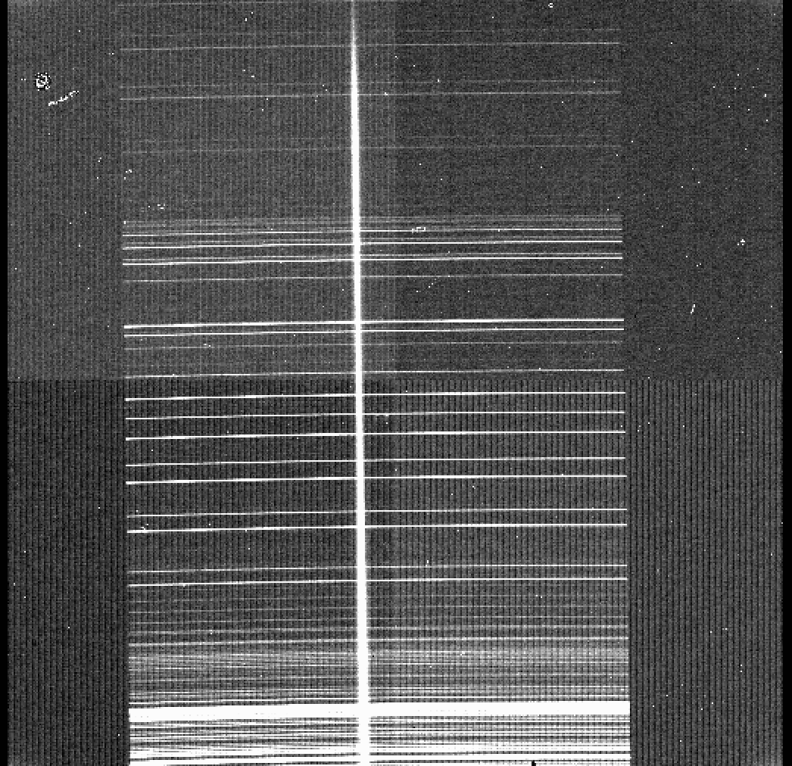

.. ex2_gnirsls_Jband111mm_cmdline.rst

.. include:: symbols.txt

.. _gnirs_Jband111mm_cmdline:

**************************************************************************
Example 2 - J-band Longslit Point Source - Using the "reduce" command line
**************************************************************************

In this example, we will reduce the GNIRS J-band longslit observation of
a metal-poor M dwarf, using the "|reduce|" command that
is operated directly from the unix shell.  Just open a terminal and load
the DRAGONS conda environment to get started.

This observation uses the 111 l/mm grating, the short-blue camera, a 0.3 arcsec
slit, and is set to a central wavelength of 1.22 |um|.   The dither pattern is
two consecutive ABBA sequences.

The dataset
===========
If you have not already, download and unpack the tutorial's data package.
Refer to :ref:`datasetup` for the links and simple instructions.

The dataset specific to this example is described in:

    :ref:`gnirsls_Jband111mm_dataset`

Here is a copy of the table for quick reference.

+---------------------+----------------------------------------------+
| Science             || N20180201S0052-59                           |
+---------------------+----------------------------------------------+
| Science flats       || N20180201S0060-64                           |
+---------------------+----------------------------------------------+
| Science arcs        || N20180201S0065                              |
+---------------------+----------------------------------------------+
| BPM                 || bpm_20100716_gnirs_gnirsn_11_full_1amp.fits |
+---------------------+----------------------------------------------+

.. add telluric

Configuring the interactive interface
=====================================
In ``~/.dragons/``, add the following to the configuration file ``dragonsrc``::

    [interactive]
    browser = your_preferred_browser

The ``[interactive]`` section defines your preferred browser.  DRAGONS will open
the interactive tools using that browser.  The allowed strings are "safari",
"chrome", and "firefox".

Set up the Local Calibration Manager
====================================

.. important::  Remember to set up the calibration service.

    Instructions to configure and use the calibration service are found in
    :ref:`cal_service`, specifically the these sections:
    :ref:`cal_service_config` and :ref:`cal_service_cmdline`.

Create file lists
=================

This data set contains science and calibration frames. For some programs, it
could contain different observed targets and different exposure times depending
on how you like to organize your raw data.

The DRAGONS data reduction pipeline does not organize the data for you.  You
have to do it.  However, DRAGONS provides tools to help you with that.

The first step is to create input file lists.  The tool "|dataselect|" helps
with that.  It uses Astrodata tags and "|descriptors|" to select the files and
send the filenames to a text file that can then be fed to "|reduce|".  (See the
|astrodatauser| for information about Astrodata.)

First, navigate to the ``playground`` directory in the unpacked data package::

    cd <path>/gnirsls_tutorial/playground

A list for the flats
--------------------
The GNRIS flats will be stack together.  Therefore it is important to ensure
that the flats in the list are compatible with each other.  You can use
`dataselect` to narrow down the selection as required.  Here, we have only
the flats that were taken with the science and we do not need extra selection
criteria.

::

    dataselect ../playdata/example2/*.fits --tags FLAT -o flats.lis

A list for the arcs
-------------------
The GNIRS longslit arc was obtained at the end of the science observation.
Often two are taken.  We will use both in this case and stack them later.

::

    dataselect ../playdata/example2/*.fits --tags ARC -o arcs.lis

.. telluric

A list for the science observations
-----------------------------------

In our case, the science observations can be selected from the observation
class, ``science``, that is how they are differentiated from the telluric
standards which are ``partnerCal``.

If we had multiple targets, we would need to split them into separate list. To
inspect what we have we can use |dataselect| and |showd| together.

::

    dataselect ../playdata/example2/*.fits --expr='observation_class=="science"' | showd -d object

    ----------------------------------------------------
    filename                                      object
    ----------------------------------------------------
    ../playdata/example2/N20180201S0052.fits   target_37
    ../playdata/example2/N20180201S0053.fits   target_37
    ../playdata/example2/N20180201S0054.fits   target_37
    ../playdata/example2/N20180201S0055.fits   target_37
    ../playdata/example2/N20180201S0056.fits   target_37
    ../playdata/example2/N20180201S0057.fits   target_37
    ../playdata/example2/N20180201S0058.fits   target_37
    ../playdata/example2/N20180201S0059.fits   target_37

Here we only have one object from the same sequence.  If we had multiple
objects we could add the object name in the expression.

::

    dataselect ../playdata/example2/*.fits --expr='observation_class=="science" and object=="target_37"' -o sci.lis

Bad Pixel Mask
==============
Starting with DRAGONS v3.1, the bad pixel masks (BPMs) are handled as
calibrations.  They are downloadable from the archive instead of being
packaged with the software. They are automatically associated like any other
calibrations.  This means that the user now must download the BPMs along with
the other calibrations and add the BPMs to the local calibration manager.

See :ref:`getBPM` in :ref:`tips_and_tricks` to learn about the various ways
to get the BPMs from the archive.

To add the static BPM included in the data package to the local calibration
database:

::

    caldb add ../playdata/example1/bpm*.fits

Master Flat Field
=================
GNIRS longslit flat field are normally obtained at night along with the
observation sequence to match the telescope and instrument flexure.

The GNIRS longslit flatfield requires only lamp-on flats.  Subtracting darks
only increases the noise.

The flats will be stacked.

::

    reduce @flats.lis

GNIRS data is affected by a "odd-even" effect where alternate rows in the
GNIRS science array have gains that differ by approximately 10 percent.  When
you run ``normalizeFlat`` in interactive mode you can clearly see the two
levels.

In interactive mode, the objective is to get a fit that falls inbetween the
two sets of points, with a symmetrical residual fit.  In this case, order=30
worked well.

Note that you are not required to run in interactive mode, but you might want
to if flat fielding is critical to your program.

::

    reduce @flats.lis -p interactive=True

In this case, we find that sigma clipping with 1 iteration and
grow=2 rejects the outliers at the left end of the flat.  The fit
leads to residuals that are symmetrical.

The interactive tools are introduced in section :ref:`interactive`.

Processed Arc - Wavelength Solution
====================================
Obtaining the wavelength solution for GNIRS longslit data can be a complicated
topic.  The quality of the results and what to use depend greatly on the
wavelength regime and the grating.

Our configuration in this example is J-band with a central wavelength of
1.22 |um|, using the 111 l/mm grating. Arcs are available, however there
might be cases where there are too few lines to get a good solution.

In our current case, the numbers of arcs lines and sky lines are similar.
Either solution could work.  We will show the result of both.  It is up to
the user to decide which solution is best for their science.

Using the arc lamp
------------------
Because the slit length does not cover the whole array, we want to know where
the unilluminated areas are located and ignore them when the distortion
correction is calculated (along with the wavelength solution).  That information
is measured during the creation of the flat field and stored in the processed
flat.   Right now, the association rules do not automatically associate
flats to arcs, therefore we need to specify the processed flat on the
command line.  Using the flat is optional but it is recommended when using
an arc lamp.

::

   reduce @arcs.lis -p interactive=True flatCorrect:flat=N20180201S0060_flat.fits

Here, increasing the order to 4 helps to get a tighter fit.

.. todo:: redo the screenshot and separate the line plot and the fit to
        avoid having the buttons in the way.

Using the sky lines
-------------------
The spectrum has a number of OH and O\ :sub:`2` sky lines that can be used to
create a wavelength solution.  The calibration can be done on a single frame
or, in case of multiple input frames, the frames will be stacked.  It is
recommended to use only one frame for a more precised wavelength solution,
unless multiple frames are needed to increase the signal-to-noise ratio.

Wavelength calibration from sky lines is better done in interactive mode
despite our efforts to automate the process.

To use the sky lines in the science frames instead of the lamp arcs, we
invoke the ``makeWavecalFromSkyEmission`` recipe.

::

    reduce @sci.lis -r makeWavecalFromSkyEmission -p interactive=True

In this case, you will initially get no fit at all in the interactive window.
This is because the
sky lines are relatively weak.

On the left control panel, set the ``Minimum SNR`` to 5 (down from the default
of 10).  Then click the "Reconstruct points" button.  Sky lines will now be
identified and you will get a fit.  Use the sky line model at the top as a
reference to ensure that the fit is correct.  You can also add some of the
weaker lines manually, and/or change the sigma clipping parameters.
For example, lowering the high and low sigma clipping to 2 will help reject
some of the weak blended lines that are more inaccurate.

Each case will be slightly different.   Whether you decide to use the solution
from the arc lamp or the sky lines is up to you.

.. Telluric Correction

Science Observations
====================
The science target is a low metallicity M-dwarf.  The sequence is two ABBA
dithered observations.  DRAGONS will flat field, wavelength calibrate,
subtract the sky, stack the aligned spectra, and finally extract the source.

Note that at this time, DRAGONS does not offer tools to do the telluric
correction and flux calibration.  We are working on it.

Following the wavelength calibration, the default recipe has an optional
step to adjust the wavelength zero point using the sky lines.  By default,
this step will NOT make any adjustment.  We found that in general, the
adjustment is so small as being in the noise.  If you wish to make an
adjustment, or try it out, see :ref:`wavzero` to learn how.

For this dataset, the automatic wavelength zero point algorithm would find a
shift of no more than 0.1333 pixels (-0.01479 nm), so not really significant.
This is typical and why the default is set to do nothing.

This is what one raw image looks like.

With all the calibrations in the local calibration manager, one only needs
to call |reduce| on the science frames to get an extracted spectrum.

.. note::  If you have derived a wavelength solution from both the arcs and
     the sky lines, as we've done here, you will have two solutions in the
     calibration manager database.  My default, the system will pick the sky
     line solution because the solution is closer in time (same time, in fact)
     as the science observations.  If you wish to use the lamp solution, either
     delete the sky line solution from the database
     (``caldb remove N20180201S0052_arc.fits``) or specify the lamp solution
     on the command line when you reduce the science frames (add
     ``-p attachWavelengthSolution:arc=N20180201S0065_arc.fits`` to the
     ``reduce`` command).

::

    reduce @sci.lis -p findAperture:max_apertures=1 traceApertures:niter=3 distortionCorrect:order=1

.. todo:: funky shape to the spectrum.  Somewhat visible in the raw data
        however.

.. todo:: way too many junk apertures.

.. todo:: trace again benefits from sigma clipping with 3 iterations.

From Olesja about the using stack vs single for sky line wavecal, and how to
set the sigma based on SNR and blended lines.

I didn’t look into the amount of shift between the lines during sequences. My assumption was that if the PIs care about the precise wavecal, they would try to use a single frame (if the SNR allows), and if they don’t care or if the SNR is low, they would use a stack. (edited)

Also, I wouldn’t think of the rejected lines in both of the above plots as “good”. Most are barely above the noise level, and the others are blends, which in my book is a definition of a “bad” line (especially when there are enough of unblended strong lines to choose from).
I actually tried to filter out this kind of lines on purpose by setting the default lsigma and hsigma for wavecal from skylines to “2” . If you set those back to “3" it maybe that most of these lines wouldn’t get rejected. (edited)