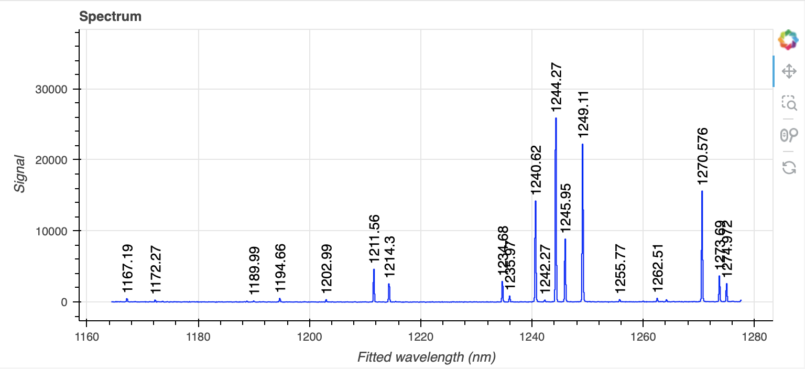
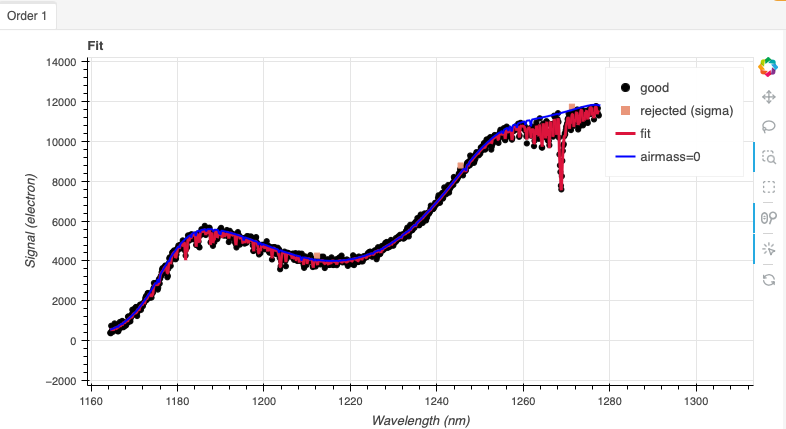
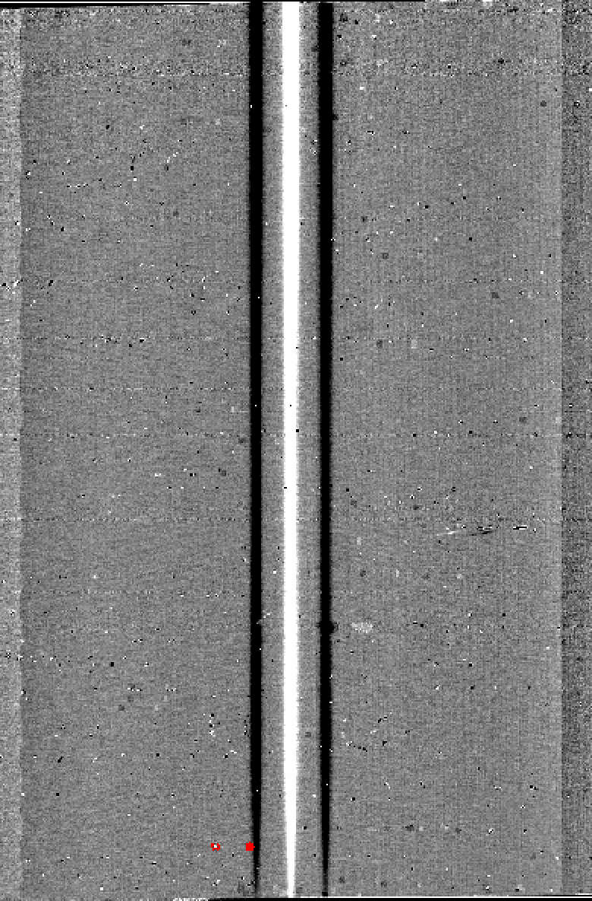
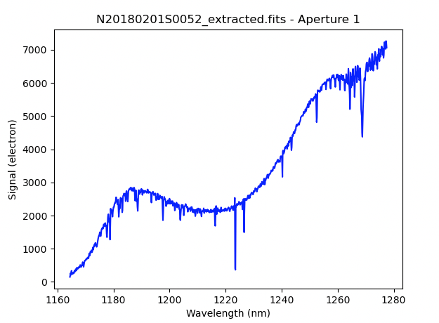
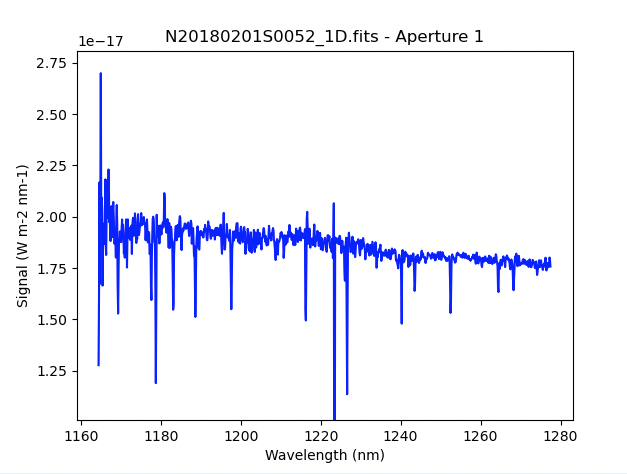

.. ex2_gnirsls_Jband111mm_cmdline.rst

.. include:: symbols.txt

.. _gnirsls_Jband111mm_cmdline:

**************************************************************************
Example 2 - J-band Longslit Point Source - Using the "reduce" command line
**************************************************************************

In this example, we will reduce the GNIRS J-band longslit observation of
a metal-poor M dwarf, using the "|reduce|" command that
is operated directly from the unix shell.  Just open a terminal and load
the DRAGONS conda environment to get started.

This observation uses the 111 l/mm grating, the short-blue camera, a 0.3 arcsec
slit, and is set to a central wavelength of 1.22 |um|.   The dither pattern is
two consecutive ABBA sequences.

The dataset
===========
If you have not already, download and unpack the tutorial's data package.
Refer to :ref:`datasetup` for the links and simple instructions.

The dataset specific to this example is described in:

    :ref:`gnirsls_Jband111mm_dataset`

Here is a copy of the table for quick reference.

+---------------------+----------------------------------------------+
| Science             || N20180201S0052-59                           |
+---------------------+----------------------------------------------+
| Science flats       || N20180201S0060-64                           |
+---------------------+----------------------------------------------+
| Science arcs        || N20180201S0065                              |
+---------------------+----------------------------------------------+
| Telluric            || N20180201S0071-74                           |
+---------------------+----------------------------------------------+
| BPM                 || bpm_20100716_gnirs_gnirsn_11_full_1amp.fits |
+---------------------+----------------------------------------------+

Configuring the interactive interface
=====================================
In ``~/.dragons/``, add the following to the configuration file ``dragonsrc``::

    [interactive]
    browser = your_preferred_browser

The ``[interactive]`` section defines your preferred browser.  DRAGONS will open
the interactive tools using that browser.  The allowed strings are "safari",
"chrome", and "firefox".

Set up the Local Calibration Manager
====================================

.. important::  Remember to set up the calibration service.

    Instructions to configure and use the calibration service are found in
    :ref:`cal_service`, specifically the these sections:
    :ref:`cal_service_config` and :ref:`cal_service_cmdline`.

Create file lists
=================

This data set contains science and calibration frames. For some programs, it
could contain different observed targets and different exposure times depending
on how you like to organize your raw data.

The DRAGONS data reduction pipeline does not organize the data for you.  You
have to do it.  However, DRAGONS provides tools to help you with that.

The first step is to create input file lists.  The tool "|dataselect|" helps
with that.  It uses Astrodata tags and "|descriptors|" to select the files and
send the filenames to a text file that can then be fed to "|reduce|".  (See the
|astrodatauser| for information about Astrodata.)

First, navigate to the ``playground`` directory in the unpacked data package::

    cd <path>/gnirsls_tutorial/playground

A list for the flats
--------------------
The GNRIS flats will be stack together.  Therefore it is important to ensure
that the flats in the list are compatible with each other.  You can use
`dataselect` to narrow down the selection as required.  Here, we have only
the flats that were taken with the science and we do not need extra selection
criteria.

::

    dataselect ../playdata/example2/*.fits --tags FLAT -o flats.lis

A list for the arcs
-------------------
The GNIRS longslit arc was obtained at the end of the science observation.
Often two are taken.  We will use both in this case and stack them later.

::

    dataselect ../playdata/example2/*.fits --tags ARC -o arcs.lis

A list for the telluric
-----------------------
DRAGONS does not recognize the telluric star as such.  This is because
the observations are taken like science data and the GNIRS headers do not
explicitly state that the observation is a telluric standard.  For now, the
`observation_class` descriptor can be used to differential the telluric
from the science observations, along with the rejection of the `CAL` tag to
reject flats and arcs.

::

    dataselect ../playdata/example2/*.fits --xtags=CAL --expr='observation_class=="partnerCal"' -o telluric.lis

A list for the science observations
-----------------------------------

In our case, the science observations can be selected from the observation
class, ``science``, that is how they are differentiated from the telluric
standards which are ``partnerCal``.

If we had multiple targets, we would need to split them into separate list. To
inspect what we have we can use |dataselect| and |showd| together.

::

    dataselect ../playdata/example2/*.fits --expr='observation_class=="science"' | showd -d object

    ----------------------------------------------------
    filename                                      object
    ----------------------------------------------------
    ../playdata/example2/N20180201S0052.fits   target_37
    ../playdata/example2/N20180201S0053.fits   target_37
    ../playdata/example2/N20180201S0054.fits   target_37
    ../playdata/example2/N20180201S0055.fits   target_37
    ../playdata/example2/N20180201S0056.fits   target_37
    ../playdata/example2/N20180201S0057.fits   target_37
    ../playdata/example2/N20180201S0058.fits   target_37
    ../playdata/example2/N20180201S0059.fits   target_37

Here we only have one object from the same sequence.  If we had multiple
objects we could add the object name in the expression.

::

    dataselect ../playdata/example2/*.fits --expr='observation_class=="science" and object=="target_37"' -o sci.lis

Bad Pixel Mask
==============
Starting with DRAGONS v3.1, the bad pixel masks (BPMs) are handled as
calibrations.  They are downloadable from the archive instead of being
packaged with the software. They are automatically associated like any other
calibrations.  This means that the user now must download the BPMs along with
the other calibrations and add the BPMs to the local calibration manager.

See :ref:`getBPM` in :ref:`tips_and_tricks` to learn about the various ways
to get the BPMs from the archive.

To add the static BPM included in the data package to the local calibration
database:

::

    caldb add ../playdata/example2/bpm*.fits

Master Flat Field
=================
GNIRS longslit flat field are normally obtained at night along with the
observation sequence to match the telescope and instrument flexure.

The GNIRS longslit flatfield requires only lamp-on flats.  Subtracting darks
only increases the noise.

The flats will be stacked.

::

    reduce @flats.lis

GNIRS data is affected by a "odd-even" effect where alternate rows in the
GNIRS science array have gains that differ by approximately 10 percent.  When
you run ``normalizeFlat`` in interactive mode you can clearly see the two
levels.

In interactive mode, the objective is to get a fit that falls inbetween the
two sets of points, with a symmetrical residual fit.

Note that you are not required to run in interactive mode, but you might want
to if flat fielding is critical to your program.

::

    reduce @flats.lis -p interactive=True

In this case, order=20, the default, worked well and we find that sigma
clipping with 1 iteration and grow=2 rejects the outliers at the left end
of the flat.  The fit leads to residuals that are symmetrical.

.. image:: _graphics/gnirsls_Jband111_evenoddflat.png
   :width: 600
   :alt: Even-odd effect in flats

The interactive tools are introduced in section :ref:`interactive`.

.. _gnirsls_Jband111mm_cmdline_arc:

Processed Arc - Wavelength Solution
====================================
Obtaining the wavelength solution for GNIRS longslit data can be a complicated
topic.  The quality of the results and what to use depend greatly on the
wavelength regime and the grating.

Our configuration in this example is J-band with a central wavelength of
1.22 |um|, using the 111 l/mm grating. Arcs are available, however, depending
on the central wavelength setting, there might be cases where there are too
few lines or the coverage is not adequate to get a good solution.

In our current case, the numbers of arcs lines and sky lines are similar.
Either solution could work.  We will show the result of both.  It is up to
the user to decide which solution is best for their science.

Using the arc lamp
------------------
Because the slit length does not cover the whole array, we want to know where
the unilluminated areas are located and ignore them when the distortion
correction is calculated (along with the wavelength solution).  That information
is measured during the creation of the flat field and stored in the processed
flat.   Right now, the association rules do not automatically associate
flats to arcs, therefore we need to specify the processed flat on the
command line.  Using the flat is optional but it is recommended when using
an arc lamp.

::

   reduce @arcs.lis -p interactive=True flatCorrect:flat=N20180201S0060_flat.fits

Here, increasing the order to 4 helps to get a tighter fit.

.. image:: _graphics/gnirsls_Jband111mm_arcfit.png
   :width: 600
   :alt: Arc line fit

Using the sky lines
-------------------
The spectrum has a number of OH and O\ :sub:`2`\  sky lines that can be used to
create a wavelength solution.  The calibration can be done on a single frame
or, in case of multiple input frames, the frames will be stacked.  It is
recommended to use only one frame for a more precise wavelength solution,
unless multiple frames are needed to increase the signal-to-noise ratio.  Here
we will use all the frames in the ``sci.lis`` list.

Wavelength calibration from sky lines is better done in interactive mode
despite our efforts to automate the process.

To use the sky lines in the science frames instead of the lamp arcs, we
invoke the ``makeWavecalFromSkyEmission`` recipe.

::

    reduce @sci.lis -r makeWavecalFromSkyEmission -p interactive=True

In this case, using all the frames, we get a good signal to noise and an
automatic fit.  If you wanted, you could identify more sky lines manually.

.. image:: _graphics/gnirsls_Jband111_skylineref.png
   :width: 600
   :alt: Sky lines identification with reference spectrum

.. image:: _graphics/gnirsls_Jband111_skyfit.png
   :width: 600
   :alt: Sky lines fit

.. note::  If the sky lines were too weak and no fit were found, a possible
    solution is to lower the minimum SNR to 5 (down from the default of 10).
    This setting is in the left control panel.  When done, click the the
    "Reconstruct points" button.

    When lowering the SNR, lowering the
    high and low sigma clipping to 2 will help reject some of the weak
    blended lines that are more inaccurate.

Which solution to use?
----------------------
Each case will be slightly different.   Whether you decide to use the solution
from the arc lamp or the sky lines is up to you.

Once you have decided, we recommend that you remove the one you do not want
to use from the calibration manager database.  Since the ``_arc`` file selected
will always be the "closest in time" to the science observation, there might be
cases where the lamp solution will be picked for the last datasets in the
sequence while the sky lines solution will be picked for the first datasets in
the sequence.

So pick one, remove the other.

::

    caldb remove N20180201S0065_arc.fits  # remove the lamp solution
    ... or ...
    caldb remove N20180201S0052_arc.fits  # remove the sky line solution

In this tutorial, we remove the lamp solution.

If you were to want to try it anyway for telluric standard reduction
or the science reduction, you can force its use with the ``--user_cal``
option on the command line, eg
``--user_cal processed_arc:N20180201S0065_arc.fits``.

Telluric Standard
=================
The telluric standard observed before the science observation is "hip 55627".
The spectral type of the star is A0V.

To properly calculate and fit a telluric model to the star, we need to know
its effective temperature.  To properly scale the sensitivity function (to
use the star as a spectrophotometric standard), we need to know the star's
magnitude.  Those are inputs to the ``fitTelluric`` primitive.

The default effective temperature of 9650 K is typical of an A0V star, which
is the most common spectral tupe used as a tellurc standard. Different
sources give values between 9500 K and 9750 K and, for example,
Eric Mamajek's list "A Modern Mean Dwarf Stellar Color and Effective
Temperature Sequence"
(https://www.pas.rochester.edu/~emamajek/EEM_dwarf_UBVIJHK_colors_Teff.txt)
quotes the effective temperature of an A0V star as 9700 K. The precise
value has only a small effect on the derived sensitivity and even less
effect on the telluric correction, so the temperature from any reliable
source can be used. Using Simbad, we find that the star has a magnitude
of K=9.165.

Instead of typing the values on the command line, we will use a parameter file
to store them.  In a normal text file (here we name it "hip55627.param"), we write::

    -p
    fitTelluric:bbtemp=9700
    fitTelluric:magnitude='K=9.165'

Then we can call the ``reduce`` command with the parameter file.  The telluric
fitting primitive can be run in interactive mode.

Note that the data is recognized by Astrodata as normal GNIRS longslit science
spectra.  To calculate the telluric correction, we need to specify the telluric
recipe (``-r reduceTelluric``), otherwise the default science reduction will be
run.

::

    reduce @telluric.lis -r reduceTelluric @hip55627.param -p fitTelluric:interactive=True

Adjusting the order of the spline to 8 leads to more randomized residuals
(second panel).

Science Observations
====================
The science target is a low metallicity M-dwarf.  The sequence is two ABBA
dithered observations.  DRAGONS will flat field, wavelength calibrate,
subtract the sky, stack the aligned spectra, extract the source, and finally
remove telluric features and flux calibrate.

Following the wavelength calibration, the default recipe has an optional
step to adjust the wavelength zero point using the sky lines.  By default,
this step will NOT make any adjustment.  We found that in general, the
adjustment is so small as being in the noise.  If you wish to make an
adjustment, or try it out, see :ref:`wavzero` to learn how.

This is what one raw image looks like.

.. image:: _graphics/gnirsls_Jband111mm_raw.png
   :width: 400
   :alt: raw science image

With all the calibrations in the local calibration manager, one only needs
to call |reduce| on the science frames to get an extracted spectrum.

::

    reduce @sci.lis

To run the reduction with all the interactive tools activated, set the
``interactive`` parameter to ``True``.

::

   reduce @sci.lis -p interactive=True

.. todo:: Whoa!  findAperture fails big time.  That wasn't happening before.
    Delete and "f" works though.  So why the heck doesn't the original fit
    work?

The 2D spectrum, without telluric correction and flux calibration, looks
like this:

::

    reduce -r display N20180201S0052_2D.fits

The 1D extracted spectrum before telluric correction or flux calibration,
obtained with ``-p extractSpectra:write_outputs=True``, looks like this.

The 1D extracted spectrum after telluric correction but before flux
calibration, obtained with ``-p telluricCorrect:write_outputs=True``, looks
like this.

.. image:: _graphics/gnirsls_Jband111mm_tellcor.png
   :width: 600
   :alt: 1D extracted spectrum after telluric correction or before flux calibration

And the final spectrum, corrected for telluric features and flux calibrated.

::

    dgsplot N20180201S0052_1D.fits 1

.. Terrible flux calibration.  I even tried to apply it back to the telluric
   itself, an A0V star, and I get the same wavy shape.  Clearly wrong.

.. From Olesja about the using stack vs single for sky line wavecal,
   and how to set the sigma based on SNR and blended lines.  I didn’t look
   into the amount of shift between the lines during sequences. My assumption
   was that if the PIs care about the precise wavecal, they would try to use a
   single frame (if the SNR allows), and if they don’t care or if the SNR is
   low, they would use a stack. Also, I wouldn’t think of the rejected lines
   in both of the above plots as “good”. Most are barely above the noise level,
   and the others are blends, which in my book is a definition of a “bad” line
   (especially when there are enough of unblended strong lines to choose from).
   I actually tried to filter out this kind of lines on purpose by setting the
   default lsigma and hsigma for wavecal from skylines to “2” . If you set
   those back to “3" it maybe that most of these lines wouldn’t get rejected. (edited)