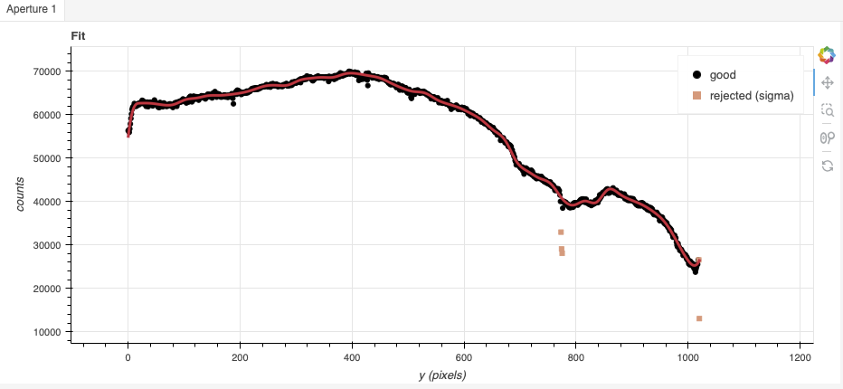

.. ex3_gnirsls_Lband10mm_cmdline.rst

.. include:: symbols.txt

.. _gnirsls_Lband10mm_cmdline:

**************************************************************************
Example 3 - L-band Longslit Point Source - Using the "reduce" command line
**************************************************************************

We will reduce the GNIRS L-band longslit observation of "HD41335", a Be-star,
using the "|reduce|" command that is operated directly from the unix shell.
Just open a terminal and load the DRAGONS conda environment to get started.

This observation uses the 10 l/mm grating, the long-red camera, a 0.1 arcsec
slit, and is centered at 3.7 |um|.  The dither pattern is a standard
ABBA sequence.

The dataset
===========
If you have not already, download and unpack the tutorial's data package.
Refer to :ref:`datasetup` for the links and simple instructions.

The dataset specific to this example is described in:

    :ref:`gnirsls_Lband10mm_dataset`

Here is a copy of the table for quick reference.

+---------------------+----------------------------------------------+
| Science             || N20180114S0121-124                          |
+---------------------+----------------------------------------------+
| Science flats       || N20180114S0125-132                          |
+---------------------+----------------------------------------------+
| Telluric            || N20180114S0113-116                          |
+---------------------+----------------------------------------------+
| BPM                 || bpm_20121101_gnirs_gnirsn_11_full_1amp.fits |
+---------------------+----------------------------------------------+

Configuring the interactive interface
=====================================
In ``~/.dragons/``, add the following to the configuration file ``dragonsrc``::

    [interactive]
    browser = your_preferred_browser

The ``[interactive]`` section defines your preferred browser.  DRAGONS will open
the interactive tools using that browser.  The allowed strings are "safari",
"chrome", and "firefox".

Set up the Local Calibration Manager
====================================

.. important::  Remember to set up the calibration service.

    Instructions to configure and use the calibration service are found in
    :ref:`cal_service`, specifically the these sections:
    :ref:`cal_service_config` and :ref:`cal_service_cmdline`.

We recommend that you clean up your working directory (``playground``) and
start a fresh calibration database (``caldb init -w``) when you start a new
example.

Create file lists
=================

This data set contains science and calibration frames. For some programs, it
could contain different observed targets and different exposure times depending
on how you like to organize your raw data.

The DRAGONS data reduction pipeline does not organize the data for you.  You
have to do it.  However, DRAGONS provides tools to help you.

The first step is to create input file lists.  The tool "|dataselect|" helps
with that.  It uses Astrodata tags and "|descriptors|" to select the files and
send the filenames to a text file that can then be fed to "|reduce|".  (See the
|astrodatauser| for information about Astrodata.)

First, navigate to the ``playground`` directory in the unpacked data package::

    cd <path>/gnirsls_tutorial/playground

A list for the flats
--------------------
The GNRIS flats will be stack together.  Therefore it is important to ensure
that the flats in the list are compatible with each other.  You can use
`dataselect` to narrow down the selection as required.  Here, we have only
the flats that were taken with the science and we do not need extra selection
criteria.

::

    dataselect ../playdata/example3/*.fits --tags FLAT -o flats.lis

A list for the telluric
-----------------------
DRAGONS does not recognize the telluric star as such.  This is because
the observations are taken like science data and the GNIRS headers do not
explicitly state that the observation is a telluric standard.  For now, the
`observation_class` descriptor can be used to differential the telluric
from the science observations, along with the rejection of the `CAL` tag to
reject flats and arcs.

::

    dataselect ../playdata/example3/*.fits --xtags=CAL --expr='observation_class=="partnerCal"' -o telluric.lis

A list for the science observations
-----------------------------------

In our case, the science observations can be selected from the observation
class, ``science``, that is how they are differentiated from the telluric
standards which are ``partnerCal``.

If we had multiple targets, we would need to split them into separate lists. To
inspect what we have we can use |dataselect| and |showd| together.

::

    dataselect ../playdata/example3/*.fits --expr='observation_class=="science"' | showd -d object

    --------------------------------------------------
    filename                                    object
    --------------------------------------------------
    ../playdata/example3/N20180114S0121.fits   HD41335
    ../playdata/example3/N20180114S0122.fits   HD41335
    ../playdata/example3/N20180114S0123.fits   HD41335
    ../playdata/example3/N20180114S0124.fits   HD41335

Here we only have one object from the same sequence.  If we had multiple
objects we could add the object name in the expression.

::

    dataselect ../playdata/example3/*.fits --expr='observation_class=="science" and object=="HD41335"' -o sci.lis

Bad Pixel Mask
==============
Starting with DRAGONS v3.1, the bad pixel masks (BPMs) are handled as
calibrations.  They are downloadable from the archive instead of being
packaged with the software. They are automatically associated like any other
calibrations.  This means that the user now must download the BPMs along with
the other calibrations and add the BPMs to the local calibration manager.

See :ref:`getBPM` in :ref:`tips_and_tricks` to learn about the various ways
to get the BPMs from the archive.

To add the static BPM included in the data package to the local calibration
database:

::

    caldb add ../playdata/example3/bpm*.fits

Master Flat Field
=================
GNIRS longslit flat fields are normally obtained at night along with the
observation sequence to match the telescope and instrument flexure.

The GNIRS longslit flatfield requires only lamp-on flats.  Subtracting darks
only increases the noise.

The flats will be stacked.

::

    reduce @flats.lis

GNIRS data are affected by a "odd-even" effect where alternate rows in the
GNIRS science array have gains that differ by approximately 10 percent.  When
you run ``normalizeFlat`` in interactive mode you can clearly see the two
levels.

In interactive mode, the objective is to get a fit that falls inbetween the
two sets of points, with a symmetrical residual fit.  In this case, because
of the rapid variations around pixel 800, increasing the order could improve
the final results.  Setting ``order=50`` fits that area well while still
offering a good fit elsewhere.

Note that you are not required to run in interactive mode, but you might want
to if flat fielding is critical to your program.

::

    reduce @flats.lis -p interactive=True

The interactive tools are introduced in section :ref:`interactive`.

Processed Arc - Wavelength Solution
===================================
The wavelength solution for L-band and M-band data are derived from the
wavelengths of strong peaks in the emission spectrum of the sky.  The
quality of the wavelength solution depends on the width and strength
of the telluric features.

Wavelength calibration from peaks is better done in interactive mode
despite our efforts to automate the process.

To use the sky transmission peaks in the science frames, we invoke the
``makeWavecalFromSkyEmission`` recipe.

::

    reduce @sci.lis -r makeWavecalFromSkyEmission -p interactive=True

In the L-band, it is very important to inspect the feature identification.
Fortunately, in our case, using the default does lead to a correct feature
identification.

Zooming in:

.. image:: _graphics/gnirsls_Lband10mm_arcID.png
   :width: 600
   :alt: Arc line identifications

.. note:: If the feature identification were to be incorrrect, often changing
    the minimum SNR for peak detection to 5 and recalculating ("Reconstruct points")
    will help find the good solution.

Telluric Standard
=================
The telluric standard observed before the science observation is "hip 28910".
The spectral type of the star is A0V.

To properly calculate and fit a telluric model to the star, we need to know
its effective temperature.  To properly scale the sensitivity function (to
use the star as a spectrophotometric standard), we need to know the star's
magnitude.  Those are inputs to the ``fitTelluric`` primitive.

The default effective temperature of 9650 K is typical of an A0V star, which
is the most common spectral tupe used as a tellurc standard. Different
sources give values between 9500 K and 9750 K and, for example,
Eric Mamajek's list "A Modern Mean Dwarf Stellar Color and Effective
Temperature Sequence"
(https://www.pas.rochester.edu/~emamajek/EEM_dwarf_UBVIJHK_colors_Teff.txt)
quotes the effective temperature of an A0V star as 9700 K. The precise
value has only a small effect on the derived sensitivity and even less
effect on the telluric correction, so the temperature from any reliable
source can be used. Using Simbad, we find that the star has a magnitude
of K=4.523, which is the closest waveband to our observation.

Instead of typing the values on the command line, we will use a parameter file
to store them.  In a normal text file (here we name it "hip28910.param"), we write::

    -p
    fitTelluric:bbtemp=9700
    fitTelluric:magnitude='K=4.523'

Then we can call the ``reduce`` command with the parameter file.  The telluric
fitting primitive can be run in interactive mode.

Note that the data are recognized by Astrodata as normal GNIRS longslit science
spectra.  To calculate the telluric correction, we need to specify the telluric
recipe (``-r reduceTelluric``), otherwise the default science reduction will be
run.

::

    reduce @telluric.lis -r reduceTelluric @hip28910.param -p fitTelluric:interactive=True

The defaults appear to work well in this case.  The blue end is strongly
affected by the telluric absorption. It is okay for the blue line, the
expected continuum, to be above the data.

Science Observations
====================
The science target is a Be star.  The sequence is one ABBA dither pattern.
DRAGONS will flatfield, wavelength calibrate, subtract the sky, stack the
aligned spectra, extract the source, and finally
remove telluric features and flux calibrate.

This is what one raw image looks like.

.. image:: _graphics/gnirsls_Lband10mm_raw.png
   :width: 400
   :alt: raw science image

With all the calibrations in the local calibration manager, simply call
|reduce| on the science frames to get an extracted spectrum.

::

    reduce @sci.lis

To run the reduction with all the interactive tools activated, set the
``interactive`` parameter to ``True``.

::

    reduce @sci.lis -p interactive=True

The default fits are all good, though the trace can be improved by setting
the order to 5 (interactively or with ``-p traceApertures:order=5``).

The 2D spectrum before extraction looks like this, with blue wavelengths at
the bottom and the red-end at the top.

.. image:: _graphics/gnirsls_Lband10mm_2d.png
   :width: 400
   :alt: 2D spectrum

The 1D extracted spectrum before telluric correction or flux calibration,
obtained with ``-p extractSpectra:write_outputs=True``, looks like this.

The 1D extracted spectrum after telluric correction but before flux
calibration, obtained with ``-p telluricCorrect:write_outputs=True``, looks
like this.

.. image:: _graphics/gnirsls_Lband10mm_tellcor.png
   :width: 600
   :alt: 1D extracted spectrum after telluric correction or before flux calibration

And the final spectrum, corrected for telluric features and flux calibrated.

.. image:: _graphics/gnirsls_Lband10mm_1d.png
   :width: 600
   :alt: 1D extracted spectrum after telluric correction and flux calibration

