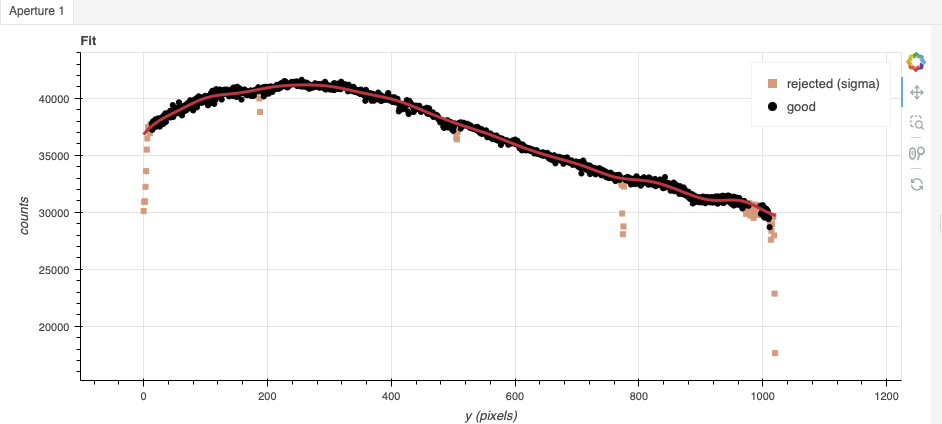
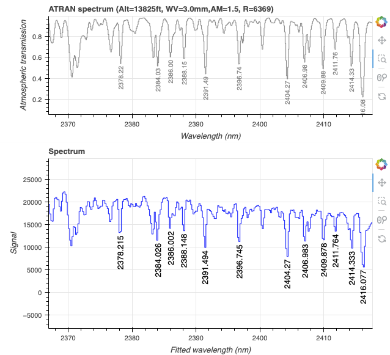
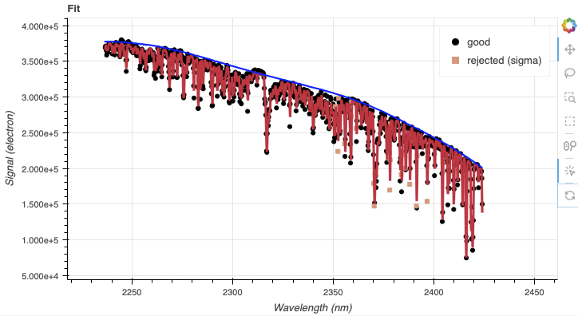
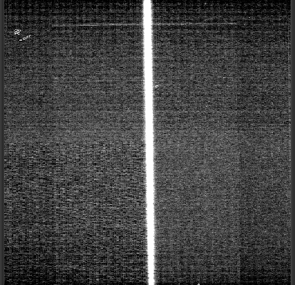

.. ex4_gnirsls_Kband111mm_red_api.rst

.. include:: symbols.txt

.. _gnirs_Kband111mm_red_api:

*****************************************************************************************************
Example 4 -K-band 2.33 micron Longslit Point Source (111 l/mm grating) - Using the "Reduce" class API
*****************************************************************************************************

We will reduce the GNIRS K-band longslit observation of HD 179821, likely
a yellow hypergiant star, using the Python
programmatic interface.

The observation uses the 111 l/mm grating, the long-blue camera, a 0.3 arcsec
slit, and is centered at 2.33 |um|.  The dither pattern is a ABBA
sequence.

The dataset
===========
If you have not already, download and unpack the tutorial's data package.
Refer to :ref:`datasetup` for the links and simple instructions.

The dataset specific to this example is described in:

    :ref:`gnirsls_Kband111mm_red_dataset`

Here is a copy of the table for quick reference.

+---------------------+----------------------------------------------+
| Science             || N20210407S0173-176                          |
+---------------------+----------------------------------------------+
| Science flats       || N20210407S0177-180                          |
+---------------------+----------------------------------------------+
| Science arcs        || N20210407S0181-182                          |
+---------------------+----------------------------------------------+
| Telluric            || N20210407S0188-191                          |
+---------------------+----------------------------------------------+
| BPM                 || bpm_20121101_gnirs_gnirsn_11_full_1amp.fits |
+---------------------+----------------------------------------------+

Configuring the interactive interface
=====================================
In ``~/.dragons/``, add the following to the configuration file ``dragonsrc``::

    [interactive]
    browser = your_preferred_browser

The ``[interactive]`` section defines your preferred browser.  DRAGONS will open
the interactive tools using that browser.  The allowed strings are "safari",
"chrome", and "firefox".

Importing libraries
-------------------

.. code-block:: python
    :linenos:

    import glob

    import astrodata
    import gemini_instruments
    from recipe_system.reduction.coreReduce import Reduce
    from gempy.adlibrary import dataselect

The ``dataselect`` module will be used to create file lists for the
biases, the flats, the arcs, the standard, and the science observations.
The ``Reduce`` class is used to set up and run the data
reduction.

Setting up the logger
---------------------
We recommend using the DRAGONS logger.  (See also :ref:`double_messaging`.)

.. code-block:: python
    :linenos:
    :lineno-start: 7

    from gempy.utils import logutils
    logutils.config(file_name='gnirsls_tutorial.log')

Set up the Calibration Service
------------------------------

.. important::  Remember to set up the calibration service.

    Instructions to configure and use the calibration service are found in
    :ref:`cal_service`, specifically the these sections:
    :ref:`cal_service_config` and :ref:`cal_service_api`.

Create file lists
=================
The next step is to create input file lists.  The module ``dataselect`` helps
with that.  It uses Astrodata tags and |descriptors| to select the files and
store the filenames to a Python list that can then be fed to the ``Reduce``
class. (See the |astrodatauser| for information about Astrodata and for a list
of |descriptors|.)

The first list we create is a list of all the files in the ``playdata``
directory.

.. code-block:: python
    :linenos:
    :lineno-start: 9

    all_files = glob.glob('../playdata/example4/*.fits')
    all_files.sort()

We will search that list for files with specific characteristics.  We use
the ``all_files`` :class:`list` as an input to the function
``dataselect.select_data()`` .  The function's signature is::

    select_data(inputs, tags=[], xtags=[], expression='True')

We show several usage examples below.

A list for the flats
--------------------
The GNRIS flats will be stack together.  Therefore it is important to ensure
that the flats in the list are compatible with each other.  You can use
`dataselect` to narrow down the selection as required.  Here, we have only
the flats that were taken with the science and we do not need extra selection
criteria.

.. code-block:: python
    :linenos:
    :lineno-start: 11

    flats = dataselect.select_data(all_files, ['FLAT'])

A list for the arcs
-------------------
The GNIRS longslit arc was obtained at the end of the science observation.
Often two are taken.  We will use both in this case and stack them later.

.. code-block:: python
    :linenos:
    :lineno-start: 12

    arcs = dataselect.select_data(all_files, ['ARC'])

A list for the telluric
-----------------------
DRAGONS does not recognize the telluric star as such.  This is because
the observations are taken like science data and the GNIRS headers do not
explicitly state that the observation is a telluric standard.  For now, the
``observation_class`` descriptor can be used to differential the telluric
from the science observations, along with the rejection of the ``CAL`` tag to
reject flats and arcs. The ``observation_class`` can be "partnerCal" or
"progCal".  In this case, it is "progCal".

.. code-block:: python
    :linenos:
    :lineno-start: 13

    tellurics = dataselect.select_data(
        all_files,
        [],
        ['CAL'],
        dataselect.expr_parser('observation_class=="progCal"')
    )

A list for the science observations
-----------------------------------

In our case, the science observations can be selected from the observation
class, ``science``, that is how they are differentiated from the telluric
standards which are ``partnerCal`` or ``progCal``.

If we had multiple targets, we would need to split them into separate lists. To
inspect what we have we can use |dataselect| and |showd| together.

.. code-block:: python
    :linenos:
    :lineno-start: 19

    all_science = dataselect.select_data(
        all_files,
        [],
        ['CAL'],
        dataselect.expr_parser('observation_class=="science"')
    )
    for sci in all_science:
        ad = astrodata.open(sci)
        print(sci, '  ', ad.object())

::

    ../playdata/example4/N20210407S0173.fits    HD 179821
    ../playdata/example4/N20210407S0174.fits    HD 179821
    ../playdata/example4/N20210407S0175.fits    HD 179821
    ../playdata/example4/N20210407S0176.fits    HD 179821

Here we only have one object from the same sequence.  If we had multiple
objects we could add the object name in the expression.

.. code-block:: python
    :linenos:
    :lineno-start: 28

    scitarget = dataselect.select_data(
        all_files,
        [],
        ['CAL'],
        dataselect.expr_parser('object=="HD 179821"')
    )

Bad Pixel Mask
==============
Starting with DRAGONS v3.1, the bad pixel masks (BPMs) are handled as
calibrations.  They are downloadable from the archive instead of being
packaged with the software. They are automatically associated like any other
calibrations.  This means that the user now must download the BPMs along with
the other calibrations and add the BPMs to the local calibration manager.

See :ref:`getBPM` in :ref:`tips_and_tricks` to learn about the various ways
to get the BPMs from the archive.

To add the static BPM included in the data package to the local calibration
database:

.. code-block:: python
    :linenos:
    :lineno-start: 34

    for bpm in dataselect.select_data(all_files, ['BPM']):
        caldb.add_cal(bpm)

Master Flat Field
=================
GNIRS longslit flat fields are normally obtained at night along with the
observation sequence to match the telescope and instrument flexure.

The GNIRS longslit flatfield requires only lamp-on flats.  Subtracting darks
only increases the noise.

The flats will be stacked.

.. code-block:: python
    :linenos:
    :lineno-start: 36

    reduce_flats = Reduce()
    reduce_flats.files.extend(flats)
    reduce_flats.runr()

GNIRS data are affected by a "odd-even" effect where alternate rows in the
GNIRS science array have gains that differ by approximately 10 percent.  When
you run ``normalizeFlat`` in interactive mode you can clearly see the two
levels.

In interactive mode, the objective is to get a fit that falls inbetween the
two sets of points, with a symmetrical residual fit.  In this case, the fit
can be improved by activating the sigma clipping with one iteration, setting
the low sigma to 2 instead of 3, and setting the "grow" parameter to 2.

Note that you are not required to run in interactive mode, but you might want
to if flat fielding is critical to your program.  Run it interactively and
see for yourself the difference the adjustments make in this case.

.. code-block:: python
    :linenos:
    :lineno-start: 39

    reduce_flats = Reduce()
    reduce_flats.files.extend(flats)
    reduce_flats.uparms = dict([('interactive', True)])
    reduce_flats.runr()

Processed Arc - Wavelength Solution
===================================
Obtaining the wavelength solution for GNIRS longslit data can be a complicated
topic.  The quality of the results and what to use depends greatly on the
wavelength regime and the grating.

Our observations are K-band at a central wavelength of 2.33 |um| using
the 111/mm grating. In that regime, the arc lamp observation contains very
few lines, five in this case which fortunately are correctly identified.  The
number of lines can be as low as 2 or 3 in redder settings.
It is impossible to have an accurate solution from the arc alone.

The other difficulty is that the OH and O\ :sub:`2`\  lines are absent in that regime.  There
are no emission lines.  There are however a large number of telluric
absorption lines.

Therefore, we will use the arc lamp solution as the starting point for the
calculation of the solution derived from the telluric absorption lines.

The arc lamp solution
---------------------
Because the slit length does not cover the whole array, we want to know where
the unilluminated areas are located and ignore them when the distortion
correction is calculated (along with the wavelength solution).  That information
is measured during the creation of the flat field and stored in the processed
flat.   Right now, the association rules do not automatically associate
flats to arcs, therefore we need to specify the processed flat on the
command line.  Using the flat is optional but it is recommended when using
an arc lamp.

Turning on the interactive mode is recommended.  The lines are correctly
identified in this case, but at redder settings it is not always the case.
Plots of the arc lamps with wavelength labels can be found here:

https://www.gemini.edu/instrumentation/gnirs/calibrations#Arc

The arc we are processing was taken with the Argon lamp.

Once the coarse arc is calculated it will automatically be added to the
calibration database.  We do not want that arc to ever be used during the
reduction of the science data.  So we immediately remove it from the database.
We will feed it to the next step, the only one that needs it, manually.

.. code-block:: python
    :linenos:
    :lineno-start: 43

    reduce_arcs = Reduce()
    reduce_arcs.files.extend(arcs)
    reduce_arcs.uparms = dict([
                ('flatCorrect:flat', reduce_flats.output_filenames[0]),
                ('interactive', True),
                ])
    reduce_arcs.runr()

    caldb.remove_cal(reduce_arcs.output_filenames[0])

.. image:: _graphics/gnirsls_Kband111mm_red_arcID.png
    :width: 600
    :alt: Arc line identifications

The telluric absorption lines solution
--------------------------------------
Because only the telluric absorption lines provide a good spectral coverage
in this configuration, we are forced to use them.

To use the sky lines in the science frames instead of the lamp arcs, we
invoke the ``makeWavecalFromSkyAbsorption`` recipe.  It will get the arc lamp
solution from the calibration manager automatically and use it as an initial
approximation.

It is strongly recommended to use the interactive mode to visually confirm
that lines have been properly identified and if not manually identify the
lines.

In this case, the automatic identification is correct and no further action
is needed.

If manually identification was needed, the first step would be to clear the
lines and then use "i" to identify lines correctly with the help of the top
plot.  After a few have been identified across the **entire** spectrum,
click "Identify Lines" to fill in more lines automatically.

.. code-block:: python
    :linenos:
    :lineno-start: 52

    reduce_sky = Reduce()
    reduce_sky.files.extend(scitarget)
    reduce_sky.recipename = 'makeWavecalFromSkyAbsorption'
    reduce_sky.ucals = dict([('processed_arc', reduce_arcs.output_filenames[0])])
    reduce_sky.uparms = dict([('interactive', True)])
    reduce_sky.runr()

Zooming in on the sky lines, we can better spot discrepancies, if any.

Telluric Standard
=================
The telluric standard observed before the science observation is "hip 92386".
The spectral type of the star is A1IV.

To properly calculate and fit a telluric model to the star, we need to know
its effective temperature.  To properly scale the sensitivity function (to
use the star as a spectrophotometric standard), we need to know the star's
magnitude.  Those are inputs to the ``fitTelluric`` primitive.

From Eric Mamajek's list "A Modern Mean Dwarf Stellar Color and Effective
Temperature Sequence"
(https://www.pas.rochester.edu/~emamajek/EEM_dwarf_UBVIJHK_colors_Teff.txt)
we find that the effective temperature of an A1V star is about 9300 K.
Prieto & del Burgo, 2016, MNRAS, 455, 3864, finds an effective temperature of
8894 K for HIP 92386 (HD 174240).  The exact temperature should not matter all
that much.  We are using the Prieto & del Burgo value here. Using
Simbad, we find that the star has a magnitude of K=6.040.

Note that the data are recognized by Astrodata as normal GNIRS longslit science
spectra.  To calculate the telluric correction, we need to specify the telluric
recipe (``-r reduceTelluric``), otherwise the default science reduction will be
run.

.. code-block:: python
    :linenos:
    :lineno-start: 58

    reduce_telluric = Reduce()
    reduce_telluric.files.extend(tellurics)
    reduce_telluric.recipename = 'reduceTelluric'
    reduce_telluric.uparms = dict([
                ('fitTelluric:bbtemp', 8894),
                ('fitTelluric:magnitude', 'K=6.040'),
                ('fitTelluric:interactive', True),
                ])
    reduce_telluric.runr()

In the top plot the blue line represents the continuum and should "envelop"
the spectrum (black dots are the data, red line is the telluric model).  If the
blue line crosses in the middle of the data, for example, this is a sign that
the wavelength calibration is not correct.  Go back and try to fix the
wavelength solution.

Here it all looks good.

Science Observations
====================
The science target is HD 179821.  It is believed to be either a post-asymtotic
giant star or a yellow hypergiant. The sequence is one
ABBA dithered observations.  DRAGONS will flat field, wavelength calibrate,
subtract the sky, stack the aligned spectra, extract the source, and finally
remove telluric features and flux calibrate.

This is what one raw image looks like.

With all the calibrations in the local calibration manager, one only needs
to do as follows to reduce the science observations and extract the 1-D
spectrum.

.. code-block:: python
    :linenos:
    :lineno-start: 67

    reduce_science = Reduce()
    reduce_science.files.extend(scitarget)
    reduce_science.runr()

To run the reduction with all the interactive tools activated, set the
``interactive`` parameter to ``True``.

.. code-block:: python
    :linenos:
    :lineno-start: 70

    reduce_science = Reduce()
    reduce_science.files.extend(scitarget)
    reduce_science.uparms = dict([('interactive', True)])
    reduce_science.runr()

The 2D spectrum, without telluric correction and flux calibration, with
blue wavelengths at the bottom and the red-end at the top, looks like this:

.. code-block:: python
    :linenos:
    :lineno-start: 74

    reduce_display = Reduce()
    reduce_display.files.extend(['N20210407S0173_2D.fits'])
    reduce_display.recipename = 'display'
    reduce_display.runr()

.. image:: _graphics/gnirsls_Kband111mm_2D.png
   :width: 400
   :alt: reduced 2D spectrum. No telluric correction. No flux calibration.

The 1D extracted spectrum before telluric correction or flux calibration,
obtained with ``('extractSpectra:write_outputs', True)``, looks like this.

.. image:: _graphics/gnirsls_Kband111mm_extracted.png
   :width: 590
   :alt: 1D extracted spectrum before telluric correction or flux calibration

The 1D extracted spectrum after telluric correction but before flux
calibration, obtained with ``('telluricCorrect:write_outputs', True)``, looks
like this.

.. image:: _graphics/gnirsls_Kband111mm_tellcorrected.png
   :width: 600
   :alt: 1D extracted spectrum after telluric correction or before flux calibration

And the final spectrum, corrected for telluric features and flux calibrated.

::

    dgsplot N20210407S0173_1D.fits 1

.. image:: _graphics/gnirsls_Kband111mm_1D.png
   :width: 600
   :alt: reduced and calibrated final 1D spectrum
