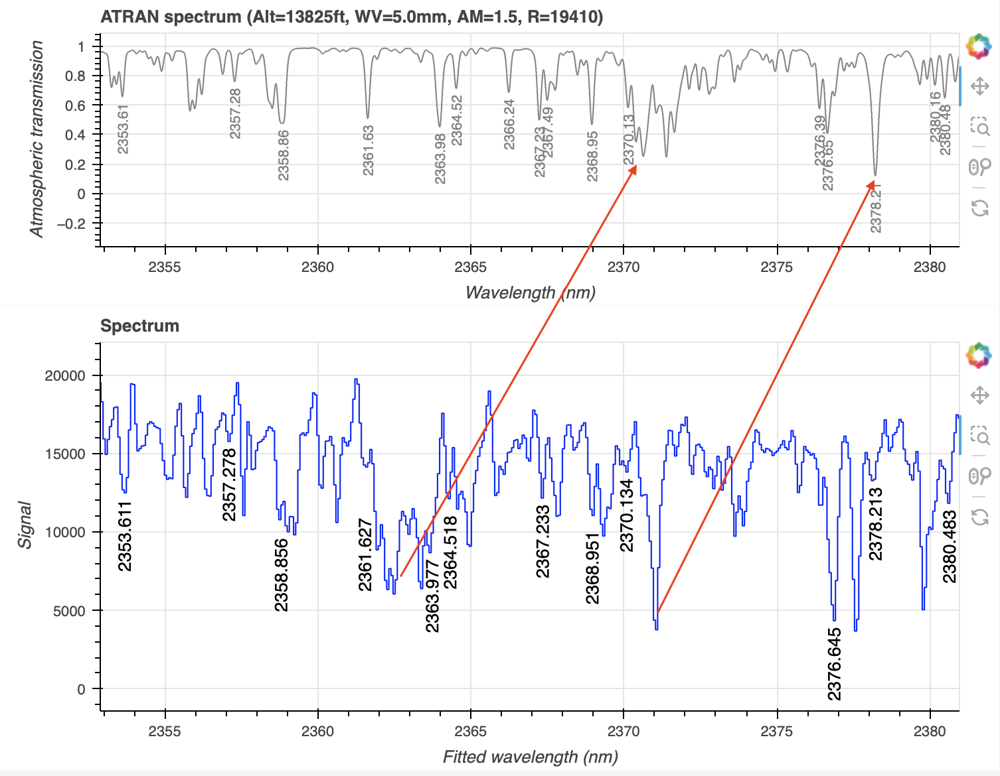
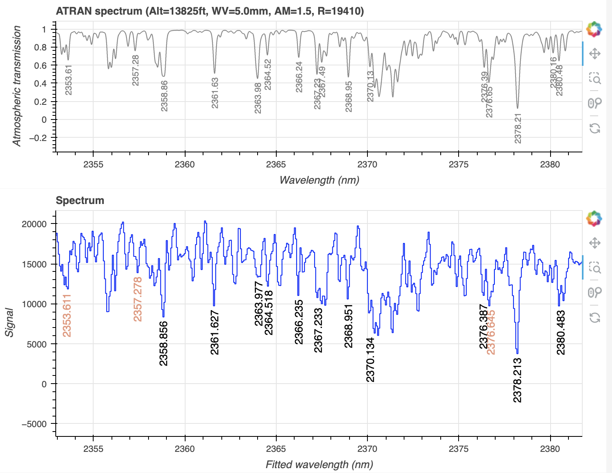

.. ex4_gnirsls_Kband111mm_red_dataset.rst

.. include:: symbols.txt

.. _gnirs_Kband111mm_red_cmdline:

***********************************************************************************************************
Example 4 -  K-band 2.365 micron Longslit Point Source (111 l/mm grating) - Using the "reduce" command line
***********************************************************************************************************

We will reduce the GNIRS K-band longslit observation of :math:`{\rho}` Cas,
a yellow hypergiant star, using the "|reduce|" command that is operated
directly from the unix shell.  Just open a terminal and load the DRAGONS
conda environment to get started.

The observation uses the 111 l/mm grating, the long-blue camera, a 0.1 arcsec
slit, and is centered at 2.365 |um|.  The dither pattern is a ABBA-ABBA
sequence.

The dataset
===========
If you have not already, download and unpack the tutorial's data package.
Refer to :ref:`datasetup` for the links and simple instructions.

The dataset specific to this example is described in:

    :ref:`gnirsls_Kband111mm_red_dataset`

Here is a copy of the table for quick reference.

+---------------------+----------------------------------------------+
| Science             || N20201026S0100-107                          |
+---------------------+----------------------------------------------+
| Science flats       || N20201026S0108-113                          |
+---------------------+----------------------------------------------+
| Science arcs        || N20201026S0114                              |
+---------------------+----------------------------------------------+
| BPM                 || bpm_20121101_gnirs_gnirsn_11_full_1amp.fits |
+---------------------+----------------------------------------------+

.. need to add the telluric frames and calibrations when supported.
.. .. | Telluric || N20201026S0120-123 |

Configuring the interactive interface
=====================================
In ``~/.dragons/``, add the following to the configuration file ``dragonsrc``::

    [interactive]
    browser = your_preferred_browser

The ``[interactive]`` section defines your preferred browser.  DRAGONS will open
the interactive tools using that browser.  The allowed strings are "safari",
"chrome", and "firefox".

Set up the Local Calibration Manager
====================================

.. important::  Remember to set up the calibration service.

    Instructions to configure and use the calibration service are found in
    :ref:`cal_service`, specifically the these sections:
    :ref:`cal_service_config` and :ref:`cal_service_cmdline`.

Create file lists
=================

This data set contains science and calibration frames. For some programs, it
could contain different observed targets and different exposure times depending
on how you like to organize your raw data.

The DRAGONS data reduction pipeline does not organize the data for you.  You
have to do it.  However, DRAGONS provides tools to help you.

The first step is to create input file lists.  The tool "|dataselect|" helps
with that.  It uses Astrodata tags and "|descriptors|" to select the files and
send the filenames to a text file that can then be fed to "|reduce|".  (See the
|astrodatauser| for information about Astrodata.)

First, navigate to the ``playground`` directory in the unpacked data package::

    cd <path>/gnirsls_tutorial/playground

A list for the flats
--------------------
The GNRIS flats will be stack together.  Therefore it is important to ensure
that the flats in the list are compatible with each other.  You can use
`dataselect` to narrow down the selection as required.  Here, we have only
the flats that were taken with the science and we do not need extra selection
criteria.

::

    dataselect ../playdata/example4/*.fits --tags FLAT -o flats.lis

A list for the arcs
-------------------
The GNIRS longslit arc was obtained at the end of the science observation.
Often two are taken.  We will use both in this case and stack them later.

::

    dataselect ../playdata/example3/*.fits --tags ARC -o arcs.lis

.. telluric

A list for the science observations
-----------------------------------

In our case, the science observations can be selected from the observation
class, ``science``, that is how they are differentiated from the telluric
standards which are ``partnerCal``.

If we had multiple targets, we would need to split them into separate lists. To
inspect what we have we can use |dataselect| and |showd| together.

::

    dataselect ../playdata/example4/*.fits --expr='observation_class=="science"' | showd -d object

    --------------------------------------------------
    filename                                    object
    --------------------------------------------------
    ../playdata/example4/N20201026S0100.fits   Rho Cas
    ../playdata/example4/N20201026S0101.fits   Rho Cas
    ../playdata/example4/N20201026S0102.fits   Rho Cas
    ../playdata/example4/N20201026S0103.fits   Rho Cas
    ../playdata/example4/N20201026S0104.fits   Rho Cas
    ../playdata/example4/N20201026S0105.fits   Rho Cas
    ../playdata/example4/N20201026S0106.fits   Rho Cas
    ../playdata/example4/N20201026S0107.fits   Rho Cas

Here we only have one object from the same sequence.  If we had multiple
objects we could add the object name in the expression.

::

    dataselect ../playdata/example4/*.fits --expr='observation_class=="science" and object=="Rho Cas"' -o sci.lis

Bad Pixel Mask
==============
Starting with DRAGONS v3.1, the bad pixel masks (BPMs) are handled as
calibrations.  They are downloadable from the archive instead of being
packaged with the software. They are automatically associated like any other
calibrations.  This means that the user now must download the BPMs along with
the other calibrations and add the BPMs to the local calibration manager.

See :ref:`getBPM` in :ref:`tips_and_tricks` to learn about the various ways
to get the BPMs from the archive.

To add the static BPM included in the data package to the local calibration
database:

::

    caldb add ../playdata/example4/bpm*.fits

Master Flat Field
=================
GNIRS longslit flat field are normally obtained at night along with the
observation sequence to match the telescope and instrument flexure.

The GNIRS longslit flatfield requires only lamp-on flats.  Subtracting darks
only increases the noise.

The flats will be stacked.

::

    reduce @flats.lis

GNIRS data is affected by a "odd-even" effect where alternate rows in the
GNIRS science array have gains that differ by approximately 10 percent.  When
you run ``normalizeFlat`` in interactive mode you can clearly see the two
levels.

In interactive mode, the objective is to get a fit that falls inbetween the
two sets of points, with a symmetrical residual fit.  In this case, the
fit on the far left end can be improved only by setting a *region* to use
that excludes the diverging points at the very edge.  The improvement is
marginal and probably not worth it, but we do it here to illustrate the use
of *regions*.  A region can be defined with the cursor by typing "r", or as
a string in the region box below the plots.  The active region is highlighted
in gray.

Note that you are not required to run in interactive mode, but you might want
to if flat fielding is critical to your program.

::

    reduce @flats.lis -p interactive=True

The interactive tools are introduced in section :ref:`interactive`.

.. image:: _graphics/gnirsls_Kband111mm_red_evenoddflat.png
   :width: 600
   :alt: Even-odd effect in flats with gray region

Processed Arc - Wavelength Solution
===================================
Obtaining the wavelength solution for GNIRS longslit data can be a complicated
topic.  The quality of the results and what to use depends greatly on the
wavelength regime and the grating.

Our observations are K-band at a central wavelength of 2.365 |um| using
the 111/mm grating. In that regime, the arc lamp observation contains very
few lines, three in this case with only two automatically identified.
Clearly it would be impossible to have an accurate solution from the arc alone.

The other difficulty is that the OH lines are absent in that regime.  There
are no emission lines.  There are however a large number of telluric
absorption lines.

Therefore, we will use the arc lamp solution as the starting point for the
calculation of the solution derived from the telluric absorption lines.

The arc lamp solution
---------------------
Because the slit length does not cover the whole array, we want to know where
the unilluminated areas are located and ignore them when the distortion
correction is calculated (along with the wavelength solution).  That information
is measured during the creation of the flat field and stored in the processed
flat.   Right now, the association rules do not automatically associate
flats to arcs, therefore we need to specify the processed flat on the
command line.  Using the flat is optional but it is recommended when using
an arc lamp.

Turning on the interactive mode is optional.

Once the coarse arc is calculated it will automatically be added to the
calibration database.  We do not want that arc to ever be used during the
reduction of the science data.  So we immediately remove it from the database.
We will feed it to the next step, the only one that needs it, manually.

::

    reduce @arcs.lis -p flatCorrect:flat=N20180106S0166_flat.fits interactive=True
    caldb remove N20201026S0114_arc.fits

.. image:: _graphics/gnirsls_Kband111mm_red_arcID.png
    :width: 600
    :alt: Arc line identifications

.. todo:: info about the arc plots https://www.gemini.edu/instrumentation/gnirs/calibrations#Arc

The telluric absorption lines solution
--------------------------------------
Because only the telluric absorption lines provide a good spectral coverage
in this configuration, we are forced to use them.

To use the sky lines in the science frames instead of the lamp arcs, we
invoke the ``makeWavecalFromSkyAbsorption`` recipe.  It will get the arc lamp
solution from the calibration manager automatically and use it as an initial
approximation.

It is strongly recommended to use the interactive mode to visually confirm
that lines have been properly identified and if not manually identify the
lines.   Clearing the lines and using "i" to manually identify lines is the
solution here.  After a few have been identified across the spectrum, click
"Identify Lines" to fill in more lines automatically.

::

    reduce @sci.lis -r makeWavecalFromSkyAbsorption --user_cal processed_arc:N20201026S0114_arc.fits -p  interactive=True prepare:bad_wcs=new

Zooming in on the sky lines, we can better spot discrepancies: the automatic solution is 7 nm
off.

Clearing the lines and using "i" to manually identify lines is the
solution here.  After a few have been identified across the spectrum, click
"Identify Lines" to fill in more lines automatically.

.. note:: The World Coordinate System (WCS) values in the header of the science
   data are not quite accurate enough for a 0.1 arc second slit.  To ensure
   that the ABBA pattern is recognized as such instead of as a full offset to
   blank sky, we need to create a new WCS using the offset values stored in
   the headers.  This is what the extra `prepare:bad_wcs=new` does.  It has
   nothing to do with the need to use the telluric absorption lines.

   See the section about how to recognize this problem in the Tips & Tricks
   chapter.

.. todo::  Add a section about recognizing the need for new WCS.

.. Telluric Correction

Science Observations
====================
The science target is the hypergiant :math:`{\rho}` Cas. The sequence is two
ABBA dithered observations.  DRAGONS will flat field, wavelength calibrate,
subtract the sky, stack the aligned spectra, and finally extract the source.

Note that at this time, DRAGONS does not offer tools to do the telluric
correction and flux calibration.  We are working on it.

Following the wavelength calibration, the default recipe has an optional
step to adjust the wavelength zero point using the sky lines.  By default,
this step will NOT make any adjustment.  We found that in general, the
adjustment is so small as being in the noise.  If you wish to make an
adjustment, or try it out, see :ref:`wavzero` to learn how.

This is what one raw image looks like.

.. image:: _graphics/gnirsls_Kband111mm_raw.png
   :width: 400
   :alt: raw science image

With all the calibrations in the local calibration manager, one only needs
to call |reduce| on the science frames to get an extracted spectrum.

::

    reduce @sci.lis -p prepare:bad_wcs=new

The 2D spectrum looks like this:

::

    reduce -r display N20201026S0100_2D.fits

.. image:: _graphics/gnirsls_Kband111mm_2D.png
   :width: 400
   :alt: reduced 2D spectrum

The 1D spectrum looks like this:

::

    dgsplot N20201026S0100_1D.fits 1

.. image:: _graphics/gnirsls_Kband111mm_1D.png
   :width: 400
   :alt: raw science image
