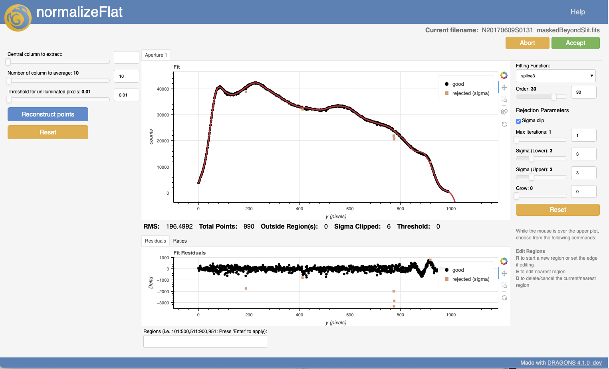

.. interactive.rst

.. _bokeh: https://bokeh.org

.. _interactive:

*****************
Interactive tools
*****************

.. _interactive_overview:

Overview
========

DRAGONS offers interactive tools for some spectroscopy steps.  The tools are
built with `bokeh`_ and, when invoked, they will pop up automatically in a
browser.

Your preferred browser can be set in the ``~/.dragons/dragonsrc`` configuration
file under the ``interactive`` section.

::

    [interactive]
    browser = your_preferred_browser

The allowed strings are "safari", "chrome", and "firefox".

The primitives that have an interactive mode also have an ``interactive``
input parameter that can be set when a reduction a launched.

To activate the interactive mode for **all** the primitives::

   Command line:
     reduce @files.lis -p interactive=True

   API
     redux = Reduce()
     redux.files = [files_to_reduce]
     redux.uparms = dict([('interactive', True)])

To activate the interactive mode for a specific primitive, eg. ``traceApertures``::

   Command line:
     reduce @files.lis -p traceApertures:interactive=True

   API
     redux = Reduce()
     redux.files = [files_to_reduce]
     redux.uparms = dict([('traceApertures:interactive', True)])

.. _ui_layout:

General layout
==============

The user interface for all the interactive tools follows a uniform general
layout.  The main regions of interest are the "Header", the "Left Panel",
the "Plot Panel", and the "Right Panel".

In the "Header", you will find the name of the primitive, the name of the
file that is being worked on, and in the top right, a "Help" button that will
issue a pop-up window with documentation about the interface and the available
adjustments.  You can keep that pop-up window open as you operate the tool.

The "Left Panel" is for adjusting core input parameters to the primitive.
Modifications on that panel requires the tool to go back to the pixels
and regenerate the data used in the plots.  In some case, this can take a
little while.  This is why changes in that panel will always require the user
to click on a blue action button to launch the recalculation only when all the
adjustments to the sliders and text boxes have been made.

The "Plot Panel" is where the fit and various residuals can be visualized.
The plots are interactive.  It is possible to use the cursor and keyboard
commands to reject points, define regions to use, etc.  The gray text
(generally) at the bottom of the "Right Panel", labelled "4" on the picture,
gives a list of the valid actions.  It is context-aware and can change
depending on where your cursor points.  The bokeh interface also has default
cursor-activated features on the right of the plots for selecting points,
zooming in, and repositioning the plots (labelled "2" on the picture).

On the "Plot Panel", there can be tabs for multiple CCDs or multiple apertures.
The tab area is labelled "1" on the picture.

Finally, labelled on the picture as "3" is the "Regions" box.  Regions can be
defined with the cursor and the "r" key, but they can also be defined more
precisely in the region box.

The "Right Panel" is for adjusting the fit to the data in the "Plot Panel".
Any changes to the sliders, checkboxes, text boxes, take effect immediately,
since the response time if very quick, unlike for the "Left Panel"
modifications.

.. _interactive_primitives:

Interactive primitives
======================

There are seven primitives with an interactive mode for GNIRS longslit.

* :ref:`determineWavelengthSolution <ui_determinewavelengthsolution>`
* :ref:`findApertures <ui_findapertures>`
* :ref:`fitTelluric <ui_fittelluric>`
* :ref:`normalizeFlat <ui_normalizeflat>`
* :ref:`skyCorrectFromSlit <ui_skyCorrectfromslit>`
* :ref:`telluricCorrect <ui_telluriccorrect>`
* :ref:`traceApertures <ui_traceapertures>`

.. _ui_determinewavelengthsolution:

determineWavelengthSolution
---------------------------
The ``determineWavelengthSolution`` interactive interface is actually two
interfaces.   One that used when calculating a solution from an arc lamp.
That is the same interface as the one used for GMOS longslit.  The other one
is used when calculating the solution from sky features, either in emission
or in absorption.

The interface for the arc lamp:

The interface when using sky features:

.. todo:: screenshot tellurc absorption

In both cases, the interface allows the user to point to specific lines to
delete them or to identify them (ie. assign a wavelength).  Modifications to
the line identification plot will be reflected in the fit below it.

Line identification in GNIRS data can be difficult, particularly in the high
resolution configurations or when telluric features must be used.  It is
recommended to visually inspect the solution using this interactive tool.

.. _ui_findapertures:

findApertures
-------------

The ``findApertures`` interactive tool plots a cross section the 2D spectrum,
along the spatial direction, to show where the sources are located.  The
primitive calculates where
it thinks there are spectra and creates apertures for each.  It can get it
wrong sometimes, especially if you are after a faint source next to on even
in the skirt of a brighter source.  This is where this interactive tool comes
in handy. You fully define your own apertures.  If you were to delete all the
apertures in the picture above, you could point the cursor to a peak and type
"f" to let the software center and define the width of the aperture.  Or, using
the small panel below the standard "Left Panel", you could manually define
your apertures.  This tool as several keyboard controls; they are summarized
in gray fonts below the plot.

.. _ui_fittelluric:

fitTelluric
-----------

The ``fitTelluric`` interactive tool helps adjust the telluric model and the
sensitivity function to the data.

The top plot shows the fit relative to the data and also what the star would
look like if there were no atmosphere.  It is useful when adjusting for the
continuum (eg. for the sensitivity function).  The third plot compares the
model with the data and it is particularly useful for ensuring that the
telluric features are fit correctly.

From the left panel, the LSF (line spread function) scaling factor is the
parameter most likely to have an effect on the fit.  The right panel has
controls for the fit of the continuum.

.. _ui_normalizeflat:

normalizeFlat
-------------

.. todo:  GNIRS normalizeFlat screenshot

The ``normalizeFlat`` tool simply fits a function to the flat signal to
normalize it.  The slider at the top defaults to
the center of the pixel array.  You can select a different row if you want.

The normalization steps generally works well without any interaction but the
tool is there to visualize the fits if you suspect a problem and need to
correct for it.  The main difficulty in GNIRS data is the odd-even effect that
results from different gains between odd and even columns.

.. _ui_skycorrectfromslit:

skyCorrectFromSlit
------------------

The plot shown in the interactive interface to ``skyCorrectFromSlit`` a cross
section the 2D spectrum, along the spatial direction.  If apertures are defined
in the input file (eg. ``findApertures`` as been run) the data points from those
areas will be automatically rejected (in gray triangle).  The objective here
is to fit large scale background signal left over after the "ABBA" sky
subtraction.   You can define regions to use to estimate the sky, if some
non-sky feature is not automatically rejected.

The slider at the top allows you to select a column to do the fit on.  This
can be useful when struggling to fit a certain sky line, eg if that sky line
is near a feature of interest in your spectrum and you wish to really optimize
the sky subtraction in that area.  Normally, though the default column (center
of the pixel array) is sufficient to adjust the fit.

.. _ui_telluriccorrect:

telluricCorrect
---------------

The interactive tool for ``telluricCorrect`` helps adjust the telluric model
to the science data.  The model can be shifted and the airmasses can be
adjusted.   There is an option to use either the model or the data.

.. _ui_traceapertures:

traceApertures
--------------

Using the apertures previously defined, ``traceApertures`` will scan the 2D
spectrum and "follow" the signal and produce the trace of where the signal is
located.   The interactive tool here allows you to adjust the fit
to best match the signal detected by the tracing algorithm.

Note the "Aperture 1" tab at the top of the plot.  If more than one source is
found, ie. more than one aperture, each aperture will have a tab.  You should
inspect all the apertures of interest.

The tracing algorithm can be controlled with the "Left Panel".  There might
be cases (eg. faint sources) where the defaults struggle to follow the signal
and the plot looks really noisy or odd.  You can experiment with those input
parameters to see if you can get a better trace to fit.