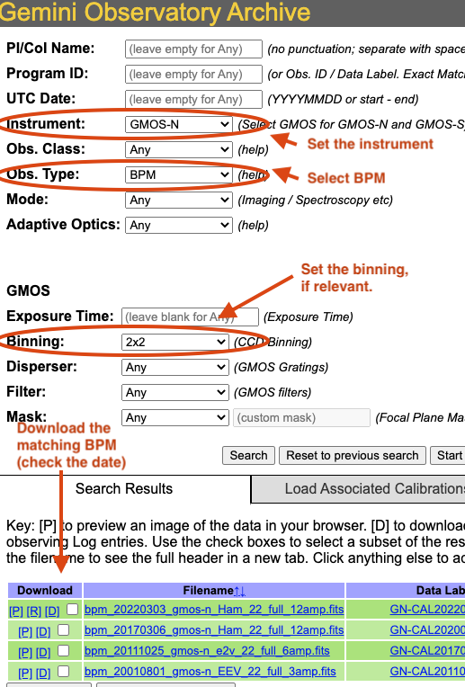
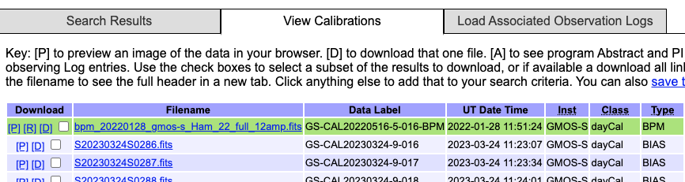

.. tips_and_tricks.rst

.. role:: raw-html(raw)
   :format: html

.. |verticalpadding| replace:: :raw-html:` `

.. _tips_and_tricks:

***************
Tips and Tricks
***************

.. _wavzero:

Adjusting the Wavelength Zeropoint
==================================

Following the wavelength calibration, the default recipe has an optional
step to adjust the wavelength zero point using the sky lines.  By default,
this step will NOT make any adjustment.  We found that in general, the
adjustment is so small as being in the noise.  If you wish to make an
adjustment, in pixels, use the ``shift`` parameter.  A value of 0 is the default and
applies no shift.  The parameter can be set to a value set my you, eg.
``-p adjustWavelengthZeroPoint:shift=1.3``.  Or, you can let the software
measure the shift for you by setting ``shift`` to ``None``.  This will trigger
the algorithm that tries to calculate the shift on it's own.

.. todo:: prepare:bad_wcs=new

.. _getBPM:

Get the BPMs
============

Getting Bad Pixel Masks from the archive
========================================
Starting with DRAGONS v3.1, the static bad pixel masks (BPMs) are now handled as
calibrations. They are downloadable from the archive instead of being packaged
with the software.  There are various ways to get the BPMs.

Note that at this time there no static BPMs for Flamingos-2 data.

.. _manualBPM:

Manual search
-------------
Ideally, the BPMs will show up in the list of associated calibrations, the
"Load Associated Calibration" tab on the archive search form (next section).
This will happen of all new data.  For old data, until we fix an issue
recently discovered, they will not show up as associated calibration.  But
they are there and can easily be found.

On the archive search form, set the "Instrument" to match your data, set the
"Obs.Type" to "BPM", if relevant for the instrument, set the "Binning".  Hit
"Search" and the list of BPMs will show up as illustrated in the figure below.

The date in the BPM file name is a "Valid-from" date.  It is valid for data
taken **on or after** that date.  Find the one most recent BPM that is valid
for your date and download (click on "D") it.  Then follow the instructions
found in the tutorial examples.

|verticalpadding|

Associated calibrations
-----------------------
The BPMs are now handled like other calibrations.  This means that they are
also downloaded from the archive.  From the archive search form, once you
have identified your science data, select the "Load Associated Calibrations"
(which turns to "View Calibrations" once the table is loaded).  The BPM will
show up with the green background.

|verticalpadding|

.. _plot_1d:

Plot a 1-D spectrum
===================
The ``dgsplot`` tool can be used to plot and inspect a 1-D spetrum in a
matplotlib window.

If you want to plot the spectrum in your own Python script, here's what
you can do.  This will use the correct WCS as opposed to the approximation
stored in FITS headers.

.. code-block:: python
    :linenos:

    import matplotlib.pyplot as plt
    import numpy as np

    import astrodata
    import gemini_instruments

    ad = astrodata.open('S20171022S0087_1D.fits')
    ad.info()

    data = ad[0].data
    wavelength = ad[0].wcs(np.arange(data.size)).astype(np.float32)
    units = ad[0].wcs.output_frame.unit[0]

    # add aperture number and location in the title.
    # check that plt.xlabel call.  Not sure it's right, it works though.
    plt.xlabel(f'Wavelength ({units})')
    plt.ylabel(f'Signal ({ad[0].hdr["BUNIT"]})')
    plt.plot(wavelength, data)
    plt.show()

Inspect the sensitivity function
================================
The sensitivity function is stored in the processed telluric star file.
To inspect the sensitivity function, you can use the following Python code.

.. code-block:: python
    :linenos:

    import numpy as np
    import matplotlib.pyplot as plt

    import astrodata
    import gemini_instruments

    from gempy.library import astromodels as am

    ad = astrodata.open('N20210407S0188_telluric.fits')
    sensfunc = am.table_to_model(ad[0].SENSFUNC)
    w = ad[0].wcs(np.arange(ad[0].data.size))
    plt.plot(w, sensfunc(w))
    plt.show()