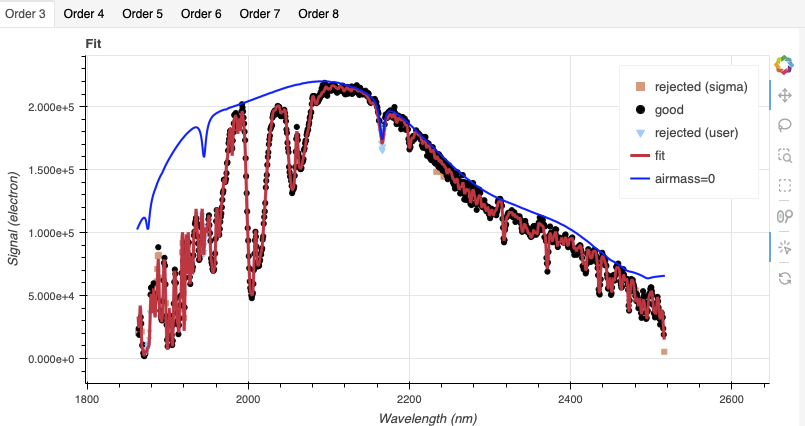
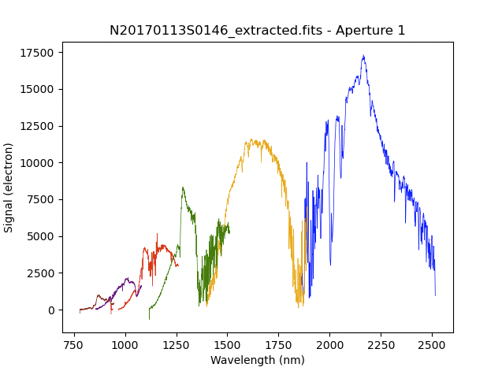
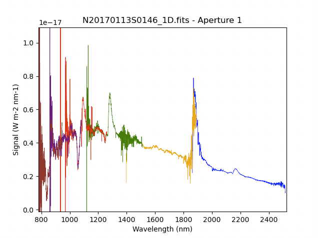

.. ex1_gnirsxd_SXD32mm_cmdline.rst

.. include:: symbols.txt

.. _gnirsxd_SXD32mm_cmdline:

*****************************************************************
Example 1 - SXD+32 Point Source - Using the "reduce" command line
*****************************************************************

In this example, we will reduce the GNIRS crossed-dispersed observation of
a supernova type II 54 days after explosion using the "|reduce|" command that
is operated directly from the unix shell.  Just open a terminal and load the
DRAGONS conda environment to get started.

This cross-dispersed observation uses the 32 l/mm grating, the short-blue
camera, and the 0.675 arcsec slit.   The dither pattern is the standard ABBA
repeated 5 times.

The dataset
===========
If you have not already, download and unpack the tutorial's data package.
Refer to :ref:`datasetup` for the links and simple instructions.

The dataset specific to this example is described in:

    :ref:`gnirsxd_SXD32mm_dataset`

Here is a copy of the table for quick reference.

+---------------------+----------------------------------------------+
| Science             || N20170113S0146-165                          |
+---------------------+----------------------------------------------+
| Science flats       || N20170113S0168-183                          |
+---------------------+----------------------------------------------+
| Pinholes            || N20170113S0569-573                          |
+---------------------+----------------------------------------------+
| Science arcs        || N20170113S0166-167                          |
+---------------------+----------------------------------------------+
| Telluric            || N20170113S0123-138                          |
+---------------------+----------------------------------------------+
| BPM                 || bpm_20121101_gnirs_gnirsn_11_full_1amp.fits |
+---------------------+----------------------------------------------+

Configuring the interactive interface
=====================================
In ``~/.dragons/``, add the following to the configuration file ``dragonsrc``::

    [interactive]
    browser = your_preferred_browser

The ``[interactive]`` section defines your preferred browser.  DRAGONS will open
the interactive tools using that browser.  The allowed strings are "**safari**",
"**chrome**", and "**firefox**".

Set up the Local Calibration Manager
====================================

.. important::  Remember to set up the calibration service.

    Instructions to configure and use the calibration service are found in
    :ref:`cal_service`, specifically the these sections:
    :ref:`cal_service_config` and :ref:`cal_service_cmdline`.

We recommend that you clean up your working directory (``playground``) and
start a fresh calibration database (``caldb init -w``) when you start a new
example.

Create file lists
=================

This data set contains science and calibration frames. For some programs, it
could contain different observed targets and different exposure times depending
on how you like to organize your raw data.

The DRAGONS data reduction pipeline does not organize the data for you.  You
have to do it.  However, DRAGONS provides tools to help you with that.

The first step is to create input file lists.  The tool "|dataselect|" helps.
It uses Astrodata tags and |descriptors| to select the files and
send the filenames to a text file that can then be fed to "|reduce|".  (See the
|astrodatauser| for information about Astrodata and for a list
of |descriptors|.)

First, navigate to the ``playground`` directory in the unpacked data package::

    cd <path>/gnirsxd_tutorial/playground

A list for the flats
--------------------
The GNIRS XD flats are obtained using two different lamps to ensure that each
order is illuminated at a sufficient level.  The software will stack each set and
automatically assemble the orders into a new flat with all orders well
illuminated.   You will use "|dataselect|" to select all the flats associated
with our science observation.

::

    dataselect ../playdata/example1/*.fits --tags FLAT -o flats.lis

A list for the pinholes
-----------------------
The orders are significantly slanted and curved on the detector.  While the
edges of the orders in the processed flat can be used to determine the
position of each order, the pinholes observations lead to a more accurate
model of the order positions.  The pinholes are taken in the same configuration
as for the science.

::

    dataselect ../playdata/example1/*.fits --tags PINHOLE -o pinholes.lis

A list for the arcs
-------------------
The GNIRS cross-dispersed arcs were obtained at the end of the science
observation.  Often two are taken.  If we decide to use both, they will be
stacked.

::

    dataselect ../playdata/example1/*.fits --tags ARC -o arcs.lis

A list for the telluric
-----------------------
DRAGONS does not recognize the telluric star as such.  This is because, at
Gemini, the observations are taken like science data and the GNIRS headers do not
explicitly state that the observation is a telluric standard.  In most cases,
the ``observation_class`` descriptor can be used to differentiate the telluric
from the science observations, along with the rejection of the ``CAL`` tag to
reject flats and arcs.

::

    dataselect ../playdata/example1/*.fits --xtags=CAL --expr='observation_class=="partnerCal"' -o telluric.lis

A list for the science observations
-----------------------------------

The science observations can be selected from the "observation class"
``science``.  This is how they are differentiated from the telluric
standards which are most often set to ``partnerCal``.

If we had multiple targets, we would need to split them into separate lists. To
inspect what we have we can use |dataselect| and |showd| together.

::

    dataselect ../playdata/example1/*.fits --expr='observation_class=="science"' | showd -d object

    --------------------------------------------------
    filename                                    object
    --------------------------------------------------
    ../playdata/example1/N20170113S0146.fits   DLT16am
    ../playdata/example1/N20170113S0147.fits   DLT16am
    ../playdata/example1/N20170113S0148.fits   DLT16am
    ...
    ../playdata/example1/N20170113S0163.fits   DLT16am
    ../playdata/example1/N20170113S0164.fits   DLT16am
    ../playdata/example1/N20170113S0165.fits   DLT16am

Here we only have one object from the same sequence.  If we had multiple
objects we could add the object name in the expression.

::

    dataselect ../playdata/example1/*.fits --expr='observation_class=="science" and object=="DLT16am"' -o sci.lis

Bad Pixel Mask
==============
The bad pixel masks (BPMs) are handled as
calibrations.  They are downloadable from the archive instead of being
packaged with the software. They are automatically associated like any other
calibrations.  This means that the user now must download the BPMs along with
the other calibrations and add the BPMs to the local calibration manager.

See :ref:`getBPM` in :ref:`tips_and_tricks` to learn about the various ways
to get the BPMs from the archive.

To add the static BPM included in the data package to the local calibration
database:

::

    caldb add ../playdata/example1/bpm*.fits

Master Flat Field
=================
GNIRS XD flat fields are normally obtained at night along with the
observation sequence to match the telescope and instrument flexure.  The
processed flat is constructed from two sets of stacked lamp-on flats, each
illuminated
differently to ensure that all orders in the reassembled flat are well
illuminated.  You do not have to worry about the details, as long as you
pass the two sets of raw flats as input to the ``reduce`` command, the software will take
care of the assembly.

The processed flat will also contain the illumination mask that identify the location
of the illuminated areas in the array, ie, where the orders are located.

::

    reduce @flats.lis

GNIRS data are affected by a "odd-even" effect where alternate rows in the
GNIRS science array have gains that differ by approximately 10 percent.  When
you run ``normalizeFlat`` in interactive mode you can clearly see the two
levels.

In interactive mode, the objective is to get a fit that falls inbetween the
two sets of points, with a symmetrical residual fit.  You can inspect each
order by selecting the tabs above the plot.

Note that you are not required to run in interactive mode, but you might want
to if flat fielding is critical to your program.

::

    reduce @flats.lis -p interactive=True

The interactive tools are introduced in section :ref:`interactive`.

.. image:: _graphics/gnirsxd_evenoddflat.png
   :width: 600
   :alt: Even-odd effect in flats

Processed Pinholes - Rectification
==================================
The pinholes are used to determine the rectification of the slanted and  curved
orders. A pinhole observation looks like this:

The rectification model is calculated by tracing the dispersed image of each
pinhole in each order.

::

    reduce @pinholes.lis

Processed Arc - Wavelength Solution
===================================
Obtaining the wavelength solution for GNIRS cross-dispersed data can be a
complicated topic.  The quality of the results and what to use depend greatly
on the wavelength regime and the grating.

Our configuration in this example is cross-dispersed with short-blue camera
and the 32 l/mm grating.  This configuration generally has a sufficient number
of lines available in all the orders.

.. todo::  TBD whether we need a wavecal guide. (See :ref:`gnirsls_wavecal_guide`.)

The illumination mask will be obtained from the processed flat.  The
processed pinhole will provide the distortion correction.

::

    reduce @arcs.lis

The primitive ``determineWavelengthSolution``, used in the recipe, has an
interactive mode. To activate the interactive mode:

::

    reduce @arcs.lis -p interactive=True

The interactive tools are introduced in section :ref:`interactive`.

.. todo:: add interactive page.

Each order can be inspected individually by selecting the tabs above the plot.

The general shape of the fit for each order should look like this:

For this dataset, the fit for Order 7 is much improved by deleting ('d') the
blue-most identification. Below are the plots before and after the deletion
of the misidentified line.

         blue-most line.

         blue-most line.

Telluric Standard
=================
The telluric standard observed before the science observation is "hip 17030".
The spectral type of the star is A0V.

To properly calculate and fit a telluric model to the star, we need to know
its effective temperature.  To properly scale the sensitivity function (to
use the star as a spectrophotometric standard), we need to know the star's
magnitude.  Those are inputs to the ``fitTelluric`` primitive.

The default effective temperature of 9650 K is typical of an A0V star, which
is the most common spectral type used as a telluric standard. Different
sources give values between 9500 K and 9750 K and, for example,
Eric Mamajek's list "A Modern Mean Dwarf Stellar Color and Effective
Temperature Sequence"
(https://www.pas.rochester.edu/~emamajek/EEM_dwarf_UBVIJHK_colors_Teff.txt)
quotes the effective temperature of an A0V star as 9700 K. The precise
value has only a small effect on the derived sensitivity and even less
effect on the telluric correction, so the temperature from any reliable
source can be used. Using Simbad, we find that the star has a magnitude
of K=9.244.

Instead of typing the values on the command line, we will use a parameter file
to store them.  In a normal text file (here we name it "hip17030.param"), we write::

    -p
    fitTelluric:bbtemp=9700
    fitTelluric:magnitude='K=9.244'

Then we can call the ``reduce`` command with the parameter file.  The telluric
fitting primitive can be run in interactive mode.

Note that the data are recognized by Astrodata as normal GNIRS cross-dispersed
science spectra.  To calculate the telluric correction, we need to specify the
telluric recipe (``-r reduceTelluric``), otherwise the default science
reduction will be run.

::

    reduce @telluric.lis -r reduceTelluric @hip17030.param -p fitTelluric:interactive=True

The fit for Order 3 looks like this:

Order 8 needs some discussion.  You will notice many rejected data points marked
as light blue triangle.  The software by default rejects those points because
the stellar features in that part of the spectrum are notoriouly difficult to
model.

In our case, the model and the star do fit remarkably well, so we can
reactivate those points and give the software more points to fit.  On the top
plot, use the
box selection tool (the dotted line square) to include the blue triangles and
type "u" to unmask them and reactivate them.

Science Observations
====================
The science target is a supernova type II 54 days after explosion.  The sequence
is 5 ABBA dither pattern. DRAGONS will flatfield, wavelength calibrate,
subtract the sky, stack the aligned spectra, extract the source, and finally
remove telluric features and flux calibrate.

.. note::  In this observation, there is only one real source to extract.  If there
   were multiple sources in the slit, regardless of whether they are of
   interest to the program or not, DRAGONS will locate them, trace them, and extract
   them automatically. Each extracted spectrum is stored in an individual
   extension in the output multi-extension FITS file.

This is what one raw image looks like.

What you see are from left to right the cross-dispersed orders, from Order 3
to Order 8.  The short horizontal features are sky lines.  The "vertical lines"
are the dispersed science target in each order.  In the raw data, the red end
is at the bottom and blue at the top.  This will be reversed when the data is
resampled and the distortion corrected and wavelength calibration are applied.

With all the calibrations in the local calibration manager, one only needs
to call |reduce| on the science frames to get an extracted spectrum.

::

    reduce @sci.lis

To run the reduction with all the interactive tools activated, set the
``interactive`` parameter to ``True``.

::

    reduce @sci.lis -p interactive=True

At the ``skyCorrectFromSlit`` step, you will notice that the fit for Order 8
is not very good.  The row being sampled is in the middle of the image.  If
you look at the raw image, you will see that there is not much signal for
Order in the middle row.  Increase the row number (the data has been resampled
and flipped at this point) using the slider at the top-left of the tool and
you will see that when there is signal the fit is good.

When you get to the ``telluricCorrect`` step, you can experiment with the
shift between the telluric standard and the target.  Both need to be well
aligned in wavelength to optimize the correction.  In this case, we find
that a shift of 0.55 pixels significantly improves the correction.

.. image:: _graphics/gnirsxd_SXD32mm_2d.png
   :align: right
   :width: 200
   :alt: 2D spectrum

A section of 2D spectrum before extraction is shown on the right, with blue wavelengths at
the bottom and the red-end at the top.  Note that each order has been rectified
and is being stored in separate extensions in the MEF file.  Here they are
displayed together, side by side.  (``reduce -r display N20170113S0146_2D.fits``,
launch DS9 first.)

Each order is extracted separately and stored in separate extensions in the
MEF file.  The 1D extracted spectrum before telluric correction or flux
calibration, obtained by adding the option
``-p extractSpectra:write_outputs=True`` to the ``reduce`` call.  You can
plot all the orders on a common plot with ``dgsplot``. (The ``--thin`` option
simply plots a thinner line than the default width.)

::

    dgsplot N20170113S0146_extracted.fits 1 --thin

The 1D extracted spectrum after telluric correction but before flux
calibration, obtained with ``-p telluricCorrect:write_outputs=True``, looks
like this.

.. image:: _graphics/gnirsxd_SXD32mm_tellcor.png
   :width: 600
   :alt: 1D extracted spectrum after telluric correction or before flux calibration

And the final spectrum, corrected for telluric features and flux calibrated.

::

    dgsplot N20170113S0146_1D.fits 1 --thin

In the final spectrum, the orders are remain separated.  Here they are simply
plotted one after the other on a common plot.  If you need to stitch the order,
and maybe stack the common wavelength ranges, you will have to do that with
your own software.

