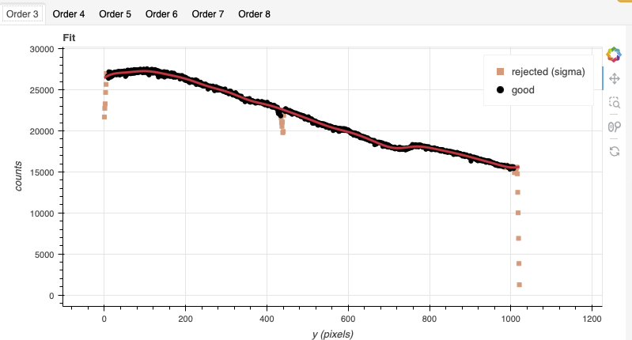
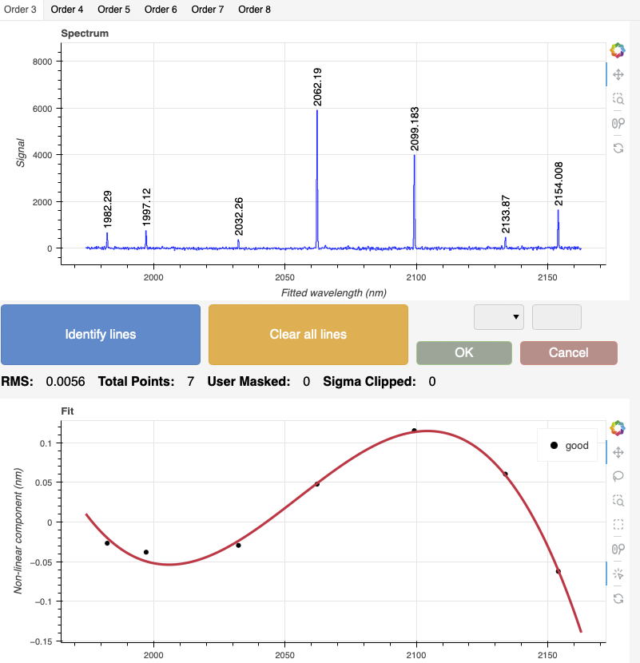
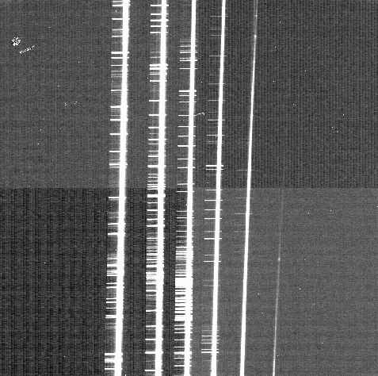
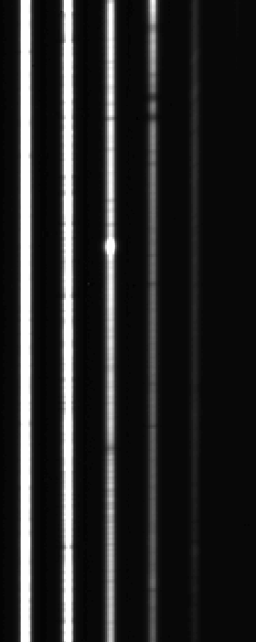
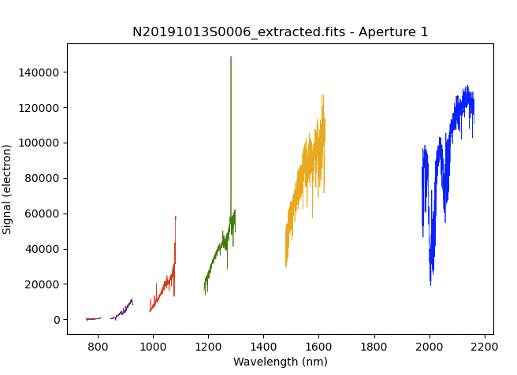
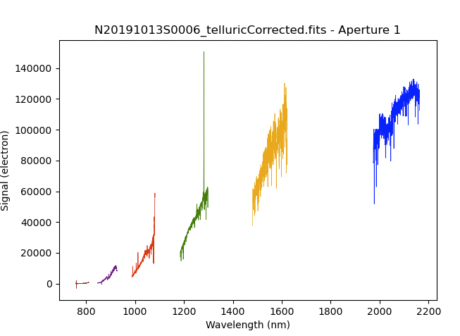
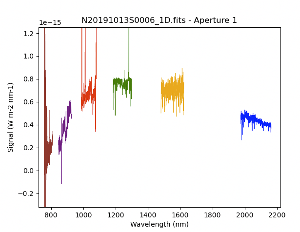
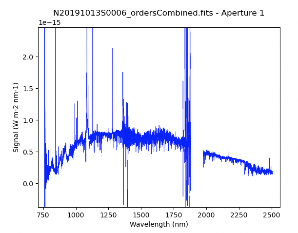

.. ex2_gnirsxd_SXD111mm_api.rst

.. include:: symbols.txt

.. |br| raw:: html

    

.. _gnirsxd_SXD111mm_api:

***************************************************************
Example 2 - SXD+111 Point Source - Using the "Reduce" class API
***************************************************************

In this example, we will reduce the GNIRS crossed-dispersed observation of
an erupting recurrent nova using the DRAGONS API.

This cross-dispersed observation uses the 111 l/mm grating, the short-blue
camera and the 0.3 arcsec slit.  The dither pattern is the standard ABBA, one
set for each of the three central wavelength settings.  The results from the
three wavelength settings will be stitched together at the end.

The dataset
===========
If you have not already, download and unpack the tutorial's data package.
Refer to :ref:`datasetup` for the links and simple instructions.

The dataset specific to this example is described in:

    :ref:`gnirsxd_SXD32mm_dataset`

Here is a copy of the table for quick reference.

+---------------------+----------------------------------------------+
| Science             || N20191013S0006-09  (1.55 |um|)              |
|                     || N20191013S0010-13  (1.68 |um|)              |
|                     || N20191013S0014-17  (1.81 |um|)              |
+---------------------+----------------------------------------------+
| Science flats       || N20191013S0036-51 (1.55 |um|)               |
|                     || N20191013S0054-69 (1.68 |um|)               |
|                     || N20191013S0072-87 (1.81 |um|)               |
+---------------------+----------------------------------------------+
| Pinholes            || None available                              |
+---------------------+----------------------------------------------+
| Science arcs        || N20191013S0034-35 (1.55 |um|)               |
|                     || N20191013S0052-53 (1.68 |um|)               |
|                     || N20191013S0070-71 (1.81 |um|)               |
+---------------------+----------------------------------------------+
| Telluric            || N20191013S0022-25 (1.55 |um|)               |
|                     || N20191013S0026-29 (1.68 |um|)               |
|                     || N20191013S0030-33 (1.81 |um|)               |
+---------------------+----------------------------------------------+
| BPM                 || bpm_20121101_gnirs_gnirsn_11_full_1amp.fits |
+---------------------+----------------------------------------------+

Configuring the interactive interface
=====================================
In ``~/.dragons/``, add the following to the configuration file ``dragonsrc``::

    [interactive]
    browser = your_preferred_browser

The ``[interactive]`` section defines your preferred browser.  DRAGONS will open
the interactive tools using that browser.  The allowed strings are "**safari**",
"**chrome**", and "**firefox**".

Importing libraries
===================

.. code-block:: python
    :linenos:

    import glob

    import astrodata
    import gemini_instruments
    from recipe_system.reduction.coreReduce import Reduce
    from gempy.adlibrary import dataselect

The ``dataselect`` module will be used to create file lists for the
biases, the flats, the arcs, the telluric star, and the science observations.
The ``Reduce`` class is used to set up and run the data
reduction.

Setting up the logger
=====================
We recommend using the DRAGONS logger.  (See also :ref:`double_messaging`.)

.. code-block:: python
    :linenos:
    :lineno-start: 7

    from gempy.utils import logutils
    logutils.config(file_name='gnirsls_tutorial.log')

Set up the Local Calibration Manager
====================================

.. important::  Remember to set up the calibration service.

    Instructions to configure and use the calibration service are found in
    :ref:`cal_service`, specifically the these sections:
    :ref:`cal_service_config` and :ref:`cal_service_api`.

We recommend that you clean up your working directory (``playground``) and
create a fresh calibration database (``caldb.init(wipe=True)``) when you
start a new example.

Create file lists
=================

This data set contains science and calibration frames. For some programs, it
could contain different observed targets and different exposure times depending
on how you like to organize your raw data.

The DRAGONS data reduction pipeline does not organize the data for you.  You
have to do it.  However, DRAGONS provides tools to help you with that.

The first step is to create input file lists.  The tool "|dataselect|" helps.
It uses Astrodata tags and |descriptors| to select the files and
send the filenames to a text file that can then be fed to "Reduce".  (See the
|astrodatauser| for information about Astrodata and for a list
of |descriptors|.)

The first step is to create input file lists.  The tool "|dataselect|" helps.
It uses Astrodata tags and |descriptors| to select the files and
send the filenames to a text file that can then be fed to ``Reduce``.  (See the
|astrodatauser| for information about Astrodata and for a list
of |descriptors|.)

The first list we create is a list of all the files in the ``playdata``
directory.

.. code-block:: python
    :linenos:
    :lineno-start: 9

    all_files = glob.glob('../playdata/example2/*.fits')
    all_files.sort()

We will search that list for files with specific characteristics.  We use
the ``all_files`` :class:`list` as an input to the function
``dataselect.select_data()`` .  The function's signature is::

    select_data(inputs, tags=[], xtags=[], expression='True')

We show several usage examples below.

Three lists for the flats
-------------------------
The GNIRS XD flats are obtained using two different lamps to ensure that each
order is illuminated at a sufficient level.  The software will stack each set
and automatically assemble the orders into a new flat with all orders well
illuminated.

The particularily of this dataset is that there are three central wavelength
settings that each need to be reduced separately.

You will use "|dataselect|" to select each set of flats associated with the
configurations used for the science observations.

But first, to see which central wavelengths have been used, run |showd| on
the flats.

.. code-block:: python
    :linenos:
    :lineno-start: 11

    for filename in dataselect.select_data(all_files, ['FLAT']):
        ad = astrodata.open(filename)
        print(filename, ad.central_wavelength())

::

    ../playdata/example2/N20191013S0036.fits 1.55e-06
    ../playdata/example2/N20191013S0037.fits 1.55e-06
    ...
    ../playdata/example2/N20191013S0054.fits 1.68e-06
    ../playdata/example2/N20191013S0055.fits 1.68e-06
    ...
    ../playdata/example2/N20191013S0072.fits 1.81e-06
    ../playdata/example2/N20191013S0073.fits 1.81e-06

.. code-block:: python
    :linenos:
    :lineno-start: 14

    flats155 = dataselect.select_data(all_files, ['FLAT'], [],
                        dataselect.expr_parser('central_wavelength==1.55e-6'))
    flats168 = dataselect.select_data(all_files, ['FLAT'], [],
                        dataselect.expr_parser('central_wavelength==1.68e-6'))
    flats181 = dataselect.select_data(all_files, ['FLAT'], [],
                        dataselect.expr_parser('central_wavelength==1.81e-6'))

Note that we have downloaded only the October data from that program.  If
the September data were also in our raw data directory, we would have to add
a date constraint to the expression, like this::

    flats155Oct = dataselect.select_data(all_files, ['FLAT'], [],
            dataselect.expr_parser('central_wavelength==1.55e-6 and ut_date=="2019-10-13"'))

A list for the pinholes
-----------------------
This program does not use a pinholes observation.

The orders in the cross-dispersed raw data are significantly slanted and curved
on the detector.  A pinhole would trace that curvature.

However, the edges of the orders in the processed flat can be used to determine
the position of each order, the pinholes observations simply lead to a more
accurate model of the order positions and of the spatial distortion component.

We do not have pinholes, therefore all steps related to pinholes, their creation
and their usage will be skipped in this tutorial.

If you had pinholes, you would select them like for the flats above using
"PINHOLE" instead of "FLAT".

Three lists for the arcs
------------------------
The GNIRS cross-dispersed arcs were obtained between the telluric and the
science observation.  Often two are taken for each configuration.  If we
decide to use both, they will be stacked.

Here, like for the flats, we need to create a list for each of the three
configurations.

.. code-block:: python
    :linenos:
    :lineno-start: 20

    arcs155 = dataselect.select_data(all_files, ['ARC'], [],
                        dataselect.expr_parser('central_wavelength==1.55e-6'))
    arcs168 = dataselect.select_data(all_files, ['ARC'], [],
                        dataselect.expr_parser('central_wavelength==1.68e-6'))
    arcs181 = dataselect.select_data(all_files, ['ARC'], [],
                        dataselect.expr_parser('central_wavelength==1.81e-6'))

Three lists for the telluric
----------------------------
DRAGONS does not recognize the telluric star as such.  This is because, at
Gemini, the observations are taken like science data and the GNIRS headers do not
explicitly state that the observation is a telluric standard.  In most cases,
the ``observation_class`` descriptor can be used to differentiate the telluric
from the science observations, along with the rejection of the ``CAL`` tag to
reject flats and arcs.  Telluric stars will be observed under the ``partnerCal``
or ``progCal`` classes, the science observation under the ``science`` class.

.. code-block:: python
    :linenos:
    :lineno-start: 26

    tellurics155 = dataselect.select_data(
        all_files,
        [],
        ['CAL'],
        dataselect.expr_parser('observation_class!="science" and central_wavelength==1.55e-6')
    )
    tellurics168 = dataselect.select_data(
        all_files,
        [],
        ['CAL'],
        dataselect.expr_parser('observation_class!="science" and central_wavelength==1.68e-6')
    )
    tellurics181 = dataselect.select_data(
        all_files,
        [],
        ['CAL'],
        dataselect.expr_parser('observation_class!="science" and central_wavelength==1.81e-6')
    )

A list for the science observations
-----------------------------------

The science observations can be selected from the "observation class"
``science``.  This is how they are differentiated from the telluric
standards which are set to ``partnerCal`` or ``progCal``.

We already know that we have multiple central_wavelength settings and that we
will need a list of each.

If we had multiple targets, we would need to split them into separate lists
using the ``object`` descriptor.  Here we only have one target.

.. code-block:: python
    :linenos:
    :lineno-start: 44

    science155 = dataselect.select_data(
        all_files,
        [],
        ['CAL'],
        dataselect.expr_parser('observation_class=="science" and central_wavelength==1.55e-6')
    )
    science168 = dataselect.select_data(
        all_files,
        [],
        ['CAL'],
        dataselect.expr_parser('observation_class=="science" and central_wavelength==1.68e-6')
    )
    science181 = dataselect.select_data(
        all_files,
        [],
        ['CAL'],
        dataselect.expr_parser('observation_class=="science" and central_wavelength==1.81e-6')
    )

Bad Pixel Mask
==============
The bad pixel masks (BPMs) are handled as calibrations.  They are downloadable
from the archive instead of being packaged with the software. They are
automatically associated like any other calibrations.  This means that the
user now must download the BPMs along with the other calibrations and add the
BPMs to the local calibration manager.

See :ref:`getBPM` in :ref:`tips_and_tricks` to learn about the various ways
to get the BPMs from the archive.

To add the static BPM included in the data package to the local calibration
database:

.. code-block:: python
    :linenos:
    :lineno-start: 62

    for bpm in dataselect.select_data(all_files, ['BPM']):
        caldb.add_cal(bpm)

Master Flat Field
=================
GNIRS XD flat fields are normally obtained at night along with the
observation sequence to match the telescope and instrument flexure.  The
processed flat is constructed from two sets of stacked lamp-on flats, each
exposed differently to ensure that all orders in the reassembled flat are
well illuminated.  You do not have to worry about the details, as long as you
pass the two sets of raw flats as input to the ``Reduce`` instance, the software
will take care of the assembly.

The processed flat will also contain the illumination mask that identify the
location of the illuminated areas in the array, ie, where the orders are
located.  By tracing the edges of the illuminated areas, a rectification
model is also calculated.

Each central wavelength settings must be reduced separately.

.. code-block:: python
    :linenos:
    :lineno-start: 64

    reduce_flats155 = Reduce()
    reduce_flats155.files.extend(flats155)
    reduce_flats155.runr()

    reduce_flats168 = Reduce()
    reduce_flats168.files.extend(flats168)
    reduce_flats168.runr()

    reduce_flats181 = Reduce()
    reduce_flats181.files.extend(flats181)
    reduce_flats181.runr()

It might be useful to run the flat reduction in interactive mode.  Also, in
this case, using ``('normalizeFlat:grow', 2)`` helps rejecting the pixels near
the edge and ensure a smoother fit.  You can play with the other parameters
too.

.. code-block:: python
    :linenos:
    :lineno-start: 75

    reduce_flats155 = Reduce()
    reduce_flats155.files.extend(flats155)
    reduce_flats155.uparms = dict([
                            ('normalizeFlat:grow', 2),
                            ('interactive', True),
                            ])
    reduce_flats155.runr()

    reduce_flats168 = Reduce()
    reduce_flats168.files.extend(flats168)
    reduce_flats168.uparms = dict([
                            ('normalizeFlat:grow', 2),
                            ('interactive', True),
                            ])
    reduce_flats168.runr()

    reduce_flats181 = Reduce()
    reduce_flats181.files.extend(flats181)
    reduce_flats181.uparms = dict([
                            ('normalizeFlat:grow', 2),
                            ('normalizeFlat:niter', 2),
                            ('interactive', True),
                            ])
    reduce_flats181.runr()

The interactive tools are introduced in section :ref:`interactive`.

.. note::  In some data the "odd-even effect", some noise pattern affecting
           odd and even rows differently cannot not be perfectly corrected.
           In those cases, you will see the black dots define two separated
           signal trace.  Get the fit to trace the middle.  In most cases,
           the effect in science and telluric data is removed during the flat
           fielding.

Processed Pinholes - Rectification
==================================
The pinholes are used to determine the rectification of the slanted and curved
orders.

This program does not have pinholes associated with it.  It is okay, the
edges of the orders have been traced when the flats were reduced.  This
can be used for the rectification.  The spatial axis is not as well sampled
but depending on the science using just the edges from the flat can be
sufficient.

Since the ``attachPinholeRectification`` step will have to be skipped for
all the recipes that requests it, let's save ourselves some typing and let's
put that instructions dictionary that we can attach later to our ``Reduce``
instance.

.. code-block:: python
    :linenos:
    :lineno-start: 99

    nopinhole = dict([('attachPinholeRectification:skip_primitive', True)])

If you had pinhole observation, just like the flats they would need to be
reduced each configuration separately.

Wavelength Solution
===================
Obtaining the wavelength solution for GNIRS cross-dispersed data can be a
complicated topic.  The quality of the results and whether to use arc lamp or
sky lines depends greatly on the wavelength regime and the grating.

.. caution::
     Do pay great attention to the wavelength calibration. It is critical
     to the telluric modelling.  It can be particularly challenging with the
     111 l/mm grating given the limited wavelength range each order covers.

Our configurations in this example is cross-dispersed with short-blue camera,
the SXD prism, and the 111 l/mm grating.  With this grating, each order covers
only a short wavelength range.  Some orders will not contain a sufficient
number of lines from the arc lamp.  In some cases, we will have to use the
sky emission lines, or even the telluric absorption features to get an
accurate enough wavelength solution for an order.

.. note:: The current software calculates a wavelength solution for each order
          separately.  A "2D solution" that would use all the lines from all
          the orders together is not yet available.

.. Please refer to the :ref:`gnirsls_wavecal_guide` for additional guidance and
    for a chart that illustrates how we arrived at the decisions we are applying
    here.

Summary of the Technique for Science Quality
--------------------------------------------
The wavelength calibration is critical to the telluric modelling.  In fact, the
best way to know which wavelength solutions work for each order and which ones
do not is to run ``fitTelluric`` interactively and see if the modeling works
well or not.

For quicklook results, you might not care to go through the trouble, but for a
science quality product, you will have to go through the following steps.

For each central wavelength setting:

1. Produce a wavelength solution from the arc lamp.
2. Produce a wavelength solution from the sky emission lines in the science
   data.
3. Launch the telluric star reduction in interactive mode.
  a. First using the arc lamp solution.   Inspect each order.  Identify
     which one works, which one does not.
  b. Then using the sky lines solution.  Inspect each order.  Identify
     which one works, which one does not.
4. Piece together the best solutions for each order and add this "processed arc"
   to the calibration database.
5. Clean up the calibration database of the arc and sky lines solutions, leaving
   only the ones built during Step 4.

Later, you will be doing the "official" reduction of the telluric star and the
reduction of the science target using the wavelength solution put together in
step 4.  It will be picked up automatically.

.. hint:: It is expected that for a set of H-band central wavelengths, like this
         case, sky emission lines will provide the most comprehensive coverage.
         It is not complete however and it will need to be complemented with
         arc lamp solutions.

Solution from the Arc Lamp
--------------------------
During the processing of the arc, the illumination mask and the rectification
model will be obtained from the processed flat.

.. code-block:: python
    :linenos:
    :lineno-start: 100

    reduce_arcs155 = Reduce()
    reduce_arcs155.files.extend(arcs155)
    reduce_arcs155.uparms = dict([
                        ('interactive', True),
                        ]) | nopinhole
    reduce_arcs155.runr()

    reduce_arcs168 = Reduce()
    reduce_arcs168.files.extend(arcs168)
    reduce_arcs168.uparms = dict([
                        ('interactive', True),
                        ]) | nopinhole
    reduce_arcs168.runr()

    reduce_arcs181 = Reduce()
    reduce_arcs181.files.extend(arcs181)
    reduce_arcs181.uparms = dict([
                        ('interactive', True),
                        ]) | nopinhole
    reduce_arcs181.runr()

The interactive tools are introduced in section :ref:`interactive`.

Each order can be inspected individually by selecting the tabs above the plot.

The general shape of the fit for each order should look like this:

While the solutions from the arc lamp are not so bad for central wavelength
1.55 and 1.68 |um|, they are quite bad in general for the 1.81 |um| setting.

Solution from Sky Emission Lines
--------------------------------
If the exposure times are long enough, chances are that the OH and
O\ :sub:`2`\  sky lines are your best bet to get a good solution in most
orders at most H-band settings, especially if you do not need Order 7 and 8.

.. code-block:: python
    :linenos:
    :lineno-start: 120

    reduce_skyarcs155 = Reduce()
    reduce_skyarcs155.files.extend(science155)
    reduce_skyarcs155.recipename = 'makeWavecalFromSkyEmission'
    reduce_skyarcs155.uparms = dict([
                        ('interactive', True),
                        ]) | nopinhole
    reduce_skyarcs155.runr()

    reduce_skyarcs168 = Reduce()
    reduce_skyarcs168.files.extend(science168)
    reduce_skyarcs168.recipename = 'makeWavecalFromSkyEmission'
    reduce_skyarcs168.uparms = dict([
                        ('interactive', True),
                        ]) | nopinhole
    reduce_skyarcs168.runr()

    reduce_skyarcs181 = Reduce()
    reduce_skyarcs181.files.extend(science181)
    reduce_skyarcs181.recipename = 'makeWavecalFromSkyEmission'
    reduce_skyarcs181.uparms = dict([
                        ('interactive', True),
                        ]) | nopinhole
    reduce_skyarcs181.runr()

For the 1.55 |um| setting, beware that the automatic solution for Order 7 is
completely wrong.  Delete all the lines and identify them manually.  Remember
to set the fit order to 3 once you have identified a few lines.  Order 8 has
no solution since there are no lines.  It will use an approximate linear solution
to complete.  We will not be using it anyway in this case since the arc solution
for Order 8 is reasonable.

For the 1.68 |um| and 1.81 |um| settings, the solutions are generally good
except for Order 8 where the lines needs to be added manually.

Verifying the Solutions with fitTelluric
----------------------------------------
We will verify the solutions we calculated above.  We have:

+------------------------+-------------------------+
| Arc at 1.55 |um|       | N20191013S0034_arc.fits |
+------------------------+-------------------------+
| Arc at 1.68 |um|       | N20191013S0052_arc.fits |
+------------------------+-------------------------+
| Arc at 1.81 |um|       | N20191013S0070_arc.fits |
+------------------------+-------------------------+
| Sky lines at 1.55 |um| | N20191013S0006_arc.fits |
+------------------------+-------------------------+
| Sky lines at 1.68 |um| | N20191013S0010_arc.fits |
+------------------------+-------------------------+
| Sky lines at 1.81 |um| | N20191013S0014_arc.fits |
+------------------------+-------------------------+

We need to run ``fitTelluric`` with each one and assess the quality of the
model for each order.   We use the ``ucals`` atrribute to override the
automatic "proccessed arc" selection.

We need to use information about the star like the temperature and
the magnitude.   See the section about the modeling of the telluric
below for more details.   For now, create a dictionary named ``hip94510``
with this content

.. code-block:: python
    :linenos:
    :lineno-start: 143

    hip94510 = dict([('fitTelluric:bbtemp', 9700),
                     ('fitTelluric:magnitude', 'K=6.754')
                   ])

For 1.55 |um|
+++++++++++++
You can "Abort" ``fitTelluric`` when you are done with the inspection.

.. code-block:: python
    :linenos:
    :lineno-start: 146

    reduce_tel155 = Reduce()
    reduce_tel155.files.extend(tellurics155)
    reduce_tel155.recipename = 'reduceTelluric'
    reduce_tel155.uparms = dict([
                                  ('fitTelluric:interactive', True),
                                 ]) | hip94510 | nopinhole
    reduce_tel155.ucals = dict([('processed_arc', 'N20191013S0034_arc.fits')])
    reduce_tel155.runr()

You will see that the "ringing" in the deep telluric features is well fit.
Order 3 to 5, and Order 8 give a good result.  In Order 6 and 7, the wavelength
scale is clearly offset and the model is wrong.

.. code-block:: python
    :linenos:
    :lineno-start: 154

    reduce_tel155 = Reduce()
    reduce_tel155.files.extend(tellurics155)
    reduce_tel155.recipename = 'reduceTelluric'
    reduce_tel155.uparms = dict([
                                  ('fitTelluric:interactive', True),
                                 ]) | hip94510 | nopinhole
    reduce_tel155.ucals = dict([('processed_arc', 'N20191013S0006_arc.fits')])
    reduce_tel155.runr()

The ringing is not as well fit, if at all when using the solution from the sky
lines.  However, the fits for Order 6 and 7 are good.

**CONCLUSION**

+-----------------------------------------------------------+
| For 1.55 |um|, use the arc solution for Order 3-5, 8, and |
| the sky solution for Order 6 and 7.                       |
+-----------------------------------------------------------+

----

Here are examples of what to look for.  First for Order 3, we can see that the
model follows the ringing quite well with the arc solution and not well at all
with the sky solution, even after adjust the LSF scaling factor to match what
is used for the arc solution (1.06).

.. list-table::
    :widths: 50 50
    :class: borderless

    * - .. image:: _graphics/gnirsxd_SXD111_155_tell3_arc.png
           :width: 100%
           :alt: Order 3 telluric fit using arc solution
      - .. image:: _graphics/gnirsxd_SXD111_155_tell3_sky.png
           :width: 100%
           :alt: Order 3 telluric fit using sky solution

----

The second example is for Order 7, where the sky solution on the right is, while
not perfect, clearly better.

.. list-table::
    :widths: 50 50
    :class: borderless

    * - .. image:: _graphics/gnirsxd_SXD111_155_tell7_arc.png
           :width: 100%
           :alt: Order 7 telluric fit using arc solution

      - .. image:: _graphics/gnirsxd_SXD111_155_tell7_sky.png
           :width: 100%
           :alt: Order 7 telluric fit using sky solution

For 1.68 |um|
+++++++++++++

.. code-block:: python
    :linenos:
    :lineno-start: 162

    reduce_tel168 = Reduce()
    reduce_tel168.files.extend(tellurics168)
    reduce_tel168.recipename = 'reduceTelluric'
    reduce_tel168.uparms = dict([
                                  ('fitTelluric:interactive', True),
                                 ]) | hip94510 | nopinhole
    reduce_tel168.ucals = dict([('processed_arc', 'N20191013S0052_arc.fits')])
    reduce_tel168.runr()

The solutions from arc are reasonable for all orders.  However, we will see
that the sky lines are doing better for Orders 3-7.

.. code-block:: python
    :linenos:
    :lineno-start: 170

    reduce_tel168 = Reduce()
    reduce_tel168.files.extend(tellurics168)
    reduce_tel168.recipename = 'reduceTelluric'
    reduce_tel168.uparms = dict([
                                  ('fitTelluric:interactive', True),
                                 ]) | hip94510 | nopinhole
    reduce_tel168.ucals = dict([('processed_arc', 'N20191013S0010_arc.fits')])
    reduce_tel168.runr()

From the sky lines, Order 8 is not usable.  But overall, the fit for the Orders
are better than from the arc lamp solution.

**CONCLUSION**

+------------------------------------------------------+
| For 1.68 |um|, use the arc solution for Order 8, and |
| the sky solution for Orders 3 to 7.                  |
+------------------------------------------------------+

While the differences can be obvious like for Order 8, some might be a little
more subtle.  For example, here we compare Order 3.  The model calculated with
the arc solution, on the left, is more noisy than the one with the sky solution
on the right.

.. list-table::
    :widths: 50 50
    :class: borderless

    * - .. image:: _graphics/gnirsxd_SXD111_168_tell3_arc.png
           :width: 100%
           :alt: Order 3 telluric fit using arc solution

      - .. image:: _graphics/gnirsxd_SXD111_168_tell3_sky.png
           :width: 100%
           :alt: Order 3 telluric fit using sky solution

For 1.81 |um|
+++++++++++++

.. code-block:: python
    :linenos:
    :lineno-start: 178

    reduce_tel181 = Reduce()
    reduce_tel181.files.extend(tellurics181)
    reduce_tel181.recipename = 'reduceTelluric'
    reduce_tel181.uparms = dict([
                                  ('fitTelluric:interactive', True),
                                 ]) | hip94510 | nopinhole
    reduce_tel181.ucals = dict([('processed_arc', 'N20191013S0070_arc.fits')])
    reduce_tel181.runr()

For Order 4 and 7, the model from the arc solution is clearly erroneous.  Order
8 is not great but it is usable and will have to do since Order 8 from the sky
lines is clearly wrong at the blue end.

.. code-block:: python
    :linenos:
    :lineno-start: 186

    reduce_tel181 = Reduce()
    reduce_tel181.files.extend(tellurics181)
    reduce_tel181.recipename = 'reduceTelluric'
    reduce_tel181.uparms = dict([
                                  ('fitTelluric:interactive', True),
                                 ]) | hip94510 | nopinhole
    reduce_tel181.ucals = dict([('processed_arc', 'N20191013S0014_arc.fits')])
    reduce_tel181.runr()

With the sky line solution, it is Order 8 that is bad.  The other Orders are
good.   The telluric fit for Order 3 is good, it is the continuum that is
a bit off.  We will deal with that later when we calculate the model using
our final wavelength solutions.

**CONCLUSION**

+------------------------------------------------------+
| For 1.81 |um|, use the arc solution for Order 8, and |
| the sky solution for Orders 3 to 7.                  |
+------------------------------------------------------+

Here is what is seen for Order 8 for the models using the arc solution (left)
and the sky solution (right).

.. list-table::
    :widths: 50 50
    :class: borderless

    * - .. image:: _graphics/gnirsxd_SXD111_181_tell8_arc.png
           :width: 100%
           :alt: Order 8 telluric fit using arc solution

      - .. image:: _graphics/gnirsxd_SXD111_181_tell8_sky.png
           :width: 100%
           :alt: Order 8 telluric fit using sky solution

Combining orders
----------------
Since the solutions from the emission sky lines are often the best, we will
use those solutions as our primary processed "arcs" and replace solutions in
them.  We can combine from two "processed arcs" at a time.

In this case, the best combinations are:

+--------------+------------------------------+----------------------------+
| Central |br| | From sky lines solution      | From arc lamp solution     |
| Wavelength   |                              |                            |
+--------------+------------------------------+----------------------------+
| 1.55 |um|    | Orders 6 and 7 |br|          | 3 to 5, and 8 |br|         |
|              | (Extensions: 4,5) |br|       | (Extensions: 1,2,3,6) |br| |
|              | N20191013S0006_arc.fits      | N20191013S0034_arc.fits    |
+--------------+------------------------------+----------------------------+
| 1.68 |um|    | Orders 3 to 7 |br|           | 8  |br|                    |
|              | (Extensions: 1,2,3,4,5) |br| | (Extension: 6)  |br|       |
|              | N20191013S0010_arc.fits      | N20191013S0052_arc.fits    |
+--------------+------------------------------+----------------------------+
| 1.81 |um|    | Orders 3 to 7 |br|           | 8 |br|                     |
|              | (Extensions: 1,2,3,4,5) |br| | (Extension: 6)  |br|       |
|              | N20191013S0014_arc.fits      | N20191013S0070_arc.fits    |
+--------------+------------------------------+----------------------------+

The primitive used by the recipe to ``combineSlices`` is generic, which means
that it knows about extensions, not about "Orders".  The **Orders 3 to 8 are stored in
extensions 1 to 6, respectively**.  This is the index scale we have to use.
It is not the most elegant solution, but for now, it works.

Combine 1.55 |um|:

.. code-block:: python
    :linenos:
    :lineno-start: 194

    reduce_comb = Reduce()
    reduce_comb.files.extend(['N20191013S0006_arc.fits', 'N20191013S0034_arc.fits'])
    reduce_comb.recipename = 'combineWavelengthSolutions'
    reduce_comb.uparms = dict([('ids', '1,2,3,6')])
    reduce_comb.runr()

    reduce_store = Reduce()
    reduce_store.files.extend(['N20191013S0006_combinedArc.fits'])
    reduce_store.recipename = 'storeProcessedArc'
    reduce_store.uparms = dict([('suffix', '_arc155')])
    reduce_store.runr()

Combine 1.68 |um|:

.. code-block:: python
    :linenos:
    :lineno-start: 205

    reduce_comb = Reduce()
    reduce_comb.files.extend(['N20191013S0010_arc.fits', 'N20191013S0052_arc.fits'])
    reduce_comb.recipename = 'combineWavelengthSolutions'
    reduce_comb.uparms = dict([('ids', '6')])
    reduce_comb.runr()

    reduce_store = Reduce()
    reduce_store.files.extend(['N20191013S0010_combinedArc.fits'])
    reduce_store.recipename = 'storeProcessedArc'
    reduce_store.uparms = dict([('suffix', '_arc168')])
    reduce_store.runr()

Combine 1.81 |um|:

.. code-block:: python
    :linenos:
    :lineno-start: 216

    reduce_comb = Reduce()
    reduce_comb.files.extend(['N20191013S0014_arc.fits', 'N20191013S0070_arc.fits'])
    reduce_comb.recipename = 'combineWavelengthSolutions'
    reduce_comb.uparms = dict([('ids', '6')])
    reduce_comb.runr()

    reduce_store = Reduce()
    reduce_store.files.extend(['N20191013S0014_combinedArc.fits'])
    reduce_store.recipename = 'storeProcessedArc'
    reduce_store.uparms = dict([('suffix', '_arc181')])
    reduce_store.runr()

Cleaning up the Calibration Database
------------------------------------
Finally, we need to clean up the calibration database to make sure only the
final wavelength solutions are found in the database.

.. code-block:: python
    :linenos:
    :lineno-start: 227

    for filedata in caldb.list_files():
        if '_combinedArc.fits' in filedata.name or '_arc.fits' in filedata.name:
            caldb.remove_cal(filedata.name)

A ``caldb list | grep arc`` call from the command line should show only
the 3 final wavelength solutions.

Telluric Standard
=================
The telluric standard observed before the science observation is "hip 94510".
The spectral type of the star is A0V.

To properly calculate and fit a telluric model to the star, we need to know
its effective temperature.  To properly scale the sensitivity function (to
use the star as a spectrophotometric standard), we need to know the star's
magnitude.  Those are inputs to the ``fitTelluric`` primitive.

The default effective temperature of 9650 K is typical of an A0V star, which
is the most common spectral type used as a telluric standard. Different
sources give values between 9500 K and 9750 K and, for example,
Eric Mamajek's list "A Modern Mean Dwarf Stellar Color and Effective
Temperature Sequence"
(https://www.pas.rochester.edu/~emamajek/EEM_dwarf_UBVIJHK_colors_Teff.txt)
quotes the effective temperature of an A0V star as 9700 K. The precise
value has only a small effect on the derived sensitivity and even less
effect on the telluric correction, so the temperature from any reliable
source can be used. Using Simbad, we find that the star has a magnitude
of H=6.792.

Instead of typing the values on the command line, we will use a dictionary
named ``hip94510`` to store them.  This will be passed to ``Reduce``.

.. code-block:: python
    :linenos:
    :lineno-start: 230

    hip94510 = dict([('fitTelluric:bbtemp', 9700),
                     ('fitTelluric:magnitude', 'K=6.754')
                   ])

Note that the data are recognized by Astrodata as normal GNIRS cross-dispersed
science spectra.  To calculate the telluric correction, we need to specify the
telluric recipe (``reduceTelluric``), otherwise the default science
reduction will be run.

The telluric fitting primitive can be run in interactive mode.

.. code-block:: python
    :linenos:
    :lineno-start: 233

    reduce_tel155 = Reduce()
    reduce_tel155.files.extend(tellurics155)
    reduce_tel155.recipename = 'reduceTelluric'
    reduce_tel155.uparms = dict([
                                  ('fitTelluric:interactive', True),
                                 ]) | hip94510 | nopinhole
    reduce_tel155.runr()

    reduce_tel168 = Reduce()
    reduce_tel168.files.extend(tellurics168)
    reduce_tel168.recipename = 'reduceTelluric'
    reduce_tel168.uparms = dict([
                                  ('fitTelluric:interactive', True),
                                 ]) | hip94510 | nopinhole
    reduce_tel168.runr()

    reduce_tel181 = Reduce()
    reduce_tel181.files.extend(tellurics181)
    reduce_tel181.recipename = 'reduceTelluric'
    reduce_tel181.uparms = dict([
                                  ('fitTelluric:interactive', True),
                                 ]) | hip94510 | nopinhole
    reduce_tel181.runr()

The spline order defaults to 6 and that is usually a good value.  You can
experiment with it if you want to see how it affects the fit.

The big drop in signal in blue end of Order 3 of central wavelength 1.81 |um|
is not fit well at all with the default spline order.  It is an extreme case
that seems to be best modeled with a spline order of 30!  Play with it to see
the effect on each plot of the interactive tool.

Science Observations
====================
The science target is a recurrent nova.  The sequence is a set of ABBA dither
pattern at three central wavelengths. DRAGONS will flatfield,
wavelength calibrate, subtract the sky, stack the aligned spectra, extract the
source, and finally remove telluric features and flux calibrate.

.. note::  In this observation, there is only one real source to extract.  If there
   were multiple sources in the slit, regardless of whether they are of
   interest to the program or not, DRAGONS will locate them, trace them, and extract
   them automatically. Each extracted spectrum is stored in an individual
   extension in the output multi-extension FITS file.

This is what one raw image looks like.

What you see are from left to right the cross-dispersed orders, from Order 3
to Order 8.  The short horizontal features are sky lines.  The "vertical lines"
are the dispersed science target in each order.  In the raw data, the red end
is at the bottom and blue at the top.  This will be reversed when the data is
resampled and the distortion corrected and wavelength calibration are applied.

With all the calibrations in the local calibration manager, for a **Quicklook
Quality output**, one only needs to call ``Reduce`` on the science frames to get
an extracted spectrum.

.. code-block:: python
    :linenos:
    :lineno-start: 256

    reduce_sci155 = Reduce()
    reduce_sci155.files.extend(science155)
    reduce_sci155.uparms = nopinhole
    reduce_sci155.runr()

For a Science Quality output, it is recommended to run the reduction in
interactive mode, in particular to adjust the wavelength shift often needed
for the telluric correction.

To run the reduction with all the interactive tools activated, set the
``interactive`` parameter to ``True``.  In this case, the need for
interactivity lies mostly in the telluric correction since an offset in
wavelength needs to be applied.  This is not always needed but it's safer to
verify anyway.  To target that step, one would use
``('telluricCorrect:interactive', True)`` instead of the non-specific call that
activates all the interactive steps.

.. code-block:: python
    :linenos:
    :lineno-start: 260

    reduce_sci155 = Reduce()
    reduce_sci155.files.extend(science155)
    reduce_sci155.uparms = dict([('interactive', True)]) | nopinhole
    reduce_sci155.runr()

    reduce_sci168 = Reduce()
    reduce_sci168.files.extend(science168)
    reduce_sci168.uparms = dict([('interactive', True)]) | nopinhole
    reduce_sci168.runr()

    reduce_sci181 = Reduce()
    reduce_sci181.files.extend(science181)
    reduce_sci181.uparms = dict([('interactive', True)]) | nopinhole
    reduce_sci181.runr()

When you get to the ``telluricCorrect`` step, you can experiment with the
shift between the telluric standard and the target.  Both need to be well
aligned in wavelength to optimize the correction.  **We find that the following
offsets are required**:  -0.7 for 1.55 |um|, -0.1 for 1.68 |um|, and -0.11 for
1.81 |um|.

(Depending on your interactive adjustments during wavelength
calibrations and the calculation of the telluric model, those offsets might
be different for you.)

A section of 2D spectrum before extraction is shown on the right, with blue wavelengths at
the bottom and the red-end at the top.  Note that each order has been rectified
and is being stored in separate extensions in the MEF file.  Here they are
displayed together, side by side.

Each order is extracted separately and stored in separate extensions in the
MEF file.  The 1D extracted spectrum before telluric correction or flux
calibration, obtained by adding the option
``('extractSpectra:write_outputs', True)`` to the ``Reduce`` instance.

You can
plot all the orders on a common plot with ``dgsplot``.

::

    from gempy.adlibrary import plotting
    ad = astrodata.open('N20191013S0006_extracted.fits')
    plotting.dgsplot_matplotlib(ad, 1, kwargs={'linewidth':0.5})

The 1D extracted spectrum after telluric correction but before flux
calibration, obtained with ``('telluricCorrect:write_outputs', True)``, looks
like this.

::

    from gempy.adlibrary import plotting
    ad = astrodata.open('N20191013S0006_telluricCorrected.fits')
    plotting.dgsplot_matplotlib(ad, 1, kwargs={'linewidth':0.5})

And the final spectrum for one central wavelength setting, corrected for
telluric features and flux calibrated.

::

    from gempy.adlibrary import plotting
    ad = astrodata.open('N20191013S0006_1D.fits')
    plotting.dgsplot_matplotlib(ad, 1, kwargs={'linewidth':0.5})

In the final spectrum, the orders remain separated.  Here they are simply
plotted one after the other on a common plot.

The plots above are for one central wavelength setting.   We probably want to
scale and stitch all the orders from all 3 final spectra together to get one
continuous spectrum.  We use the primitive ``combineOrders`` to do that.

.. code-block:: python
    :linenos:
    :lineno-start: 274

    reduce_combine = Reduce()
    reduce_combine.recipename = 'combineOrders'
    reduce_combine.files.extend([reduce_sci155.output_filenames[0],
                                 reduce_sci168.output_filenames[0],
                                 reduce_sci181.output_filenames[0]])
    reduce_combine.uparms = dict([('scale', True)])
    reduce_combine.runr()

::

    from gempy.adlibrary import plotting
    ad = astrodata.open('N20191013S0006_ordersCombined.fits')
    plotting.dgsplot_matplotlib(ad, 1, kwargs={'linewidth':0.5})

