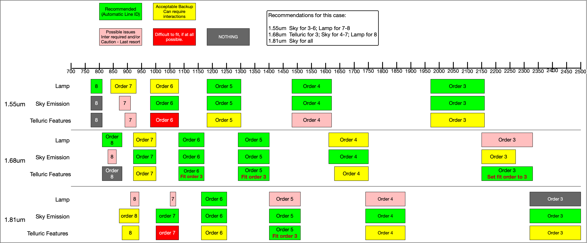

.. gnirsxd_wavecal_guide.rst

.. include:: symbols.txt

.. |br| raw:: html

    

.. _gnirsxd_wavecal_guide:

*****************************************
Wavelength Calibration Guide for GNIRS XD
*****************************************

The wavelength calibration for GNIRS XD can be quite involved depending on
the instrument configuration, in particular the resolution used and the
central wavelength setting.

The telluric modeling depends critically on the wavelength solution, so it
very important to get it right and invest the time needed to do it properly.

At this time, the DRAGONS software measures the wavelength solution
independently for each order, which means that it is not uncommon to have
some orders with poor line coverage, whether it be arc lines, sky emission
lines or telluric features.  This will remain a problem until the DRAGONS
team can implement a 2-D wavelength calibration solution.

This guide will help you figure out the most likely approach you will need.
Especially in the high resolution mode, 111l/mm grating, a combination of
solution methods is often needed.

We have not tested all the configuration.  The table below is based on
limited experimentation and it is meant as a guide, not as a set of absolute
rules.   The table covers the most commonly used configurations.  We will
add more configurations as we study them.

+-------------+------------+--------------+-------------------------------------------------------------------------------+
| Camera      | Grating    | Central |br| | Advise                                                                        |
|             |            | Wavelength   |                                                                               |
+-------------+------------+--------------+-------------------------------------------------------------------------------+
| Short Blue  | 32/mm |br| |   ~1.65 |um| | **most likely**: The arcs will normally have enough lines and |br|            |
|             |            |              | reasonable coverage. |br| |br|                                                |
|             |            |              | **recommended improvement**: If the OH and O\ :sub:`2`\  emission |br|        |
|             |            |              | lines are visible in all orders, they can be used instead of |br|             |
|             |            |              | the arc. |br| |br|                                                            |
|             |            |              | **unlikely**: If emission lines are not visible (short exposures), |br|       |
|             |            |              | and the arc is not sufficient, the telluric absorption lines  |br|            |
|             |            |              | can be used (from the telluric or the science observation).                   |
|             +------------+--------------+-------------------------------------------------------------------------------+
|             | 111/mm     | H-band range | **most likely**: You will need a combination of methods and |br|              |
|             |            |              | the best solution for each order will depend on the exact |br|                |
|             |            |              | central wavelength.  In general, if the exposure time is long |br|            |
|             |            |              | enough, the OH and O\ :sub:`2`\  emission lines will be the |br|              |
|             |            |              | primary method.  |br| |br|                                                    |
|             |            |              | See discussion below to get a feel for what to expect for |br|                |
|             |            |              | a set of three central wavelengths with the 111/mm |br|                       |
|             |            |              | grating.                                                                      |
+-------------+------------+--------------+-------------------------------------------------------------------------------+

Usage
=====

Need for a processed flat
-------------------------
Even when you are reducing an arc lamp observation, a flat is required to get
the slit model.  The data will not be flat fielded, but the slit model in the
processed flat will be used to defined the edges of each order.  It will be
picked up automatically by the calibration manager.

Wavelength calibration methods
------------------------------

From the Arc Lamp
+++++++++++++++++
Producing a wavelength solution from the arc observations is fairly
straightforward.  Just call reduce on the raw arcs.

The use of the interactive mode is recommended to verify the solution and
ensure that the lines offer a good coverage the entire spectral range, across
the six orders.  If any order has too few lines, consider using the sky lines
solution.

::

  reduce @arcs.lis -p interactive=True

From the Sky Emission Lines
+++++++++++++++++++++++++++
When OH and O\ :sub:`2`\  lines are present in the science data, it is possible
to use those to calculate the wavelength solution.  Often the number of lines
and the coverage will be better than what the arc lamp can provide, at least
for orders 3 to 6, if using the 111/mm grating.

The sky lines will be fewer or fainter in orders 7 and 8.

The wavelength calibration is obtained from the sky lines by running
``reduce`` on the science frames and specifying the use of the
``makeWavecalFromSkyEmission`` recipe.  The interactive mode is
recommended to verify and ensure correct line identification and to inspect
which orders might have a poor solution requiring a different approach.

::

  reduce @sci.lis -r makeWavecalFromSkyEmission -p interactive=True

If the OH and O\ :sub:`2`\  sky lines are bright, it is possible to use
only one science observation instead of the stack.  This could lead to higher
precision as the stack might make the lines a touch thicker.

From the Telluric Absorption Features
+++++++++++++++++++++++++++++++++++++
When the arc lamp offers very few lines, or poor coverage (eg. all the lines at
one end of the spectrum), and there are no emission lines, one has to resort
to using the telluric absorption features to measure the wavelength solution.

This is done by running reduce on the science frames and specifying the use
of the ``makeWavecalFromSkyAbsorption`` recipe.

This recipe benefits from a solution from the arc lamp to serve as initial
condition.  So in this case, there are two steps to the process.

::

  reduce @arcs.lis -p interactive=True
  caldb remove N20210407S0181_arc.fits

  reduce @sci.lis -r makeWavecalFromSkyAbsorption --user_cal processed_arc:N20210407S0181_arc.fits -p interactive=True

If we resort to the telluric method, it is because the arc solution is poor.
So we remove it from the calibration manager to ensure that no science reduction
uses it.  Note that the telluric might also be poor for some orders, so it is
likely that you will end up combining solutions from different methods.

The interactive mode is highly recommended to verify and ensure correct line
identification.

Combining Wavelength Solutions
++++++++++++++++++++++++++++++
As shown in Example 2, when a single method does not provide a good solution
we need to combine orders from wavelength solutions obtained with different
methods.

This is done with with the recipe ``combineWavelengthSolutions``, followed
by the primitive ``storeProcessedArc`` to add the new combined solution to the
calibration database.  For example::

    reduce -r combineWavelengthSolutions N20191013S0006_arc.fits N20191013S0034_arc.fits -p ids=1,2,3,6
    reduce -r storeProcessedArc N20191013S0006_combinedArc.fits -p suffix=_arc155

.. important::  The primitive used by the recipe to ``combineSlices`` is
      generic, which means that it knows about extensions, not about "Orders".
      The **Orders 3 to 8 are stored in extensions 1 to 6, respectively**.
      This is the index scale we have to use. It is not the most elegant
      solution, but for now, it works.

Special Considerations for the 111/mm Grating
---------------------------------------------
The each order when the 111/mm grating is used covers a very small wavelength
range.  This means that the number of arc lines per order is going to be
small.  Also, because the specific region depends on the central wavelength
selected, predicting the quality of the wavelength calibration one is going
to obtain is difficult.

We have also found that just evaluating the wavelength calibration based
on the ``determineWavelengthSolution`` plots is not sufficient.  We tried
as illustrated in the diagram below.   Then, when we ran ``fitTelluric``
(see Example 2) we found that there are exception.

Therefore, use the diagram as a first guide, but always verify the adequacy
of the solution using ``fitTelluric`` as shown in Example 2.

Keep in mind that the diagram applies only for those specific central
wavelengths.

As a general recommendation, avoid using the telluric line solution if there
is another method that leads to reasonable results.

