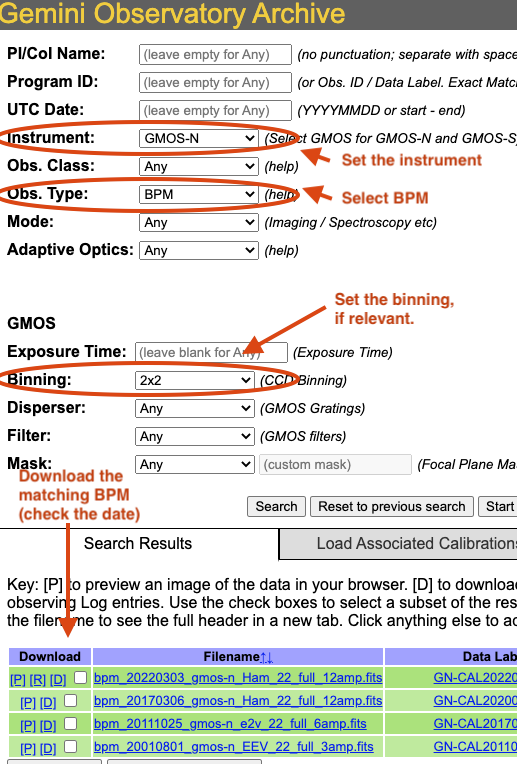
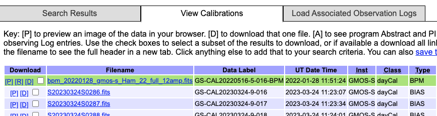

.. tips_and_tricks.rst

.. role:: raw-html(raw)
   :format: html

.. |verticalpadding| replace:: :raw-html:` `

.. _tips_and_tricks:

***************
Tips and Tricks
***************

.. _badWCS:

Fix Bad WCS
===========

In GNIRS data, it is not uncommon for the World Coordinate System (WCS) values
in the headers to be wrong in the raw data.  In the step `prepare`, which
every recipes starts with, a primitives called ``standardizeWCS`` inspect the
coordinates and looks for relative discrepancies between the WCS of the all
the files relative to the first one.  Correct WCS values are essential to
sky association and to the alignment of the frames before stacking.

If the reduction crashes with this message::

    "ValueError: Some files have bad WCS information and user has requested an exit"

it means that the WCS values in the headers of at least one file are wrong.

This can be fixed.  ``standardizeWCS`` can try to fix things.  For GNIRS
longslit data, using the option ``-p prepare:bad_wcs=new`` seems to work
reliably. Eg.::

   reduce @sci.lis -p prepare:bad_wcs=new

.. _getBPM:

Get the BPMs
============

Getting Bad Pixel Masks from the archive
----------------------------------------
Starting with DRAGONS v3.1, the static bad pixel masks (BPMs) are now handled as
calibrations. They are downloadable from the archive instead of being packaged
with the software.  There are various ways to get the BPMs.

Note that at this time there no static BPMs for Flamingos-2 data.

.. _manualBPM:

Manual search
-------------
Ideally, the BPMs will show up in the list of associated calibrations, the
"Load Associated Calibration" tab on the archive search form (next section).
This will happen of all new data.  For old data, until we fix an issue
recently discovered, they will not show up as associated calibration.  But
they are there and can easily be found.

On the archive search form, set the "Instrument" to match your data, set the
"Obs.Type" to "BPM", if relevant for the instrument, set the "Binning".  Hit
"Search" and the list of BPMs will show up as illustrated in the figure below.

The date in the BPM file name is a "Valid-from" date.  It is valid for data
taken **on or after** that date.  Find the one most recent BPM that is valid
for your date and download (click on "D") it.  Then follow the instructions
found in the tutorial examples.

|verticalpadding|

Associated calibrations
-----------------------
The BPMs are now handled like other calibrations.  This means that they are
also downloaded from the archive.  From the archive search form, once you
have identified your science data, select the "Load Associated Calibrations"
(which turns to "View Calibrations" once the table is loaded).  The BPM will
show up with the green background and unlike on the screenshot below, they
are now located at the bottom of the primary list.

|verticalpadding|

.. _plot_1d:

Plot a 1-D spectrum
===================
The ``dgsplot`` tool can be used to plot and inspect a 1-D spetrum in a
matplotlib window. Eg.::

    dgsplot N20210407S0173_1D.fits 1

If you want to plot the spectrum in your own Python script, here's what
you can do.  This will use the correct WCS as opposed to the approximation
stored in FITS headers.

.. code-block:: python
    :linenos:

    import matplotlib.pyplot as plt
    import numpy as np

    import astrodata
    import gemini_instruments

    ad = astrodata.open('N20170113S0146_1D.fits')
    ad.info()

    fig, ax = plt.subplots()
    for ext in ad:
        w = ext.wcs(np.arange(ext.data.size))
        ax.plot(w, ext.data, lw=0.5)

    units = ad[0].wcs.output_frame.unit[0]
    plt.ylim(0, np.max(ad[0].data) * 1.5)
    plt.xlabel(f'Wavelength ({units})')
    plt.ylabel(f'Signal ({ad[0].hdr["BUNIT"]})')
    plt.show()

Inspect the telluric model
==========================
The telluric model is stored in the processed telluric star file.
To inspect the telluric model, you can use the following Python code.

.. code-block:: python
    :linenos:

    import numpy as np
    import matplotlib.pyplot as plt

    import astrodata
    import gemini_instruments

    ad = astrodata.open('N20210407S0188_telluric.fits')
    w = ad[0].wcs(np.arange(ad[0].data.size))
    plt.plot(w, ad[0].TELLABS)
    plt.show()

Inspect the sensitivity function
================================
The sensitivity function is stored in the processed telluric star file.
To inspect the sensitivity function, you can use the following Python code.
The example below plots the sensitivity function for the first of six orders,
``ad[0]``, which is Order 3.  To plot Order 8, you would use ``ad[5]``.

.. code-block:: python
    :linenos:

    import numpy as np
    import matplotlib.pyplot as plt

    import astrodata
    import gemini_instruments

    from gempy.library import astromodels as am

    ad = astrodata.open('N20210407S0188_telluric.fits')
    sensfunc = am.table_to_model(ad[0].SENSFUNC)
    w = ad[0].wcs(np.arange(ad[0].data.size))

    std_wave_unit = ad[0].SENSFUNC['knots'].unit
    std_flux_unit = ad[0].SENSFUNC['coefficients'].unit

    plt.xlabel(f'Wavelength ({std_wave_unit})')
    plt.ylabel(f'{std_flux_unit}')
    plt.plot(w, sensfunc(w))
    plt.show()

.. _useful_parameters:

Useful parameters
=================

skip_primitive
--------------
I might happen that you will want or need to not run a primitive in a recipe.
You could copy the recipe over and edit it.  Or you could invoke the
``skip_primitive`` parameter to tell DRAGONS to completely skip that step.

Let's say that you want the data aligned but not stacked.  You would do::

    reduce @sci.lis -p stackFrames:skip_primitive=True

write_outputs
-------------
When debugging or when there's a need to inspect intermediate products, you
might want to write the output of a specific primitive to disk.  This is done
with the ``write_outputs`` parameter.

For example, to write the extracted spectrum before it is corrected for
telluric features and flux calibrated, you would do::

    reduce @sci.lis -p extractSpectra:write_outputs=True

