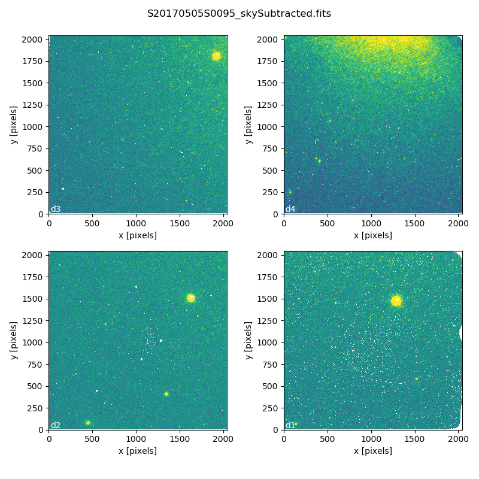
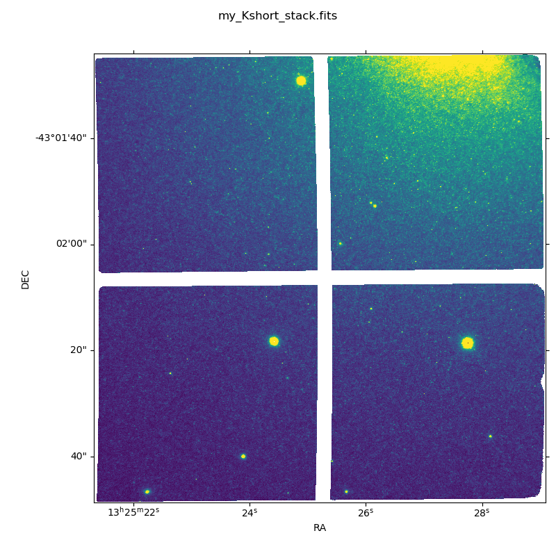

.. 02_data_reduction.rst

.. include:: DRAGONSlinks.txt

.. |github| image:: /_static/img/GitHub-Mark-32px.png
    :scale: 75%

.. _command_line_data_reduction:

****************************
Data Reduction with "reduce"
****************************

This chapter will guide you on reducing **GSAOI data** using
command line tools. In this example we reduce a GSAOI observation of
the resolved outskirt of a nearby galaxy. The observation is a
dither-on-target with offset-to-sky sequence. Just open a terminal to
get started.

While the example cannot possibly cover all situations, it will help you get
acquainted with the reduction of GSAOI data with DRAGONS. We
encourage you to look at the :ref:`tips_and_tricks` and
:ref:`issues_and_limitations` chapters to learn more about GSAOI data
reduction.

DRAGONS installation comes with a set of handful scripts that are used to
reduce astronomical data. The most important script is called
"|reduce|", which is extensively explained in the `Recipe System Users Manual
<https://dragons-recipe-system-users-manual.readthedocs.io/en/latest/index.html>`_.
It is through that command that a DRAGONS reduction is launched.

For this tutorial, we will be also using other `Supplemental tools
<https://dragons-recipe-system-users-manual.readthedocs.io/en/latest/supptools.html>`_,
like "|dataselect|", "|showd|", "|typewalk|", and "|caldb|".

The dataset
===========
If you have not already, download and unpack the tutorial's data package.
Refer to :ref:`datasetup` for the links and simple instructions.

The dataset specific to this example is described in:

    :ref:`about_data_set`.

Here is a copy of the table for quick reference.

+---------------+---------------------+--------------------------------+
| Science       || S20170505S0095-110 || Kshort-band, on target, 60 s  |
+---------------+---------------------+--------------------------------+
| Flats         || S20170505S0030-044 || Lamp on, Kshort, for science  |
|               || S20170505S0060-074 || Lamp off, Kshort, for science |
+---------------+---------------------+--------------------------------+
| Standard star || S20170504S0114-117 || Kshort, standard star, 30 s   |
+---------------+---------------------+--------------------------------+

.. _setup_caldb:

Set up the Local Calibration Manager
====================================

DRAGONS comes with a local calibration manager that uses the same calibration
association rules as the Gemini Observatory Archive. This allows ``reduce``
to make requests to a local light-weight database for matching **processed**
calibrations when needed to reduce a dataset.

Let's set up the local calibration manager for this session.

In ``~/.geminidr/``, create or edit the configuration file ``rsys.cfg`` as
follow:

.. code-block:: none

    [calibs]
    standalone = True
    database_dir = ${path_to_my_data}/gsaoiimg_tutorial/playground

This simply tells the system where to put the calibration database, the
database that will keep track of the processed calibrations we are going to
send to it.

.. note:: The tilde (``~``) in the path above refers to your home directory.
   Also, mind the dot in ``.geminidr``.

Then initialize the calibration database:

.. code-block:: bash

    caldb init

That's it! It is ready to use!

You can add processed calibrations with ``caldb add <filename>`` (we will
later), list the database content with ``caldb list``, and
``caldb remove <filename>`` to remove a file **only** from the database
(it will **not** remove the file on disk). For more the details, check the
Recipe System Local Calibration Manager documentation, |caldb|.

.. _organize_files:

Check files
===========

For this example, all the raw files we need are in the same directory called
``../playdata/``. Let us learn a bit about the data we have.

Ensure that you are in the ``playground`` directory and that the ``conda``
environment that includes DRAGONS has been activated.

Let us call the command tool "|typewalk|":

..  code-block:: bash

    $ typewalk -d ../playdata/

    directory:  /data/workspace/gsaoiimg_tutorial/playdata
         S20170504S0114.fits ............... (GEMINI) (GSAOI) (IMAGE) (RAW) (SIDEREAL) (SOUTH) (UNPREPARED)
         ...
         S20170505S0030.fits ............... (AZEL_TARGET) (CAL) (DOMEFLAT) (FLAT) (GEMINI) (GSAOI) (IMAGE) (LAMPON) (NON_SIDEREAL) (RAW) (SOUTH) (UNPREPARED)
         ...
         S20170505S0060.fits ............... (AZEL_TARGET) (CAL) (DOMEFLAT) (FLAT) (GEMINI) (GSAOI) (IMAGE) (LAMPOFF) (NON_SIDEREAL) (RAW) (SOUTH) (UNPREPARED)
         ...
         S20170505S0095.fits ............... (GEMINI) (GSAOI) (IMAGE) (RAW) (SIDEREAL) (SOUTH) (UNPREPARED)
         ...
         S20170505S0110.fits ............... (GEMINI) (GSAOI) (IMAGE) (RAW) (SIDEREAL) (SOUTH) (UNPREPARED)
    Done DataSpider.typewalk(..)

This command will open every FITS file within the folder passed after the ``-d``
flag (recursively) and will print an unsorted table with the file names and the
associated tags. For example, calibration files will always have the ``CAL``
tag. Flat images will always have the ``FLAT`` tag. This means that we can
start getting to know a bit more about our data set just by looking the tags.
The output above was trimmed for presentation.

.. _create_file_lists:

Create File lists
=================

This data set contains science and calibration frames. For some program, it
could have different observed targets and different exposure times depending
on how you like to organize your raw data.

The DRAGONS data reduction pipeline does not organize the data for you.  You
have to do it. DRAGONS provides tools to help you with that.

The first step is to create lists that will be used in the data reduction
process. For that, we use "|dataselect|". Please, refer to the "|dataselect|"
documentation for details regarding its usage.

A list for the flats
--------------------
Let us create the list containing the domeflats:

.. code-block:: bash

    $ dataselect --tags FLAT ../playdata/*.fits -o flats_Kshort.list

We know that our dataset has only one filter (Kshort). If our dataset
contained data with more filters, we would have had to use the ``--expr``
option to select the appropriate filter as follow:

.. code-block:: bash

    $ dataselect --tags FLAT --expr "filter_name=='Kshort'" ../playdata/*.fits -o flats_Kshort.list

.. note:: To see the name of the filter, use "|showd|" (show descriptor):

     .. code-block:: bash

        $ showd ../playdata/*.fits -d filter_name
        ----------------------------------------------------
        filename                                 filter_name
        ----------------------------------------------------
        ../playdata/S20170504S0114.fits   Kshort_G1105&Clear
        ...
        ...

A list for the standard star
----------------------------
In this case we have only one standard star.  Indeed, we can confirm that by
selecting on partner calibrations and showing the object name:

..  code-block:: bash

    $ dataselect --expr 'observation_class=="partnerCal"' ../playdata/*.fits | showd -d object
    ----------------------------------------
    filename                          object
    ----------------------------------------
    ../playdata/S20170504S0114.fits     9132
    ../playdata/S20170504S0115.fits     9132
    ../playdata/S20170504S0116.fits     9132
    ../playdata/S20170504S0117.fits     9132

If we had more than one object, a list for each standard star is created by
using the ``object`` descriptor as a selection criterium in "|dataselect|":

.. code-block:: bash

    $ dataselect --expr 'object=="9132"' ../playdata/*.fits -o std_9132.list

A list for the science observations
-----------------------------------
The rest is the data with your science target. Before we create a new list, let
us check that indeed we have only one science target and a unique exposure time:

.. code-block:: bash

    $ dataselect --expr 'observation_class=="science"' ../playdata/*.fits | showd -d object,exposure_time
    ---------------------------------------------------------
    filename                           object   exposure_time
    ---------------------------------------------------------
    ../playdata/S20170505S0095.fits   NGC5128            60.0
    ../playdata/S20170505S0096.fits   NGC5128            60.0
    ...
    ../playdata/S20170505S0109.fits   NGC5128            60.0
    ../playdata/S20170505S0110.fits   NGC5128            60.0

Just to demonstrate how expression are built, let us consider that we need to
select only the files for which ``object`` is NGC5128 and ``exposure_time``
is 60 seconds. We also want to pass the output to a new list:

.. code-block:: bash

   $ dataselect --expr '(observation_class=="science" and exposure_time==60.)' ../playdata/*.fits -o science.list

.. _process_flat_files:

Create a Master Flat Field
==========================
The GSAOI Kshort master flat is created from a series of lamp-on and lamp-off
dome exposures.  They should all have the same exposure time.  Each flavor is
stacked (averaged), then the lamp-off stack is subtracted from the lamp-on
stack and the result normalized.

We create the master flat field and add it to the calibration manager as
follow:

..  code-block:: bash

   $ reduce @flats_Kshort.list
   $ caldb add S20170505S0030_flat.fits

The master flat file is found in two places: inside the same folder where you
ran ``reduce`` and inside the ``calibrations/processed_flats/`` folder, for
safekeeping. Here is an example of a master flat:

.. figure:: _static/img/S20170505S0030_flat.png
   :align: center

   Master Flat - K-Short Band

Note that this figure shows the masked pixels in white color but not all the
detector features are masked. For example, the "Christmas Tree" on detector
2 can be easily noticed but was not masked.

Reduce Standard Star
====================
The standard star is reduced essentially the same way as the science
target (next section). The processed flat field that we added earlier to
the local calibration database will be fetched automatically.  Also, in
this case the standard star was obtained using ROIs (Regions-of-Interest)
which do not match the flat field.  The software will recognize that the
flat field is still valid will crop it to match the ROIs.

::

    $ reduce @std_9132.list

To stack, the tool ``disco_stu`` is needed for GSAOI.  It is discussed later
in this chapter.

::

    $ disco `dataselect *_skySubtracted.fits --expr='observation_class=="partnerCal"'`

.. _processing_science_files:

Reduce the Science Images
=========================
This is an observation of a galaxy with offset to sky.  We need to turn off
the additive offsetting of the sky because the target fills the field of view
and does not represent a reasonable sky background.  If the offsetting is not
turned off *in this particular case*, it results in an over-subtraction of the
sky frame.

.. note:: Unlike the other near-IR instruments, the additive ``offset_sky``
      parameter is used by default to adjust the sky frame background for
      GSAOI instead of the multiplicative ``scale_sky`` parameter.  It was
      found to work better when the sky background per pixel is very low,
      which is common due to the short exposure time needed to avoid
      saturating stars and the small pixel scale. The reader is encourage
      to experiment with ``scale_sky`` if ``offset_sky`` does not seem to
      lead to an optimal sky subtraction.

      (Remember that when the source is extended, both parameters
      normally need to be turned off.)

The sky frame comes from off-target sky observations.  We feed the pipeline
all the on-target and off-target frames.  The software will split the
on-target and the off-target appropriately using information in the headers.

Once we have our calibration files processed and added to the database, ready
for retrieval, we can run ``reduce`` on our science data.

.. code-block:: bash

   $ reduce @science.list -p skyCorrect:offset_sky=False

This command will generate flat corrected and sky subtracted files but will
not stack them. You can find which file is which by its suffix
(``_flatCorrected`` or ``_skySubtracted``).  The on-target files are the ones
that have been sky subtracted (``_skySubtracted``).  There should be nine of
the them.

The frames are not stacked because of the high level of distortion in the
GSAOI images that requires special software to correct and properly stack.
The tool ``disco_stu`` (next section) must be used to stack GSAOI science
data.

   S20170505S0095 - Flat corrected and sky subtracted

The figure above shows an example of the sky-subtracted frames. The
masked pixels are represented in white color.

Stack Sky-Subtracted Science Images
===================================
The final step is to stack the images. For that, you must be aware that
GSAOI images are highly distorted and that this distortion must be corrected
before stacking. The tool for distortion correction and image stacking is
``disco_stu``.

.. note:: ``disco_stu`` is installed with conda when the standard Gemini
          software installation instructions are followed. To install after the
          fact::

            conda install disco_stu

The simplest use of ``disco_stu`` is to run the command ``disco`` on the
files to be stacked.

.. code-block:: bash

   $ disco `dataselect *_skySubtracted.fits --expr 'observation_class=="science"'` --no_skysub -o my_Kshort_stack.fits

By default, ``disco`` will write the output file as ``disco_stack.fits``, the
``-o`` flag allows us to override that and choose the name of the output
stack.

By default, Disco-Stu will estimate the sky level in each array and subtract
it from the data.  We have an extended source with no "sky" area to speak
of.  We need to turn this behavior off, hence the ``--no_skysub`` flag added
to the command.

For absolute distortion correction and astrometry, ``disco_stu`` can use a
reference catalog provided by the user.  Without a reference catalog, like
above, only the relative distortion between the frames is accounted for.  For
more information about ``disco_stu`` see the ``disco_stu.pdf`` manual in
``$CONDA_PREFIX/share/disco_stu``.

The output stack units are in electrons (header keyword BUNIT=electrons).
The output stack is stored in a multi-extension FITS (MEF) file.  The science
signal is in the "SCI" extension, the variance is in the "VAR" extension, and
the data quality plane (mask) is in the "DQ" extension.

The final image is shown below.

   Sky Subtracted and Stacked Final Image

