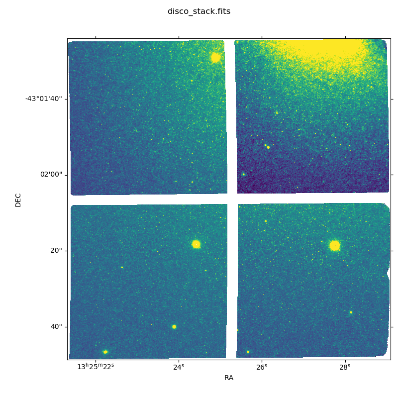
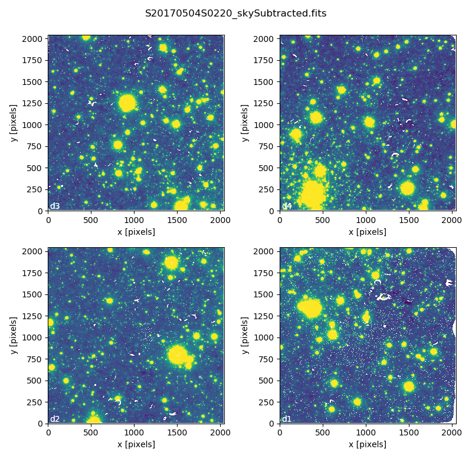
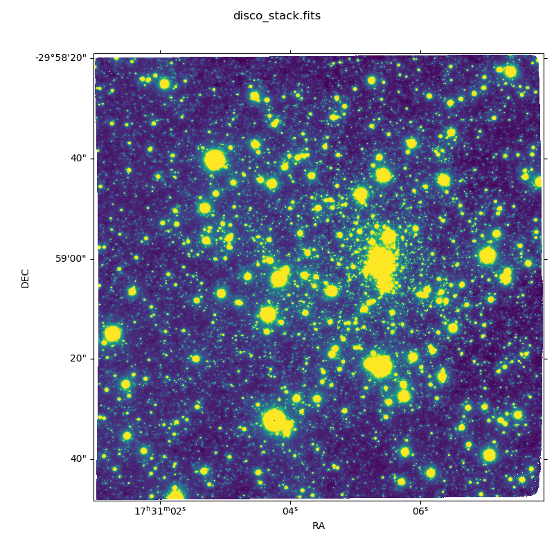

.. 02_data_reduction.rst

.. _caldb: https://dragons-recipe-system-users-manual.readthedocs.io/en/latest/supptools.html#caldb

.. _dataselect: https://dragons-recipe-system-users-manual.readthedocs.io/en/latest/supptools.html#dataselect

.. _reduce: https://dragons-recipe-system-users-manual.readthedocs.io/en/latest/supptools.html#typewalk

.. _showd: https://dragons-recipe-system-users-manual.readthedocs.io/en/latest/supptools.html#showd

.. _showrecipes: https://dragons-recipe-system-users-manual.readthedocs.io/en/latest/supptools.html#showrecipes

.. _showpars: https://dragons-recipe-system-users-manual.readthedocs.io/en/latest/supptools.html#showpars

.. _typewalk: https://dragons-recipe-system-users-manual.readthedocs.io/en/latest/supptools.html#typewalk

.. |github| image:: /_static/img/GitHub-Mark-32px.png
    :scale: 75%

.. _command_line_data_reduction:

Data Reduction
**************

DRAGONS installation comes with a set of handful scripts that are used to
reduce astronomical data. One of the most important scripts is called
reduce_, which is extensively explained in the `Recipe System Users Manual
<https://dragons-recipe-system-users-manual.readthedocs.io/en/latest/index.html>`_.
For this tutorial, we will be also using other `Supplemental tools
<https://dragons-recipe-system-users-manual.readthedocs.io/en/latest/supptools.html>`_,
like dataselect_, showd_, typewalk_, and caldb_.

.. warning:: Some primitives use a lot of RAM memory and they can make reduce_
    crash. Our team is aware of this problem and we are working on that. For
    now, if that happens to you, you might need to run the pipeline on a
    smaller data set.

.. _setup_caldb:

Set up caldb_
-------------

DRAGONS comes with a local calibration manager and a local light weight database
that uses the same calibration association rules as the Gemini Observatory
Archive. This allows ``reduce`` to make requests for matching **processed**
calibrations when needed to reduce a dataset.

Let's set up the local calibration manager for this session.

In ``~/.geminidr/``, create or edit the configuration file ``rsys.cfg`` as
follow:

.. code-block:: none

    [calibs]
    standalone = True
    database_dir = ${path_to_my_data}/gsaoiimg_tutorial/playground

This simply tells the system where to put the calibration database, the
database that will keep track of the processed calibrations we are going to
send to it.

.. note:: The tilde (``~``) in the path above refers to your home directory.
   Also, mind the dot in ``.geminidr``.

.. todo: calmanager
.. warning:: The Gemini Local Calibration Manager is not available yet in the
   Gemini Conda Channel for installation and you might not have it installed.
   On a terminal, type `caldb config`. If you get an error message, you can
   skip this section and you will still be able to bypass the Calibration
   Manager as we will show later here.

Then initialize the calibration database:

.. code-block:: bash

    caldb init

That's it! It is ready to use!

You can add processed calibrations with ``caldb add <filename>`` (we will
later), list the database content with ``caldb list``, and
``caldb remove <filename>`` to remove a file **only** from the database
(it will **not** remove the file on disk). For more the details, check the
caldb_ documentation in the `Recipe System - User's Manual <https://dragons-recipe-system-users-manual.readthedocs.io/>`_.

.. _organize_files:

Organize files
--------------

First of all, let us consider that we have put all the files in the same folder
called ``../playdata/`` and that we do not have any information anymore. From a
bash terminal and from within the Conda Virtual Environment where DRAGONS was
installed, we can call the command tool typewalk_:

..  code-block:: bash

    $ typewalk -d ../playdata/

    directory:  /path_to_my_files/gsaoiimg_tutorial/playdata
         S20171208S0054.fits ............... (AZEL_TARGET) (CAL) (DOMEFLAT) (FLAT) (GEMINI) (GSAOI) (IMAGE) (LAMPON) (NON_SIDEREAL) (RAW) (SOUTH) (UNPREPARED)
         S20150609S0029.fits ............... (AT_ZENITH) (AZEL_TARGET) (CAL) (DARK) (GEMINI) (GSAOI) (NON_SIDEREAL) (RAW) (SOUTH) (UNPREPARED)
         ...
         S20170505S0102.fits ............... (GEMINI) (GSAOI) (IMAGE) (RAW) (SIDEREAL) (SOUTH) (UNPREPARED)
         S20170505S0066.fits ............... (AZEL_TARGET) (CAL) (DOMEFLAT) (FLAT) (GEMINI) (GSAOI) (IMAGE) (LAMPOFF) (NON_SIDEREAL) (RAW) (SOUTH) (UNPREPARED)
    Done DataSpider.typewalk(..)

This command will open every FITS file within the folder passed after the ``-d``
flag (recursively) and will print an unsorted table with the file names and the
associated tags. For example, calibration files will always have the ``CAL``
tag. Flat images will always have the ``FLAT`` tag. Dark files will have the
``DARK`` tag. This means that we can start getting to know a bit more about our
data set just by looking the tags. The output above was trimmed for simplicity.

.. _create_file_lists:

Create File lists
-----------------

This data set now contains science and calibration frames. It could have
different observed targets and different exposure times. The current data
reduction pipeline does not organize the data.

That means that we first need to identify these files and create lists that will
be used in the data-reduction process. For that, we will use the dataselect_
command line. Please, refer to the dataselect_ page for details regarding its
usage. Let us start with the DARK files:

..  code-block:: bash

    $ dataselect --tags DARK ../playdata/*.fits > list_of_darks.txt

Here, the ``>`` symbol gets the dataselect_ output and stores it within the
``list_of_darks.txt`` file. If you want to see the output, simply omit it and
everything after it.

Now we can do the same with the FLAT files, separating them by filter:

..  code-block:: bash

    $ dataselect --tags FLAT --expr 'filter_name=="Kshort"' ../playdata/*.fits > list_of_Kshort_flats.txt

..  code-block:: bash

    $ dataselect --tags FLAT --expr 'filter_name=="H"' ../playdata/*.fits > list_of_H_flats.txt

You can select the standard start with the following command:

..  code-block:: bash

    $ dataselect --expr 'observation_class=="partnerCal"' raw/*.fits
    raw/S20170504S0114.fits
    raw/S20170504S0115.fits
    raw/S20170504S0116.fits
    raw/S20170504S0117.fits

Here we have only four files. But the problem is that you may have more than one
standard star in your data set. We can verify that by passing the dataselect_
output to the showd_ command line using "pipe" (``|``):

..  code-block:: bash

    $ dataselect --expr 'observation_class=="partnerCal"' ../playdata/*.fits | showd -d object
    ----------------------------------------
    filename                          object
    ----------------------------------------
    ../playdata/S20170504S0114.fits     9132
    ../playdata/S20170504S0115.fits     9132
    ../playdata/S20170504S0116.fits     9132
    ../playdata/S20170504S0117.fits     9132

The ``-d`` flag tells showd_ which descriptor will be printed for each input
file. As you can see, it was not our case. If you see more than one object, you
can create a list for each standard star using the ``object`` descriptor
as an argument for dataselect_ (spaces are allowed if you use double quotes):

.. code-block:: bash

    $ dataselect --expr 'object=="9132"' ../playdata/*.fits > list_of_std_9132.txt

The rest is the data with your science target. Before we create a new list, let
us check if we have more than one target and more than one exposure time:

.. code-block:: bash

    $ dataselect --expr 'observation_class=="science"' ../playdata/*.fits | showd -d object
    -----------------------------------------
    filename                           object
    -----------------------------------------
    ../playdata/S20170505S0095.fits   NGC5128
    ../playdata/S20170505S0096.fits   NGC5128
    ...
    ../playdata/S20170505S0109.fits   NGC5128
    ../playdata/S20170505S0110.fits   NGC5128

We have only one target. Now let us check the exposure time:

..  code-block:: bash

    $ dataselect --expr 'observation_class=="science"' ../playdata/*.fits | showd -d exposure_time
    -----------------------------------------------
    filename                          exposure_time
    -----------------------------------------------
    ../playdata/S20170505S0095.fits            60.0
    ../playdata/S20170505S0096.fits            60.0
    ...
    ../playdata/S20170505S0109.fits            60.0
    ../playdata/S20170505S0110.fits            60.0

Again, only one exposure time. You can print more than one descriptor by passing
a comma-sepparated argument to the ``-d`` argument (e.g.,
``-d object_name,exposure_time``).

Just to show the example, let us consider that we want to filter all the files
whose ``object`` is NGC5128 and that the ``exposure_time`` is 60 seconds. We
also want to pass the output to a new list:

.. code-block:: bash

   $ dataselect --expr '(observation_class=="science" and exposure_time==60.)' ../playdata/*.fits > list_of_science_files.txt

.. _process_dark_files:

Process DARK files
------------------

Accordingly to the `Calibration webpage for GSAOI
<https://www.gemini.edu/sciops/instruments/gsaoi/calibrations>`_,
**DARK subtraction is not necessary** since the dark noise level is too low.
DARK files are only used to generate Bad Pixel Masks (BPM).

If, for any reason, you believe that you really need to have a master DARK file,
you can create it using the command below:

..  code-block:: bash

   $ reduce @list_of_darks.txt

Note that ``reduce`` will not separate DARKS with different exposure times. You
will have to create a new list for each exposure time, if that is the case.

Master DARK files can be added to the local database using the caldb_
command. Before you run it, make sure you have `configured and initialized your
caldb <setup_caldb>`_. Once you are set, add the Master Dark to the local
database using the following command:

.. code-block:: bash

   $ caldb add ./calibrations/processed_dark/S20150609S0022_dark.fits

Note that the prefix name of the master dark file can be different for you.

.. _create_bpm_files:

Create BPM files
----------------

The Bad Pixel Mask (BPM) files can be created using a set of FLAT images and a
set of DARK files. The FLATs must be obtained in the H band with a number of
counts around 20000 adu and no saturated pixels, usually achieved with 7 seconds
exposure time. The :ref:`download_sample_files` section contains a sample of the
files to be used in this tutorial. If you need to download files for your own
data set, use the `Gemini Archive Search Form <https://archive.gemini.edu/searchform>`_
to look for matching data.

The BPM file can be created using the ``makeProcessedBPM`` recipe available
via ``reduce`` command line:

..  code-block:: bash

   $ reduce -r makeProcessedBPM @list_of_H_flats.txt @list_of_darks.txt

The ``-r`` argument tells ``reduce`` which recipe you want to use to replace
the default recipe. This recipe will create a new file that contains the
Bad Pixel Mask (see the `AstroData User's Manual
<https://astrodata-user-manual.readthedocs.io/en/latest/data.html#data-quality-plane>`_
for more details) into a FITS file with the ``_bpm`` suffix. In this example,
the created file is called ``./S20171208S0053_bpm.fits``.

.. _process_flat_files:

Process FLAT files
------------------

FLAT images can be easily reduced using the ``reduce`` command line:

..  code-block:: bash

   $ reduce @list_of_Kshort_flats.txt

If we want ``reduce`` to use the BPM file, we need to add ``-p
addDQ:user_bpm="S20131129S0320_bpm.fits"`` to the command line:

.. code-block::

   $ reduce @list_of_Kshort_flats.txt -p addDQ:user_bpm="S20171208S0053_bpm.fits"

.. note::

   Here we used the "S20171208S0053_bpm.fits" as a BPM file. It is very unlikely
   that your BPM file has the same name. Make sure you use the correct file name.
   Processed BPM files will have the "_bpm.fits" sufix.

Once you finish, you will have the master flat file copied in two places: inside
the same folder where you ran ``reduce`` and inside the
``calibrations/processed_flats/`` folder. Here is an example of a master flat:

.. figure:: _static/img/S20170505S0030_flat.png
   :align: center

   Master Flat - K-Short Band

Note that this figure shows the masked pixels in white color but not all the
detector features are masked. For example, the "Christmas Tree" on the detector
2 can be easily noticed but was not masked.

Once you are done, add the Master Flat to the local database using caldb_:

.. code-block:: bash

   $ caldb add ./calibrations/processed_flat/S20170505S0030_flat.fits

If you do so, ``reduce`` will "see" this calibration file when performing
the data reduction of our science files.

.. _processing_science_files:

Process Science files
---------------------

Once we have our calibration files processed and added to the database, we can
run ``reduce`` on our science data:

.. code-block:: bash

   $ reduce @list_of_science_files.txt

This command will generate flat corrected and sky subtracted files but will
not stack them. You can find which file is which by its suffix
(``_flatCorrected`` or ``_skySubtracted``).

.. todo: calmanager

If you don't have the calibration manager or want to bypass it for some reason,
use the following command to override the input calibrations:

..  code-block:: bash

    $ reduce @list_of_science.txt --user_cal processed_flat:S20170505S0030_flat.fits

.. figure:: _static/img/S20170505S0095_skySubtracted.png
   :align: center

   S20170505S0095 - Flat corrected and sky subtracted

The figure above shows an example of a sparse field already reduced. The
masked pixels are represented in white color.

The sky subtraction works in the same as any other IR instrument. It uses the
positional offsets to work out whether the images all overlap or not. The image
with the smallest offsets is assumed to contain the science target. If some
images are clearly in a different position, these are assumed to be sky frames
and only these are stacked to construct sky frames to be subtracted from the
science images. If all the images overlap, then all frames can be used to make
skies provided they're more than a certain distance (a couple of arcseconds)
from the science frame (to avoid objects falling on top of each other and
cancelling out).

Stack Science reduced images
----------------------------

.. todo: @bquint make .tar.gz file available for public access and change the url below.
..  todo:: @bquint make .tar.gz file available for public access and change the
    url below.

Finally, you will have to stack your images. For that, you must be aware that
GSAOI images are highly distorted and that this distortion must be corrected
before stacking. At this moment, the standard tool for distortion correction
and image stacking is called ``disco-stu``. This package can be found in the
link bellow (only available within Gemini Internal Network for now and requires
login):

*  `disco-stu v1.3.4 <https://gitlab.gemini.edu/DRSoftware/disco_stu/repository/v1.3.4/archive.tar.gz>`_

.. Warning::

  The functionality of ``disco-stu`` is being incorporated withing DRAGONS.
  Because of that, you might find unexpected results. Specially in very
  crowded fields where the sky cannot be properly measured. This section
  will be changed in the future.

De-compress the file, enter in the decompressed directory and use pip to install
it: ``pip install .`` .

Once you are all set, you can simply run ``disco`` on the Sky Subtracted
files:

.. code-block:: bash

   $ disco *_skySubtracted.fits

By default, ``disco`` will write the output file as ``disco_stack.fits``. If you
want to change the name of the output file during execution, run the following
command instead:

.. code-block:: bash

   $ disco *_skySubtracted.fits -o my_final_image.fits

The final image is shown below.

   Sky Subtracted and Stacked Final Image

.. todo: @bquint why d4 looks darker? what can I do to fix this?
.. todo:: @bquint why d4 looks darker? what can I do to fix this?

This operation in known to have great impact on some science cases. For example,
check the two images below. The first one is a single frame of the globular
cluster "HP I", observed for the program GS-2017A-Q-44 and published in
`Kerber et. al. (2019) <https://ui.adsabs.harvard.edu/#abs/2019MNRAS.484.5530K/abstract>`_.
The second image, is the same object after aligning and stacking all the images
using ``disco_stu`` as described above.

   HP 1 - Single Frame

   HP 1 - Stacked Image

Note that although the sky subtraction adds several masked regions in the most
dense part of the field, the staked image corrects that and complete the full
frame which, now, can be use for science.

Advanced Operations
-------------------

It is also important to remember that ``reduce`` is basically a recipe with
a sequence of operations, called Primitives, and that each Primitive require
a set of parameters. When we run ``reduce`` without any extra flag, it will
run all the Primitives in our recipe using the default values. Depending on
your data/science case, you may have to try to change the parameters of one or
more Primitives.

First, you need to know what are the recipes available for a given files, then
you need to get what are Primitives living within that recipe. Finally, you need
a list of parameters that can be modified.

The showrecipes_ command line takes care of both steps. In order to list
all the recipes available for a given file, we can pass the file as an input and
the ``--all`` option. Here is an example:

.. code-block:: bash

  $ showrecipes ../playdata/S20170505S0073.fits --all
  Input file: ${path_to_my_data}/playdata/S20170505S0073.fits
  Input tags: {'GEMINI', 'LAMPOFF', 'UNPREPARED', 'GSAOI', 'NON_SIDEREAL', 'DOMEFLAT', 'CAL', 'RAW', 'IMAGE', 'SOUTH', 'FLAT', 'AZEL_TARGET'}
  Recipes available for the input file:
     geminidr.gsaoi.recipes.sq.recipes_FLAT_IMAGE::makeProcessedBPM
     geminidr.gsaoi.recipes.sq.recipes_FLAT_IMAGE::makeProcessedFlat
     geminidr.gsaoi.recipes.qa.recipes_FLAT_IMAGE::makeProcessedFlat

The output tells me that I have two recipes for the SQ (Science Quality) mode
and one recipe for the QA (Quality Assessment) mode. By default, ``reduce`` uses
the SQ mode for processing the data.

The showrecipes_ command line can also display what are the Primitives that
were used within a particular Recipe. Check the example below:

.. code-block::  bash

    $ showrecipes ../playdata/S20170505S0073.fits --mode sq --recipe makeProcessedBPM
    Input file: ${path_to_my_data}/playdata/S20170505S0073.fits
    Input tags: ['SOUTH', 'AZEL_TARGET', 'IMAGE', 'GEMINI', 'NON_SIDEREAL', 'LAMPOFF', 'FLAT', 'CAL', 'DOMEFLAT', 'UNPREPARED', 'RAW', 'GSAOI']
    Input mode: sq
    Input recipe: makeProcessedBPM
    Matched recipe: geminidr.gsaoi.recipes.sq.recipes_FLAT_IMAGE::makeProcessedBPM
    Recipe location: /data/bquint/Repos/DRAGONS/geminidr/gsaoi/recipes/sq/recipes_FLAT_IMAGE.py
    Recipe tags: {'CAL', 'IMAGE', 'FLAT', 'GSAOI'}
    Primitives used:
       p.prepare()
       p.addDQ()
       p.addVAR(read_noise=True, poisson_noise=True)
       p.ADUToElectrons()
       p.selectFromInputs(tags="DARK", outstream="darks")
       p.selectFromInputs(tags="FLAT")
       p.stackFrames(stream="darks")
       p.makeLampFlat()
       p.normalizeFlat()
       p.makeBPM()

Now you can get the list of parameters for a given Primitive using the
showpars_ command line. Here is an example:

.. code-block:: bash

    $ showpars ../playdata/S20170505S0073.fits makeLampFlat

Now that we know what are is the recipe being used, what are the Primitives
it calls and what are the parameters that are set, we can finally change the
default values using the ``-p`` flag. We actually did this earlier in this
tutorial when we called:

.. code-block:: bash

    $ reduce @list_of_Kshort_flats.txt -p addDQ:user_bpm="S20171208S0053_bpm.fits"
    Dataset tagged as {'RAW', 'DOMEFLAT', 'NON_SIDEREAL', 'SOUTH', 'AZEL_TARGET', 'CAL', 'GEMINI', 'FLAT', 'LAMPOFF', 'GSAOI', 'IMAGE', 'UNPREPARED'}
    Settable parameters on 'makeLampFlat':
    ========================================
    Name                   Current setting

    suffix               '_stack'             Filename suffix
    apply_dq             True                 Use DQ to mask bad pixels?
    statsec              None                 Section for statistics
    operation            'mean'               Averaging operation
    Allowed values:
            mean    arithmetic mean
            wtmean  variance-weighted mean
            median  median
            lmedian low-median

    reject_method        'sigclip'            Pixel rejection method
    Allowed values:
            none    no rejection
            minmax  reject highest and lowest pixels
            sigclip reject pixels based on scatter
            varclip reject pixels based on variance array

    hsigma               3.0                  High rejection threshold (sigma)
            Valid Range = [0,inf)
    lsigma               3.0                  Low rejection threshold (sigma)
            Valid Range = [0,inf)
    mclip                True                 Use median for sigma-clipping?
    max_iters            None                 Maximum number of clipping iterations
            Valid Range = [1,inf)
    nlow                 0                    Number of low pixels to reject
            Valid Range = [0,inf)
    nhigh                0                    Number of high pixels to reject
            Valid Range = [0,inf)
    memory               None                 Memory available for stacking (GB)
            Valid Range = [0.1,inf)

for example. But now you know that ``-p`` is telling ``reduce`` that the
``addDQ`` primitive should use a different value for the ``user_bpm`` parameter.
Since we did not say anything about the mode or the recipe, it is using the
default values.
