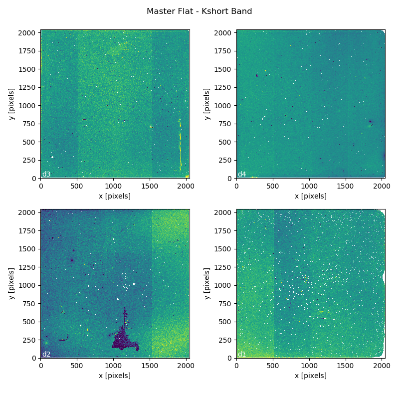
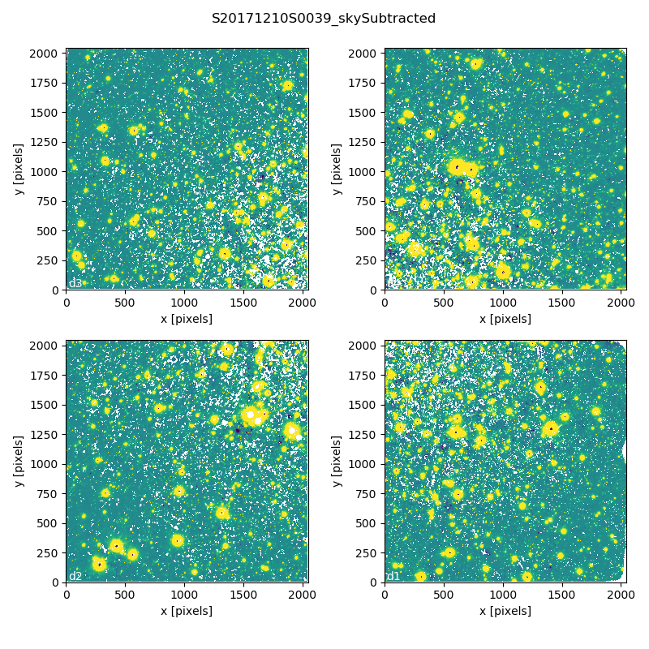

.. 03_data_reduction.rst

.. _command_line_data_reduction:

Data Reduction
**************

DRAGONS installation comes with a set of handful scripts that are used to
reduce astronomical data. One of the most important scripts is called
``reduce``, which is extensively explained in the `Recipe System Users Manual
<https://dragons-recipe-system-users-manual.readthedocs.io/en/latest/index.html>`_.
For this tutorial, we will be also using other `Supplemental tools
<https://dragons-recipe-system-users-manual.readthedocs.io/en/latest/supptools.html>`_,
like ``dataselect``, ``showd``, ``typewalk``, and ``caldb``.

.. todo: write dataselect documentation

.. todo: write showd documentation

.. todo: write typewalk documentation

.. todo: write caldb documentation

http://www.gemini.edu/sciops/data-and-results/processing-software
https://www.gemini.edu/sciops/instruments/gsaoi/calibrations/baseline-calibrations

.. _organize_files:

Organize files
--------------

First of all, let us consider that we have put all the files in the same folder
called ``raw`` and that we do not have any information anymore. From a bash
terminal and from within the Conda Virtual Environment where DRAGONS was
installed, we can call the command tool ``typewalk``:::

    $ typewalk

    directory:  <my_full_path>/raw
    ...
    S20171208S0091.fits ............... (AZEL_TARGET) (CAL) (DOMEFLAT) (FLAT) ... (SOUTH) (UNPREPARED)
    S20171208S0092.fits ............... (AZEL_TARGET) (CAL) (DOMEFLAT) (FLAT) ... (SOUTH) (UNPREPARED)
    ...
    S20171210S0042.fits ............... (GEMINI) (GSAOI) (IMAGE) (RAW) (SIDEREAL) (SOUTH) (UNPREPARED)
    S20171210S0043.fits ............... (GEMINI) (GSAOI) (IMAGE) (RAW) (SIDEREAL) (SOUTH) (UNPREPARED)
    ...

This command will open every FITS file within the current folder (recursively)
and will print a table with the file names and the associated tags. For example,
calibration files will always have the ``CAL`` tag. Flat images will always have
the ``FLAT`` tag. This means that we we can start getting to know a bit more
about our data set just by looking the tags. The output above was trimmed for
simplicity.

.. _create_file_lists:

Create File lists
-----------------

This data set science images obtained with the Kshort and with the J filters and
with different exposure times. It also contains images of standard stars
obtained in the same night with the same filters. Finally, it contains flat
images in both filters and DARK frames obtained far in the past. We first need
to identify these files and create lists that will be used in the
data-reduction process.

Let us start with the DARK files:::

   $ dataselect --tags DARK raw/*.fits > list_of_darks.txt

Now we can do the same with the FLAT files, separating them by filter:::

    $ dataselect --tags FLAT --expr 'filter_name=="J"' raw/*.fits > \
         list_of_J_flats.txt

    $ dataselect --tags FLAT --expr 'filter_name=="Kshort"' raw/*.fits > \
         list_of_Kshort_flats.txt

    $ dataselect --tags FLAT --expr 'filter_name=="H"' raw/*.fits > \
         list_of_H_flats.txt

Recall that the ``\`` (back-slash) is used simply to break the long line. The
standard stars can be select using the command:::

    $ dataselect --xtags FLAT raw/*.fits \
        --expr 'observation_class=="partnerCal"' > list_of_standard_stars.txt

The rest is the data with your science target. `reduce` is still not smart
enough to determine if the targets are the same or to compensate different
exposure times. Because of that, we have to create a list for all the cases.
Here is an example:::

   $ dataselect --expr '(object=="NGC 104" and exposure_time==30)' raw/*.fits \
         > list_of_science_files_30s.txt

If we use ``dataselect`` together with ``showd`` we can find that this
target was observed with exposure times of 6, 30 and 60 seconds. Here is the
command used:::

   $ dataselect --expr '(object=="NGC 104")' raw/*.fits | showd -d exposure_time

   filename:   exposure_time
   ------------------------------
   S20171210S0033.fits: 6.0
   ...
   S20171210S0039.fits: 30.0
   S20171210S0045.fits: 60.0
   ...

Part of the output was omitted to keep this document clean. The "pipe" (``|``)
passes the output files selected by ``dataselect`` as inputs to ``showd``. The
``-d`` flag tells ``showd`` which descriptor will be printed for each input
file. Now that we know the other exposure times, we can create a list of files
for them too:::

   $ dataselect --expr '(object=="NGC 104" and exposure_time==60)' raw/*.fits \
         > list_of_science_files_60s.txt

   $ dataselect --expr '(object=="NGC 104" and exposure_time==6)' raw/*.fits \
         > list_of_science_files_6s.txt

.. _process_dark_files:

Process DARK files
------------------

Accordingly to the `Calibration webpage for GSAOI
<https://www.gemini.edu/sciops/instruments/gsaoi/calibrations>`_,
**DARK subtraction is not necessary** since the dark noise level is too low. DARK
files are only used to generate Bad Pixel Masks (BPM).

If, for any reason, you believe that you really need to have a master DARK file,
you can create it using the command below:::

   $ reduce @list_of_darks.txt

Note that ``reduce`` will no separate DARKS with different exposure times. You
will have to create a new list for each exposure time, if that is the case.

Master DARK files can be added to the local database using the ``caldb``
command:::

   $ caldb add ./calibrations/processed_dark/S20150609S0022_dark.fits

Note that the name of the master dark file can be different for you.

.. _create_bpm_files:

Create BPM files
----------------

The Bad Pixel Mask (BPM) files can be created using a set of FLAT images and a
set of DARK files. The FLATs must be obtained in the H band with a number of
counts around 20000 adu and no saturated pixels, usually achieved with 7 seconds
exposure time. The download_sample_files_ contains a sample of the files to be
used in this tutorial. If you need to download files for your own data set, use
the `Gemini Archive Search Form <https://archive.gemini.edu/searchform>`_ to
look for matching data.

The BPM file can be created using the ``makeProcessedBPM`` recipe available
via ``reduce`` command line:::

   $ reduce -r makeProcessedBPM @list_of_H_flats.txt @list_of_darks.txt

The ``-r`` argument tells ``reduce`` which recipe you want to use to replace
the default recipe.

.. _process_flat_files:

Process FLAT files
------------------

FLAT images can be easily reduced using the ``reduce`` command line:::

   $ reduce @list_of_J_flats.txt

   $ reduce @list_of_Kshort_flats.txt

If we want ``reduce`` to use the BPM file, we need to add ``-p
addDQ:user_bpm="S20131129S0320_bpm.fits"`` to the command line:::

   $ reduce @list_of_J_flats.txt -p addDQ:user_bpm="S20171208S0053_bpm.fits"

   $ reduce @list_of_Kshort_flats.txt -p addDQ:user_bpm="S20171208S0053_bpm.fits"

.. note::

   Here we used the "S20131129S0320_bpm.fits" as a BPM file. It is very unlikely
   that your BPM file has the same name. Make sure you use the correct file name.
   Processed BPM files will have the "_bpm.fits" sufix.

Once you finish, you will have the master flat file copied in two places: inside
the same folder where you ran ``reduce`` and inside the
``calibrations/processed_flats/`` folder. Here is an example of a master flat:

   Master Flat - K-Short Band

Note that this figure shows the masked pixels in red color but not all the
detector features are masked. For example, the "Christmas Tree" on the detector
2 can be easily noticed but was not masked.

.. _processing_science_files:

Process Science files
---------------------

Once we have our calibration files processed and added to the database, we can
run ``reduce`` on our science data:::

   $ reduce @list_of_science_files_30s.txt

This command will generate flat corrected and sky subtracted files but will
not stack them. You can find which file is which by its suffix
(``_flatCorrected`` or ``_skySubtracted``).

   S20171210S0039 - Flat corrected and sky subtracted

The figure above shows an example of a crowded field already reduced. The
masked pixels are represented in white color.

Correct Distortion and Stack Images
-----------------------------------

Finally, you will have to stack your images. For that, you must be aware that
GSAOI images are highly distorted and that this distorion must be corrected
before stacking. At this moment, the standard tool for distortion correction
and image stacking is called `disco-stu`. It can be found
`here <https://www.gemini.edu/sciops/data-and-results/processing-software>`_.
Alternatively, you can copy and paste the URL below into your browser:::

    https://www.gemini.edu/sciops/data-and-results/processing-software

.. todo: Add proper parameter values to ``reduce`` so Sky Subtraction can be
   performed correctly.

.. It's the same as any other IR instrument. It uses the positional offsets to
   work out whether the images all overlap or not. The image with the smallest
   offsets is assumed to contain the science target. If some images are clearly
   in a different position, these are assumed to be sky frames and only these
   are stacked to construct sky frames to be subtracted from the science images.
   If all the images overlap, then all frames can be used to make skies provided
   they're more than a certain distance (a couple of arcseconds) from the
   science frame (to avoid objects falling on top of each other and cancelling
   out).

.. The final reduced data is crap: I have files with no sources or a file
   with a lot of residuum and with a bad WCS. Need to check on this tomorrow.

