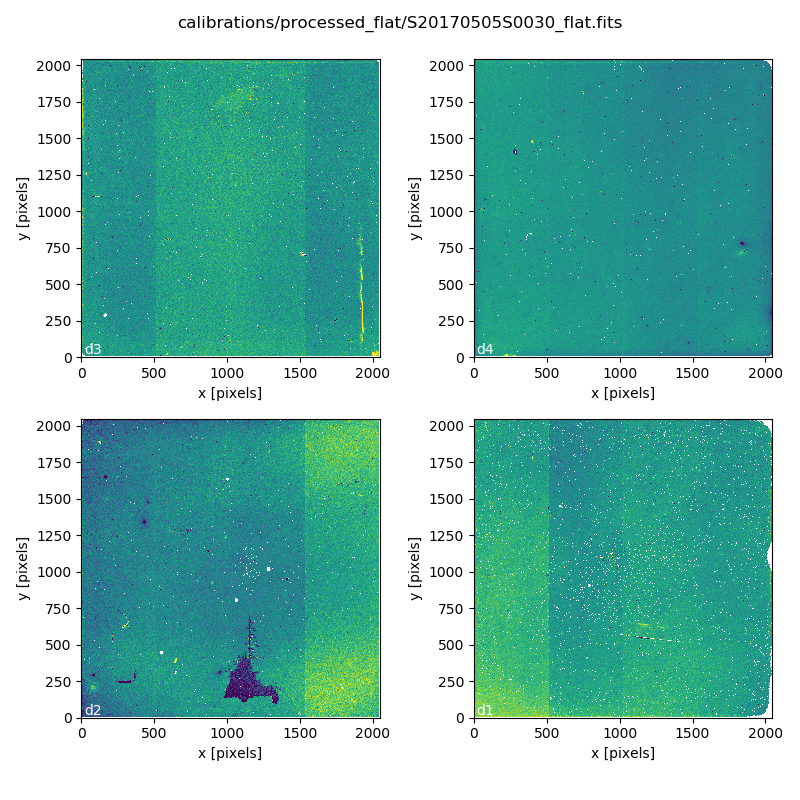
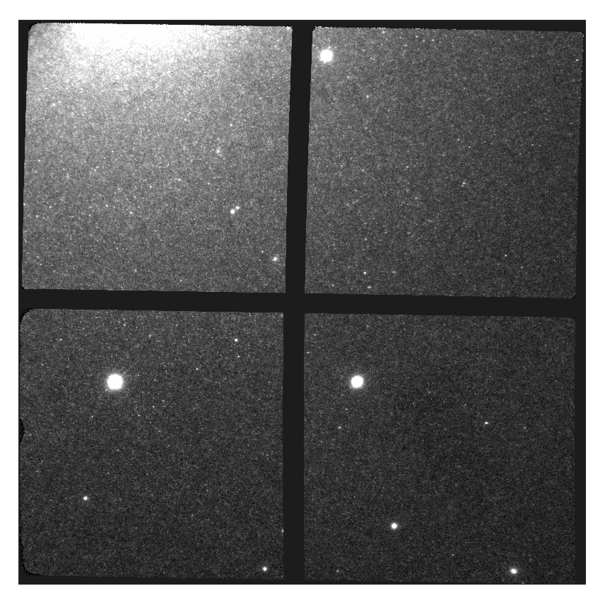

.. ex1_gsaoiim_offsetsky_cmdline.rst

.. _offsetsky_cmdline:

************************************************************************
Example 1 - Crowded with offset to sky - Using the "reduce" command line
************************************************************************

This chapter will guide you on reducing **GSAOI data** using
command line tools. In this example we reduce a GSAOI observation of
the resolved outskirt of a nearby galaxy. The observation is a
dither-on-target with offset-to-sky sequence. Just open a terminal to
get started.

While the example cannot possibly cover all situations, it will help you get
acquainted with the reduction of GSAOI data with DRAGONS. We
encourage you to look at the :ref:`tips_and_tricks` and
:ref:`issues_and_limitations` chapters to learn more about GSAOI data
reduction.

DRAGONS installation comes with a set of scripts that are used to
reduce astronomical data. The most important script is called
"|reduce|", which is extensively explained in the |RSUser|.
It is through that command that a DRAGONS reduction is launched.

For this tutorial, we will be also using the following supplemental tools:
"|dataselect|", "|showd|", "|typewalk|", and "|caldb|".

The dataset
===========
If you have not already, download and unpack the tutorial's data package.
Refer to :ref:`datasetup` for the links and simple instructions.

The dataset specific to this example is described in:

    :ref:`offsetsky_dataset`.

Here is a copy of the table for quick reference.

+---------------+---------------------+--------------------------------+
| Science       || S20170505S0095-110 || Kshort-band, on target, 60 s  |
+---------------+---------------------+--------------------------------+
| Flats         || S20170505S0030-044 || Lamp on, Kshort, for science  |
|               || S20170505S0060-074 || Lamp off, Kshort, for science |
+---------------+---------------------+--------------------------------+
| Standard star || S20170504S0114-117 || Kshort, standard star, 30 s   |
+---------------+---------------------+--------------------------------+
| BMP           || bpm_20121104_gsaoi_gsaoi_11_full_4amp.fits          |
+---------------+---------------------+--------------------------------+

.. note:: A master dark is not needed for GSAOI.  The dark current is very low.

.. _setup_caldb:

Set up the Calibration Service
==============================

.. important::  Remember to set up the calibration service.

    Instructions to configure and use the calibration service are found in
    :ref:`cal_service`, specifically the these sections:
    :ref:`cal_service_config` and :ref:`cal_service_cmdline`.

.. _organize_files:

Check files
===========

For this example, all the raw files we need are in the same directory called
``../playdata/example1``. Let us learn a bit about the data we have.

Ensure that you are in the ``playground`` directory and that the ``conda``
environment that includes DRAGONS has been activated.

Let us call the command tool "|typewalk|":

..  code-block:: bash

    $ typewalk -d ../playdata/example1

    directory:  /data/workspace/gsaoiimg_tutorial/playdata/example1
         S20170504S0114.fits ............... (GEMINI) (GSAOI) (IMAGE) (RAW) (SIDEREAL) (SOUTH) (UNPREPARED)
         ...
         S20170505S0030.fits ............... (AZEL_TARGET) (CAL) (DOMEFLAT) (FLAT) (GEMINI) (GSAOI) (IMAGE) (LAMPON) (NON_SIDEREAL) (RAW) (SOUTH) (UNPREPARED)
         ...
         S20170505S0060.fits ............... (AZEL_TARGET) (CAL) (DOMEFLAT) (FLAT) (GEMINI) (GSAOI) (IMAGE) (LAMPOFF) (NON_SIDEREAL) (RAW) (SOUTH) (UNPREPARED)
         ...
         S20170505S0095.fits ............... (GEMINI) (GSAOI) (IMAGE) (RAW) (SIDEREAL) (SOUTH) (UNPREPARED)
         ...
         S20170505S0110.fits ............... (GEMINI) (GSAOI) (IMAGE) (RAW) (SIDEREAL) (SOUTH) (UNPREPARED)
    Done DataSpider.typewalk(..)

This command will open every FITS file within the folder passed after the ``-d``
flag (recursively) and will print an unsorted table with the file names and the
associated tags. For example, calibration files will always have the ``CAL``
tag. Flat images will always have the ``FLAT`` tag. This means that we can
start getting to know a bit more about our data set just by looking at the tags.
The output above was trimmed for presentation.

.. _create_file_lists:

Create File lists
=================

This data set contains science and calibration frames. For some program, it
could have different observed targets and different exposure times depending
on how you like to organize your raw data.

The DRAGONS data reduction pipeline does not organize the data for you.  You
have to do it. DRAGONS provides tools to help you with that.

The first step is to create input file lists.  The tool "|dataselect|" helps
with that.  It uses Astrodata tags and "|descriptors|" to select the files and
send the filenames to a text file that can then be fed to "|reduce|".  (See the
|astrodatauser| for information about Astrodata.)

First, navigate to the ``playground`` directory in the unpacked data package::

    cd <path>/gsaoiim_tutorial/playground

A list for the flats
--------------------
Let us create the list containing the domeflats:

.. code-block:: bash

    $ dataselect --tags FLAT ../playdata/example1/*.fits -o flats_Kshort.list

We know that our dataset has only one filter (Kshort). If our dataset
contained data with more filters, we would have had to use the ``--expr``
option to select the appropriate filter as follows:

.. code-block:: bash

    $ dataselect --tags FLAT --expr "filter_name=='Kshort'" ../playdata/example1/*.fits -o flats_Kshort.list

.. note:: To see the name of the filter, use "|showd|" (show descriptor):

     .. code-block:: bash

        $ showd ../playdata/example1/*.fits -d filter_name
        -------------------------------------------------------------
        filename                                          filter_name
        -------------------------------------------------------------
        ../playdata/example1/S20170504S0114.fits   Kshort_G1105&Clear
        ...
        ...

A list for the standard star
----------------------------
In this case we have only one standard star.  Indeed, we can confirm that by
selecting on partner calibrations and showing the object name:

..  code-block:: bash

    $ dataselect --expr 'observation_class=="partnerCal"' ../playdata/example1/*.fits | showd -d object
    -------------------------------------------------
    filename                                   object
    -------------------------------------------------
    ../playdata/example1/S20170504S0114.fits     9132
    ../playdata/example1/S20170504S0115.fits     9132
    ../playdata/example1/S20170504S0116.fits     9132
    ../playdata/example1/S20170504S0117.fits     9132

If we had more than one object, a list for each standard star is created by
using the ``object`` descriptor as a selection criterium in "|dataselect|":

.. code-block:: bash

    $ dataselect --expr 'object=="9132"' ../playdata/example1/*.fits -o std_9132.list

A list for the science observations
-----------------------------------
The rest is the data with your science target. Before we create a new list, let
us check that indeed we have only one science target and a unique exposure time:

.. code-block:: bash

    $ dataselect --expr 'observation_class=="science"' ../playdata/example1/*.fits | showd -d object,exposure_time
    ------------------------------------------------------------------
    filename                                    object   exposure_time
    ------------------------------------------------------------------
    ../playdata/example1/S20170505S0095.fits   NGC5128            60.0
    ../playdata/example1/S20170505S0096.fits   NGC5128            60.0
    ...
    ../playdata/example1/S20170505S0109.fits   NGC5128            60.0
    ../playdata/example1/S20170505S0110.fits   NGC5128            60.0

Just to demonstrate how expression are built, let us consider that we need to
select only the files for which ``object`` is NGC5128 and ``exposure_time``
is 60 seconds. We also want to pass the output to a new list:

.. code-block:: bash

   $ dataselect --expr '(observation_class=="science" and exposure_time==60.)' ../playdata/example1/*.fits -o science.list

Bad Pixel Mask
==============
Starting with DRAGONS v3.1, the bad pixel masks (BPMs) are now handled as
calibrations.  They are downloadable from the archive instead of being
packaged with the software. They are automatically associated like any other
calibrations.  This means that the user now must download the BPMs along with
the other calibrations and add the BPMs to the local calibration manager.

See :ref:`getBPM` in :ref:`tips_and_tricks` to learn about the various ways
to get the BPMs from the archive.

To add the static BPM included in the data package to the local calibration
database:

::

    caldb add ../playdata/example1/bpm*.fits

.. _process_flat_files:

Create a Master Flat Field
==========================
The GSAOI Kshort master flat is created from a series of lamp-on and lamp-off
dome exposures.  They should all have the same exposure time.  Each flavor is
stacked (averaged), then the lamp-off stack is subtracted from the lamp-on
stack and the result normalized.

We create the master flat field and add it to the calibration manager as
follows:

..  code-block:: bash

   $ reduce @flats_Kshort.list

The ``@`` character before the name of the input file is the "at-file" syntax.
More details can be found in the |atfile| documentation.

Because the database was given the "store" option in the ``dragonsrc`` file,
the processed dark will be automatically added to the database at the end of
the recipe.

.. note:: The file name of the output processed flat is the file name of the
    first file in the list with ``_flat`` appended as a suffix.  This the
    general naming scheme used by "|reduce|".

.. note:: If you wish to inspect the processed calibrations before adding them
    to the calibration database, remove the "store" option attached to the
    database in the ``dragonsrc`` configuration file.  You will then have to
    add the calibrations manually following your inspection, eg.

   ``caldb add S20170505S0030_flat.fits``

.. note::
    The master flat will be saved in the same folder where |reduce| was
    called *and* inside the ``./calibrations/processed_flat`` folder. The latter
    location is to cache a copy of the file. This applies to all the processed
    calibration.

Here is an example of a master flat:

   Master Flat - K-Short Band

Note that this figure shows the masked pixels in white color but not all the
detector features are masked. For example, the "Christmas Tree" on detector
2 can be easily noticed but was not masked.

Reduce Standard Star
====================
The standard star is reduced essentially the same way as the science
target (next section). The processed flat field that we added earlier to
the local calibration database will be fetched automatically.  Also, in
this case the standard star was obtained using ROIs (Regions-of-Interest)
which do not match the flat field.  The software will recognize that the
flat field is still valid and will crop it to match the ROIs.

::

    $ reduce @std_9132.list

.. note:: The ``reduce`` command will automatically align and stack the images.
      Therefore, it is no longer necessary to use the ``disco_stu`` tool for
      GSAOI data.

.. _processing_science_files:

Reduce the Science Images
=========================
This is an observation of a galaxy with offset to sky.  We need to turn off
the additive offsetting of the sky because the target fills the field of view
and does not represent a reasonable sky background.  If the offsetting is not
turned off *in this particular case*, it results in an over-subtraction of the
sky frame.

.. note:: Unlike the other near-IR instruments, the additive ``offset_sky``
      parameter is used by default to adjust the sky frame background for
      GSAOI instead of the multiplicative ``scale_sky`` parameter.  It was
      found to work better when the sky background per pixel is very low,
      which is common due to the short exposure time needed to avoid
      saturating stars and the small pixel scale. The reader is encouraged
      to experiment with ``scale_sky`` if ``offset_sky`` does not seem to
      lead to an optimal sky subtraction.

      (Remember that when the source is extended, both parameters
      normally need to be turned off.)

The sky frame comes from off-target sky observations.  We feed the pipeline
all the on-target and off-target frames.  The software will split the
on-target and the off-target appropriately using information in the headers.

Once we have our calibration files processed and added to the database, ready
for retrieval, we can run ``reduce`` on our science data.

.. code-block:: bash

   $ reduce @science.list -p skyCorrect:offset_sky=False

This command will generate flat corrected files, align them,
stack them, and orient them such that North is up and East is left. The final
image will have the name of the first file in the set, with the suffix
``_image``. The on-target files are the ones that have been flat corrected
(``_flatCorrected``), and scaled (``_countsScaled``).  There should be nine
of these.

   S20170505S0095 - Final flat corrected, aligned, and stacked image

The figure above shows the final flat-corrected, aligned, and stacked frame.
For absolute distortion correction and astrometry, ``reduce`` can use a
reference catalog provided by the user.  Without a reference catalog, like
above, only the relative distortion between the frames is accounted for.

The output stack units are in electrons (header keyword BUNIT=electrons).
The output stack is stored in a multi-extension FITS (MEF) file.  The science
signal is in the "SCI" extension, the variance is in the "VAR" extension, and
the data quality plane (mask) is in the "DQ" extension.
