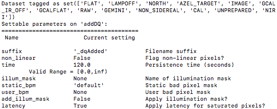
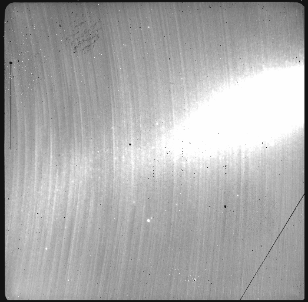
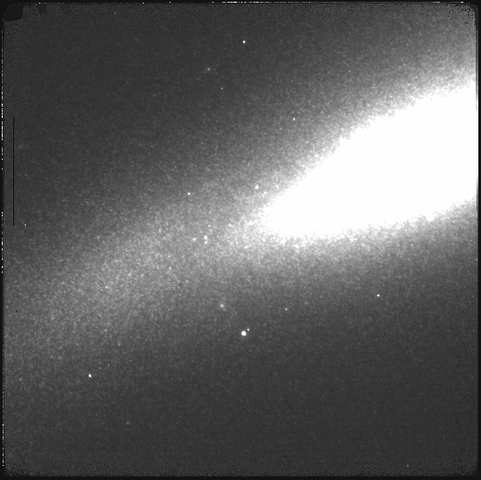

.. ex1_niriim_extended_cmdline.rst

.. _extended_cmdline:

*********************************************************************************
Example 1 - Extended source with offset to sky - Using the "reduce" command line
*********************************************************************************

In this example we will reduce a NIRI observation of an extended source using
the "|reduce|" command that is operated directly from the unix shell.  Just
open a terminal and load the DRAGONS conda environment to get started.

This observation is a simple dither on target, a galaxy, with offset to sky.

The dataset
===========
If you have not already, download and unpack the tutorial's data package.
Refer to :ref:`datasetup` for the links and simple instructions.

The dataset specific to this example is described in:

    :ref:`extended_dataset`.

Here is a copy of the table for quick reference.

+---------------+--------------------------------------------+
| Science       || N20160102S0270-274 (on-target)            |
|               || N20160102S0275-279 (on-sky)               |
+---------------+--------------------------------------------+
| Science darks || N20160102S0423-432 (20 sec, like Science) |
+---------------+--------------------------------------------+
| Flats         || N20160102S0373-382 (lamps-on)             |
|               || N20160102S0363-372 (lamps-off)            |
+---------------+--------------------------------------------+
| Short darks   || N20160103S0463-472                        |
+---------------+--------------------------------------------+
| Standard star || N20160102S0295-299                        |
+---------------+--------------------------------------------+
| BPM           || bpm_20010317_niri_niri_11_full_1amp.fits  |
+---------------+--------------------------------------------+

Set up the Local Calibration Manager
====================================

.. important::  Remember to set up the calibration service.

    Instructions to configure and use the calibration service are found in
    :ref:`cal_service`, specifically the these sections:
    :ref:`cal_service_config` and :ref:`cal_service_cmdline`.

Create file lists
=================

This data set contains science and calibration frames. For some programs, it
could have different observed targets and different exposure times depending
on how you like to organize your raw data.

The DRAGONS data reduction pipeline does not organize the data for you.  You
have to do it.  DRAGONS provides tools to help you with that.

The first step is to create input file lists.  The tool "|dataselect|" helps
with that.  It uses Astrodata tags and "|descriptors|" to select the files and
send the filenames to a text file that can then be fed to "|reduce|".  (See the
|astrodatauser| for information about Astrodata.)

First, navigate to the ``playground`` directory in the unpacked data package.

::

    cd <path>/niriim_tutorial/playground

Two lists for the darks
-----------------------
We have two sets of darks; one set for the science frames, the 20-second darks,
and another for making the BPM, the 1-second darks.  We will create two lists.

If you did not know the exposure times for the darks, you could have use a
combination of "|dataselect|" to select all the darks (tag ``DARK``) and feed
that list to "|showd|" to show descriptor values, in this case
``exposure_time``.  (See the |descriptors| page for a complete list.)

.. highlight:: text

::

    dataselect ../playdata/example1/*.fits --tags DARK | showd -d exposure_time

    --------------------------------------------------------
    filename                                   exposure_time
    --------------------------------------------------------
    ../playdata/example1/N20160102S0423.fits          20.002
    ../playdata/example1/N20160102S0424.fits          20.002
    ../playdata/example1/N20160102S0425.fits          20.002
    ../playdata/example1/N20160102S0426.fits          20.002
    ../playdata/example1/N20160102S0427.fits          20.002
    ../playdata/example1/N20160102S0428.fits          20.002
    ../playdata/example1/N20160102S0429.fits          20.002
    ../playdata/example1/N20160102S0430.fits          20.002
    ../playdata/example1/N20160102S0431.fits          20.002
    ../playdata/example1/N20160102S0432.fits          20.002
    ../playdata/example1/N20160103S0463.fits           1.001
    ../playdata/example1/N20160103S0464.fits           1.001
    ../playdata/example1/N20160103S0465.fits           1.001
    ../playdata/example1/N20160103S0466.fits           1.001
    ../playdata/example1/N20160103S0467.fits           1.001
    ../playdata/example1/N20160103S0468.fits           1.001
    ../playdata/example1/N20160103S0469.fits           1.001
    ../playdata/example1/N20160103S0470.fits           1.001
    ../playdata/example1/N20160103S0471.fits           1.001
    ../playdata/example1/N20160103S0472.fits           1.001

As one can see above the exposure times all have a small fractional increment.
This is just a floating point inaccuracy somewhere in the software that
generates the raw NIRI FITS files.  As far as we are concerned in this
tutorial, we are dealing with 20-second and 1-second darks.  The tool
"|dataselect|" is smart enough to match those exposure times as "close enough".
So, in our selection expression, we can use "1" and "20" and ignore the extra
digits.

.. note:: If a perfect match to 1.001 were required, adding the option
          ``--strict`` in ``dataselect`` would ensure an exact match.

Let's create our two lists now.

::

    dataselect ../playdata/example1/*.fits --tags DARK --expr='exposure_time==1' -o darks1s.lis
    dataselect ../playdata/example1/*.fits --tags DARK --expr='exposure_time==20' -o darks20s.lis

A list for the flats
--------------------
The flats are a sequence of lamp-on and lamp-off exposures.  We just send all
of them to one list.

::

    dataselect ../playdata/example1/*.fits --tags FLAT -o flats.lis

A list for the standard star
----------------------------
The standard stars at Gemini are normally taken as partner calibration.

You can see the ``observation_class`` of all the data using "|showd|". Here
we will print the object name too.

::

    showd ../playdata/example1/*.fits -d observation_class,object

    -----------------------------------------------------------------------
    filename                                   observation_class     object
    -----------------------------------------------------------------------
    ../playdata/example1/N20160102S0270.fits             science    SN2014J
    ...
    ../playdata/example1/N20160102S0295.fits          partnerCal      FS 17
    ../playdata/example1/N20160102S0296.fits          partnerCal      FS 17
    ../playdata/example1/N20160102S0297.fits          partnerCal      FS 17
    ../playdata/example1/N20160102S0298.fits          partnerCal      FS 17
    ../playdata/example1/N20160102S0299.fits          partnerCal      FS 17
    ../playdata/example1/N20160102S0363.fits              dayCal   GCALflat
    ...
    ../playdata/example1/N20160103S0472.fits              dayCal       Dark

The list is abridged for presentation.

Our standard star is a "partnerCal" named "FS 17".  Since it is unique, we
can use either criterion to get our list.

::

    dataselect ../playdata/example1/*.fits --expr='observation_class=="partnerCal"' -o stdstar.lis

Or

::

    dataselect ../playdata/example1/*.fits --expr='object=="FS 17"' -o stdstar.lis

A list for the science observations
-----------------------------------
The science frames are all the ``IMAGE`` non-``FLAT`` frames that are also not
the standard.  Since flats are tagged ``FLAT`` and ``IMAGE``, we need to
exclude the ``FLAT`` tag.

This translates to the following expression::

    dataselect ../playdata/example1/*.fits --tags IMAGE --xtags FLAT --expr='object!="FS 17"' -o target.lis

One could have used the name of the science target too, like we did for
selecting the standard star observation in the previous section.  The example
above shows how to *exclude* a tag if needed and was considered more
educational.

Master Dark
===========
We first create the master dark for the science target, then add it to the
calibration database.  The name of the output master dark,
``N20160102S0423_dark.fits``, is written to the screen at the end of the
process.

::

    reduce @darks20s.lis

The ``@`` character before the name of the input file is the "at-file" syntax.
More details can be found in the |atfile| documentation.

Because the database was given the "store" option in the ``dragonsrc`` file,
the processed dark will be automatically added to the database at the end of
the recipe.

.. note:: The file name of the output processed dark is the file name of the
    first file in the list with `_dark` appended as a suffix.  This the
    general naming scheme used by "|reduce|".

.. note:: If you wish to inspect the processed calibrations before adding them
    to the calibration database, remove the "store" option attached to the
    database in the ``dragonsrc`` configuration file.  You will then have to
    add the calibrations manually following your inspection, eg.

    ``caldb add S20131120S0115_dark.fits``

Bad Pixel Mask
==============
Starting with DRAGONS v3.1, the bad pixel masks (BPMs) are now handled as
calibrations.  They are downloadable from the archive instead of being
packaged with the software. They are automatically associated like any other
calibrations.  This means that the user now must download the BPMs along with
the other calibrations and add the BPMs to the local calibration manager.

See :ref:`getBPM` in :ref:`tips_and_tricks` to learn about the various ways
to get the BPMs from the archive.

To add the static BPM included in the data package to the local calibration
database:

::

    caldb add ../playdata/example1/bpm*.fits

The user can also create a *supplemental*, fresher BPM from the flats and
recent short darks.  That new BPM is later fed to "|reduce|" as a *user BPM*
to be combined with the static BPM.  Using both the static and a fresh BPM
from recent data can lead to a better representation of the bad pixels.  It
is an optional but recommended step.

The flats and the short darks are the inputs.

The flats must be passed first to the input list to ensure that the recipe
library associated with NIRI flats is selected.  We will not use the default
recipe but rather the special recipe from that library called
``makeProcessedBPM``.

::

    reduce @flats.lis @darks1s.lis -r makeProcessedBPM

The BPM produced is named ``N20160102S0373_bpm.fits``.

Since this is a user-made BPM, you will have to pass it to DRAGONS on the
as an option on the command line.

Master Flat Field
=================
A NIRI master flat is created from a series of lamp-on and lamp-off exposures.
Each flavor is stacked, then the lamp-off stack is subtracted from the lamp-on
stack.

We create the master flat field and add it to the calibration database as
follow::

    reduce @flats.lis -p addDQ:user_bpm=N20160102S0373_bpm.fits

Note how we pass in the BPM we created in the previous step.  The ``addDQ``
primitive, one of the primitives in the recipe, has an input parameter named
``user_bpm``.  We assign our BPM to that input parameter.

To see the list of available input parameters and their defaults, use the
tool "|showpars|".  It needs the name of a file on which the primitive will
be run because the defaults are adjusted to match the input data.

::

    showpars ../playdata/example1/N20160102S0363.fits addDQ

Standard Star
=============
The standard star is reduced more or less the same way as the science
target (next section) except that dark frames are not obtained for standard
star observations.  Therefore the dark correction needs to be turned off.

The processed flat field that we added earlier to the local calibration
database will be fetched automatically.  The user BPM (optional, but
recommended) needs to be specified by the user.

::

    reduce @stdstar.lis -p addDQ:user_bpm=N20160102S0373_bpm.fits darkCorrect:do_cal=skip

Science Observations
====================
The science target is an extended source.  We need to turn off
the scaling of the sky because the target fills the field of view and does
not represent a reasonable sky background.  If scaling is not turned off *in
this particular case*, it results in an over-subtraction of the sky frame.

The sky frame comes from off-target sky observations.  We feed the pipeline
all the on-target and off-target frames.  The software will split the
on-target and the off-target appropriately.

The master dark and the master flat will be retrieved automatically from the
local calibration database. Again, the user BPM needs to be specified on
the command line. (The static BPM will be picked from database).

The output stack units are in electrons (header keyword BUNIT=electrons).
The output stack is stored in a multi-extension FITS (MEF) file.  The science
signal is in the "SCI" extension, the variance is in the "VAR" extension, and
the data quality plane (mask) is in the "DQ" extension.

.. todo:: Fix cleanReadout so that we don't have to skip it.
          For now, add ``cleanReadout:clean=skip`` to the command line.

::

    reduce @target.lis -p addDQ:user_bpm=N20160102S0373_bpm.fits skyCorrect:scale_sky=False

The attentive reader will note that the reduced image is slightly larger
than the individual raw image. This is because of the telescope was dithered
between each observation leading to a slightly larger final field of view
than that of each individual image.  The stacked product is *not* cropped to
the common area, rather the image size is adjusted to include the complete
area covered by the whole sequence.  Of course the areas covered by less than
the full stack of images will have a lower signal-to-noise.  The final MEF file
has three named extensions, the science (SCI), the variance (VAR), and the data
quality plane (DQ).
