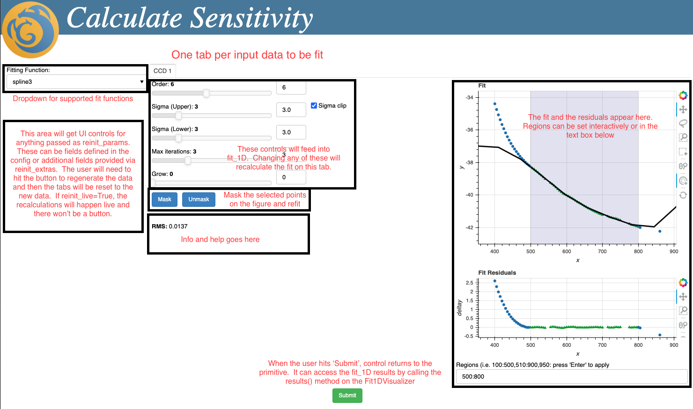
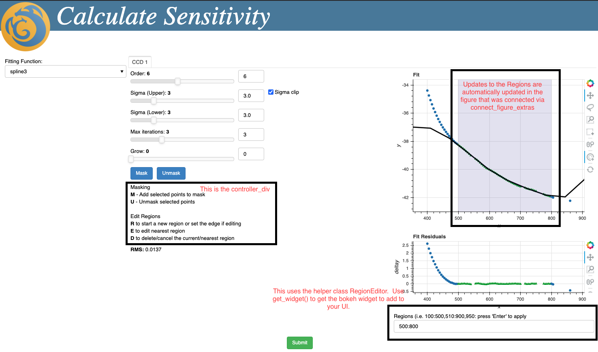

# Interactive Tools

This is a guide to the interactive APIs and how to use them
in the primitives in the recipe system.  These tools depend
on bokeh and spin up an embedded webserver to provide the
user interface.

## Quick Start

The visualization is done in bokeh with an embedded web server.
In the primitive, the code will call out to the visualization
API with the input values/parameters.  From there, the user will
be interacting with the data in bokeh.  Once the user hits a
submit button, the code will return to the calling primitive and
it can extract the final fit/parameters from the visualization.
There is also a pre-done 1-D Visualizer provided to use the
fit_1D fitter.

## Fit1DVisualizer

This first section will outline the `Fit1DVisualizer`.  For
many primitives, this will be sufficient.  Using this
`Visualizer` implementation will save time and lead to a
consistent interface with other interactive fits.



### Identify Coordinate inputs, Fit inputs

Look over the primitive and see what inputs are used to
generate the initial set of coordinates to be fit.  This
may be an expensive operation and we want to
separate out the needed inputs accordingly in the UI.
These inputs will be UI widgets on the far left used
to generate the full set of coordinates/weights.

The logic to generate the coordinates from those
inputs may be placed in a method.  Changes in these left
side inputs affect all tabs and will call this provided
function from the primitive to regenerate all input
coordinates and weights.

### Noteable Parameters

Some of the more noteable parameters to the `Fit1DVisualizer` are:

#### data_source

This will either be actual input coordinates or a function that
returns the input coordinates.  If you have no parameters other
than the ones being passed to the `fit_1D` fitters (`order`, etc)
then you can just pass a list of (x, y, weights) tuples

#### fitting_parameters

This should be a list of dictionaries that will
be sent to each `fit_1D` when doing the fits.  Essentially, this will
have the initial `order`, etc that will be used for each tab.  This
can be easily generated from the primitive parameters using:

```python
fit_1D.translate_params(params)
```

### Create/Start the Fit1DVisualizer

This is the same approach you will take with a custom
`Visualizer` if one is needed.

First you instantiate the `Fit1DVisualizer` with the
coordinates or coordinate function and other parameters.
Then you start the bokeh UI by calling

```python
geminidr.interactive.server.interactive_fitter(visualizer)
```

The call will block until the user hits the *Submit* button or
closes the tab.  Then the function will return and resulting
fits are available from the `visualizer`.  You can get the list
of final `fit_1D` fits by calling the `results()` method like
this:

```python
all_m_final = visualizer.results()
```

### calculateSensitivity

The `calculateSensitivty` primitive is a good example of the common case and
how to use the pre-done `Fit1DVisualizer` UI.  The code ends up like this:

```python
if interactive:
    for ext in ad:
        # calculate the x, y, weights
        # create a dict of fit_1D parameters
        # add each to an array
        # <snip>...
        all_exts.append(ext)
        all_shapes.append(ext.shape[0])
        all_pixels.append(wave.value)
        all_masked_data.append(zpt.value)
        all_weights.append(1./zpt_err.value)
        # Do NOT reuse the fit_1D.translate_params output for all values as the
        # UI will update the dictionary and that would affect all extensions
        all_fp_init.append(fit_1D.translate_params(params))

    # Clone the config
    config = self.params[self.myself()]
    config.update(**params)

    # Create the 1-D Fitter.  The first argument is either a tuple of x, y, weight arrays
    # or a function that returns a tuple of x, y, weight arrays.  Each array has 1 array
    # per extension.  So x[0], y[0], weights[0] all belong to the first extension, etc.
    visualizer = fit1d.Fit1DVisualizer((all_pixels, all_masked_data, all_weights),
                                       fitting_parameters=all_fp_init,
                                       config=config,
                                       tab_name_fmt="CCD {}",
                                       xlabel='x', ylabel='y',
                                       reinit_live=True,
                                       domains=all_shapes,
                                       title="Calculate Sensitivity")
    # This bit spins up bokeh and waits for the user to click 'Submit' or close the window
    geminidr.interactive.server.interactive_fitter(visualizer)

    # Grab the fit_1D outputs and do something
    all_m_final = visualizer.results()
    for ext, fit in zip(all_exts, all_m_final):
        # Do something
        # <snip>...
else:
    # non-interactive variant
```

### normalizeFlat

The `normalizeFlat` primitive is quite expensive, so we modify the basic UI a bit.  This
primitive passes a function to access the x, y, weights.  What this will do is create extra
UI controls on the left side of the UI, outside the per-extension tabs.  These controls can
be modified to alter values of the `config`.  You can also add additional parameters via the
`reinit_extras` dictionary of name, Field pairs.  The config and the values of the extras are
then passed into the function you provided to recalculate the x, y, weights for all
extensions.

In the case of normalizeFlat, this capability was used to pull out a single row from each
extension to be fit.  When the user selects a row, say `100`, the UI will call back into the
supplied function from `normalizeFlat`.  It will then extract x, y, weights for all extensions
by pulling that row out.

Once the user hits Submit, the fits are not useable as-is.  Instead, this primitive pulls the
`fit_1D` parameters out of the returned fits and does a new fit with the full data using the
same parameters.

It's probably best to examine this primitive as a reference should you need to do something
similar.

## Custom Approach

If the fit can't be done with `fit_1D`, you can subclass
`PrimitiveVisualizer` to do something custom.

An example of this is the `findSourceApertures` primitive which uses
`geminidr.interactive.fit.aperture` to provide an interactive interface.

## PrimitiveVisualizer

The `PrimitiveVisualizer` constructor expects the primitive `config` and a `title`.
The `title` is used in the top of the HTML template shown to the user.  The `config`
will be available to your primitive as a field on the visualizer.

It also creates a `submit_button` field that is a bokeh `Button` to submit the results.
You will want to add this `Button` in your custom UI for the user to submit their final
fit.

### do_later

If you are performing work outside of the bokeh event loop but you want to affect
the UI in some way, use the `do_later` method on the `PrimitiveVisualizer`.  This will
post your function onto the bokeh event loop to be executed in that context.

### visualize(doc)

The method you need to implement to provide a custom UI is `visualize`.  It will take
a bokeh `Document` as it's argument and should add whatever widgets and figures you
need.  Don't forget to add the `submit_button` from the base class.

### results

The only standard method is `visualize`.  You should provide a method/fields for your
primitive to access the results of your custom fit.  In the case of the `Fit1DVisualizer1`,
this call is `results()`

### show_user_message

There is a helper method called `show_user_message` that will pop up a message dialog
for the user.  As an example:

```python
self.vis.show_user_message(f"Sigma slider changed to {val}")
```

### make_modal

There is a helper method called `make_modal` that will pop up a message in the webpage
and block access to the UI.  It takes two parameters, a `widget` and a `message`.  The
`message` will be the text displayed to the user.  The `widget` is used to drive display
of the popup.  When this `widget` is disabled, the message will be shown.  When the `widget`
is re-enabled, the message will be hidden and the user will have access to the UI again.

This roundabout way of showing the popup is necessary due to the design of bokeh.
Typically, you would tie it to a button that kicks off an operation that you expect to be
slow.

For this to work properly, the long-running work should be queued up via
the `do_later` method mentioned previously.  The pattern works like this:

```python
self.make_modal(self.button, "<b>This may take 20 seconds</b>")
```

```python
# ... somewhere else with lots of work to do
self.button.disabled = True

def fn():
    # do something expensive
    self.button.disabled = False
self.do_later(fn)
```

### show_ok_cancel

There is a helper method called `show_ok_cancel`.  This is an updated way to make the
bokeh show a standard javascript ok/cancel dialog and route the response, as a boolean,
to some python code.  The python callback supplied will execute on the UI thread, so
it can safely access bokeh components.

Here is an example

```python
def im_a_callback(arg):
    print(f"Callback made with {arg}")
self.show_ok_cancel("Click OK or Cancel", im_a_callback)
```

### make_ok_cancel_dialog

There is a helper method called `make_ok_cancel_dialog`.  This is called on a bokeh
`Button`, typically right after creating it.  The helper method also takes the message
to display in the ok/cancel dialog and a callback function.  The callback function should
take a single boolean argument, which will be `True` if the user chose "OK" and `False`
if they chose "Cancel".  The helper calls the callback from inside the UI thread, so you
don't have to add a `do_later` layer of your own.

Here is an example from the 1-D fitter:

```python
def reset_dialog_handler(result):
    if result:
        self.fitting_parameters_ui.reset_ui()
self.reset_dialog = self.visualizer.make_ok_cancel_dialog(reset_button,
                                                          'Reset will change all inputs for this tab back '
                                                          'to their original values.  Proceed?',
                                                          reset_dialog_handler)
```

### make_widgets_from_parameters

The `PrimitiveVisualizer` has a `make_widgets_from_parameters` helper method.  For the
passed parameters, defined in a `UIParameters`, this will build a panel of widgets
to update the corresponding parameters.  This provides a quick and easy way to make
a UI for the inputs to a primitive.  For this to work, the `PrimitiveVisualizer` must
be told about the parameters when it is constructed.  This is done with a few lines of
code in the primitive like so:

```python
config = self.params[self.myself()]
config.update(**params)
ui_params = UIParams(config)
# pass this config to the visualizer constructor
```

The `UIParams` can also take a few extra arguments to fine tune it's behavior.
`params` is a list of all the parameters you want captured from the `Config`.
`hidden_params` are the parameters to not automatically add in the
`make_widgets_from_parameters`, if you want to place them elsewhere.  You can add
`title_overrides` to give a dictionary mapping of parameters to text to use in
the UI instead of inferring them from the `Config`.

## Tornado Handlers

The embedded bokeh server uses Tornado for the web engine.  It is possible to add
additional Tornado-based handlers to the server.  This can be useful, for instance,
to create custom web service calls that the HTML UI could access.  As an example, I
have wired up a ‘version’ web service that will report back the DRAGONS version
number.  This is used in the HTML UI to set the text/link to DRAGONS in the lower
right corner.

The logic that adds this handler is the extra_patterns parameter to the bokeh
Server constructor.

```python
extra_patterns=[('/version', VersionHandler),]
```

## Custom Callbacks

There is a dedicated web endpoint setup to handle custom web calls as a convenience.
You can register a method for access via web callbacks by using

```python
callback_id = register_callback(fn)
```

Later in some javascript code, such as a `CustomJS`:

```javascript
$.ajax('/handle_callback?callback=' + cbid + '&...more_args...');
```

The function will be passed the incoming arguments to the web endpoint.  This
is generally a dictionary where the values are arrays of bytes.

## Key Passing

Bokeh provides no way to pass key presses naturally to the python.  As a workaround,
I added a custom bokeh endpoint that takes key presses as URL parameters.  This is
wired up to the `handle_key` URL endpoint in the bokeh Server.  Supported keys must
be intercepted in the javascript in `index.html`.  Then they will come in through
`handle_key`.

Note that this code path is outside the bokeh event loop, so if you
need to change the UI in response to a key press, you will want to use the
`do_later` function provided in `PrimitiveVisualizer`

## Controller/Tasks/Handlers

The key passing is currently used for working with selection bands and apertures.
The bands interface is built into the Fit1DVisualizer, but may be useful in building
more custom visualizers as well.

There are two places this interface is visible.  The first is in the plot itself,
where bands are seen here as shaded bluish stripes.  The second is below the
mask/unmask where some help text is displayed with the currently available key
commands.  Let’s take a look at the code.  Note that we will show bands here,
but Apertures work similarly.



First, in the visualizer for each tab a region model is created.  This is a data
structure that keeps track of all the regions, can check if a given coordinate is
‘selected’ by the regions, and notifies registered listeners whenever the bands
change.  This last is used by Fit1DVisualizer to recalculate the masked points
and redo the fit, for instance.

```python
self.region_model = GIRegionModel()
```

Next, in the UI below the mask/unmask buttons we add a bokeh `Div`.  This `Div` is
going to be updated with help text for the active task.

```python
controller_div = Div()
controls = column(..., controller_div)
```

Then we create a visualization of the bands on the bokeh `Figure`.  This can be
done with a simple utility function.  The None here refers to an optional
`GIApertureModel`.  Note that we can call this multiple times to connect the
`GIRegionModel` to multiple `Figure`s (and indeed in this example there are two).

```python
connect_figure_extras(figure, None, self.region_model)
```

To get updates on the bands so we know to recalculate the masked points, we add
a listener to the `GIRegionModel`.  Note there is a lot of custom code for
`Fit1DVisualizer` behind this and we would need to do something custom for any
new interfaces.

```python
self.region_model.add_listener(some_listener)
```

Lastly, we setup a `Controller`.  There is one for the top figure in each of the
tabs in this example UI.  The `Controller` detects when the mouse enters a
figure and routes mouse coordinates and key presses to a `RegionTask` to modify the
bands as directed.  We don’t need to do anything additional for that, we just
create the `Controller` and let it manage everything.

```python
Controller(figure, None, self.band_model, controller_div)
```

There is also a helper class called `RegionEditor`.  If you create an instance of
this, it will make a text input that is linked to the `GIRegionModel`.  Just call
`get_widget()` on the `RegionEditor` after you make it to get a widget you can add
to a bokeh layout.

### Handlers

You can also define custom key handlers for the controller.  These allow you to
map a key press over the figure to a function, along with some help text you
want shown in the small help text in `controller_div`.  The function in your
`Handler` should have a signature like `fn(key, x, y)`.

```python
def fn(key, x, y):
    print(f"{key}: ({x}, {y})")
h = Handler('q', 'Do something', fn)
Controller(figure, None, None, controller_div, handlers=[h,])
```


## TabsTurboInjector

The `Tabs` in `bokeh` do a poor job of managing the DOM.  If you have many tabs
with content, it can drastically impair the performance.  As a workaround, you
can initialize your tabs using the provided `TabsTurboInjector` in the `interactive`
module.  First, you instantiate one of these helpers passing an empty bokeh `Tabs`
to it to be managed.  Then, instead of adding child tab `Panel`s to your `Tabs`,
you call the injector's helper method to add the child with a passed title.

A side effect of the injector is that, on tab changes, you'll get a momentary blank tab.

## Modules

The top-level module is for the bokeh server and for custom UI elements and helpers.  It
has the base PrimitiveVisualizer class that you should subclass if you need a
custom UI.

The `fit` module holds the custom `PrimitiveVisualizer` implementations.  This keeps
them from cluttering up the top level as we add more.

The `templates` folder holds HTML and styling information.

The `deprecated` folder holds code that is being retired as a result of a large
refactor.  I have kept it around for now in case it is useful for reference.

### Top Level

#### server

The server has two calls, `interactive_fitter` and `stop_server`.  The `interactive_fitter`
is called with a `PrimitiveVisualizer` instance and will run the UI interaction
in a browser until the UI is stopped.  `stop_server` is generally called by the
user clicking the Submit button or closing the browser tab.

### interactive

`interactive` has the abstract base class, `PrimitiveVisualizer`.  It also has some
helper methods for building slider/text box widgets and some code for displaying and
managing bands (range-selections with plot shading) and apertures (also with plot
shading).

### controls

`controls` has code that is wired up to key presses in the browser.  This includes
a `Controller` that listens for key presses and passes control to various `Task`
managers.  For instance, one such `Task` is for bands and it allows a user to
use the mouse to add, resize, or delete the band selections.

The easiest way to make use of this logic is to use the helper function to
connect a `GIRegionModel` and/or `GIApertureModel` to a bokeh `Figure` and `Div`.
The connected `Figure` will show the selected areas and the `Div` will show
help text for the currently active task (such as `RegionTask`).

Connecting the models to a `Figure` is done with
`connect_figure_extras(fig, aperture_model, band_model)`

To cause a figure to respond to key presses and connect a help `Div` area,
you build a `Controller` like: `Controller(fig, aperture_model, band_model, helptext)`.
Note that `aperture_model` or `band_model` may be passed as None if it
is not relevant.

## fit

The `fit` module is for the implementations of visualizers and supporting code.
Right now, it includes a 1-D fitter for tracing apertures and an aperture
visualizer for finding apertures.

## templates

The `templates` folder has the HTML for displaying the UI and support for things
like a modal overlay message for long-run operations.
