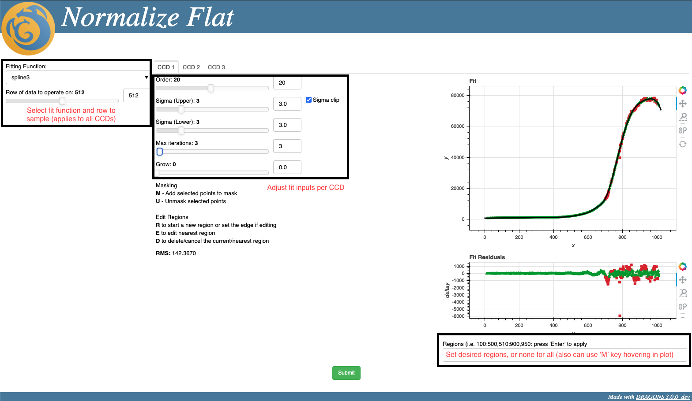
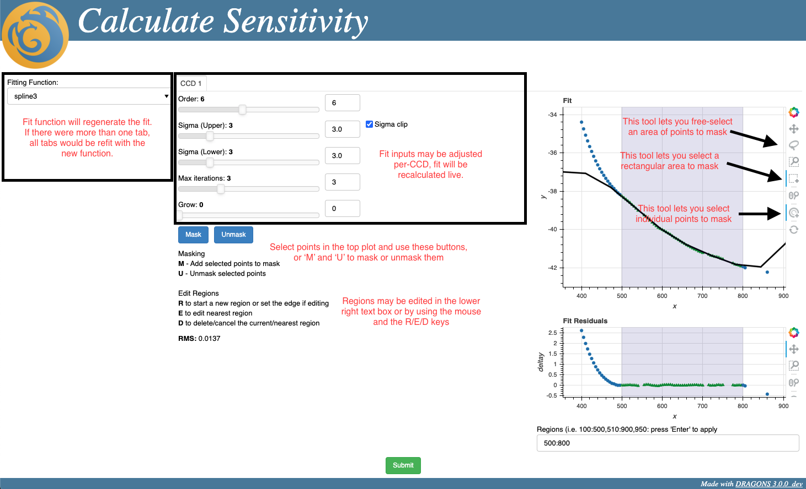
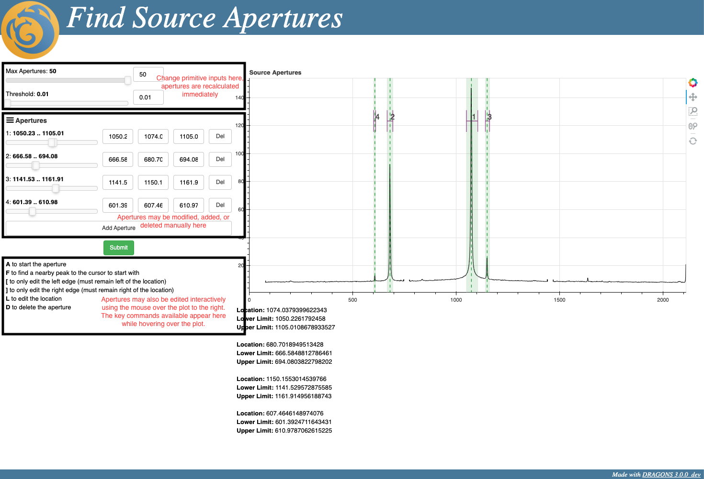

# Interactive Tools

This is a guide to using the interactive tools for data reduction.
For information on developing new interactive interfaces, see
[INTERACTIVE.md](INTERACTIVE.md)

## Normalize Flat

The step to normalize flats can be done interactively.  This happens
as part of the `makeProcessedFlat` recipe.  To turn on interactive mode,
pass the `interactive` parameter.  Here is an example.

### Step 1: Get Data

For this example, you will need to download `N20200520S0141.fits`.  You
can do this in your browser by browsing to:

<https://archive.gemini.edu/file/N20200520S0141.fits>

Alternatively, on UNIX based systems you can use

```bash
curl -O https://archive.gemini.edu/file/N20200520S0141.fits
```

### Step 2: Call `reduce` With `interactive` Parameter

```bash
reduce -p interactive=True -p do_bias=False N20200520S0141.fits
```

This should select the `makeProcessedFlat` recipe.  The `do_bias` parameter
just drops that step so we can focus on the `normalizeFlat` interactivity.
The user interface should automatically start in your web browser and will
look as follows:

### Step 3a: Alter Inputs As Desired



There are two sets of inputs.  The left-most are applied across all of the
CCDs.  This is the fit function (i.e. spline) to perform and a row of data to sample.
The fit is too expensive to preview on all of the data, so this allows for
a responsive interface.  The inputs to the fit are available per-extension
and on each tab.

### Step 3b: Alter Regions As Desired

The regions can be specified as well.  This narrows the points used as input
to the fit.  This can be done interactively, or via the text input below
each plot.  Regions are also set per-CCD.

### Step 4: Submit Parameters

When you hit the *Submit* button, the UI will close and the reduction will
continue, using the inputs and fit function you specified.

### Step 5: Check Output

After finishing, the result of the reduction will be available as
`N20200520S0141_flat.fits`

## Calculate Sensitivity

The `calculateSensitivity` primitive has also been set up for interactive
use.  Here are steps to test it out.

### Step 1: Get Data

For this example, we are going to run the primitive explicitly.  To do this,
I have pulled out a file from just before this step during reduce.  You can
get the file at this URL (Google Drive).  You must be logged in to your
Gemini account, so a browser is recommended.

<https://drive.google.com/file/d/1P_DpzBWtEye03p8AcZy5YrOYz0BKPdZB/view?usp=sharing>


### Step 2: Call `reduce` With `interactive` And Specify Primitive

```bash
reduce -p interactive=True -r calculateSensitivity N20201022S0006_align.fits
```

This should directly call the `calculateSensitivity` primitive.
The user interface should automatically start in your web browser and will
look as follows:

### Step 3a: Alter Inputs As Desired



There are two sets of inputs.  The left-most are applied across all of the
CCDs.  This is the fit function (i.e. spline) to perform on the data.
The inputs to the fit are available per-extension
and on each tab.

### Step 3b: Alter Regions As Desired

The regions can be specified as well.  This narrows the points used as input
to the fit.  This can be done interactively, or via the text input below
each plot.  Regions are also set per-CCD.

### Step 3c: Mask Arbitrary Points As Desired

This primitive allows the selection of arbitrary points.  This can be done
by clicking directly on a point, by using the box select tool, or by using the
lasso free select tool.  Then you either use the 'M' and 'U' keys or the
buttons to mask or unmask those points.  This was not feasable for the
normalize flat UI since it can only show one row at a time.

### Step 4: Submit Parameters

When you hit the *Submit* button, the UI will close and the reduction will
continue, using the inputs and fit function you specified.

### Step 5: Check Output

After finishing, the result of the reduction will be available as
`N20201022S0006_sensitivityCalculated.fits`

## Find Source Apertures

The `findSourceApertures` primitive has also been set up for interactive
use.  Here are steps to test it out.

### Step 1: Get Data

For this example, we are going to run the primitive explicitly.  To do this,
I have pulled out a file from just before this step during reduce.  You can
get the file at this URL (Google Drive).  You must be logged in to your
Gemini account, so a browser is recommended.

<https://drive.google.com/file/d/1nSsTVvEf3OFO46TkK5vbTcjmJsHm6mKs/view?usp=sharing>


### Step 2: Call `reduce` With `interactive` And Specify Primitive

```bash
reduce -p interactive=True -r findSourceApertures S20200201S0031_aperturesTraced.fits
```

This should directly call the `findSourceApertures` primitive.
The user interface should automatically start in your web browser and will
look as follows:

### Step 3: Alter Inputs As Desired



The inputs to the primitive are in the top left.  Altering these will cause the
apertures to be regenerated.  Then, you can modify, add, or delete apertures using
the controls below.  You can also edit the apertures by hovering the mouse over
the plot and using the key commands as described on the bottom left.

### Step 4: Submit Parameters

When you hit the *Submit* button, the UI will close and the reduction will
continue, using the currently defined apertures.

### Step 5: Check Output

After finishing, the result of the reduction will be available as
`S20200201S0031_aperturesFound.fits`
