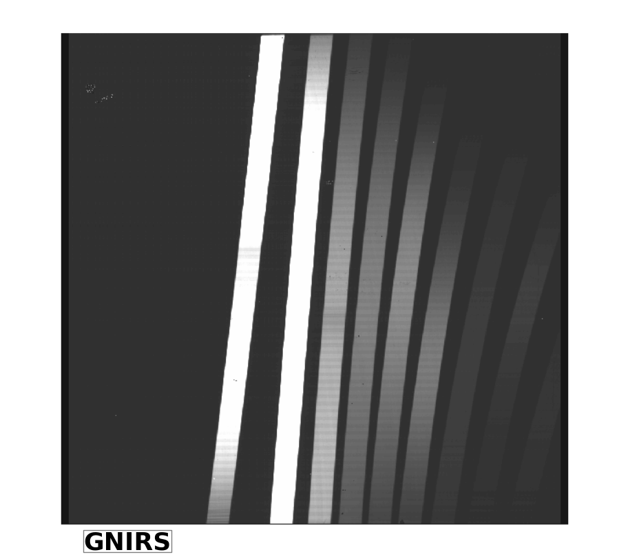

.. _Introduction:

Introduction
------------

.. _what_is:

Edge detection (ED) is both a set of Python scripts and a process that allows you to:

- Find the coordinates of the footprint edges in a Multi-object flat spectra from GMOS and Flamingos-2 (F2) and in a GNIRS Cross-dispersed (XD) flat spectra. 
- With the MDF information and the list of edges produce a list of footprints description that is written to a bintable with Extname *TRACEFP*.

This is a the typical data set that ED can handle:

.. _in_data:

.. image:: _images/gmosSectionOut.png
     :width: 30%

.. image:: _images/F2sectionOut.png
      :width: 30%

Applying the *Sobel* operator we get the footprint edges  in a binary image.

.. image:: _images/bgnirs.png  
   :width: 30%

.. image:: _images/bgmos.png
     :width: 30%

.. image:: _images/bf2.png
      :width: 30%

These thin 1-pixel edges are the input to our edge finding algorithm. Some of these edges do not look continuous but it is a ds9 effect. Zooming in, you could see an unbroken edge.

.. _ed_installation:

**ED installation**

The Edge Detection functions run in any system where AstroData can run. At this time is 
limited to Linux machines running RedHat, Fedora, Ubuntu and Mac OS X.

The software is installed in the gemini_python *gempy* directory which need
to be imported before running ED.

A tar file is available with the ED software and a setup.py file is provided to install it in your system. For example, if you untar the ED tar file in the current directory then:
::

 python setup.py install --home=/tmp

 # Add to PYTHONPATH the new pathname where the ED modules are:

 setenv PYTHONPATH ${PYTHONPATH}:/tmp/lib/python.

.. _user_help:

**Getting Help**

If you experience problems installing or running ED please contact the
Gemini `Helpdesk <http://www.gemini.edu/sciops/helpdesk/?q=sciops/helpdesk>`_.

For internal Gemini staff please contact: Nelson Zarate at  nzarate@gemini.edu. 

.. _quick_example:

**Quick Example: Getting cutouts from each footprint in an image**

- Start your favorite Python shell

- importing modules
  ::

    from astrodata import AstroData
    # The module 'extract.py' should be in a directory accessible via
    # the environment variable PYTHONPATH.
    #
    from gempy.adlibrary import extract as extr

- Use *AstroData* to open a FITS file
  ::

   # Open an F2 Flat exposure of a Multi-object footprint mask.

   ad = AstroData('fS20120104S0070.fits')  

- Find footprints
  ::

   # Find edges, pairs them into Footprint objects and create a 
   # binary table 'TRACEFP' with information about each footprint's edges,
   # appending the table to the input AstroData object. The 'debug' flag will
   # set the function to display the input image in ds9 and plot
   # the edges in a 'matplotlib' window. 
   #
   adout = extr.trace_footprints(ad,debug=True)

- Use the TRACEFP table in the adout object to cut the footprints on a target 
  MOS spectra image.
  ::

   ad = AstroData('myobjects.fits')

   # Add the TRACEFP extension to the target spectrum's AD object.
   ad.append(adout['TRACEFP'])

- Get footprint cutouts.
  ::

   # A rectangular cutout is produced for each footprint with information 
   # in the TRACEFP table. Only one footprint per cutout and all pixels 
   # between the rectangle boundaries and the footprint's edges are set to zero.
   # An AstroData object is returned with as many IMAGE extensions as
   # there are footprints. The 'debug' flag will set the function to display
   # each cutout in ds9 and a footprint drawing in a 'matplotlib' window. 
   # 

   # Notice that we use the target spectrum's AD object containing the 
   # TRACEFP extension.
   ad_cuts = extr.cut_footprints(ad, debug=True)

- Saving all into a FITS file.
  ::

   ad_cuts.write('mycuts.fits')

.. _ed_glossary:

Glossary
------------

**Footprint** 
  The illuminated area of a spectral flat spectrum or more general, an image area (mostly rectangular) with higher flux than the background and limited by two edges. In a MOS FLAT image each illuminated strip is a *footprint*.

**Edge**
  The boundary between the image background and a footprint.
 
**Cut**
  The rectangular area enclosing a footprint. The class Cut defines the members and functions to extract one footprint from the input image and generate a FITS extension in the output AstroData object

.. image:: _images/foot.png 

.. _ed_works:

How to locate footprint edges
------------------------------

The main goal when locating edges is to find a list of (x,y) pixel coordinates belonging to one edge along the footprint boundary. These are the basic steps to achieve this.

1) Quality of the input image.

 - The GMOS, GNIRS and F2 Flat images should have a good signal to noise ratio. If multiple Flats are available then combining several individual exposures can reduce noise and improve signal to noise. In general a S/N of 3.0 or better will guarantee that footprint edges are found.

 - The footprints separation is crucial to determine a well defined edge showing no breakage along the dispersion axis. If two footprints are as close as one pixel, chances are that the algorithm will fail to find the edges.

2) Prefiltering the input data is necessary in some cases to eliminate the background noise which produces to many unwanted short streak after the Sobel operator.

 - For F2 data, the prefiltering is a one sigma standard deviation of the Gauss filter.
 - For GNIRS data, the brightest footprints (:ref:`see picture <in_data>`) are clipped to normalized the orders.
 - GMOS, footprints are well illuminated and uniform with no need of filtering.

3) Use the Sobel operator from the ndimage package. It returns the maximum gradient at positions where there is a change in intensity, such as boundaries between background and a footprint. The picture below shows one row section of about 3 footprints of a GMOS data file with the positive peak (entering the footprint) and a negative peak (exiting the footprint) corresponding to the Sobel operator output.

.. image:: _images/gmossobel.png 

4) Create a binary image by putting the value one on all those points in the Sobel image that are greater than the standard deviation and zero if they are below. The sigma is calculated from the Sobel image. Notice that we are breaking the problem of finding the edges in two. One for positive peaks in the Sobel output image; i.e. the edges when entering the Slit and the negative peaks or the peaks obtained when exiting the footprint. This method makes it easy to follow one edge in a crowded environment when we have two close footprints separated by no more than 2 pixels for example.

5) At about the middle of the image in the dispersion direction, we collapse about 40 rows or columns. This gives us a good signal intensity at the edges location discarding noise areas. From here we find a lists of peak locations that we compare with the values in the MDF table. This is our reference list of peaks for one edge per footprint.

6) Then we follow each edge (peak) in the reference list from the middle position in the dispersion direction toward the high pixels location, appending the (x,y) coordinates for the edges. We follow and do the same from the middle position toward the low pixels location.

7) Since we are building (x_array, y_array) for one edge on each footprint, we can determine the other footprint's edge by adding the footprint width to each coordinate in the spatial direction. No need to go through 5) and 6) for footprints containing edges that are almost linear with constant width. For GNIRS data find the negative edges from the Sobel Image and do 5) and 6) because data contains faint low orders; also footprints are fairly curved.

8) With the (x,y) lists for each edge we fit a 2nd order polynomial use later in the process to cut a rectangle containing a footprint.

.. _ulf:

User Level Functions
-----------------------

The *trace_footprints* and *cut_footprints* are user level functions to obtain footprint edges information and footprint cutouts. 

.. _trace_footprints:

trace_footprints()
-------------------

This user level function finds the footprint edges of spectroscopic flats creating a BINTABLE extension with the footprint parameters information and appends it to the input AstroData object.

USAGE
::

 adout = trace_footprints(ad, function='polynomial', order=2, trace_threshold=1., debug=False)

 Parameters
 ----------
   ad:       Input AstroData object.
   function: Name of the fitting function to use when fitting edges. The default
             value is 'polynomial'. Other posible values are: 'legendre', 'chebyshev'
   order:    Order of the polynomial. Default is 2.
   trace_threshold: 
             Threshold in units of sigma to applied to the filtered image.
             Default value is one.
   debug:    If True, footprint edges plot will be displayed and the input image will be
             displayed on ds9 showing the footprint edges.

  Output
  ------
   adout: Output AstroData objects which is the input AD object with
          the 'TRACEFP' binary table appended.

.. _cut_footprints:

cut_footprints()
------------------

User level function to read from the AD objects the 'TRACEFP' extension having footprints information to cut footprints.  It returns an AD object with a list of IMAGE extensions; each one containing a footprint cut.

USAGE
::

 adout = cut_footprints(ad,debug=False)

  Parameters
  ----------
   ad:       Input AstroData object containing the binary TABLE extension named 'TRACEFP'.
   debug:    If True, footprint edges plot inside a rectangle will be displayed and the
             rectangle is also displayed as an image in the ds9 display.

   Output
   ------
   adout:    Output AstroData object with as many image extensions as
             records in the input 'TRACEFP' table.

   NOTE
   ----
      If the adinput is a target spectra to be cut, then the caller should 
      append the already created TRACEFP table to this target AD object.

         

 

 
 
 
