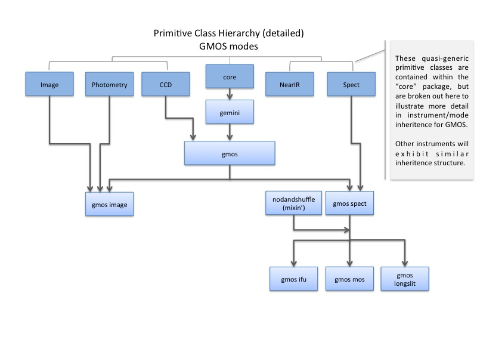

.. interfaces.rst
.. include mappers
.. include overview

.. _iface:

Using the Mappers API
*********************
For practical applications, the Mapper base class provides no functionality, but
defines all attributes for instances built from subclasses of Mapper. Though not 
strictly an abstract class, the Mapper base class cannot be used on its own. 
Subclasses, such as PrimitiveMapper and RecipeMapper, should not override 
Mapper.__init__(), but implement their own mapping routines optimized to the 
"target" of the mapping. An example of a Mapper extension might be an 
implemention of a mapper to find "applicable" lookup tables in instrument 
packages.

The programmatic interfaces on the current mapper classes are straight forward.
One begins by passing a list of astrodata instances, and any ancilliary arguments,
to the "constructor" of either PrimitiveMapper or RecipeMapper. Below, we reiterate
the input arguments to a Mapper class and show the default values of parameters not
passed by the caller::

  __init__(self,
           adinputs,             <list> AstroData objects.
	   context=['sq'],       <list> Defines the recipe set or sets to search.
	   drpkg='geminidr',      <str> Defines the 'dr' package to map.
	   recipename='default',  <str> The recipe name.
           usercals=None,        <dict> User provided calibration files.
	   uparms=None,          <list> User parameters passed to primitives.
	   upload_metrics=False, <bool> Send QA metrics to fitsstore
           )

Once an instance of either a PrimitiveMapper or a RecipeMapper class is built, 
that instance has one (1) and only one public method, a method that invokes
the search algorithm for the instance.

It shall be noted here that the following discussion and examples are based on
using the default data reduction package, *geminidr*. This Gemini Observatory
"drpkg" defines recipes, contexts, and primitive classes for several instruments
of the Observatory. With that in mind, the last :ref:`section of this chapter <drpkg>`
will detail steps required to build your own "drpkg", whether for testing purposes
or as a new, complete data reduction package. It will be the case that all examples
presented herein will be perfectly applicable to any correctly implemented *drpkg*.

Selecting Primitives with PrimitiveMapper
=========================================

Primitive classes for Gemini Observatory instruments are defined in the *geminidr*
package under *gemini_python*. This is specified as the default value on the ``drpkg``
keyword argument shown above. These classes define methods to provide essential
data processing functionality. Primitive classes in *geminidr* are structured
hierarchically and employ multiple inheritance. (Hereafter, a Primitive class may
be referred to as a set of "primitives" or just "primitives", which are just the
defined or inherited methods on that class).

"Generic" primitive classes in the ``geminidr`` package are defined under
``geminidr.core`` (see :ref:`Figure 4.1, Primitive Class Hierarchy <prmcls>`. These
generic classes provide functions that work on all data produced by Gemini
Oberservatory. These classes are arranged logically, meaning primitive functions
for some general task are grouped together. For example, the stacking functions
are defined on the ``Stack`` class found in ``core.primitives_stack``.

There are five (5) defined primitive classes in `core` that are not strictly
generic but are what might be called "quasi-generic", that is, they define
methods for data of a certain general kind, such imaging or spectroscopy.
:ref:`Figure 4.2 <gmoscls>` illustrates these classes by breaking them out of
*core* to show what they are and where in the class structure they are used.

Generic classes are inherited by the primitive class, ``Gemini``. The ``Gemini``
class is then inherited by all instrument-specific primitive classes. These
instrument-specific classes are what might be called "concrete," because they
will provide a complete set of fully implement methods particular to the
instrument data being processed.

.. _prmcls:

.. figure:: images/primcls16.jpg

   Hierarchy of Primitive classes defined under `geminidr`

Because real data are produced by real instruments, the PrimitiveMapper will
usually be pointed to and select primitive classes defined at the instrument-mode
level, i.e., one or more inheritance levels under an instrument primitive class.
That sounds like gobble but :ref:`Figure 4.1, Primitive Class Hierarchy <prmcls>`,
illustrates that this is simple. For example, an F2 image will be processed with
the "f2 image" primitive class, GNIRS image data, the "gnirs image" class, and so
on.

.. _gmoscls:

   Hierarchy of Primitive classes inherited by GMOS

Recall that primitive classes are attributed with a *tagset* indicating the
particular kinds of data to which they are applicable. Indeed, as defined in the
*geminidr* package, only ``gemini`` and subclasses thereof have *tagset* attributes
that make them discoverable by the PrimitiveMapper. Which also implies that any
primitive classes defined in ``core`` are not discoverable by the PrimitiveMapper.
We shall examine the details of this statement in the next section.

Mapping Data to Primitives
--------------------------

When the PrimitiveMapper receives input data, those data are passed as a
list of *astrodata* objects, one *astrodata* object per input dataset. All astrodata
objects have been classified with a number of what are called `tags`, which are
present on the *astrodata* instance as an attribute of the object. For example, a
typical unprocessed GMOS image:

>>> ad = astrodata.open('S20161025S0111.fits')
>>> ad.tags
set(['RAW', 'GMOS', 'GEMINI', 'SIDEREAL', 'UNPREPARED', 'IMAGE', 'SOUTH'])

The PrimitiveMapper uses these tags to search *geminidr* packages, first by 
immediately narrowing the search to the applicable instrument package. In this 
case, the instrument and package are ``gmos``. The Mapper classes have an
understanding of this, and set their own attribute on Mapper instances called,
``pkg``:

>>> from recipe_system.mappers.primitiveMapper import PrimitiveMapper
>>> pm = PrimitiveMapper([ad])
>>> pm.pkg
'gmos'

Once a PrimtiveMapper instance is created, the public method, 
``get_applicable_primitives()`` can be invoked and the search for the most 
appropriate primitive class begins. The search itself is concerned with finding
class objects that define a ``tagset`` attribute on the class.

Continuing the example, let's see how primitive classes in the hierarchy are 
tagged, beginning with the ``gemini`` primitives::

  class Gemini( ...  ):
    tagset = set(["GEMINI"])

  class GMOS(Gemini, ... ):
      tagset = set(["GEMINI", "GMOS"])

  class GMOSImage(GMOS, ... ):
      tagset = set(["GEMINI", "GMOS", "IMAGE"])

The PrimitiveMapper gloms all primitive classes in the package, looking for a 
maximal subset of the *astrodata tags* in the tagset attribute of the primitive 
classes. Using our astrodata ``tags`` in the example above, we can see that 
``GMOSImage`` class provides a maximal matching tagset to the astrodata object's 
data classifications.

We proceed from the example above and have the PrimitiveMapper do its job:

>>> pset = pm.get_applicable_primitives()

Check that we have the primitives we expect:

>>> pset.__class__
<class 'geminidr.gmos.primitives_gmos_image.GMOSImage'>

Which is exactly correct. Once PrimitiveMapper has acquired the best "applicable"
primitive class, it instantiates the primitives object using the parameters 
passed. The returned ``pset`` is the *actual instance of the class* and is ready 
to be used.

The *tagset* is the only criterion used by the PrimitiveMapper to find the correct
primitive class. Readers may correctly infer from this that naming primitive
classes, and the modules containing them, is arbitrary; primitive classes and the
containing modules can be named at the discretion of the developer. Indeed, the
entire set of primitive classes could exist in a single file. For reasons too
obvious to enumerate, such an "arrangement" is considered ill-advised.

.. _rselect:

Selecting Recipes with RecipeMapper
===================================

Recipes are pre-defined python functions that receive a single argument: a
primitive class object (instance). Unlike primitive classes, recipes are much
simpler; they are straight up functions with one argument. Recipe functions are
not classes and do not (cannot) inherit. The recipe simply defines the set and
order of primitive functions to be called on the data, references to which are
contained by the primitive instance. Essentially, a recipe is a pipeline.

Recipe functions are defined in python modules (which may be referred to as
recipe libraries, a collection of functions) that are placed in a *geminidr*
instrument package. Recipes are only defined for instruments and exist under
an instrument package in the directory in a ``recipes/`` directory like this::

  ../geminidr/f2/recipes
  ../geminidr/gmos/recipes
  ../geminidr/gnirs/recipes
  .. [etc. ]

Here is a (current) listing of instrument recipe directories under *geminidr*::

  geminidr/f2/recipes/:
      __init__.py
      qa/
      sq/

  geminidr/gmos/recipes/:
      __init__.py
      qa/
      sq/

  geminidr/gnirs/recipes/:
      __init__.py
      qa/
      sq/

  geminidr/gsaoi/recipes/:
      __init__.py
      qa/
      sq/

  geminidr/niri/recipes/:
      __init__.py
      qa/
      sq/

Readers will note the appearance of directories named ``qa`` and ``sq`` under
recipes. These directories indicate a separation of recipe types, named to indicate
the kinds of recipes contained therein. Any named directories defined under
``recipes/`` are termed "contexts." 

.. _context:

Context
-------
An instrument package *recipes* path is extended by names indicating a "context."
As shown above, *geminidr* instrument packages define two contexts under all
recipes directories: `qa` and `sq`, which indicate that recipes defined under
``recipes/qa`` provide Quality Assurance (*qa*) processing. Science Quality
(*sq*) recipes defined under ``recipes/sq`` provide science quality reduction
pipelines. Currently defined recipe library files will appear under one or all of
these context directories.

Context is not hard limited to just `qa` and `sq` contexts for the RecipeMapper.
Indeed, contexts can be named almost anything you like. The form new contexts shall
have takes the same pattern shown above::

  ../geminidr/<instrument_name>/recipes/<context>/

Developers are free to define and use new *contexts* as they choose. All that is 
required to have the RecipeMapper select recipes from another context is to pass a 
list containing this new *context* value (or values) to the RecipeMapper. RecipeMapper
uses a default context when no context is passed. The :ref:`next section <d2r>` 
will discuss this and provide examples for adding new contexts and selecting recipes 
from these new contexts.

.. admonition:: Why is Context a list?

   A reasonable question will arise regarding the *context* parameter: why is
   context a list and not just a single string value?

   The answer is that *context* serves, not only a recipe context indicator to the 
   RecipeMapper, but also other possible flags or indicators that may be used by 
   primitives. Since the *context* parameter is passed to primitives, the primitive
   functions are free to inspect the context list for particular items and make 
   decisions based upon any or all provided contexts. Hence, arbitrary flags can 
   be included in the context list and passed to the primitive class initializer.

   Indeed, any number of strings (and other data types) can be added to the context 
   list.

   For example, the calibration primitives in *geminidr* (``primitives_calibdb.py``) 
   examine the context parameter for an "upload" string. This string is 
   interpreted by the primitives as a signal to upload any processed calibration 
   files to the Gemini Observatory Archive produced during data processing. Which 
   means that the context parameter will have a form::

    context = ['sq', 'upload']
   
   While the 'sq' entry is used by RecipeMapper, the calibration primitives look
   for 'upload' in the context. It is at the discretion of the primitive function
   to examine context at decision nodes and to interpret and act upong these 
   context strings (or other objects) at these nodes.

   In general, *context*, as a list, provides a direct way for developers writing 
   new primitives to pass new flags or switches to those primitives without a 
   need to alter the command line interface of ``reduce`` or the API on the 
   ``Reduce`` class.

Discussion of instrument packages and their format are presented in some detail 
in the section of Chapter 2, :ref:`Instrument Packages <ipkg>`.

.. _d2r:

Mapping Data to Recipes
-----------------------

When the RecipeMapper receives input data, those data are passed as a
list of *astrodata* objects, one *astrodata* object per input dataset. All
astrodata objects have been classified with a set of `tags`, which are present
on the *astrodata* instance as an attribute of the object. For example, a
typical unprocessed GMOS image:

>>> ad = astrodata.open('S20161025S0111.fits')
>>> ad.tags
set(['RAW', 'GMOS', 'GEMINI', 'SIDEREAL', 'UNPREPARED', 'IMAGE', 'SOUTH'])

The RecipeMapper uses these tags to search *geminidr* packages, first by
immediately narrowing the search to the applicable instrument package and then
by using the ``context`` parameter, further focusing the recipe search. In this
case, the instrument and package are ``gmos``. The Mapper classes have an
understanding of this, and set their own attribute on Mapper instances called,
``pkg``:

>>> from recipe_system.mappers.recipeMapper import RecipeMapper
>>> rm = RecipeMapper([ad])
>>> rm.pkg
'gmos'

You can also see the current context setting on the RecipeMapper instance:

>>> rm.context
['qa']

Once a RecipeMapper instance is created, the public method,
``get_applicable_recipe()`` can be invoked and the search for the most
appropriate recipe begins. The search algorithm is concerned with finding module
objects that define a ``recipe_tags`` attribute on the module (library). Each
recipe library defines, or may define, multiple recipe functions, all of which are
applicable to the data classification described by the ``recipe_tags`` set.

Continuing the 'gmos' example, let's see how these recipe libraries are tagged::

  gmos/recipes/qa/recipes_BIAS.py:
  -------------------------------
  recipe_tags = set(['GMOS', 'CAL', 'BIAS'])

  gmos/recipes/qa/recipes_FLAT_IMAGE.py:
  -------------------------------
  recipe_tags = set(['GMOS', 'IMAGE', 'CAL', 'FLAT'])

  gmos/recipes/qa/recipes_IMAGE.py:
  -------------------------------
  recipe_tags = set(['GMOS', 'IMAGE'])

  gmos/recipes/qa/recipes_NS.py:
  -------------------------------
  recipe_tags = set(['GMOS', 'NODANDSHUFFLE'])

The RecipeMapper gloms all recipe libraries in the package, looking for a 
maximal subset of the *astrodata tags* in the ``recipe_tags`` attribute of the 
recipe library. Referring to the astrodata ``tags`` in the example above, simple
inspection reveals that the ``recipes_IMAGE`` library for GMOS provides a maximal 
matching *subset* of tags to the astrodata object's data classifications.

A Running Example
-----------------

The example set that follows begins by first making an ``astrodata`` instance 
from an unknown FITS file, passing that alone to the RecipeMapper, and then 
calling the instance's public method, ``get_applicable_recipe()``.

>>> import astrodata
>>> import gemini_instruments
>>> ad = astrodata.open('S20161025S0111.fits')
>>> ad.tags
set(['RAW', 'GMOS', 'GEMINI', 'SIDEREAL', 'UNPREPARED', 'IMAGE', 'SOUTH'])
>>> adinputs = [ad]
>>> from recipe_system.mappers.recipeMapper import RecipeMapper
>>> rm = RecipeMapper(adinputs)
>>> recipe = rm.get_applicable_recipe()
>>> recipe.__name__ 
'reduce'

Changing context
^^^^^^^^^^^^^^^^

Let's say we are uncertain of which recipe context we actually used. Simply
inspect the mapper object:

>>> >>> rm.context
['sq']

But, it turns out that we would like to get the default 'qa' recipe, not the 
default 'sq' recipe. All we need to do is set the context attribute on the 
RecipeMapper object and the recall the method:

>>> rm.context = ['qa']
>>> recipefn = rm.get_applicable_recipe()
>>> recipefn.__name__
'reduce_nostack'

Which is the defined default recipe for the GMOS `qa` recipe context.

As this returned recipe function name suggests, image stacking will not be done.
But perhaps we might want to use a recipe that does perform stacking. We simply
set the recipename attribute to be the desired recipe. [#]_

>>> rm.recipename = 'reduce'
>>> recipefn = rm.get_applicable_recipe()
>>> recipefn.__name__
'reduce'

There is more going on here than simply setting a string value to the
recipename attribute. The RecipeMapper is actually acquiring the named recipe
using the already set *context* and the astrodata tagset. Calling the method a
second time relaunches the search algorithm, this time for the `qa` context, 
imports the "applicable" `qa` recipe function and returns the function object 
to the caller.

Returning to the class initializer, we can get this same result by passing the 
relevant arguments directly to the RecipeMapper call.

>>> rm = RecipeMapper(adinputs, context=['qa'], recipename='reduce')
>>> recipefn = rm.get_applicable_recipe()
>>> recipefn.__name__
'reduce'

Selecting External (User) Recipes
^^^^^^^^^^^^^^^^^^^^^^^^^^^^^^^^^

Next, let's say we have an external recipe function defined in a file named, 
``myrecipes.py`` in some arbitrary location and would like to use that recipe. 
While you know the file name, location, and the recipe function name, the 
RecipeMapper does the work of importing the file and returning the function 
object in one easy step.

While some users may have set their ``PYTHONPATH`` to include such arbitrary 
locations, which would allow the ``myrecipes`` module to be imported directly, 
most people will not have such paths in their ``PYTHONPATH``, and would not be 
able to directly import their recipe file without modifying their environment. 
Using the RecipeMapper lets users avoid this hassle because it handles import 
transparently.

E.g.,
  
>>> rm.recipename = '/path/to/myrecipes.myreduce'
>>> recipefn = rm.get_applicable_recipe()
>>> recipefn.__name__
'myreduce'

We may obtain this result by specifying the arguments when instantiating 
the RecipeMapper object.

>>> rm = RecipeMapper(adinputs, recipename='/path/to/myrecipes.myreduce')
>>> recipefn = rm.get_applicable_recipe()
>>> recipefn.__name__
'myreduce'

Note that for user supplied recipe libraries and functions, the *context* is
irrelevant, as it is used for searching the *geminidr* package or other
packages similarly designed.

Bearing that in mind, we'll extend the example by continuing the 
:ref:`earlier discussion <context>` of how to build and use a new context.

Adding a New Context
^^^^^^^^^^^^^^^^^^^^

The interface on the Mapper classes was presented at the 
:ref:`beginning of the chapter <iface>`. There is one positional argument, which
is a list of astrodata objects -- the input datasets -- and five (5) keyword
arguments, one of which is ``context``. This mapper attribute is defaulted to be 
['sq'] and there are only two contexts currently defined for all recipe context 
packages ('qa' and 'sq').

It is very easy for developers to add new context packages under an 
instrument's recipes simply by placing the new context directory under 
``recipes/``. Your recipe files for this context are written in there. [#]_

E.g., make the new context directory
::

 $ mkdir ../geminidr/gmos/recipes/my_context/

and either copy or move any new recipe files in there ::

 $ cp myrecipes.py ../geminidr/gmos/recipes/my_context/

Using the new context, let's see how we can select ``myrecipes.myreduce``. 

>>> rm = RecipeMapper(adinputs, context=['my_context'], recipename='myreduce')
>>> recipefn = rm.get_applicable_recipe()
>>> recipefn.__name__
'myreduce'

This can be made to work in the same way the RecipeMapper locates recipes using
a default recipe, but two things need to appear in the new recipe file
(i.e., ``myrecipes.py``). One, an attribute defined on the module called,
``recipe_tags`` (:ref:`see above <d2r>`) and, two, an attribute named ``default``
pointing to whichever recipe function you wish to be the default recipe when
unspecified.

We proceed with the example and intend that the new recipe is applicable
to GMOS image data.

For example, in myrecipes.py, place the ``default`` reference ::

  in myrecipes.py:
  ----------------
  recipe_tags = set(['GEMINI', 'GMOS', 'IMAGE'])
  def myreduce(p):
      p.prepare()
      ...
      return

  default = myreduce

Once this new context and recipe library have been installed under *geminidr* in
this manner, you are now able to have your myreduce recipe selected by the
RecipeMapper.

We'll step through this from the top, only this time, we want to get ``myreduce``
from ``myrecipes.py`` under ``gmos/my_context/myrecipes.py`` returned by the
RecipeMapper:

>>> import astrodata
>>> import gemini_instruments
>>> ad = astrodata.open('S20161025S0111.fits')
>>> ad.tags
set(['RAW', 'GMOS', 'GEMINI', 'SIDEREAL', 'UNPREPARED', 'IMAGE', 'SOUTH'])
>>> adinputs = [ad]
>>> from recipe_system.mappers.recipeMapper import RecipeMapper
>>> rm = RecipeMapper(adinputs, context=['my_context'])
>>> recipe = rm.get_applicable_recipe()
>>> recipe.__name__ 
  'myreduce'

If things are working for you in this way, you now have a recipe library and 
functions installed under *gemindir*.

We will now discuss what to do now that we have both a primtives instance and a 
recipe.

Primitives and Recipes, Together at Last
----------------------------------------

As discussed earlier in :ref:`Chapter 3, The Mappers <mapps>`, after
instantiating RecipeMapper and PrimitiveMapper objects with necessary 
parameters, the ``get_applicable_recipe()`` and ``get_applicable_primitives()`` 
methods are respectively called and the returned objects are then combined into 
a nominal function call::

>>> rm = RecipeMapper(adinputs, ...)
>>> pm = PrimitiveMapper(adinputs, ...)
>>> recipe = rm.get_applicable_recipe()
>>> p = pm.get_applicable_primitives()
>>> recipe(p)

That's it. Once the function, ``recipe``, is called with the primitive instance, 
``p``, the pipeline begins execution.

In the context of running ``reduce`` from the command line, the ``Reduce`` class
is responsible for retrieving recipes and primitive sets appropriate to the data
and passing the primitive object as the argument to the recipe function. And while
the ``Reduce`` class provides exception handling during pipeline execution, there
are no such protections at the level of the mapper interfaces. Any exceptions
raised will have to be dealt with by those using the Recipe System at this lower
level interface.

.. rubric:: Footnotes

.. [#] See appendix on currently available recipes in geminidr.

.. [#] Remember, these are python packages and as such will need the standard 
       __init__.py in the context directory as well. This is still required by 
       Python2 but goes away in Python3.
