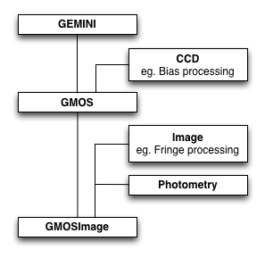

.. interfaces.rst

.. include:: references.txt

.. _iface:

Using the Mappers API
*********************
The |Mapper|  base class provides no functionality, rather its purpose is to
define all the attributes for instances built from subclasses of Mapper.
Though not strictly an abstract class, the |Mapper|  base class cannot be used
on its own.

The subclasses, |PrimitiveMapper| and |RecipeMapper|, do not override
``Mapper.__init__()``.  They implement mapping routines aiming to find the
primitives and recipes that best match the input data.

The mappers require a Data Reduction Package itself containing Instrument
Packages.  We discuss these packages and how to build the basic directory
structure for them in the :ref:`Appendix <drpkg>`.

Below, we use the ``geminidr`` data reduction package when we need an
example.  Note that ``geminidr`` is the default package unless it is overridden
with the ``drpkg`` argument.

Selecting Primitives with PrimitiveMapper
=========================================

Primitive classes are defined in a Data Reduction (DR) Package.  For the Gemini
instruments that is the ``geminidr`` package.  The DR Package to use by the
mapper is set by the ``drpkg`` argument to mapper.

These primitive classes define methods, referred to as *primitives*, that provide
data processing functionality. Primitive classes in a DR Package are structured
hierarchically and may employ multiple inheritance.

In Figure 4.1 below, we show an example of primitive class inheritance as done
in ``geminidr``, with ``GMOSImage`` the primitive class inheriting and
mixing-in the other classes.  In general, the class inheriting others will also
have longer, more specific *tagsets*.  This will ensure that the mapping for
a GMOS image, if we follow the example in Figure 4.1, does return the
*GMOSImage* class as the best match, not *GMOS*, not *GEMINI*.

The GMOSImage primitive class, by inheriting all of the classes above it and
hence all their methods (aka primitives) becomes a complete set of primitives
that can be applied to a GMOS IMAGE.  It becomes a *primitive set*.

Generic primitive classes like CCD, Image, Photometry in Figure 4.1 normally
should have empty *tagsets*.

   Figure 4.1: An example of primitive class inheritance. (A section of
   ``geminidr``.)

.. note:: Hereafter, a Primitive class may be referred to as a "primitive set"
   or just "primitives".  Through inheritance, a primitive class collects many
   primitives from higher in the hierarchy.  The primitive set implies the
   whole collection more clearly than just referring to the primitive
   class.

Mapping Data to Primitives
--------------------------

|PrimitiveMapper| requires as input a list of AstroData tags and the name
of an instrument packages.

The mapping is done by matching the primitive set's ``tagset`` attribute
to the AstroData tags.

The primitive set is instantiated as follow, where ``ad`` is an AstroData
object::

   >>> from recipe_system.mappers.primitiveMapper import PrimitiveMapper
   >>> tags = ad.tags
   >>> instpkg = ad.instrument(generic=True).lower()
   >>> pmapper = PrimitiveMapper(tags, instpkg)
   >>> pclass = pmapper.get_applicable_primitives()
   >>> p = pclass([ad])

This ``p`` can now be passed to the best match recipe.

Example
^^^^^^^
Let us discuss an example.  Let us use a raw GMOS image.

::

    >>> ad = astrodata.open('S20161025S0111.fits')
    >>> ad.tags
   set(['RAW', 'GMOS', 'GEMINI', 'SIDEREAL', 'UNPREPARED', 'IMAGE', 'SOUTH'])

The |PrimitiveMapper| uses these tags to search the ``geminidr`` packages, or
the data reduction package specified in the mapper attribute ``drpkg``.  The
first step in the search is to narrow it to the applicable instrument package,
in this case, ``gmos``. The mapper enforces the rule that the directory name
for the instrument package be the lower case version of the AstroData descriptor
``instrument()``.  This speeds up the search but it is also a limitation.

The |PrimitiveMapper| instance stores the name of the package it will search
in the ``dotpackage`` attribute.  For example, using the GMOS ``ad``::

   >>> from recipe_system.mappers.primitiveMapper import PrimitiveMapper
    >>> pmapper = PrimitiveMapper([ad])
    >>> pmappmer.dotpackage
   'geminidr.gmos'

The public method ``get_applicable_primitives()``, when invoked, launches the
search for the most appropriate primitive class. The search itself is focused
on finding class objects with a ``tagset`` attribute.

::

    >>> pclass = pmapper.get_applicable_primitives()

In the case of GMOS, the ``tagsets`` in primitive classes hierarchy
(Figure 4.1 above) are::

   class Gemini( ...  ):
      tagset = set(["GEMINI"])

   class GMOS(Gemini, ... ):
      tagset = set(["GEMINI", "GMOS"])

   class GMOSImage(GMOS, ... ):
      tagset = set(["GEMINI", "GMOS", "IMAGE"])

The function looks to match the ``tagset`` of the primitive class it finds to
the *AstroData tags*.  A successful match requires ``tagset`` to be
a subset of the Astrodata tags.  The match with the largest subset wins the
contest.  In our example, the class ``GMOSImage`` wins. Indeed::

    >>> pclass
    <class 'geminidr.gmos.primitives_gmos_image.GMOSImage'>

To use this selection of primitives, one then needs to instantiate it::

    >>> p = pclass([ad])

This can be used by a recipe.

.. _rselect:

Selecting Recipes with RecipeMapper
===================================

Recipes are functions that receive a single argument: an instance of a primitive
class.  Recipe functions are not classes and do not (cannot) inherit. The recipe
simply defines the primitives to be used and the order in which the primitive calls
are made on the data.

Recipe functions are defined in python modules which we refer to as
recipe libraries.  The location of those modules in a data reduction package
must obey some rules; they must be located in an instrument package under a
subdirectory named ``recipes`` and therein in a subdirectory that matches the
``mode`` setting.  The |RecipeMapper| searches only such directories.  For
example::

    my_drpkg/instrumentX/recipes/modeY/recipes_IMAGING.py

.. _d2r:

Mapping Data to Recipes
-----------------------
At a minimum, |RecipeMapper| requires as input a list of AstroData tags and
the name of an instrument package. The mapping is
done by matching the recipe library's ``recipe_tags`` module attribute
to the AstroData tags of the first input element.

The recipe is obtained as follow, where ``ad`` is an AstroData object::

    >>> from recipe_system.mappers.recipeMapper import RecipeMapper
    >>> tags = ad.tags
    >>> instpkg = ad.instrument(generic=True).lower()
    >>> rmapper = RecipeMapper(tags, instpkg)
    >>> recipe = rmapper.get_applicable_recipe()
    >>> recipe.__name__
    reduce

The recipe can then be run by passing it a primitive set (see the section
above on primitive mapping)::

    >>> recipe(p)

Example
^^^^^^^
Let us discuss an example.  Let us use a raw GMOS image.

::

    >>> ad = astrodata.open('S20161025S0111.fits')
    >>> ad.tags
   set(['RAW', 'GMOS', 'GEMINI', 'SIDEREAL', 'UNPREPARED', 'IMAGE', 'SOUTH'])

The |RecipeMapper| uses these tags to search the ``geminidr`` packages, or
the data reduction package specified in the mapper attribute ``drpkg``.  The
first step in the search is to narrow it to the applicable instrument package,
in this case, ``gmos``. The mapper enforces the rule that the directory name
for the instrument package be the lower case version of the AstroData descriptor
``instrument()``.  This speeds up the search but it is also a limitation.

Next, it narrows the search to the subdirectory ``recipes`` and then the
subdirectory therein named after the ``mode``.  The default ``mode`` in
|RecipeMapper| is ``sq``.  In our example, this means ``gmos/recipes/sq/``

The |RecipeMapper| instance stores the name of the instrument, and thus the
name of the instrument package in the ``pkg`` attribute, which is set upon
instantiation from the ``.instrument()`` descriptor of the first AstroData
object in the input list.  For example, using the GMOS ``ad``::

    >>> from recipe_system.mappers.recipeMapper import RecipeMapper
    >>> tags = ad.tags
    >>> instpkg = ad.instrument(generic=True).lower()
    >>> rmapper = RecipeMapper(tags, instpkg)
    >>> recipe = rmapper.get_applicable_recipe()

The public method ``get_applicable_recipe()``, when invoked, launches the
search for the most appropriate recipe library. The search itself is focused
on finding modules with a ``recipe_tags`` attribute.

::

    >>> recipe = rmapper.get_applicable_recipe()

The function looks to match the ``recipe_tags`` of the recipe libraries it
finds to the *AstroData tags*.  A successful match requires ``recipe_tags`` to
be a subset of the Astrodata tags.  The match with the largest subset wins the
contest.  In our example, the recipe library ``recipes_IMAGE`` of mode ``sq`` of
GMOS wins.  In there, the default recipe is named ``reduce``.

::

    >>> recipe.__name__
    reduce
    >>> recipe.__module__
    'geminidr.gmos.recipes.sq.recipes_IMAGE'

Selecting External (User) Recipes
---------------------------------
It is possible to bypass the recipe mapping entirely and request the use
of a user recipe library and recipe.  It is simply a matter of setting the
``recipename`` to the path to the recipe library and to the name of the recipe
when the |RecipeMapper| is instantiated.  The |RecipeMapper| imports the file
and returns the recipe function object.

While some users may have set their ``PYTHONPATH`` to include such arbitrary
locations, which would allow the ``myrecipes`` module to be imported directly,
most people will not have such paths in their ``PYTHONPATH``, and would not be
able to directly import their recipe file without modifying their environment.
Using the RecipeMapper lets users avoid this hassle because it handles import
transparently.

::

    >>> rm = RecipeMapper(adinputs, recipename='/path/to/myrecipes.myreduce')
    >>> recipefn = rm.get_applicable_recipe()
    >>> recipefn.__name__
    'myreduce'

Note that for user supplied recipe libraries and functions, the ``mode``, the
``pkg``, the ``drpkg``, and the tags are irrelevant.  Essentially,
passing a user-defined recipe to the RecipeMapper tells the mapper, "do not
search but use this." In these cases, it is incumbent upon the users and
developers to ensure that the external recipes specified are actually applicable
to the datasets being processed.

Primitives and Recipes, Together at Last
----------------------------------------

To summarize the mapper usage described in this chapter, to launch a reduction
one does::

    >>> tags = ad.tags
    >>> instpkg = ad.instrument(generic=True).lower()
    >>> rmapper = RecipeMapper(tags, instpkg)
    >>> pmapper = PrimitiveMapper(tags, instpkg)
    >>> recipe = rmapper.get_applicable_recipe()
    >>> pclass = pmapper.get_applicable_primitives()
    >>> p = pclass([ad])
    >>> recipe(p)

This is essentially what the |Reduce| class does.

Using the Primitives Directly
=============================
The primitves in the selected primitive set can be used directly.  The recipe
is just a function that calls some primitives from the set in some
pre-defined order.  This usage can be useful for testing, debugging or
interactive use.

The primitive set is obtained as shown in the previous section, using the
|PrimitiveMapper| and its ``get_applicable_primitives`` method.  To retrieve
the list of primitives from the primitive set, one can do this::

    >>> import inspect
    >>> for item in dir(p):
    ...    if not item.startswith('_') and \
    ...       inspect.ismethod(getattr(p, item)):
    ...       print(item)
    ...

The primitive set has been initialized with a list of AstroData objects.
Running a primitive on them only requires calling the primitive as a method
of the primitive set.

The exact call depends on the primitive itself.  In ``geminidr``, the
primitives use a ``streams`` attribute to store the AstroData objects being
processed in such a way that those objects do not need to be passed to the
primitives when called.  For example::

    >>> p.prepare()
    >>> p.addVAR()

The syntax above uses *streams* to pass the data along from one primitive to
the next.  The streams are attributes of the ``geminidr`` ``PrimitiveBASE``
class that all ``geminidr`` primitive classes inherit.  When writing a new
data reduction package, the use of that base class, and the
``parameter_override`` decorator in ``recipe_system.utils.decorators``, is
required to benefit from the *streams* system.

It is also recommended, and indeed the primitives in ``geminidr`` do that, to
have the primitives methods return the modified output AstroData objects.  When
*streams* are used, return values are not necessary, but for debugging,
testing, or exploration purposes it can be handy.  For example, one can do
this::

    >>> intermediate_outputs = p.prepare()

A logger is currently required.  The logger in ``gempy.utils`` called
``logutils`` is used by the recipe_system.  The output will go to
both stdout and a logfile.  If the logfile is not defined, it leads
double-printing of the logging on stdout.  To avoid the double-
printing the logfile name must be set to something.  If you do not want to
write a logfile to disk, on Unix systems you can set the file name to
``/dev/null``.

    >>> from gempy.utils import logutils
    >>> logutils.config(file_name='/dev/null')

Here is what the stdout logging looks like when a primitive is run directly::

    >>> p.prepare()
       PRIMITIVE: prepare
       ------------------
          PRIMITIVE: validateData
          -----------------------
          .
          PRIMITIVE: standardizeStructure
          -------------------------------
          .
          PRIMITIVE: standardizeHeaders
          -----------------------------
             PRIMITIVE: standardizeObservatoryHeaders
             ----------------------------------------
             Updating keywords that are common to all Gemini data
             .
             PRIMITIVE: standardizeInstrumentHeaders
             ---------------------------------------
             Updating keywords that are specific to GMOS
             .
          .
       .
       [<gemini_instruments.gmos.adclass.AstroDataGmos object at 0x11a12d650>]

Of interest when running the primitives in this way are the contents of the
``streams`` and ``params`` attributes of the primitive set.

The *streams* and *params* are features of the ``geminidr`` ``PrimitiveBASE``
class, the ``parameter_override`` decorator, and the ``pexconfig``-based
parameter system used in ``geminidr``.  For the time being, developers of new
DR packages must use those systems.

The main stream that allows the data to be passed from one primitive to the
other without the need of arguments is ``p.streams['main']``.  When the
primitive set is instantiated by ``get_applicable_primitives``, the input
AstroData objects are stored in that stream.   If for some reason you need
to repopulate that stream, do something like this::

    >>> new_inputs = [ad1, ad2, ... adn]
    >>> p.streams['main'] = new_inputs

The input parameters to the primitives are stored in the primitive set in
``p.params``.  For example, to see the parameters to the ``prepare``
primitive and their current settings::

    >>> p.params['prepare'].toDict()
    OrderedDict([('suffix', '_prepared'), ('mdf', None), ('attach_mdf', True)])

Or, prettier ::

    >>> print(*p.params['prepare'].toDict().items(), sep='\n')
    ('suffix', '_prepared')
    ('mdf', None)
    ('attach_mdf', True)

If you need guidance as to the recommended sequence of primitives, you can
inspect the recipes returned by the |RecipeMapper|.

::

    >>> from recipe_system.mappers.recipeMapper import RecipeMapper
    >>> tags = ad.tags
    >>> instpkg = ad.instrument(generic=True).lower()
    >>> rmapper = RecipeMapper(tags, instpkg)
    >>> recipe = rmapper.get_applicable_recipe()
    >>> recipe.__name__
    'reduce'
    >>> import inspect
    >>> print(inspect.getsource(recipe.__code__))
    def reduce(p):
        """
        This recipe performs the standardization and corrections needed to
        convert the raw input science images into a stacked image.

        Parameters
        ----------
        p : PrimitivesBASE object
            A primitive set matching the recipe_tags.
        """

        p.prepare()
        p.addDQ()
        p.addVAR(read_noise=True)
        p.overscanCorrect()
        p.getProcessedBias()
        p.biasCorrect()
        p.ADUToElectrons()
        p.addVAR(poisson_noise=True)
        p.getProcessedFlat()
        p.flatCorrect()
        p.getProcessedFringe()
        p.fringeCorrect()
        p.mosaicDetectors()
        p.detectSources()
        p.adjustWCSToReference()
        p.resampleToCommonFrame()
        p.flagCosmicRaysByStacking()
        p.scaleByExposureTime()
        p.stackFrames(zero=True)
        p.storeProcessedScience()
        return
