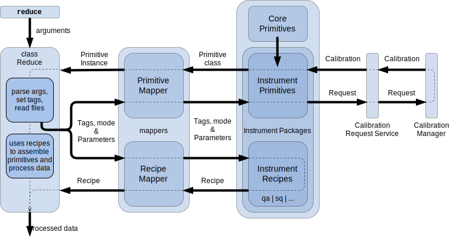

.. overview.rst

.. include:: references.txt

.. _overview:

Overview
********

The Recipe System is a python package distributed as a component of the Gemini
Observatory's DRAGONS metapackage for data reduction. The Recipe System is a
framework that supports configurable data processing pipelines
and which can technically accommodate processing pipelines for arbitrary types
of astronomical data.

The Recipe System provides infrastructure that will inspect DRAGONS-compatible
configuration and data processing packages and map recipes and primitives to
the input data.  The infrastructure will then link the appropriate primitives
to the appropriate recipe and run it.  The Recipe System also includes tools
and mechanisms to automatically handle and associate processed calibrations
using the ``GeminiCalMgr`` python package, available separately.

The Recipe System matches and links recipes and primitives to the data, and
execute the recipes.  Any flow control and decisions are left to the recipes
and primitives.  The Recipe System only provides an automation infrastructure
to run the reduction.

To match data to recipes and primitives, the Recipe System requires the data
to be accessed with ``astrodata``, the DRAGONS data access infrastructure.
``astrodata`` provides a common grammar to recognize and to access pixel and
header data.  The Recipe System depends critically on ``astrodata`` for
recipe and primitive mapping which matches ``astrodata`` tags.  (See the
:ref:`Astrodata documentation, Section 1.2 <related>` for more information.)

Gemini Observatory has developed a suite of recipes and primitives for
the Observatory's facility instruments. These can be found in the DRAGONS
package ``geminidr``.  The Astrodata configuration package for the Gemini
instruments is ``gemini_instruments``.  Both packages are included in DRAGONS.

At Gemini, DRAGONS and its Recipe System are used in an operational environment
for data quality assessment at night.  It provides sky condition metrics
calculated from the data itself.  DRAGONS and the Recipe System also are
the data reduction platform that will replace Gemini's legacy IRAF software.

Readers unfamiliar with terms and concepts presented in this manual can consult
the :ref:`Glossary <glossary>` for a definition of terms. For greater detail and
depth, below are definitions of terms and components directly relevant to
usage and development of the Recipe System.

.. _defs:

Definitions
===========

The following section provides definitions, discussion, and some examples about
certain terms and components that are key to the functioning Recipe System.

**Data Reduction Package (``drpkg``)**

A data reduction package is a Python package in which data reduction software,
formatted as recipes and primitives, is organized.  Normally, recipes and
primitives specific to an instrument are organized together in an "instrument
package".  The primitives can be organized in any way that makes inheritance
easy and practical.  For example, in the Gemini data reduction package,
``geminidr``, along with the instrument package, there is a ``gemini`` package
for software that can apply to all or multiple instruments, and a ``core``
package for primitives that are generic, like for stacking or photometry.
In the Recipe System, the default data reduction package is ``geminidr``.  This
can be changed by setting the value of the ``drpkg`` attribute to the |Reduce|
class or with the ``--drpkg`` options on the ``reduce`` command line.

.. _modedef:

**Mode**

Programmatically, the mode is a label -- a string literal --  by which recipe
libraries are differentiated.  The modes are represented in the data reduction
package as subdirectory to the ``recipes`` directory in an "instrument package".
For example, mode ``sq`` is associated with the directory ``recipes/sq``.  Only
the ``sq`` recipes will be found there.  In principle, the mode names should
indicate or hint at the recipes' purpose or to the quality of the products.

The mode is an attribute of the |Reduce| class and can be set on the ``reduce``
command line with the ``--qa`` and ``--ql`` flags ("quality assessment" and
"quicklook", respectively) with the ``sq`` mode as the default.
The mode specified for pipeline processing can be used as a flag in a primitive
too, for example if a primitive is to behave differently depending on
mode.

Recipes organized by modes can differ for whatever operational reasons you
might have.  The Gemini quality assessment recipes, mode ``qa``, measure sky
condition metrics at various stages of the reduction.  That is not done in
science quality reduction recipes, mode ``sq``, but additional care is made to
sky subtraction, for example.  The Mode is therefore related to the desired
product the recipe is to deliver.

**Primitive**

A DRAGONS primitive is a method of a primitive class, also called a primitive
set.  Primitive sets can be associated to specific Astrodata tags that the
Recipe System can match to data.  A primitive is expected to be a meaningful
data processing step and named appropriately, for example, ``biasCorrect``
will apply the bias correction.  This is a guideline and the Recipe System
has no technical requirements for this.

**Primitive Class**

The Recipe System matches the data to the most appropriate Primitive Class,
also called Primitive Set.  The association is made using the Astrodata tags
of the input data, and the tagset attached to each primitive class. Each
primitive class must have a ``tagset`` class attribute assigned with a Python
set containing the relevant Astrodata tags, eg.
``tagset = set(["GEMINI", "GMOS"])``.  The class that matches the greatest
number of tags wins the contest and gets selected.

The primitive classes can make use of inheritance and mix-ins to collect a
complete set of primitives applicable to the data being reduced.

**Recipe**

A recipe is a python function defined for specific instruments, instrument
modes, and pipeline modes (see above, ``mode``). A recipe function receives
one parameter: an instance of a primitive class, also called a "primitive set".
The recipe can then use any primitives from that set.

The recipes are stored in a Recipe Library, a Python module, see below.

**Recipe Library**

A Recipe Library is a Python module that stores recipes.  The Recipe Library
is given a tagset for data for recipe mapping by the Recipe System.  All the
recipes in a Recipe Library must therefore apply to the same Astrodata tags.
The Astrodata tagset is stored in the module variable ``recipe_tags``.

Each library must have a recipe assigned as "default".  The module variable
``_default`` is set to the name of the default recipe.

The Recipe System finds the Recipe Library that best matches the data based on
tagset and mode.  Then it picks from it the default recipe, or the
user-specified recipe from that library.  The primitive set is selected and
passed to the selected recipe, completing the mapping.

**Tagset**

A Tagset is a Python set of Astrodata tags (see
:ref:`Astrodata documentation <related>`).  A dataset opened with Astrodata
will be recognized and assigned a set of *tags*. These tags are used by the
Recipe System map the data to the most appropriate recipe library and the most
appropriate primitive set.

A recipe library announces the tags it applies to with a tagset stored in
the module ``recipe_tags`` variable.  A primitive class uses the class
attributr ``tagset`` to store the applicable tags.  The Recipe System
maps all the tagsets together to find the best mapping solution.

For example, a datasets is assigned the following tags::

   >>> ad = astrodata.open('N20170609S0160.fits')
   >>> ad.tags
   set(['RAW','GMOS','GEMINI','NORTH','SIDEREAL','UNPREPARED','IMAGE','ACQUISITION'])

The Recipe System will match that data to the recipe library and primitives
with the following tags::

   Recipe Library with: recipe_tags = set(['GMOS', 'IMAGE'])
   Primitive Class with : tagset = set(["GEMINI", "GMOS", "IMAGE"])

Tagset matching by the Mapper classes are discussed in greater detail in
subsequent chapters of this document, :ref:`Chapter 3, The Mappers <mapps>`, and
:ref:`Chapter 4, Using The Mappers API <iface>`.

Outline of the Recipe System
============================
In this section we provide a functional overview of the Recipe System, and
describe in more detail some of the key components of the complete reduction
ecosystem.

Functional overview
-------------------
The complete reduction ecosystem is represented in
:ref:`Figure 2.1 <schematic>` with emphasis on how the Recipe System automates
and supports the data reduction. It illustrates the system's relationship to
instrument packages and the calibration manager.

.. _schematic:

   Figure 2.1: Schematic Diagram of Recipe System Components and the supporting
   Calibration Request Service

Let us go through that diagram.

#. The command line interface, ``reduce``, provides users command access and
   execution from the terminal.
   (:ref:`Reduce and Recipe System User Manual.<refdocs>`)
#. The |Reduce| class receives input datasets and parameters either
   from ``reduce`` or directly through the |Reduce| API
   (:ref:`Reduce and Recipe System User Manual.<refdocs>`). |Reduce| parses
   the input arguments and opens the input datasets.  When run, it will send the
   first input to the Mappers.
#. The *Mappers*, both RecipeMapper and PrimitiveMapper, conduct
   best matching tests on recipe libraries and primitive classes and return
   the best matched objects.  The Astrodata tags and the recipe libraries and
   primitive classes tagsets are used to do the match.
#. The instrument data reduction (DR) package is a collection of modules that
   provide data reduction classes (primitives) and recipe libraries, and any
   supporting software like lookup tables. The instrument DR packages are not
   part of the Recipe System, they are add-ons specific to the instruments being
   supported. The Recipe System probes and searches those packages for matching
   primitive sets and recipes.  In DRAGONS, the instrument DR packages, and some
   generic primitive packages, are found under ``geminidr``.
#. The Calibration Request Service provides a functional interface between
   primitives requesting calibration files (biases, flats, etc.) and the
   designated calibration manager.
#. The Calibration Manager is an independent component, not part of DRAGONS,
   that contains the calibration association rules and interacts with a
   database that stores the processed calibrations.  It accepts calibration
   requests passed by the Calibration Request Service at the behest of the
   primitive calls.  The Calibration Manager can be *Local Calibration Manager*
   distributed as ``GeminiCalMgr`` for use by individuals, or the Gemini
   internal facility calibration manager.  The latter is for Gemini Operations
   needs only (for reference, Fitsstore).  In either case, the data's metadata
   are used, along with a set of rules, to determine a best available match
   for the requested calibration type and return a full path name (local) or a
   URL (internal Gemini manager) to the file.

It is worth noting that all components discussed here operate and communicate
using the common grammar provided by the ``astrodata`` data abstraction.

``reduce`` and |Reduce|
-----------------------
``reduce`` is the easiest way to invoke the Recipe System. It passes command
line options to the |Reduce| class, which then invokes the mappers. Those, in
turn, use arguments to locate and identify the best applicable primitive
classes and recipes. For most users, ``reduce`` will be the common way to
process datasets with the Recipe System.

The |Reduce| class can be used directly for a programmatic invocation of
the reduction rather than using the terminal.

Usage of both ``reduce`` and |Reduce| is documented in the
:ref:`Reduce and Recipe System User Manual <refdocs>`.

The ``reduce`` script itself is really light weight and mostly just a wrapper
around |Reduce|.  It sets up a logger and then uses the same parser that
|Reduce| also has access to, ``buildParser``.  Then it is off to |Reduce| to
to run the show.

A |Reduce| instance can be created with or without arguments.  The argument
is a string representing the command line of ``reduce``.  When that argument
is provided, |Reduce| will call ``buildParser`` on it.  The instance attributes
can also be set individually.  When using the API, a logger must be set ahead
of time, |Reduce| will not create one, yet it expects to be able to write to
one.  The main public method of |Reduce| is ``runr()`` which is
responsible for applying the mapper-returned primitive instance to the
mapper-returned recipe function, at which point, processing begins.
Note that ``runr`` has logic to recognize the name of a
primitive and to run that specific primitive rather than a recipe.  Of course,
the primitive will be coming from a tagset matching primitive set.

Mappers
-------
The mapper classes are the core of the Recipe System and provide the means by
which the Recipe System matches input datasets to processing routines. When applicable
primitive classes and recipes are found, the mappers return objects of the
appropriate kind to the caller; the |PrimitiveMapper| returns an instance of
the applicable primitive class; the |RecipeMapper| returns the actual recipe
function object from the applicable recipe library.

There are two functional mapper classes, |RecipeMapper| and
|PrimitiveMapper|, which are subclassed on the base class, |Mapper| .
These classes and their modules are located in |mappers|.

Mappers are discussed more fully in the :ref:`next chapter <mapps>`.

.. _ipkg:

Instrument Data Reduction Packages
----------------------------------
The data reduction packages are not components of the Recipe System.  They
stand on their own.  They provide the means, or instructions, for reducing data
and, therefore, at least one such package is required for the Recipe System to
function.

The data reduction packages provide some hooks that the Recipe System depends
on to map recipes and primitives to the data.

Instructions on how to structure a data reduction package for use by the Recipe
System are provided in :ref:`appendix <drpkg>`.

The primitive class signature must be able to accept this instantiation call::

   primitive_actual(self.adinputs, mode=self.mode, ucals=self.usercals,
                    uparms=self.userparams, upload=self.upload)

    adinputs: Python list of AstroData objects
    mode:     One of 'sq', 'qa', or 'ql'
    ucals:    Python dict with format
                 {(<data_label>, <type_of_calib>): <calib_filename>},
                 one key-value pair for each input, with the type of
                 calibration matching one from the keys in
                 cal_service.caldb.REQUIRED_TAG_DICT.
    uparms:   Python dict with format ``{'<prim>:<param>': <value>}``
    upload:   Python list of any combination of 'calibs', 'metrics', or
                 'science'.

In ``geminidr``, the primitive classes use a decorator to process those inputs.

The recipes must be located in subdirectory named after the *mode*.  For
example::

  <inst_pkg>/
      __init__.py
      recipes/
             __init__.py
             qa/
             sq/
             .../

While it is entirely possible to allow unrestricted naming of subpackages and
modules within an instrument data reduction package, the Recipe System is
optimized to search packages of a certain form. In particular, some optimization
allows the mapping algorithms to bypass code defined in the ``lookups/``
directory where Gemini puts static inputs like look-up tables and bad pixel
masks.  Because the Recipe System conducts depth-first searches,
the optimization expedites mapping by known exclusion: bypassing subpackages
and modules that are known not contain primitives or recipes.

Refer to the :ref:`appendix <drpkg>` for more a more complete discussion.

.. _calrq:

Calibration Request Service
---------------------------

The Calibration Request Service provides a functional interface to a local
calibration manager (GeminiCalMgr), the Gemini Observatory facility
calibration manager (fitsstore), or the Gemini Observatory Archive.

Primitives requiring **processed** calibration files (biases, flats, etc.)
will use this functional interface to make calibration requests. These requests
are served by the calibration manager in real time. This is a *JIT* (just in
time) service.  (See the :ref:`Appendix<jit>` for more information about why
*JIT* calibration service is necessary.)

Calibration requests are built from the Astrodata descriptors and tags, and
the requested calibration type (flat, dark, etc). The calibration request
is processed by the calibration manager's association rules to find the best
match.

The structure of the calibration service is set up when the primitive class
object is instantiated by reading the configuration file whose default
location is ``~/.dragons/dragonsrc``. The service is constructed as a
series of database instances, each of which is queried in turn via various
``get_processed_<caltype>`` methods, providing
a suitable calibration for each requested file (and indicating which
database successfully served the request) or passing the request onto the
next database in the series.

**UserDB**

The ``UserDB`` class handles the command-line parameters that define the
user-defined calibrations, e.g., ``--user_cal processed_flat:myflat.fits``.
If a calibration has been defined for the type matching the request, then
this calibration is returned.

**LocalDB**

The ``LocalDB`` class provides an interface to the ``LocalManager`` class
which queries the sqlite database containing the locations of the calibration
files that have been processed and stored by the user.

**RemoteDB**

The ``RemoteDB`` class provides an interface to the Gemini internal
``fitsstore`` server by making an HTTP POST request. After determining the
filename of a suitable calibration, it determines whether a file of that name
and calibration type has already been cached on disk in a subdirectory of
the ``calibrations`` directory created by DRAGONS, to avoid unnecessary
repeated downloads.

Both the ``LocalDB`` and ``RemoteDB`` classes have the responsibility of
verifying the md5 checksum of the file on disk with that stored in the
database to ensure it hasn't been corrupted. In the case of the local
database, the file is not returned, while the remote database downloads
the file again.

Calibration Manager
-------------------

The Calibration Manager is an external component to the Recipe System and
even DRAGONS itself.  The Recipe System currently uses two types of
calibration manager.

The original calibration manager is one used internally
at Gemini. It is associated with a large database that stores the data too.
For external users, a lightweight local calibration manager is available
instead.

The local calibration manager uses a sqlite database to store the
location information of the calibrations processed by the user.  Since the
data were processed locally, there is no need to store the data, just the
name and the path to the data. The ``caldb`` facility is provided for the
user to create and populate (or de-populate) the local database. At
present, this limits the ``dragonsrc`` file to have only a single local
database. This limitation may be relaxed in the future.

What both calibration managers share are the calibration associations rules,
rules that will identify the best processed calibrations for a given
Gemini observation.  Those rules are the same as the rules used by the
Gemini Observatory Archive.  The internal database is in fact using exactly
the same software as the GOA.  The local calibration manager uses a subset
of the code plus a couple extra routines.

The internal Gemini data manager is obviously very Gemini-centric, by
necessity.  The local calibration manager, distributed as GeminiCalMgr, is
also, unfortunately still quite Gemini-centric.  The ORMs are designed for
Gemini data.  It might be possible for a third-party to replace the ORMs and
the calibration rules to match their data's needs.
