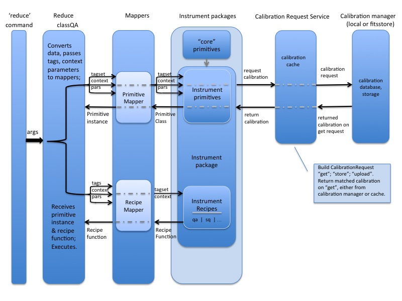

.. overview.rst
.. include glossary
.. include interfaces
.. include mappers

.. _overview:

Overview
********

The Gemini Recipe System is a pure python package provided by the Gemini
Observatory's *gemini_python* data reduction package. The Recipe System is a
framework that supports configurable data processing pipelines, i.e., "recipes," 
and which can accommodate processing pipelines for arbitrary dataset types. The 
Recipe System is written to introspectively exploit features of "instrument 
packages" by effecting arbitrage on specific attributes of defined recipes and 
primitives comprising such packages. Gemini Observatory has developed a suite of 
these recipes and primitives, which can be found in the *gemini_python* package, 
``geminidr``.

The Recipe System offers dynamic flow control and automatically executes options
regarding processing and calibration. These decisions are based on the pixel and
the metadata properties of the dataset at "decision nodes" in processing and on
the context in which the processing is being carried out.

In conjunction with the development of the Recipe System, Gemini Observatory has
also developed the new ``astrodata`` (v2.0), which works with instrument packages
defined in ``geminidr``. This package provides the definitions for the
abstractions of Gemini Observatory astronomical observations. Indeed, "AstroData"
objects and their interfaces provide a common grammar by which the Recipe System
and the instrument packages identify and work with astronomical datasets. For
further information and discussion of ``astrodata`` and its interface, see the
`Astrodata User's Manual` (:ref:`related`; Document ID:
PIPE-USER-106_AstrodataUserManual)

In Gemini Observatory's operational environment "on summit," the Recipe System,
``reduce``, ``astrodata``, and the ``geminidr`` packages provide a
currently defined, near-realtime, quality assurance pipeline, the so-called QAP. 
``reduce`` is used to launch this pipeline on newly acquired data and provide 
image quality metrics to observers, who then assess the metrics and apply 
observational decisions on telescope operations.

Users unfamiliar with terms and concepts heretofore presented should consult 
the :ref:`Glossary <glossary>` for a definition of terms. For greater detail and 
depth, users should consult the documentation cited in the
sections below.

.. _refdocs:

Reference Documents
===================

  - `RecipeSystem v2.0 Design Note`, Doc. ID: PIPE-DESIGN-104_RS2.0DesignNote,
    Anderson, K.R., Gemini Observatory, 2017, DPSGdocuments/.

  - `Reduce and Recipe System User Manual`, Doc. ID: PIPE-USER-109_RSUsersManual,
    Anderson, K.R., Gemini Observatory, 2017, 
    gemini_python/recipe_system/doc/rs_UsersManual/.

.. _related:

Related Documents
=================

  - `Astrodata cheat sheet`, Doc. ID: PIPE-USER-105_AstrodataCheatSheet,
    Cardenas, R., Gemini Observatory, 2017, astrodata/doc/ad_CheatSheet.

  - `Astrodata User’s Manual`, Doc. ID:  PIPE-USER-106_AstrodataUserManual,
    Labrie, K., Gemini Observatory, 2017, astrodata/doc/ad_UserManual/.

  - `Gemini Fits Storage System Overview` (Calibration Manager), 
    Doc. ID: `None`, Doc. file: `FitsStorageSystemOverview.docx`,
    P. Hirst, 2011, http://scisoft/svn/FitsStorage/trunk/docs/

Further Information
===================
As this document details programmatic use of the mapper classes, readers who wish
to read up on the Recipe System application, ``reduce``, should consult the 
*gemini_python* document, :ref:`Reduce and Recipe System User Manual <refdocs>`, 
*Doc ID: PIPE-USER-109_RSUserManual*, which also describes usage of the 
``Reduce`` class API.

Users and developers wishing to see more information about the ``astrodata`` 
package, how to use the programmtic interfaces on such objects should consult the
documents :ref:`enumerated above <related>`.

.. _defs:

Definitions
===========

Data Reduction Package (drpkg)
------------------------------
A data reduction (dr) package is simply an umbrella directory under which
instrument packages can be defined. Currently, only `geminidr` is defined for
the Gemini Observatory instruments, which provides instrument packages for
GMOS-(N,S), GSAOI, F2, GNIRS, and NIRI. Users running ``reduce`` can change the
default 'dr' package to other such defined packages with the ``--drpkg`` option.

Context
-------
A context is a list of one or more labels by which the recipe libraries are
delineated and which are manifest in instrument packages ``recipes`` directory
as directories named with these same labels. These context names `should`
indicate or hint at the purpose or quality of the recipes contained therein.
For example, Quality Assurance recipes are found in the ``qa`` recipes directory,
Science Qauality recipes, in an ``sq`` recipes directory.

Primitive
---------
A primitive is a defined method on a primitive class. A primitive function 
is generally contrived to be a "science-oriented" data processing step, though
the Recipe System provides no requirement that this be true.

Primitive Class
---------------
As defined under the *gemini_python* package, `geminidr`, primitive classes 
are a large set of hierarchical classes exhibiting inheritance from generic to
specific. Because they are real data, datasets will always have some 
instrument/mode specific set of *tags* that will see the Recipe System pick
instrument/mode specific primitive class.

Recipe
------
A *recipe* is a python function defined for specific instruments and modes. A
recipe function recieves one parameter, an instance of a primitive class. 
This "primitive" class presents all available primitive methods on the 
instance recived by the recipe, which is then free to call any primitive 
function in any order. [#ord]_ The acquisition of an applicable recipe and primitive
class is the primary operation provided by ``reduce``.

.. rubric:: Footnotes

.. [#ord] This is not strictly true, as certain primitives check metadata to
          determine if something required to be done was actually done.
          For instance, many primitives check that headers have been updated
          by the *standardizeGeminiHeaders* and *standardizeInstrumentHeaders*
          primitives.

Recipe Library
--------------
A python module defined in an instrument package that comprises one or more 
defined *recipes*. A recipe library (module) will have one (1) attribute
defined as ``recipe_tags``, which is a set of tags indicating the kind of
data to which this recipe library applies.

Tagset
------
A *tagset* is a set of data classification *names* that describe both input dataset(s)
and elements of instrument packages. When an input dataset is converted to an
astrodata instance, astrodata inspects the dataset and assigns a number of classifier
names, or tags, to the data. These *tags* are accessed from an instance attribute.
E.g.:

>>> ad = astrodata.open('N20170609S0160.fits')
>>> ad.tags
set(['RAW', 'GMOS', 'GEMINI', 'NORTH', 'SIDEREAL', 'UNPREPARED', 'IMAGE', 'ACQUISITION'])

Astrodata tags are matched against primitive classes that provide a ``tagset``
attribute on the class, and against recipe libraries providing a ``recipe_tags``
attribute on the library module. These attributes are targets for the Recipe
System, and are of the same form as the astrodata instance attribute. All
"tag-like" attributes used by astrodata and the Recipe System, ``tags``,
``tagset``, and ``recipe_tags`` are python *sets* and not simply lists.

Tags and tagset matching by the Mapper classes are discussed in greater detail in
subsequent chapters of this document, :ref:`Chapter 3, The Mappers <mapps>`, and
:ref:`Chapter 4, Using The Mappers API <iface>`.

The subject of *astrodata* is beyond the scope of this document. Readers and 
developers should consult the :ref:`Astrodata documentation <related>` for 
further information on *astrodata* and data classifications.

Outline of the Recipe System
============================
The following is an outline of the Recipe System, its command line interface,
``reduce``, and the system's relationship with instrument packages. A brief
description of each segment of :ref:`Figure 2.1, Schematic Diagram <schematic>`
of the Recipe System and supporting compenents follows.

.. _schematic:

   Schematic Diagram of Recipe System Components and the supporting 
   Calibration Request Service

From left to right, the diagram indicates that the Recipe System, `in toto`, 
comprises six (6) main components. The calibration manager, whether local or 
facility service, is an indepedent (and indpendently developed) component that 
provides the calibration manager service to any requesting client. 

 * Command line interface, ``reduce``, providing command access and execution
 * The ``Reduce`` class, which receives input datasets and parameters either 
   from ``reduce`` or through the ``Reduce`` class API. These components are
   thoroughly presented in :ref:`Reduce and Recipe System User Manual.<refdocs>` 
   ``Reduce`` acts as a "data wrangler", and passes these data to ... 
 * The "Mappers", both ``RecipeMapper`` and ``PrimitiveMapper``. Mappers conduct
   best matching tests on recipe libraries and primitive classes and return
   the best matched objects.
 * Instrument packages, which are an arbitrary collection of packages that
   provide data reduction classes, instrument lookup tables, and recipe
   libraries. These instrument packages serve as the "targets" of the Recipe 
   System. In *gemini_python*, these packages are found under *geminidr*.
 * The Calibration Request Service provides a functional interface between
   primitives requiring calibration files (biases, flats, etc.) and either
   a local calibration manager or the Gemini Observatory facility calibration
   manager provided by the FitsStorage server (a.k.a. "fitsstore").
 * The Calibration Manager (local or fitsstore) accepts calibration requests
   passed by the Calibration Request Service at the behest of primitive calls.
   The "calmanager" recieves observational metadata and applies a set of complex 
   rules to determine a best match for the requested calibration, and returns a 
   URL to the matching file available in the fitsstore or local calibration manager.

All components delineated here operate and communicate using the common grammar
provided by the ``astrodata`` data abstraction.

``reduce`` and ``Reduce``
-------------------------
The application ``reduce`` is provided with the Recipe System under the
recipe system ``scripts`` directory. When this directory is available on a
user's PATH environment variable, ``reduce`` can be called and help requested::

  $ reduce --help

Which will provide a summary of options and switches available on the command
line. The Recipe System also provides a manual page (manpage) that can be
directly called::

  $ man reduce

``reduce`` is the easiest way to invoke the Recipe System, which passes command 
line options to the mappers, which, in turn, use these values to locate and
indentify applicable primitive classes and recipes. For most users, ``reduce``
will be the common way to process datasets with the Recipe System.

The ``reduce`` command and its underlying class, ``Reduce``, are described 
in rigorous detail in the :ref:`Reduce and Recipe System User Manual <refdocs>`.

Mappers
-------
The mapper classes provide the means by which the recipe system matches
inputs to data processing tasks, i.e., primitives. When applicable primitive 
classes and recipes are found, the mappers return objects of the appropriate 
kind to the caller; the ``PrimitiveMapper`` returning an instance of the 
applicable primitive class; the ``RecipeMapper`` returning the actual recipe 
function object from the applicable recipe library. The ``Reduce`` class is
responsible for applying to the mapper-returned primitive instance to the 
mapper-returned recipe function, at which point, processing begins.

Currently, there are two functional mapper classes, ``RecipeMapper`` and
``PrimitiveMapper``, which are subclassed on the base class, ``Mapper``.
These classes and their modules are located under *gemini_python* in 
``recipe_system/mappers``.

.. _ipkg:

Instrument Packages
-------------------
Though not strictly a component of the Recipe System, rather, the instrument
packages serve as "targets" of the Recipe System, which introspects the
packages searching for both matchable and matching attributes defined on
modules and classes of the packages. Without instrument packages serving as
"targets," the Recipe System would be of little use.

Instrument packages comprise at least two (2) components, with a third
often present (``lookups/``), though not needed by the Recipe System::

  <instrument>_package/
                  lookups/
                  parameters_<instrument>.py
                  primitives_<instrument>.py
                  parameters_<instrument>_<mode1>.py
                  primitives_<instrument>_<mode1>.py
                  parameters_<instrument>_<modeX>.py
                  primitives_<instrument>_<modeX>.py
                  [ ... ]
                  recipes/qa/
                         /sq/
                         /.../

As a real example, the 'gmos' instrument package under ``geminidr`` ::

  gmos/
      __init__.py
      lookups/
      parameters_gmos.py
      primitives_gmos.py
      parameters_gmos_ifu.py
      primitives_gmos_ifu.py
      parameters_gmos_image.py
      primitives_gmos_image.py
      parameters_gmos_longslit.py
      primitives_gmos_longslit.py
      parameters_gmos_mos.py
      primitives_gmos_mos.py
      parameters_gmos_nodandshuffle.py
      primitives_gmos_nodandshuffle.py
      parameters_gmos_spect.py
      primitives_gmos_spect.py
      recipes/

Recipe System targets of instrument packages are recipe libraries contained
in ``recipes/`` and the ``primitives_X.py`` modules, which define the primitive
classes. While the ``parameters_X.py`` modules will be imported and used by the
matching primitive class, they are *not* targets of the Recipe System and
do not provide, and shall not provide, a ``tagset`` attribute on those classes.
The naming of the primitive and parameter modules and class names is discretionary;
targeted attributes are defined only on discoverable classes.

The ``recipes`` package is further delineated by subpackages described as
"context" packages. Currently, two such contexts are defined within the
instrument package recipe libraries defined under ``geminidr``, and which
provide context-specific recipes: "qa" and "sq" recipes. The "qa" context
provides Quality Assurance recipes of the kind used for near real-time
processing at summit, whereas "sq" recipes provide pipeline definitions
(recipes) for "science quality" data reduction. In general, "sq" context recipes
`require` full calibration, including bias, flat, and fringe (GMOS) correction
while "qa" recipes do not. Both the Reduce class and the ``reduce`` command line
provide a default context, which can be overridden by the user with the
``--context`` option. See :ref:`Section 2.4, Definitions <defs>` for a refresher
on these definitions.

The Recipe System is ready built to handle any new and newly named context
packages. Indeed, the Gemini Observatory has plans for a "quicklook" context,
which is expected to provide one (or more) recipes that will facilitate
quicklook capability. There is much more about instrument packages, recipes, and
contexts in :ref:`Chapter 4, Using The Mappers API <iface>`.

.. note:: While it is entirely possible to allow unrestricted naming of
   subpackages and modules within an instrument package, the Recipe System is
   optimized to search packages of this form, which, in particular, allows the
   mapping algorithms to bypass lookup tables defined in the ``lookups/``
   directory. Because the Recipe System conducts depth-first searches,
   the optimization expedites mapping by known exclusion: bypassing subpackages 
   and modules that are known not to be targets.

.. _calrq:

Calibration Request Service
---------------------------

As briefly indicated in the point form summary above, the Calibration Request 
Service provides a functional interface to a local calibration manager or the Gemini 
Observatory facility calibration manager provided by the FitsStorage server 
(a.k.a. "fitsstore"). Primitives requiring calibration files (biases, flats, etc.)
will use this functional interface to make calibration requests. These requests 
are served by the calibration manager in real time. This is accurately 
described as a `jit` (just in time) service.

This service is provided by a function library that converts observational 
metadata into a URL-formed request on a calibration manager. If a matched 
calibration file is found by the "calmanager," and a URL to that file is returned, 
the Calibration Request Service is responsible for determining whether the matched 
calibration is in the calibration cache, in which case, the path to that file is 
returned. If not, then the request service downloads the file by the returned URL, 
caches the calibration appropriately, and then passes `that` file path to the 
requesting caller.

Calibration Manager
-------------------

In the course of data reduction pipelines, certain primitives will make requests 
for calibrations. For example, both ``biasCorrect`` and ``flatCorrect`` will make 
requests through the Calibration Request Service for *processed_bias* and 
*processed_flat* calibration files that meet their respective requests.

These calibration requests are serviced by what is called the Calibration Manager.
The Calibration Manager is a service provided by the Gemini Observatory facility,
*fitsstore*, but can also be run as a stand alone server -- something we might call
the "local calmanager." In either case, requests made on this service are identical.

The system provides a calibration management and association feature. Essentially, 
given a science frame and a requested calibration type, the system is able to 
automatically choose the best available calibration of the required type to apply 
to the science frame. The calibration manager service can be used both by a 
"human-oriented" interface, and a "a machine-oriented interface." The latter 
interface is used by the QA pipeline (QAP) and, more generally, will be used within 
the Gemini data reduction package to provide automatic calibration selection within 
an interactive processing environment.

To use the service, a client simply requests a given calibration (eg flat field) 
for a given science frame, and the system responds telling it which flat field to 
use. The calibration type requested is simply specified as part of the URL.

The target data file can be specified in two ways:

 - As a raw data filename as part of the URL, which the database can look up 
   internally.

 - By providing all metadata needed to carry out the association live over the 
   http connection.

In the former case, a URL such as 
http://fits/calmgr/arc/N20100330S0157.fits will return a small 
calibration association XML document. (Note: a request may also provide a data 
label rather than a filename.)

Here is an example calibration association XML resulting from a raw data file 
query using the URL: http://fits/calmgr/arc/GN-2010A-Q-91-26-004 ::

 <calibration_associations>
  <dataset>
    <datalabel>GN-2010A-Q-91-26-004</datalabel>
    <filename>N20100330S0157.fits</filename>
    <md5>c5f05ecac2a798c27e0105848a0657d5</md5>
    <ccrc>36ea55f1</ccrc>
    <calibration>
      <caltype>arc</caltype>
      <datalabel>GN-2010A-Q-91-193-001</datalabel>
      <filename>N20100424S0072.fits</filename>
      <md5>caffd39714fa6345c6a66a3eebefa969</md5>
      <ccrc>2e2be373</ccrc>
      <url>http://mkofits1/file/N20100424S0072.fits</url>
    </calibration>
  </dataset>
 </calibration_associations>

It is this XML response to a calibration request that the :ref:`Calibration Request 
Service <calrq>` will parse, examine the cache for the file, and, if not cached,
then make a URL request on the url included in the XML document.

The example above demonstrates the interface on the Gemini Observatory's *fitsstore*
facility. When running and using a local calibration manager to make calibration 
requests, the request and return value will be much the same, except for a couple of
minor, though important differences.

.. todo::

   **Update** with <protocol>://<localhost>:<port>/ for local calmanager example.

   `With a local "calmanager", we make requests in the same way, but on the local
   host: http://localhost:<PORT?>/calmgr/arc/N20100330S0157.fits`

JIT Calibration Requests
^^^^^^^^^^^^^^^^^^^^^^^^
It is important to understand that, when a calibration request is made, "live" 
metadata are passed to the calibration manager at the current stage of processing.
This kind of operation is called "just in time" (jit), which indicates that one 
only requests a calibration at the processing stage where and when it is needed.

Why is "live" metadata important, and why might a calibration match be different 
at different stages of a given recipe?

The correct association of a processed calibration product can actually depend on 
the processing history of the target dataset at the point where you wish to apply 
the calibration. The canonical example of this is in overscan subtraction of GMOS 
data. Simplistically, the GMOS raw data includes an overscan strip on the edge of 
each data frame, resulting from ADC samples with the ADC inputs connected to a 
bias type source rather than actual CCD pixel registers. This can be used as part 
of the de-biasing procedure during data reduction - a fit is made to the overscan 
region, which is then subtracted from the entire data frame. The overscan region 
is then trimmed off the frame and discarded. If this is done for both the science 
dataset and also the BIAS frames, then the BIAS frames are essentially being used 
to subtract off the bias structure of the CCDs whereas the overscan region is 
being used to subtract off the DC offset of the bias, and generally this is the 
preferred data processing procedure.

However, in some situations generally associated with large bright objects, the 
overscan region of the science frame can become contaminated with spurious signal 
and cannot be used. In that case one simply does not overscan subtract the BIAS 
calibration frames either and the BIAS calibration subtraction takes care of both 
the bias structure and the DC offset - with the latter not being as accurately 
corrected as if it were being measured from the overscan.

The point here is that if you request a processed bias frame for an overscan 
subtracted science frame, you require an overscan subtracted processed bias frame, 
where as if you request a processed bias for a non-overscan-subtracted science 
frame, you require a non-overscan-subtracted processed bias frame.

The Calibration Manager is only a part of the much larger *fitsstore* service
and we only present a high level overview here. Developers and users 
should consult the document, :ref:`Gemini Fits Storage System Overview, <related>` 
for a thorough presentation of fitsstore and the services provided thereby.
