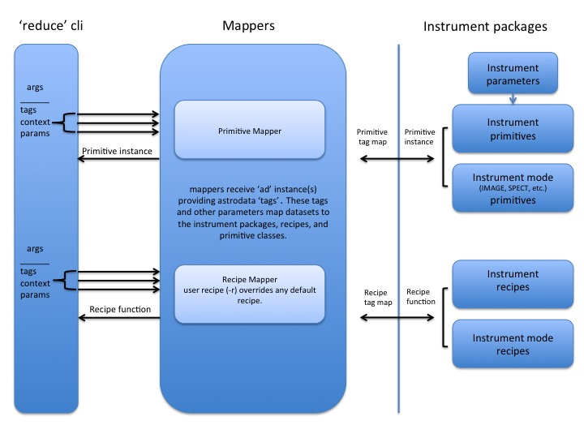

.. overview.rst
.. include glossary
.. include interfaces

.. _overview:

Overview
********

The Gemini Recipe System is a pure python package provided by the Gemini
Observatory's ``gemini_python`` data reduction package. The Recipe System is a
framework that supports configurable data processing pipelines, i.e.,
"recipes," and which can accommodate processing pipelines for arbitrary
dataset types. The Recipe System is written to introspectively exploit features
of "instrument packages" by effecting arbitrage on specific attributes of
defined recipes and primitives comprising such packages. Gemini Observatory has
developed a suite of these recipes and primitives, which can be found in the
``gemini_python`` package, ``geminidr``.

The Recipe System offers dynamic flow control and automatically executes options
regarding processing and calibration. These decisions are based on the pixel and
the metadata properties of the dataset at "decision nodes" in processing and on
the context in which the processing is being carried out.

In conjunction with the development of the Recipe System, Gemini Observatory has
also developed the new ``astrodata`` (v2.0), which works with instrument packages
defined in ``gemini_instruments``. This package provides the definitions for the
abstractions of Gemini Observatory astronomical observations. Indeed, "AstroData"
objects and their interfaces provide a common grammar by which the Recipe System
and the instrument packages identify and work with astronomical datasets. For
further information and discussion of ``astrodata`` and it's interface, see the
`Astrodata User's Manual` (:ref:`related`; Document ID:
PIPE-USER-106_AstrodataUserManual)

In Gemini Observatory's operational environment "on summit," the Recipe System,
``reduce``, ``astrodata``, and the ``gemini_instruments`` packages provide a
currently defined, near-realtime, quality assurance pipeline, the so-called QAP. 
``reduce`` is used to launch this pipeline on newly acquired data and provide 
image quality metrics to observers, who then assess the metrics and apply 
observational decisions on telescope operations.

Users unfamiliar with terms and concepts heretofore presented should consult 
the glossary (Appendix A, :ref:`glossary`) for a definition of terms. For
greater detail and depth, users should consult the documentation cited in the
sections below.

Reference Documents
===================

  - `RecipeSystem v2.0 Design Note`, Doc. ID: PIPE-DESIGN-104_RS2.0DesignNote,
    Anderson, K.R., Gemini Observatory, 2017, DPSGdocuments/.

  - `Recipe System Programmer’s Manual`, Doc. ID: PIPE-USER-108_RSProgManual,
    Anderson, K.R., Gemini Observatory, 2017, 
    gemini_python/recipe_system/doc/rs_ProgManual/.

.. _related:

Related Documents
=================

  - `Astrodata cheat sheet`, Doc. ID: PIPE-USER-105_AstrodataCheatSheet,
    Cardenas, R., Gemini Observatory, 2017, astrodata/doc/ad_CheatSheet.

  - `Astrodata User’s Manual`, Doc. ID:  PIPE-USER-106_AstrodataUserManual,
    Labrie, K., Gemini Observatory, 2017, astrodata/doc/ad_UserManual/.

Outline of the Recipe System
============================
The following is an outline of the Recipe System, it's command line interface,
``reduce``, and the system's relationship with instrument packages. A brief
description of each segment of :ref:`schematic` follows.

From left to right, the diagram indicates the Recipe System comprises three (3)
main components; the command line interface, ``reduce``, providing command
access and execution of the underlying ``Reduce`` class; the "Mappers"; and
the instrument packages, which are an arbitrary collection of packages that
provide data reduction classes, instrument lookup tables, and recipe
libraries. These instrument packages serve as the "targets" of the Recipe System.
All components delineated here operate and communicate using the common grammar
provided by the ``astrodata`` data abstraction.

.. _schematic:

   Schematic Diagram of the Recipe System.

.. note:: While the instrument packages are not part of the Recipe System,
   `per se`, the Recipe System targets and introspects extant instrument
   packages.

``reduce``
----------
The application ``reduce`` is provided with the Recipe System under the
recipe system ``scripts`` directory. When this directory is available on a
user's PATH environment variable, ``reduce`` can be called and help requested::

  $ reduce --help

Which will provide a summary of options and switches available on the command
line. The Recipe System also provides a manual page (manpage) that can be
directly called::

  $ man reduce

``reduce`` is the easiest way to invoke the Recipe System, passing command line
options to the recipe mappers, which, in turn, use these values to locate and
indentify applicable primitive classes and recipes. For most users, ``reduce``
will be the common way to process datasets with the Recipe System. It is this
command line tool and it's underlying class, ``Reduce``, which are described in
vigorous detail in Chapter 3, :ref:`interfaces`.

Mappers
-------
While not the primary subject of this document, suffice it to say here
that the mapper classes provide the means by which the recipe system matches
inputs to data processing tasks, i.e., primitives. When applicable
primitive classes and recipes are found, the mappers return objects of the
appropriate kind to the caller; the ``PrimitiveMapper`` returning an instance
of the applicable primitive class; the ``RecipeMapper`` returning the actual
recipe function object from the applicable recipe library. Within the ``reduce``
application, the returned primitive instance is applied to the returned
recipe function and processing begins.

Currently, there are two functional mapper classes, ``RecipeMapper`` and
``PrimitiveMapper``, which are subclassed on the base class, ``Mapper``. For
more information on using the mapper classes programmatically, users and
developers should consult the `Recipe System Programmer’s Manual`,
(Document ID: PIPE-USER-108_RSProgManual).

Instrument Packages
-------------------

Though not strictly a component of the Recipe System, rather, the instrument
packages serve as "targets" of the Recipe System, which introspects the
packages searching for both matchable and matching attributes defined on
modules and classes of the packages. Without instrument package targets,
the Recipe System would be of little use.

Instrument packages comprise at least two (2) components, with a third
often present (``lookups/``), though not needed by the Recipe System::

  <instrument>_package/
                  lookups/
                  recipes/
                  parameters_<instrument>.py
                  primitives_<instrument>.py
                  parameters_<instrument>_<mode1>.py
                  primitives_<instrument>_<mode1>.py
                  parameters_<instrument>_<mode2>.py
                  primitives_<instrument>_<mode2>.py
                  parameters_<instrument>_<modeX>.py
                  primitives_<instrument>_<modeX>.py
                  [ ... ]

Recipe System targets of any instrument package are recipe libraries contained
in ``recipes/`` and the ``primitives_X.py`` modules, which define the primitive
classes. The ``parameters_X.py`` will be imported and used by the matching
primitive class, but they are not targets of the Recipe System. The naming of
the primitive and parameter modules is discretionary; targeted attributes are
defined within the modules and classes.

The ``recipes`` package is further delineated by subpackages described as
"context" packages. Currently, two such contexts are defined within the 
instrument package recipe libraries defined under ``geminidr``, and which
provide context-specific recipes: "qa" and "sq" recipes. The "qa" context
provides Quality Assurance recipes of the kind used for near real-time
processing at summit, whereas "sq" recipes provide pipeline definitions
(recipes) for "science quality" data reduction. In general, "sq" context recipes
require full calibration, including bias, flat, and fringe correction while
"qa" recipes do not. Both the Reduce class and the ``reduce`` command line
provide a default context, which can be overridden by the user with the
``--context`` option.

The Recipe System is ready built to handle any new and newly named context
packages. Indeed, the Gemini Observatory has plans for a "quicklook" context,
which is expected to provide one (or more) recipes that will facilitate
quicklook capability.

.. note:: While it is entirely possible to allow unrestricted naming of
   subpackages and modules within an instrument package, the Recipe System is
   optimized to search packages of this form, which, in particular, allows the
   mapping algorithms to bypass lookup tables defined in the ``lookups/``
   directory. Because the Recipe System conducts depth-first searches,
   the optimization expidites mapping by simply excluding subpackages and
   modules that are known not to be targets.
