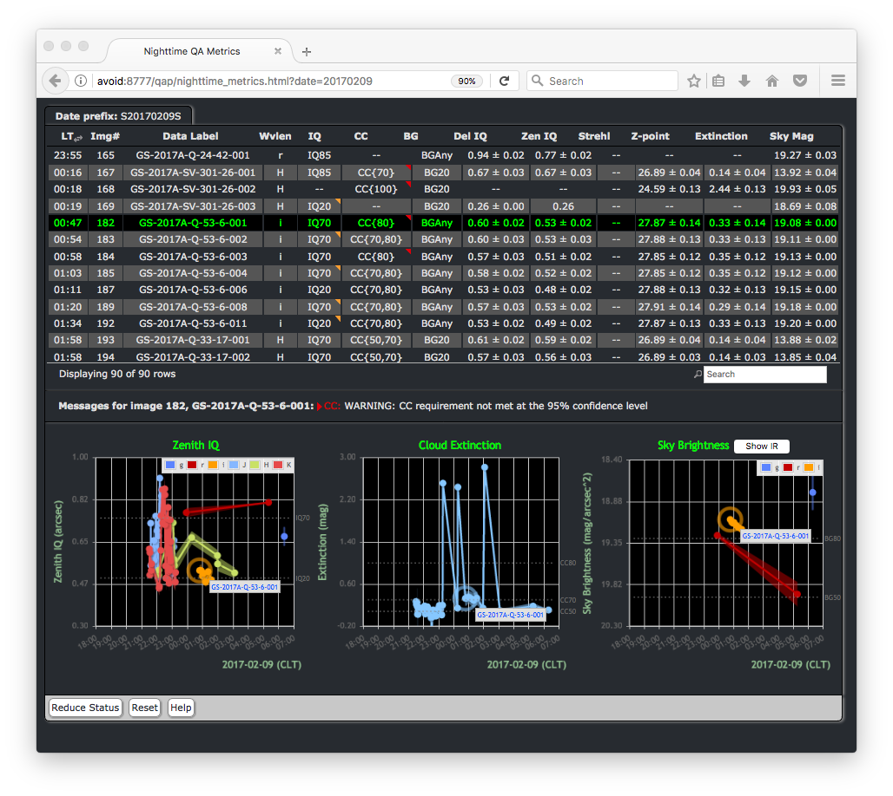

.. supptools:
.. include discuss
.. include howto

Supplemental tools
==================

The gemini_python package provides a number of command line tools that users may
find helpful in executing reduce on their data.

With the installation and configuration of gemini_python comes some supplemental
tools to help users discover information, not only about their own data, but
about the Recipe System, such as available recipes, primitives, and defined
tag sets.

If the user environment has been configured correctly these applications 
will work directly.

.. _adcc:

adcc
----
The application that has historically been known as the ``adcc``, the Automated
Data Communication Center, is significantly scaled back from its previous
(v1.0) incarnation and now runs only as an HTTP server. The webservice provided
by the ``adcc`` allows both the Recipe System and primitive functions to post
data produced during data processing. These data comprise image quality and
observing condition metrics, passed to the web server in the form of messages
encapsulating metrics data. The metrics themselves are produced by
three specific primitive functions, ``measureIQ``, ``measuerBG``, and
``measureCC``, which respectively measure image quality, background level,
and cloud cover (measured atmospheric extinction).

Neither the Recipe System nor the primitives require the ``adcc`` to be
running, but if an ``adcc`` instance is alive, then the metrics will be reported
to the service. The ``adcc`` provides an interactive graphical interface and
renders metric "events" in real time. Metrics events are also directly reported
to the :ref:`fitsstore` and stored in the fitsstore metrics database when the
``reduce`` option, ``--upload_metrics``, is specified.

The ``adcc`` is started with the command of the same name, and one may request
the help (or the manpage), in order to see the possible controllers supplied::

  $ adcc --help

  usage: adcc [-h] [-d] [-v] [--startup-report ADCCSRN] [--http-port HTTPPORT]

  Automated Data Communication Center (ADCC), v2.0 (beta)

  optional arguments:
    -h, --help            Show this help message and exit
    -d, --dark            Use the adcc faceplate 'dark' theme.
    -v, --verbose         Increase HTTP client messaging on GET requests.
    --startup-report ADCCSRN
                          File name for adcc startup report.
    --http-port HTTPPORT  Response port for the web interface. i.e.
                          http://localhost:<http-port>. Default is 8777.

The application provides a HTTP server that listens on either a user-provided
port number (via --http-port), or the default port of 8777. This webserver
provides an interactive, graphical interface by which users can monitor incoming
metrics that may be reported by recipe system pipelines (recipes), specifically,
the Quality Assurance Pipeline (QAP). The near real-time QAP produces image
quality and weather related metrics that are passed to the adcc as message events.
Users wishing to use the adcc to monitor QA metrics need to simply open a web
browser on the service's URL.

   Snapshot of the Nighttime Metrics GUI, using the "dark" theme and displaying
   the metrics retrieved from fitsstore for operational day 20170209.

E.g., Start the adcc::

    $ adcc

And open a browser window on

    http://localhost:8777/qap/nighttime_metrics.html

Start the adcc on another port::

    $ adcc --http-port 8778

And point a browser to

    http://localhost:8778/qap/nighttime_metrics.html

When metrics are produced and sent to the adcc, the display will automatically
update with the latest metric event. If users are processing datasets taken on a
day prior to the current operational day, the URL to monitor metrics produced
for that day is

     http://localhost:8778/qap/nighttime_metrics.html?date=YYYYMMDD

When the adcc is started, certain information is written to a special file in
a ``.adcc`` directory that records the process id (pid) of the adcc instance and
port number on which the web server is listening.

.. note::
   Currently, only one adcc instance is permitted to run. Should users move to
   another directory, another adcc will not be allowed to start. Users running
   the QA pipeline, or other recipes that may produce metrics, should remain in
   the directory containing the .adcc directory before starting ``reduce``.

.. _typewalk:

typewalk
--------
The ``typewalk`` application examines files in a directory or directory tree
and reports the tag sets through the ``astrodata`` tag sets. Files are selected
and reported through a regular expression mask, which by default, finds all
".fits" and ".FITS" files. Users can change this mask with the ``-f,--filemask``
option.

By default, typewalk will recurse all subdirectories under the current
directory. Users may specify an explicit directory with the ``-d,--dir``
option.

A user may request that an output file is written when AstroData tag
qualifiers are passed by the ``--tags`` option. An output file is specified
through the ``-o,--out`` option. Output files are formatted so they may
be passed directly to the reduce command line via that applications
'at-file' (``@file``) facility. See the section on :ref:`atfile`.

Users may select tag matching logic with the ``--or`` switch. By default,
qualifying logic is AND. I.e. the logic specifies that *all* tags must be
present (x AND y); ``--or`` specifies that ANY tags, enumerated with
``--tags``, may be present (x OR y). --or is only effective when ``--tags``
is used.

For example, find all gmos images from Cerro Pachon in the top level
directory and write out the matching files, then run reduce on them::

  $ typewalk -n --tags SOUTH GMOS IMAGE --out gmos_images_south
  $ reduce @gmos_images_south

This will also report match results to stdout.

``typewalk`` supports the following options::

  -h, --help            show this help message and exit
  -b BATCHNUM, --batch BATCHNUM
                        In shallow walk mode, number of files to process at a
                        time in the current directory. Controls behavior in
                        large data directories. Default = 100.
  -d TWDIR, --dir TWDIR
                        Walk this directory and report tags. default is cwd.
  -f FILEMASK, --filemask FILEMASK
                        Show files matching regex <FILEMASK>. Default is all
                        .fits and .FITS files.
  -n, --norecurse       Do not recurse subdirectories.
  --or                  Use OR logic on 'tags' criteria. If not specified,
                        matching logic is AND (See --tags). Eg., --or --tags
                        SOUTH GMOS IMAGE will report datasets that are one of
                        SOUTH *OR* GMOS *OR* IMAGE.
  -o OUTFILE, --out OUTFILE
                        Write reported files to this file. Effective only with
                        --tags option.
  --tags TAGS [TAGS ...]
                        Find datasets that match only these tag criteria. Eg.,
                        --tags SOUTH GMOS IMAGE will report datasets that are
                        all tagged SOUTH *and* GMOS *and* IMAGE.
  --xtags XTAGS [XTAGS ...]
                        Exclude <xtags> from reporting.

Files are selected and reported through a regular expression mask which, 
by default, finds all ".fits" and ".FITS" files. Users can change this mask 
with the **-f, --filemask** option.

As the **--tags** option indicates, ``typewalk`` can find and report data that 
match specific tag criteria. For example, a user might want to find all GMOS 
image flats under a certain directory. ``typewalk`` will locate and report all 
datasets that would match the AstroData tags, ``set(['GMOS', 'IMAGE', 'FLAT'])``.

A user may request that a file be written containing all datasets 
matching AstroData tag qualifiers passed by the **--tags** option. An output 
file is specified through the **-o, --out** option. Output files are formatted 
so they may be passed `directly to the reduce command line` via that applications 
'at-file' (@file) facility. See :ref:`atfile` or the reduce help for more on 
'at-files'.

Users may select tag matching logic with the **--or** switch. By default,
qualifying logic is AND, i.e. the logic specifies that `all` tags must be
present (x AND y); **--or** specifies that ANY tags, enumerated with 
**--tags**, may be present (x OR y). **--or** is only effective when the 
**--tags** option is specified with more than one tag.

For example, find all GMOS images from Cerro Pachon in the top level
directory and write out the matching files, then run reduce on them
(**-n** is 'norecurse')::

  $ typewalk -n --tags SOUTH GMOS IMAGE --out gmos_images_south
  $ reduce @gmos_images_south

Find all F2 SPECT datasets in a directory tree::

 $ typewalk --tags SPECT F2

This will also report match results to stdout, colourized if requested (**-c**).

Users may find the **--xtags** flag useful, as it provides a facility for
filtering results further by allowing certain tags to be excluded from the
report. 

For example, find GMOS, IMAGE tag sets, but exclude ACQUISITION images from
reporting::

  $ typewalk --tags GMOS IMAGE --xtags ACQUISITION

  directory: ../test_data/output
     S20131010S0105.fits ............... (GEMINI) (SOUTH) (GMOS) (IMAGE) (RAW) 
     (SIDEREAL) (UNPREPARED)

     S20131010S0105_forFringe.fits ..... (GEMINI) (SOUTH) (GMOS)
     (IMAGE) (NEEDSFLUXCAL) (OVERSCAN_SUBTRACTED) (OVERSCAN_TRIMMED) 
     (PREPARED) (PROCESSED_SCIENCE) (SIDEREAL)

     S20131010S0105_forStack.fits ...... (GEMINI) (SOUTH) (GMOS) (IMAGE) 
     (NEEDSFLUXCAL) (OVERSCAN_SUBTRACTED) (OVERSCAN_TRIMMED) 
     (PREPARED) (SIDEREAL)

Exclude GMOS ACQUISITION images and GMOS IMAGE datasets that have been 
'prepared'::

  $ typewalk --tags GMOS IMAGE --xtags ACQUISITION PREPARED

  directory: ../test_data/output
     S20131010S0105.fits ............... (GEMINI) (SOUTH) (GMOS) (IMAGE) (RAW) 
     (SIDEREAL) (UNPREPARED)

With **--tags** and **--xtags**, users may really tune their searches for very
specific datasets.
